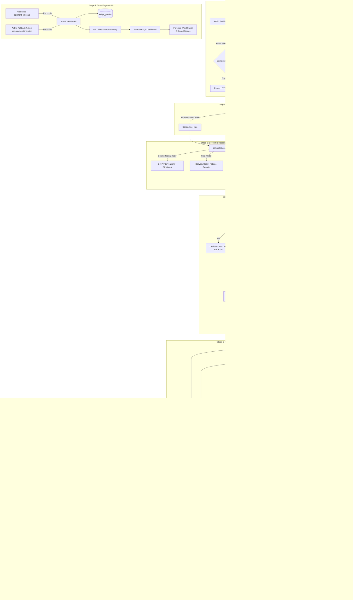
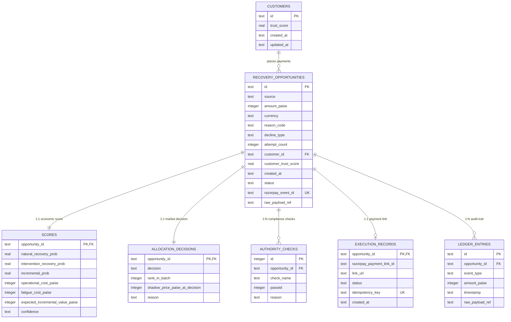
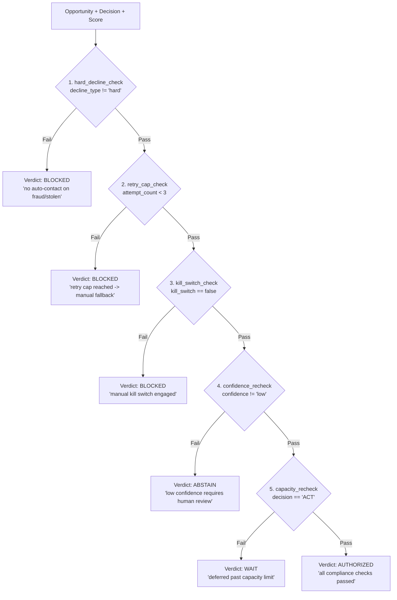
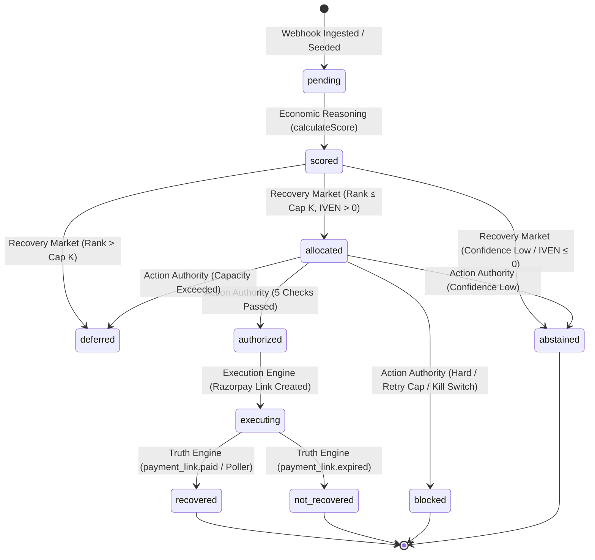

# ULTRON: Autonomous Economic Control Plane for Failed-Payment Recovery

**System Architecture, Economic Foundations & Technical Specification**  
*Repository*: [ULTRON (GitHub: Mr-Roninx/ULTRON)](https://github.com/Mr-Roninx/ULTRON.git)  
*Version*: 1.0.0 (Production Blueprint / Razorpay Test Mode)  
*Target Stack*: Node.js (v24 / `node:sqlite`) + TypeScript + Express + React/Next.js + Tailwind CSS + Razorpay Node SDK

---

## 1. Executive Summary & Core Thesis

### The Paradigm Shift
Traditional payment recovery systems (e.g., in Razorpay, Stripe, Adyen, Zuora) operate opportunity-by-opportunity, asking:  
> *"Can we recover this payment?"*

**ULTRON** operates a layer above retry schedulers, treating failed payments as scarce-resource portfolio optimization problem, asking:  
> *"Is recovering this payment worth spending our next unit of limited recovery capacity — and does action survive deterministic compliance rules?"*

```
                                  ECONOMIC ARBITRAGE
  Failed Payment Event  ───►  [Counterfactual Modeling]  ───►  [Portfolio Greedy Allocation]
                               (Natural vs Intervention)         (Capacity Cap K=5, Shadow Price)
                                                                            │
                                                                            ▼
  Live Payment Link     ◄───    [Real Razorpay API]     ◄───  [Action Authority Gate]
   (Settled & Ledgered)         (Strict Idempotency)          (5 Deterministic Veto Checks)
```

### Non-Negotiable Principles
1. **Opportunity-First Abstraction**: Raw webhooks are never acted upon directly; every failure is normalized into a `RecoveryOpportunity` record.
2. **Incremental Economic Scoring ($\text{IVEN}$)**: Scored by incremental recovery probability ($\Delta = P_{\text{intervention}} - P_{\text{natural}}$), operational cost (₹4.00), and attempt-fatigue penalties.
3. **Discrete Decision Triad**: Every opportunity resolves to exactly one of three states: `ACT`, `WAIT`, or `ABSTAIN`.
4. **Portfolio Allocation & Shadow Price**: Capacity-constrained ($K=5$ links/run) ranking exposes the marginal opportunity's value as a market shadow price ($\lambda$).
5. **Two-Stage Separation**: Economic ranking (Stage 1) is completely decoupled from deterministic compliance vetoes (Stage 2).
6. **Zero-LLM Execution Boundary**: Zero LLMs sit on the decision or execution path.
7. **Durable Stored Audit Trail**: The "Why?" forensic drawer is assembled strictly by reading durable SQLite database fields, never synthesized at view time.
8. **Strict Financial Accounting**: The "$ Recovered" dashboard KPI reflects **strictly real, reconciled payments**, never synthetic estimations.

---

## 2. End-to-End System Architecture



---

## 3. Database Schema & Entity-Relationship Model

All durable data is persisted in SQLite using WAL (`Write-Ahead Logging`) mode with foreign key cascading.



### Table Definitions & Indexing

```sql
-- 1. Customers Table
CREATE TABLE customers (
  id TEXT PRIMARY KEY,
  trust_score REAL NOT NULL DEFAULT 0.65,
  created_at TEXT NOT NULL,
  updated_at TEXT NOT NULL
);

-- 2. Recovery Opportunities (Core Ingestion Entity)
CREATE TABLE recovery_opportunities (
  id TEXT PRIMARY KEY,
  source TEXT NOT NULL CHECK(source IN ('real', 'synthetic')),
  amount_paise INTEGER NOT NULL,
  currency TEXT NOT NULL DEFAULT 'INR',
  reason_code TEXT NOT NULL,
  decline_type TEXT NOT NULL CHECK(decline_type IN ('hard', 'soft', 'unknown')),
  attempt_count INTEGER NOT NULL DEFAULT 1,
  customer_id TEXT NOT NULL,
  customer_trust_score REAL NOT NULL DEFAULT 0.65,
  created_at TEXT NOT NULL,
  status TEXT NOT NULL CHECK(status IN (
    'pending', 'scored', 'allocated', 'authorized', 'deferred',
    'blocked', 'abstained', 'executing', 'recovered', 'not_recovered'
  )),
  razorpay_event_id TEXT UNIQUE,
  raw_payload_ref TEXT
);
CREATE INDEX idx_opportunities_status ON recovery_opportunities(status);
CREATE INDEX idx_opportunities_source ON recovery_opportunities(source);

-- 3. Economic Scores
CREATE TABLE scores (
  opportunity_id TEXT PRIMARY KEY,
  natural_recovery_prob REAL NOT NULL,
  intervention_recovery_prob REAL NOT NULL,
  incremental_prob REAL NOT NULL,
  operational_cost_paise INTEGER NOT NULL,
  fatigue_cost_paise INTEGER NOT NULL,
  expected_incremental_value_paise INTEGER NOT NULL,
  confidence TEXT NOT NULL CHECK(confidence IN ('low', 'medium', 'high')),
  FOREIGN KEY (opportunity_id) REFERENCES recovery_opportunities(id) ON DELETE CASCADE
);

-- 4. Allocation Decisions (Market Decisions)
CREATE TABLE allocation_decisions (
  opportunity_id TEXT PRIMARY KEY,
  decision TEXT NOT NULL CHECK(decision IN ('ACT', 'WAIT', 'ABSTAIN')),
  rank_in_batch INTEGER NOT NULL,
  shadow_price_paise_at_decision INTEGER NOT NULL,
  reason TEXT NOT NULL,
  FOREIGN KEY (opportunity_id) REFERENCES recovery_opportunities(id) ON DELETE CASCADE
);

-- 5. Authority Checks (Compliance Log)
CREATE TABLE authority_checks (
  id INTEGER PRIMARY KEY AUTOINCREMENT,
  opportunity_id TEXT NOT NULL,
  check_name TEXT NOT NULL,
  passed INTEGER NOT NULL CHECK(passed IN (0, 1)),
  reason TEXT NOT NULL,
  FOREIGN KEY (opportunity_id) REFERENCES recovery_opportunities(id) ON DELETE CASCADE
);

-- 6. Execution Records (Payment Links)
CREATE TABLE execution_records (
  opportunity_id TEXT PRIMARY KEY,
  razorpay_payment_link_id TEXT NOT NULL,
  link_url TEXT NOT NULL,
  status TEXT NOT NULL,
  idempotency_key TEXT NOT NULL UNIQUE,
  created_at TEXT NOT NULL,
  FOREIGN KEY (opportunity_id) REFERENCES recovery_opportunities(id) ON DELETE CASCADE
);

-- 7. Immutable Ledger Entries
CREATE TABLE ledger_entries (
  id TEXT PRIMARY KEY,
  opportunity_id TEXT NOT NULL,
  event_type TEXT NOT NULL CHECK(event_type IN (
    'webhook_received', 'reconciled', 'recovered', 'not_recovered'
  )),
  amount_paise INTEGER NOT NULL,
  timestamp TEXT NOT NULL,
  raw_payload_ref TEXT,
  FOREIGN KEY (opportunity_id) REFERENCES recovery_opportunities(id) ON DELETE CASCADE
);
```

---

## 4. Deep Dive: The 7 Pipeline Stages

### Stage 1: Event Fabric (Ingestion Layer)
- **File**: `src/webhooks/razorpay.ts`
- **HMAC Signature Verification**: Captures the raw unparsed JSON buffer from Express and calculates:
  $$\text{HMAC}_{\text{SHA256}}(\text{rawBody}, \text{RAZORPAY\_WEBHOOK\_SECRET})$$
  Evaluated using `crypto.timingSafeEqual` to prevent timing attacks. Rejects invalid signatures with `HTTP 400`.
- **Deduplication Strategy**: Queries `recovery_opportunities` by `razorpay_event_id`. Duplicate webhook events are acknowledged with `HTTP 200 { received: true, deduplicated: true }` without creating secondary records.

---

### Stage 2: Perception Normalization
- **File**: `src/perception/normalizer.ts`
- **Decline Taxonomy Normalization**: Maps raw gateway error codes and descriptions into 3 categories:
  - `hard`: Stolen card, lost card, pickup card, restricted card (`stolen_card`, `lost_card`, `pickup_card`).
  - `soft`: Insufficient funds, expired card, generic decline, timeout (`insufficient_funds`, `expired_card`, `generic_decline`, `bank_gateway_timeout`).
  - `unknown`: Unrecognized issuer error codes (e.g., `unmapped_custom_issuer_code_999`). Fallback without throwing.
- **Dynamic Customer Profiling**: Unseen customers are created in `customers` with default `trust_score = 0.65`.
- **Attempt Tracking**: Computes attempt count dynamically by querying previous opportunities for that customer.

---

### Stage 3: Economic Reasoning Engine
- **File**: `src/economics/scorer.ts`
- **Counterfactual Probability Modeling**:
  All probabilities represent *model-estimated* counterfactual recovery rates:

| Decline Taxonomy / Reason Code | Natural Recovery $P_{\text{natural}}$ | Intervention Recovery $P_{\text{intervention}}$ | Incremental Probability $\Delta$ | Confidence Level |
| :--- | :---: | :---: | :---: | :---: |
| **Hard Decline** (`stolen_card`) | 0.02 | 0.02 | **0.00** | High |
| **Insufficient Funds** | 0.35 | 0.55 | **0.20** | Medium (Attempt 1-2) / Low (Attempt 3+) |
| **Expired Card** | 0.05 | 0.60 | **0.55** | Medium |
| **Generic Bank Decline / Do Not Honor** | 0.25 | 0.45 | **0.20** | Medium |
| **Bank / Gateway Timeout** | 0.60 | 0.70 | **0.10** | High |
| **Unknown Issuer Code** | 0.10 | 0.10 | **0.00** | Low |

- **Incremental Recovery Probability**:
  $$\Delta = \max\big(0, P_{\text{intervention}} - P_{\text{natural}}\big)$$
- **Operational & Customer Fatigue Cost Model**:
  - Operational Delivery Cost: Fixed ₹4.00 (400 paise).
  - Customer Fatigue Penalty Curve:
    $$\text{Cost}_{\text{fatigue}}(n) = \begin{cases} 0\text{ paise} & n = 1 \\ 250\text{ paise (₹2.50)} & n = 2 \\ 750\text{ paise (₹7.50)} & n = 3 \\ 1500 + 500 \times (n - 4)\text{ paise} & n \ge 4 \end{cases}$$
- **Expected Incremental Value ($\text{IVEN}$)**:
  $$\text{IVEN} = \text{round}\big(\Delta \times \text{amount\_paise} - \text{Cost}_{\text{operational}} - \text{Cost}_{\text{fatigue}}\big)$$

---

### Stage 4: Recovery Market (Portfolio Allocation & Shadow Price)
- **File**: `src/market/allocator.ts`
- **Greedy Portfolio Allocator**:
  1. Filters out non-viable opportunities: Any item with `confidence === 'low'` (e.g. attempt $\ge 3$ or unknown decline) or $\text{IVEN} \le 0$ (e.g. hard decline) routes immediately to `ABSTAIN` ($\text{rank} = 0$).
  2. Sorts remaining eligible opportunities by IVEN descending:
     $$\text{Opportunity}_{(1)} \ge \text{Opportunity}_{(2)} \ge \dots \ge \text{Opportunity}_{(N)}$$
  3. Top $K$ opportunities (where $K = \text{MAX\_LINKS\_PER\_RUN} = 5$) receive decision `ACT` (`status = 'allocated'`).
  4. Items past the cutoff receive decision `WAIT` (`status = 'deferred'`).
- **Marginal Shadow Price ($\lambda$)**:
  $$\lambda = \text{IVEN}(\text{Opportunity}_{(K)})$$
  Stamped onto all decision rows in the run with the marginal justification.

```
  Example (Cap = 5):
  Rank #1: synth_11_high_val_deposit     (₹20,000)  IVEN: ₹3,993.50  --> ACT
  Rank #2: synth_09_high_val_license     (₹25,000)  IVEN: ₹2,496.00  --> ACT
  Rank #3: synth_12_mid_val_retainer     (₹12,000)  IVEN: ₹2,396.00  --> ACT
  Rank #4: synth_14_high_val_cloud_infra (₹18,000)  IVEN: ₹1,796.00  --> ACT
  Rank #5: synth_04_expired_card         (₹3,200)   IVEN: ₹1,756.00  --> ACT (Marginal Cutoff: λ = ₹1,756.00)
  ---------------------------------------------------------------------------------------------------------
  Rank #6: synth_08_mid_val_saas         (₹8,500)   IVEN: ₹1,693.50  --> WAIT ("below marginal value ₹1,756.00")
```

---

### Stage 5: Action Authority (Deterministic Compliance Gate)
- **File**: `src/authority/gate.ts`
- **The Two-Stage Architectural Gate**: Economic ranking cannot authorize payment links. Action Authority evaluates 5 discrete, independent checks:



- **Global Kill Switch**: When engaged via `POST /authority/kill-switch { enabled: true }`, fails `kill_switch_check` on 100% of opportunities, instantly revoking authorization.

---

### Stage 6: Execution Engine (Settlement Layer)
- **File**: `src/execution/executor.ts`
- **Zero-Bypass Compliance Assertion**:
  ```ts
  const evalResult = evaluateOpportunity(opp, decision, score);
  if (evalResult.verdict !== 'AUTHORIZED') {
    throw new Error(`Compliance Violation: Opportunity ${opp.id} is not AUTHORIZED (verdict: ${evalResult.verdict}).`);
  }
  ```
- **Idempotency Key**: Keyed on `reference_id = opportunity_id`. Checks SQLite `execution_records` before calling Razorpay API.
- **Hosted Payment Link Creation**:
  ```ts
  const rzpResponse = await rzpClient.paymentLink.create({
    amount: opp.amount_paise,
    currency: 'INR',
    accept_partial: false,
    reference_id: opp.id,
    description: `ULTRON automated recovery for opportunity ${opp.id}`,
    notes: { system: 'ULTRON Economic Recovery Control Plane' },
  });
  ```
- **Persistence & Audit**:
  - Inserts row to `execution_records` (`razorpay_payment_link_id`, `link_url`, `idempotency_key`).
  - Sets opportunity status to `executing`.
  - Appends `reconciled` audit entry in `ledger_entries`.

---

### Stage 7: Truth Engine & Single-Page Dashboard
- **Files**: `src/reconciliation/poller.ts`, `src/routes/dashboard.ts`, `frontend/src/app/page.tsx`
- **Dual-Path Reconciliation**:
  1. *Push Path (Webhooks)*: `POST /webhooks/razorpay` captures `payment_link.paid` and updates status to `recovered`.
  2. *Pull Path (Active Poller)*: `pollAndReconcile()` polls `rzp.paymentLink.fetch(linkId)` for opportunities in `executing` status, guaranteeing eventual truth settlement if webhooks are dropped.
- **Strict Real-Only Financial Boundary**:
  $$\text{Total Recovered (₹)} = \sum_{i \in \text{recovered}, \text{source} = \text{'real'}} \text{amount\_paise}_i$$
  Synthetic opportunities are strictly excluded from financial totals.
- **Forensic "Why?" Drawer (Zero View-Time Generation)**:
  Assembled strictly from durable stored SQLite fields across all 6 stages:
  1. Raw Ingestion Event & Gateway Error Code
  2. Perception Normalization & Customer Trust Score
  3. Economic Reasoning ($P_{\text{natural}}$, $P_{\text{intervention}}$, $\Delta$, Costs, IVEN labeled `model-estimated`)
  4. Recovery Market Greedy Allocation (Decision, Rank, Shadow Price)
  5. Action Authority Compliance Checklist (5 checks with `✓`/`✗` symbols)
  6. Execution Record & Chronological Ledger Audit Trail

---

## 5. Opportunity State Machine Lifecycle



---

## 6. Complete REST API Specification

| Endpoint | Method | Input Parameters / Body | Description | Output Schema |
| :--- | :---: | :--- | :--- | :--- |
| `/health` | `GET` | None | Health check & mode inspection | `{ status, system, mode, timestamp }` |
| `/webhooks/razorpay` | `POST` | Raw JSON body + `x-razorpay-signature` | Razorpay webhook ingestion endpoint | `{ received: bool, deduplicated?: bool, opportunity_id: string }` |
| `/opportunities` | `GET` | None | Lists all opportunities | `{ count: int, opportunities: [] }` |
| `/opportunities/:id` | `GET` | Path `id` | Full opportunity details with customer, score, decision & ledger | `{ opportunity, score, decision, authority_checks, customer, ledger }` |
| `/opportunities/:id/score` | `GET` | Path `id` | Economic score breakdown with `model-estimated` labels | `{ opportunity_id, natural_recovery_prob, intervention_recovery_prob, incremental_prob, operational_cost_paise, fatigue_cost_paise, expected_incremental_value_paise, confidence, _labels }` |
| `/opportunities/:id/authority` | `GET` | Path `id` | 5-check Action Authority checklist | `{ opportunity_id, verdict, status, summary_reason, all_passed, checklist: [{ check_name, passed, symbol, reason }] }` |
| `/opportunities/score-all` | `POST` | None | Batch scores all opportunities in SQLite | `{ success: bool, count: int, scores: [] }` |
| `/market/run` | `GET`/`POST` | Query / Body: `capacity` (default 5) | Runs greedy portfolio allocation | `{ capacity, total_opportunities, eligible_count, abstained_count, accepted_count, deferred_count, shadow_price_paise, shadow_price_display, items: [] }` |
| `/market/decisions` | `GET` | None | Retrieves all allocation decision rows | `{ count: int, decisions: [] }` |
| `/authority/run` | `GET`/`POST` | Query / Body: `capacity` (default 5) | Runs two-stage pipeline (Market + Authority) | `{ kill_switch_active, total_evaluated, authorized_count, blocked_count, abstained_count, deferred_count, results: [] }` |
| `/authority/kill-switch` | `GET` | None | Checks kill switch state | `{ kill_switch_active: bool, status: string }` |
| `/authority/kill-switch` | `POST` | Body: `{ enabled: bool }` | Engages / disengages global kill switch | `{ success: bool, kill_switch_active: bool, status: string }` |
| `/execution/run` | `POST` | Body: `{ maxLinks?: int, capacity?: int }` | Batch executes AUTHORIZED payment links | `{ max_links_cap, total_authorized, executed_count, skipped_count, failed_count, results: [] }` |
| `/execution/opportunity/:id` | `POST` | Path `id` | Executes single AUTHORIZED opportunity | `{ opportunity_id, success, created_new, record, error }` |
| `/execution/records` | `GET` | None | Lists all created execution records | `{ count: int, records: [] }` |
| `/execution/records/:id` | `GET` | Path `id` | Retrieves execution record by opportunity ID | `ExecutionRecord` object |
| `/dashboard/summary` | `GET` | None | High-level portfolio summary with real-only recovered KPI | `{ total_opportunities, total_at_risk_display, total_recovered_display, real_recovered_count, synthetic_recovered_count, shadow_price_display, capacity_limit, capacity_used, capacity_available, kill_switch_active, status_counts }` |
| `/dashboard/reconcile-poll` | `POST` | None | Triggers active fallback reconciliation poller | `{ total_checked, reconciled_count, still_executing_count, failed_count, items: [] }` |

---

## 7. Security, Idempotency & Fault-Tolerance Architecture

1. **HMAC-SHA256 Webhook Verification**:
   - Every webhook ingestion route verifies signature over raw request buffers against `process.env.RAZORPAY_WEBHOOK_SECRET`.
2. **Double-Payment & Duplicate-Link Prevention**:
   - Keyed on `reference_id = opportunity_id`. Razorpay link generation queries `execution_records` before initiating an API call; repeated calls return the existing link with `created_new: false`.
3. **Zero-Bypass Authority Safety**:
   - `executeOpportunity()` asserts `evalResult.verdict === 'AUTHORIZED'` directly in code before network calls. Attempts to execute `BLOCKED`, `WAIT`, or `ABSTAIN` records throw a compliance violation error with zero external API calls.
4. **Batch Error Isolation**:
   - `executeAuthorizedBatch()` wraps each item in an independent `try/catch` block. Malformed payloads or single-item gateway errors are logged as failures without crashing the batch or server.
5. **Secret Hygiene**:
   - All Razorpay API keys (`RAZORPAY_KEY_ID`, `RAZORPAY_KEY_SECRET`) are loaded exclusively from `.env` (gitignored). `.env.example` contains placeholders only.

---

## 8. Verification Suite & Test Commands

| Test Command | Target Feature | Acceptance Verification Description |
| :--- | :--- | :--- |
| `npm run test:webhook` | Feature 1 | Ingestion, HMAC verification, deduplication, opportunity persistence. |
| `npm run test:perception` | Feature 2 | Taxonomy classification (`hard`/`soft`/`unknown`), unseen customer trust score. |
| `npm run test:economics` | Feature 3 | Mathematical IVEN scoring, cost curves, model-estimated labeling. |
| `npm run test:market` | Feature 4 | Portfolio greedy ranking, cap=5 vs cap=3 dynamic shadow price shift. |
| `npm run test:authority` | Feature 5 | 5 compliance checks, fraud/retry-cap blocks, global kill switch override. |
| `npm run test:execution` | Feature 6 | Real Razorpay link creation, idempotency replay, zero-bypass guard. |
| `npm run test:truth` | Feature 7 | Webhook payment settlement, fallback poller, real-only financial KPI boundary. |
| `npx tsx scripts/test_fault_tolerance.ts` | Reliability | Error isolation on malformed inputs and mathematical IVEN hand-recomputation. |

### Running the Live Application
```bash
# 1. Start Backend API Daemon (Port 3001)
npm start

# 2. Start Frontend React/Next.js Dashboard (Port 3000)
cd frontend && npm start -- -p 3000
```
Open **[http://localhost:3000](http://localhost:3000)** in any browser to interact with the live control plane.
