# ULTRON: Autonomous Economic Control Plane for Failed-Payment Recovery
### System Architecture, Economic Foundations & Technical Specification (v6.1.0)
*Repository*: [ULTRON (GitHub: Mr-Roninx/ULTRON)](https://github.com/Mr-Roninx/ULTRON.git)  
*Current Architecture*: Dual-Engine Storage (PostgreSQL Pool + SQLite WAL) + TypeScript + Express + React/Next.js 15 + Tailwind CSS + Razorpay Node SDK (Test Mode)

---

## 1. Executive Summary & Core Thesis

### The Paradigm Shift
Traditional payment recovery systems (e.g., in Razorpay, Stripe, Adyen, Zuora) operate opportunity-by-opportunity, asking:  
> *"Can we retry or recover this payment right now?"*

**ULTRON** operates a layer above retry schedulers, treating failed payments as a scarce-resource portfolio optimization problem, asking:  
> *"Is recovering this payment worth spending our next unit of limited recovery capacity — and does action survive deterministic compliance rules?"*

```
                                  ECONOMIC ARBITRAGE
  Failed Payment Event  ───►  [Counterfactual Modeling]  ───►  [Portfolio Greedy Allocation]
                                (Natural vs Intervention)         (Capacity Cap K=5, Shadow Price)
                                                                            │
                                                                            ▼
  Live Payment Link     ◄───    [Real Razorpay API]     ◄───  [Action Authority Gate]
   (Settled & Ledgered)         (Strict Idempotency)          (5 Deterministic Veto Checks)
```

### Non-Negotiable Principles Verified in Code
1. **Opportunity-First Abstraction**: Raw webhooks or client events are never acted upon directly; every failure is normalized into a `RecoveryOpportunity` record.
2. **Incremental Economic Scoring ($\text{IVEN}$)**: Scored strictly by incremental recovery probability ($\Delta P = P_{\text{intervention}} - P_{\text{natural}}$), operational delivery cost (₹4.00), and attempt-fatigue penalties.
3. **Discrete Decision Triad**: Every opportunity resolves to exactly one of three states: `ACT`, `WAIT`, or `ABSTAIN`.
4. **Portfolio Allocation & Shadow Price**: Capacity-constrained ($K=5$ links/run or per-tenant limit) ranking exposes the marginal opportunity's value as a market shadow price ($\lambda$).
5. **Two-Stage Separation**: Economic ranking (Stage 1) is completely decoupled from deterministic compliance vetoes (Stage 2).
6. **Zero-LLM Execution Boundary**: Zero LLMs sit on the financial execution path.
7. **Durable Stored Audit Trail**: The forensic audit trail is assembled strictly by reading stored database fields, never synthesized at view time.
8. **Strict Financial Accounting**: Reconciled payments are recorded in an immutable SHA-256 chained double-entry ledger.

---

## 2. End-to-End System Architecture

```mermaid
flowchart TD
    subgraph Ingestion["Stage 1: Ingestion & Interception"]
        WH[POST /webhooks/razorpay/:tenant_id] -->|HMAC-SHA256 Verify| DEDUPE{Deduplication Check}
        EVT[POST /v1/events] -->|Zod Schema + Tenancy Scope| DEDUPE
        SDK[sdk/ultron.js] -->|Interception of window.Razorpay| EVT
        SEED[scripts/seed_synthetic.ts] -->|16 Synthetic Scenarios| RAW_REC[(recovery_opportunities)]
        DEDUPE -->|Duplicate| RES_DUP[Return HTTP 200 Cached]
        DEDUPE -->|New Event| RAW_REC
    end

    subgraph Perception["Stage 2: Perception Normalization"]
        RAW_REC --> NORM[Taxonomy Classifier]
        NORM -->|hard / soft / unknown| TAX_SET[Set decline_type]
        NORM -->|Customer Lookup| CUST[(customers table)]
        NORM -->|Attempt Counter| ATT_COUNT[Set attempt_count]
    end

    subgraph Economics["Stage 3: Economic Reasoning Engine"]
        TAX_SET --> SCORER[calculateScore]
        ATT_COUNT --> SCORER
        SCORER -->|Counterfactual Table| PROB["ΔP = P(intervention) - P(natural)"]
        SCORER -->|Cost Model| COST["Delivery Cost + Fatigue Penalty"]
        SCORER -->|IVEN Formula| IVEN_CALC["IVEN = ΔP × Amount - Costs"]
        SCORER -->|Bayesian Beta Prior| BAYES["Beta Posterior Calibration"]
        IVEN_CALC --> SCORES[(scores table)]
    end

    subgraph Market["Stage 4: Recovery Market Greedy Allocator"]
        SCORES --> PRE_FILTER{Confidence Low OR IVEN ≤ 0?}
        PRE_FILTER -->|Yes| DEC_ABSTAIN[Decision: ABSTAIN\nRank = 0]
        PRE_FILTER -->|No| SORT_IVEN[Sort by IVEN Descending]
        SORT_IVEN --> CAP_CHECK{Rank ≤ Cap K=5?}
        CAP_CHECK -->|Yes| DEC_ACT[Decision: ACT\nStatus: allocated]
        CAP_CHECK -->|No| DEC_WAIT[Decision: WAIT\nStatus: deferred]
        DEC_ACT --> SHADOW_CALC[Calculate Shadow Price λ]
        DEC_WAIT --> SHADOW_CALC
        SHADOW_CALC --> ALLOC_DB[(allocation_decisions)]
    end

    subgraph Authority["Stage 5: Action Authority Compliance Gate"]
        ALLOC_DB --> CHK1[1. Hard Decline Check]
        CHK1 --> CHK2[2. Retry Cap Check]
        CHK2 --> CHK3[3. Kill Switch Check]
        CHK3 --> CHK4[4. Confidence Recheck]
        CHK4 --> CHK5[5. Capacity Recheck]
        CHK1 & CHK2 & CHK3 & CHK4 & CHK5 --> AUTH_DB[(authority_checks)]
        AUTH_DB --> VERDICT{All 5 Checks Passed?}
        VERDICT -->|No: Hard/Cap/Kill| STAT_BLOCK[Verdict: BLOCKED]
        VERDICT -->|No: Low Confidence| STAT_ABS[Verdict: ABSTAIN]
        VERDICT -->|No: Exceeded Cap| STAT_DEF[Verdict: WAIT]
        VERDICT -->|Yes: All Passed| STAT_AUTH[Verdict: AUTHORIZED]
    end

    subgraph Execution["Stage 6: Resilient Execution Engine"]
        STAT_AUTH --> EXEC_ASSERT{Assert Status == AUTHORIZED}
        EXEC_ASSERT -->|Not Authorized| ABORT_ERR[Throw Compliance Violation]
        EXEC_ASSERT -->|Authorized| IDEMP_CHK{Check idempotency_key}
        IDEMP_CHK -->|Exists| RETURN_EXIST[Return Existing Record]
        IDEMP_CHK -->|New| CB[Circuit Breaker with Jitter]
        CB --> RZP_API[Razorpay SDK: paymentLink.create]
        RZP_API --> EXEC_REC[(execution_records)]
        RZP_API --> WA_DISP[Omnichannel WhatsApp & Email Dispatch]
    end

    subgraph Truth["Stage 7: Truth Engine & Ledger"]
        EXEC_REC --> POLL[Authoritative Reconciler Sweep]
        POLL --> RZP_POLL[Razorpay API Query]
        RZP_POLL --> PROV_TRUTH{Provider Status == 'paid' AND amount_paid > 0?}
        PROV_TRUTH -->|Yes| LEDGER[Append DoubleEntryLedger SHA-256 Chain]
        LEDGER --> STAT_REC[Update Status: recovered]
        PROV_TRUTH -->|No| STAT_UNREC[Keep executing / not_recovered]
    end
```



---

## 3. Detailed Component Breakdown

### 3.1 Dual-Engine Storage Subsystem
Implemented in `src/db/adapter.ts` and `src/db/database.ts`:
- **SQLite Engine**: Utilizes Node.js native `DatabaseSync` on `ultron.db`. Enforces Write-Ahead Logging (`WAL`), foreign key constraints (`PRAGMA foreign_keys = ON`), and 5000ms busy timeout.
- **PostgreSQL Pool**: Connects to Supabase PostgreSQL when `DATABASE_URL` is set, with parameterized query translation (`?` $\leftrightarrow$ `$1, $2`), atomic transaction support (`withTransaction`), and pool metrics reporting.
- **Automated Schema Migrations**: Managed via `src/db/migrations/runner.ts` tracking checksums and applied migrations in `schema_migrations`.

### 3.2 Perception Normalizer
Implemented in `src/perception/normalizer.ts`:
- Normalizes raw failure events into standard `RecoveryOpportunity` models.
- Classifies errors deterministically:
  - `hard`: Stolen card, lost card, pickup card, restricted card.
  - `soft`: Insufficient funds, card expired, generic decline, do not honor, gateway timeout, network error.
  - `unknown`: Unrecognized provider codes safely kept without pipeline crash.
- Resolves customer profile, calculating `attempt_count` by querying historical attempts for the same customer or order reference.

### 3.3 Economic Engine & Bayesian Calibration
Implemented in `src/economics/scorer.ts` and `src/economics/bayesian_calibration.ts`:
- **Probability Estimation**:
  - Assigns counterfactual natural recovery probability ($P_{\text{natural}}$) and intervention probability ($P_{\text{intervention}}$).
  - Computes incremental probability: $\Delta P = \max(0, P_{\text{intervention}} - P_{\text{natural}})$.
- **Cost Formulation**:
  - Operational Cost: Fixed at 400 paise (₹4.00) per link.
  - Fatigue Penalty Curve:
    $$\text{Fatigue Cost} = \begin{cases}
    0 \text{ paise} & \text{attempt } 1 \\
    250 \text{ paise} & \text{attempt } 2 \\
    750 \text{ paise} & \text{attempt } 3 \\
    1500 + (\text{attempt} - 4) \times 500 \text{ paise} & \text{attempt } \ge 4
    \end{cases}$$
- **Expected Incremental Value ($\text{IVEN}$)**:
  $$\text{IVEN} = (\Delta P \times \text{amount\_paise}) - \text{operational\_cost\_paise} - \text{fatigue\_cost\_paise}$$
- **Bayesian Updating**:
  $$\text{Beta Posterior} = \text{Beta}(\alpha_{\text{prior}} + \text{successes}, \beta_{\text{prior}} + \text{failures})$$
  Candidate calibrated models are auto-promoted when sample size $N \ge 100$, lift $> 5\%$, and two-tailed Z-test $p < 0.05$.

### 3.4 Recovery Market Portfolio Allocator
Implemented in `src/market/allocator.ts`:
- Enforces portfolio-level capacity limit ($K=5$ payment links per run by default).
- Pre-filters: Opportunities with `confidence === 'low'` OR $\text{IVEN} \le 0$ are immediately assigned `decision = 'ABSTAIN'` (`rank_in_batch = 0`).
- Greedy Ranking: Ranks eligible items by IVEN descending.
- Cutoff: Items at $\text{Rank} \le K$ receive `decision = 'ACT'` (`allocated`); items at $\text{Rank} > K$ receive `decision = 'WAIT'` (`deferred`).
- Computes **Shadow Price ($\lambda$)**: The IVEN of the marginal (last accepted) opportunity.

### 3.5 Action Authority Compliance Gate
Implemented in `src/authority/gate.ts`:
- Executes independently after market allocation. Holds deterministic veto power.
- Evaluates 5 independent rules:
  1. `hard_decline_check`: Hard decline? $\implies$ `BLOCKED`.
  2. `retry_cap_check`: Attempt count $\ge 3$? $\implies$ `BLOCKED`.
  3. `kill_switch_check`: Emergency kill switch active? $\implies$ `BLOCKED`.
  4. `confidence_recheck`: Low confidence? $\implies$ `ABSTAIN`.
  5. `capacity_recheck`: Decision is not ACT? $\implies$ `WAIT`.
- Only when all 5 checks pass does the verdict become `AUTHORIZED`.

### 3.6 Resilient Execution Engine
Implemented in `src/execution/executor.ts`:
- Asserts Action Authority verdict is strictly `AUTHORIZED`.
- Resolves tenant-specific credentials from `RazorpayClientPool`.
- Employs `CircuitBreaker`:
  - 10-second timeout.
  - Exponential backoff with random jitter.
  - Tripping after 5 consecutive failures with 30-second cooldown.
- Calls Razorpay API with `reference_id: opp.id` for provider-side idempotency.
- Execution Dead Letter Queue (`src/execution/dlq.ts`) logs failures with backoff retries (5m, 15m, 1h, 4h).
- Dispatches omnichannel recovery links via WhatsApp and Email.

### 3.7 Truth Engine & Authoritative Reconciliation
Implemented in `src/truth/canonical_state_machine.ts`, `src/truth/provider_truth.ts`, and `src/reconciliation/authoritative_reconciler.ts`:
- **Core Separation Rule**:
  $$\text{LINK\_CREATED} \ne \text{RECOVERED}$$
  Creating a link transitions state to `executing`, never `recovered`.
- **Settlement Recording**: A recovery is confirmed strictly when the external provider confirms `status === 'paid'` or `'captured'` and `amount_paid > 0`.
- **Double-Entry Cryptographic Hash Chain**:
  $$\text{entry\_hash} = \text{SHA-256}(\text{prev\_hash} : \text{id} : \text{opp\_id} : \text{event} : \text{debit} : \text{credit} : \text{amount} : \text{timestamp})$$
  Debits `bank_settlement` and credits `recovered_revenue`. Genesis hash is 64 zeros.
- **Causal Analysis Engine** (`src/truth/causal_analysis_engine.ts`):
  Computes paired Student's t-distribution statistics ($df=4$) and Cohen's $d_z$ effect sizes directly from raw per-seed observations without hardcoded summary values.

### 3.8 Advisory AI Agent Subsystem
Implemented in `src/agents/`:
- **15-State Lifecycle Machine** (`src/agents/state_machine.ts`).
- **Specialist Agents**:
  - `PerceptionAgent`: Analyzes failure patterns and urgency scores.
  - `StrategyAgent`: Generates calibrated parameter update proposals.
  - `OutreachAgent`: Drafts compliant customer communications (`PENDING_REVIEW`).
- **Semantic Economics Bridge** (`src/agents/bridge.ts`):
  Clamps signals between `0.0` and `1.0`. Hard-clamps probability modifiers between `-0.10` and `+0.10`. Forces hard declines to `0.0` regardless of LLM recommendations.
- **Agent Authority Gate** (`src/agents/gate.ts`):
  Enforces 9 checks on tool calls, strictly blocking direct financial writes (`execute_payment`, `modify_ledger`).
- **Autonomous Daemon** (`src/agents/daemon.ts`):
  Executes 24/7 background sweeps every 30 seconds across portfolio scanning, allocation, execution, and authoritative reconciliation.

---

## 4. Multi-Tenancy & Cryptographic Security

Implemented in `src/security/`:
- **Authentication**: Dual-token model supporting Machine API Keys (`ul_live_...`, `ul_test_...`) with scope enforcement (`events:write`, `events:read`, etc.) and Dashboard Session JWTs.
- **Envelope Encryption**: AES-256-GCM authenticated encryption for provider secrets with tenant-specific Scrypt key derivation:
  $$\text{TenantKey} = \text{Scrypt}(\text{MasterKey}, \text{"tenant\_salt:"} + \text{tenant\_id}, 32)$$
- **Property-Level Protection**: `TenancyEnforcer` rejects mutation of critical fields (`tenant_id`, `environment`, `authority_result`, `recovered`, `amount_paid`).

---

## 5. Client SDK & Real-Time Telemetry

- **Zero-Code Drop-In Client SDK** (`sdk/ultron.js`):
  Embeddable via `<script src=".../sdk/ultron.js" data-api-key="...">`. Wraps `window.Razorpay` to capture `payment.failed` events and successful checkouts automatically.
- **Server-Sent Events (SSE)** (`src/realtime/broadcaster.ts`):
  Streams live updates (`EVENT_INGESTED`, `NOTIFICATION_CREATED`, `OPPORTUNITY_UPDATED`) to merchant dashboards over `GET /v1/events/live-stream`.
- **Prometheus Metrics** (`src/observability/metrics.ts`):
  Standard text exposition at `GET /metrics` exporting counters, gauges, and histograms.
- **Enterprise Health Probes** (`src/observability/health.ts`):
  Kubernetes-compliant `/health/live`, `/health/ready`, and `/health/deep`.

---

## 6. Frontend Web Application

Located in `frontend/src/` (Next.js 15 App Router + TailwindCSS):
- **Unified Recovery Hub** (`/dashboard`): Real-time financial KPIs (Total at Risk, Recovered Revenue, Shadow Price), Kill Switch toggle, filterable opportunity table, forensic "Why?" drawer, and WhatsApp recovery modal.
- **Setup Wizard** (`/dashboard/setup`): 3-step merchant onboarding wizard for connecting Razorpay test keys, generating embed scripts, and running interactive checkout failure simulations.
- **Live Event Stream** (`/dashboard/events`): Real-time monitor of incoming client and webhook events.
- **Ledger Audit** (`/dashboard/audit`): Forensic view of the cryptographic double-entry ledger.
