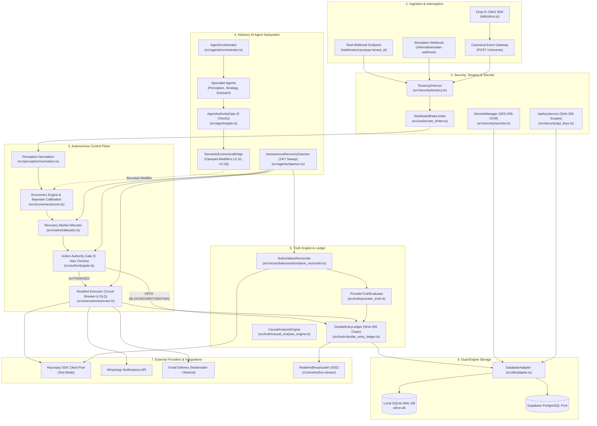
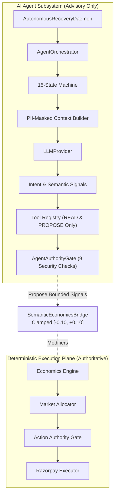

# ULTRON: Autonomous Economic Control Plane for Failed-Payment Recovery
### Comprehensive Technical Architecture, Operational Engine & System Reference Manual
*Derived purely from the active codebase*

---

## 1. Executive Summary & System Philosophy

### 1.1 The Fundamental Problem
Traditional payment gateways and retry tools (e.g. Razorpay, Stripe, Adyen, Zuora) operate on an **opportunity-by-opportunity** basis:
> *"Can we retry or recover this payment right now?"*

This strategy frequently exhausts customer goodwill, triggers issuer anti-fraud velocity limits, incurs redundant delivery fees, and wastes limited operational bandwidth on transactions that would either have recovered on their own naturally or are permanently unrecoverable.

### 1.2 The ULTRON Paradigm Shift
**ULTRON** operates an autonomous economic control layer **above** payment retries:
> *"Is recovering this payment worth spending our next unit of scarce, costly recovery capacity — and does action survive deterministic compliance rules?"*

ULTRON models failed payments as **Recovery Opportunities** competing within a portfolio under explicit constraints (e.g. a batch capacity cap of 5 payment links per run). It computes the **Expected Incremental Value ($\text{IVEN}$)**, runs a **Market Allocation** to determine the marginal cutoff (**Shadow Price**), validates the decision through a separate **Deterministic Compliance Gate (Action Authority)** that holds strict veto power, executes link creation idempotently in Razorpay Test Mode, and anchors settlements into an **Immutable Double-Entry Ledger**.

```
                           THE ULTRON PIPELINE
  Failed Payment Event
          │
          ▼
  [Perception Normalizer] ──► Hard / Soft / Unknown Decline Taxonomy
          │
          ▼
  [Economic Engine]       ──► IVEN = (P_incremental × Amount) - Delivery - Fatigue
          │
          ▼
  [Recovery Market]       ──► Greedy Portfolio Ranking (Cap K=5, Shadow Price λ)
          │
          ▼
  [Action Authority Gate] ──► 5 Deterministic Checks (Compliance Veto Power)
          │
       AUTHORIZED
          │
          ▼
  [Resilient Executor]    ──► Circuit Breaker + Idempotency Key (ref_<opp_id>)
          │
          ├──► Razorpay Payment Links API (Test Mode)
          ├──► Omnichannel Dispatch (WhatsApp + Email)
          └──► Immutable Double-Entry Ledger (SHA-256 Chained)
```

---

## 2. Core Design Invariants

1. **Opportunity-First Ingestion**: Raw webhook payloads or client signals are never acted upon directly. Every event is normalized into a persistent `RecoveryOpportunity` record.
2. **Counterfactual Probability ($\Delta P$)**: Opportunities are scored on **incremental recovery probability**:
   $$\Delta P = \max(0, P_{\text{intervention}} - P_{\text{natural}})$$
   A payment that had a high natural probability of recovery (such as temporary bank gateway timeouts) is not worth spending scarce recovery links on unless intervention significantly increases the odds.
3. **Tri-State Decision Model**: Every opportunity resolves to exactly one of three states:
   - **`ACT`**: Economic case is positive, within capacity cap, and compliance checks pass.
   - **`WAIT`**: Economic case is positive, but value falls below the batch shadow price cutoff.
   - **`ABSTAIN`**: Confidence is low, expected value is non-positive, or decline is irreversible.
4. **Two-Stage Decoupling (Economics vs Compliance)**: Economic optimization (Stage 1) is strictly decoupled from Action Authority (Stage 2). Action Authority is deterministic, rules-based, and holds total veto power over an economic `ACT` decision.
5. **Strict Execution Path Isolation (Zero LLM on Money Path)**: No Large Language Model (LLM) sits on the decision, scoring, or execution path. LLMs are restricted to advisory roles (generating natural language explanations, semantic diagnostic signals, and outreach drafts).
6. **Provider Truth Invariant**:
   $$\text{PROVIDER TRUTH} > \text{RECONCILIATION} > \text{LOCAL FINANCIAL STATE}$$
   Creating a payment link only sets state to `executing` (`PROVIDER_OBJECT_CREATED`). A payment is **strictly marked `recovered`** only when the external provider confirms `status === 'paid'` or `'captured'` and `amount_paid > 0`.

---

## 3. System Architecture & Component Topology



---

## 4. Database Schema & Storage Architecture

### 4.1 Dual-Engine Architecture (`DatabaseAdapter`)
Implemented in `src/db/adapter.ts`:
- **Engine 1: SQLite (`node:sqlite.DatabaseSync`)**: High-performance local file persistence running in Write-Ahead Logging (`WAL`) mode with foreign keys enabled (`PRAGMA foreign_keys = ON`).
- **Engine 2: PostgreSQL (`pg.Pool`)**: Cloud-native persistence connected to Supabase PostgreSQL with automated SQL normalization:
  - Rewrites `?` placeholders to `$1, $2, ...`
  - Replaces `INTEGER PRIMARY KEY AUTOINCREMENT` with `BIGSERIAL PRIMARY KEY`
  - Strips SQLite PRAGMAs
  - Translates `INSERT OR IGNORE` into `INSERT ... ON CONFLICT DO NOTHING`

### 4.2 Core Schemas & Entity Contracts

```sql
-- 1. Tenants (Multi-Tenancy Isolation)
CREATE TABLE tenants (
  id TEXT PRIMARY KEY,
  name TEXT NOT NULL,
  slug TEXT NOT NULL UNIQUE,
  environment TEXT NOT NULL CHECK(environment IN ('live', 'test')),
  status TEXT NOT NULL CHECK(status IN ('ACTIVE', 'SUSPENDED', 'PENDING')),
  capacity_limit INTEGER NOT NULL DEFAULT 5,
  kill_switch_active INTEGER NOT NULL DEFAULT 0,
  created_at TEXT NOT NULL
);

-- 2. Recovery Opportunities (Primary Financial Artifact)
CREATE TABLE recovery_opportunities (
  id TEXT PRIMARY KEY,
  tenant_id TEXT NOT NULL DEFAULT 'tenant_system_default',
  merchant_id TEXT NOT NULL DEFAULT 'tenant_system_default',
  source TEXT NOT NULL CHECK(source IN ('real', 'synthetic')),
  amount_paise INTEGER NOT NULL,
  currency TEXT NOT NULL DEFAULT 'INR',
  reason_code TEXT NOT NULL,
  decline_type TEXT NOT NULL CHECK(decline_type IN ('hard', 'soft', 'unknown')),
  attempt_count INTEGER NOT NULL DEFAULT 1,
  customer_id TEXT NOT NULL,
  customer_trust_score REAL NOT NULL DEFAULT 0.65,
  created_at TEXT NOT NULL,
  status TEXT NOT NULL CHECK(status IN (
    'pending', 'scored', 'allocated', 'authorized', 'deferred',
    'blocked', 'abstained', 'executing', 'recovered', 'not_recovered'
  )),
  razorpay_event_id TEXT UNIQUE,
  raw_payload_ref TEXT
);

-- 3. Economic Scores (1:1 with Opportunity)
CREATE TABLE scores (
  opportunity_id TEXT PRIMARY KEY,
  tenant_id TEXT NOT NULL DEFAULT 'tenant_system_default',
  natural_recovery_prob REAL NOT NULL,
  intervention_recovery_prob REAL NOT NULL,
  incremental_prob REAL NOT NULL,
  operational_cost_paise INTEGER NOT NULL,
  fatigue_cost_paise INTEGER NOT NULL,
  expected_incremental_value_paise INTEGER NOT NULL,
  confidence TEXT NOT NULL CHECK(confidence IN ('low', 'medium', 'high')),
  FOREIGN KEY (opportunity_id) REFERENCES recovery_opportunities(id) ON DELETE CASCADE
);

-- 4. Allocation Decisions (Market Portfolio Selection)
CREATE TABLE allocation_decisions (
  opportunity_id TEXT PRIMARY KEY,
  decision TEXT NOT NULL CHECK(decision IN ('ACT', 'WAIT', 'ABSTAIN')),
  rank_in_batch INTEGER NOT NULL,
  shadow_price_paise_at_decision INTEGER NOT NULL,
  reason TEXT NOT NULL,
  FOREIGN KEY (opportunity_id) REFERENCES recovery_opportunities(id) ON DELETE CASCADE
);

-- 5. Authority Checks (Compliance Audit Veto Log)
CREATE TABLE authority_checks (
  id INTEGER PRIMARY KEY AUTOINCREMENT,
  opportunity_id TEXT NOT NULL,
  check_name TEXT NOT NULL,
  passed INTEGER NOT NULL CHECK(passed IN (0, 1)),
  reason TEXT NOT NULL,
  FOREIGN KEY (opportunity_id) REFERENCES recovery_opportunities(id) ON DELETE CASCADE
);

-- 6. Execution Records (Payment Link State)
CREATE TABLE execution_records (
  opportunity_id TEXT PRIMARY KEY,
  razorpay_payment_link_id TEXT NOT NULL,
  link_url TEXT NOT NULL,
  status TEXT NOT NULL,
  idempotency_key TEXT NOT NULL UNIQUE,
  created_at TEXT NOT NULL,
  FOREIGN KEY (opportunity_id) REFERENCES recovery_opportunities(id) ON DELETE CASCADE
);

-- 7. Double-Entry Ledger (Cryptographic SHA-256 Chained Audit Trail)
CREATE TABLE double_entry_ledger (
  id TEXT PRIMARY KEY,
  tenant_id TEXT NOT NULL DEFAULT 'tenant_system_default',
  opportunity_id TEXT NOT NULL,
  event_type TEXT NOT NULL,
  debit_account TEXT NOT NULL,
  credit_account TEXT NOT NULL,
  amount_paise BIGINT NOT NULL,
  timestamp TEXT NOT NULL,
  prev_hash TEXT NOT NULL,
  entry_hash TEXT NOT NULL
);

-- 8. Encrypted Tenant Credentials (AES-256-GCM Envelope)
CREATE TABLE tenant_credentials (
  id TEXT PRIMARY KEY,
  tenant_id TEXT NOT NULL,
  provider TEXT NOT NULL,
  environment TEXT NOT NULL CHECK(environment IN ('live', 'test')),
  credential_reference TEXT NOT NULL UNIQUE,
  encrypted_data TEXT NOT NULL,
  iv TEXT NOT NULL,
  auth_tag TEXT NOT NULL,
  created_at TEXT NOT NULL,
  updated_at TEXT NOT NULL,
  FOREIGN KEY (tenant_id) REFERENCES tenants(id) ON DELETE CASCADE
);

-- 9. Machine API Keys
CREATE TABLE api_keys (
  id TEXT PRIMARY KEY,
  tenant_id TEXT NOT NULL,
  name TEXT NOT NULL,
  key_prefix TEXT NOT NULL,
  key_id TEXT NOT NULL UNIQUE,
  secret_hash TEXT NOT NULL,
  environment TEXT NOT NULL CHECK(environment IN ('live', 'test')),
  scopes TEXT NOT NULL,
  created_at TEXT NOT NULL,
  last_used_at TEXT,
  expires_at TEXT,
  revoked_at TEXT,
  FOREIGN KEY (tenant_id) REFERENCES tenants(id) ON DELETE CASCADE
);

-- 10. Interventions Prevented (Anti-Blast Financial & Goodwill Audit)
CREATE TABLE interventions_prevented (
  id TEXT PRIMARY KEY,
  opportunity_id TEXT NOT NULL,
  tenant_id TEXT NOT NULL DEFAULT 'tenant_system_default',
  prevention_reason TEXT NOT NULL,
  messaging_fee_saved_paise INTEGER NOT NULL,
  provider_fee_saved_paise INTEGER NOT NULL,
  goodwill_saved_paise INTEGER NOT NULL,
  total_capital_saved_paise INTEGER NOT NULL,
  timestamp TEXT NOT NULL
);
```

---

## 5. End-to-End Operational Pipeline

### Stage 1: Ingestion Gateway & Interception
The system accepts payment failure events from 4 interfaces:
1. **Real Webhooks** (`POST /webhooks/razorpay/:tenant_id`): Verified against tenant-specific webhook secrets using HMAC-SHA256 (`crypto.timingSafeEqual`). Records assigned `source = 'real'`.
2. **Simulation Webhooks** (`POST /internal/simulate-webhook/:tenant_id`): Generates test opportunities unconditionally tagged with `source = 'synthetic'`.
3. **Canonical Event Ingestion Gateway** (`POST /v1/events`): Authenticated via API key or JWT, strictly asserting that incoming `tenant_id` matches the authenticated caller, and validating payloads against Zod schema `CanonicalPaymentEventSchema`. Deduplicates by `event_id` and `payment_id`.
4. **Client SDK Interceptor** (`GET /sdk/ultron.js`): A lightweight zero-code drop-in client script. Injects into merchant checkouts, monkey-patches `window.Razorpay`, listens to `instance.on('payment.failed')`, captures failed payments directly, and sends heartbeats to `/v1/events/ping`.

### Stage 2: Perception Normalization
Implemented in `src/perception/normalizer.ts`:
- **Taxonomy Classification**:
  - `hard`: Matches `HARD_DECLINE_PATTERNS` (e.g. `stolen_card`, `lost_card`, `pickup_card`, `restricted_card`).
  - `soft`: Matches `SOFT_DECLINE_PATTERNS` (e.g. `insufficient_funds`, `expired_card`, `generic_decline`, `do_not_honor`, `bank_gateway_timeout`, `network_timeout`).
  - `unknown`: Unrecognized codes; gracefully mapped without crashing.
- **Attempt Tracking**: Increments attempt count using `countPriorAttempts(customerId, orderId) + 1`.
- **Customer Trust Score**: Resolves customer profile from `customers` table (defaults to `0.65` for new customers).

### Stage 3: Economic Reasoning & Valuation
Implemented in `src/economics/scorer.ts`:
- **Counterfactual Probabilities**:
  - `insufficient_funds`: $P_{\text{natural}} = 0.35, P_{\text{intervention}} = 0.55 \implies \Delta P = 0.20$
  - `expired_card`: $P_{\text{natural}} = 0.05, P_{\text{intervention}} = 0.60 \implies \Delta P = 0.55$
  - `bank_gateway_timeout`: $P_{\text{natural}} = 0.60, P_{\text{intervention}} = 0.70 \implies \Delta P = 0.10$
  - `hard_decline`: $P_{\text{natural}} = 0.02, P_{\text{intervention}} = 0.02 \implies \Delta P = 0.00$
- **Cost Structure**:
  - Operational Cost: Fixed at **₹4.00 (400 paise)** per payment link.
  - Customer Fatigue Cost Curve:
    $$\text{Fatigue Cost} = \begin{cases} 
    0 \text{ paise} & \text{attempt } \le 1 \\ 
    250 \text{ paise (₹2.50)} & \text{attempt } = 2 \\ 
    750 \text{ paise (₹7.50)} & \text{attempt } = 3 \\ 
    1500 + (\text{attempt} - 4) \times 500 \text{ paise} & \text{attempt } \ge 4 
    \end{cases}$$
- **Expected Incremental Value ($\text{IVEN}$)**:
  $$\text{IVEN (paise)} = \text{round}\Big((\Delta P \times \text{amount\_paise}) - \text{operational\_cost\_paise} - \text{fatigue\_cost\_paise}\Big)$$
- **Confidence Scoring**: `low` if `decline_type === 'unknown'` or `attempt_count >= 3`; `high` if `decline_type === 'hard'` or timeout; `medium` otherwise.

### Stage 4: Recovery Market Portfolio Allocation
Implemented in `src/market/allocator.ts`:
1. **Abstain Filter**: If `confidence === 'low'` OR $\text{IVEN} \le 0$, the opportunity is routed to `ABSTAIN` (`rank_in_batch = 0`). It never enters the allocation queue.
2. **Greedy Ranking**: Remaining eligible opportunities are sorted in descending order of IVEN.
3. **Capacity Allocation**:
   - $\text{Rank} \le \text{Capacity Cap (5)}$: Decision assigned is `ACT`, status updated to `allocated`.
   - $\text{Rank} > \text{Capacity Cap (5)}$: Decision assigned is `WAIT`, status updated to `deferred`.
4. **Shadow Price Calculation**:
   $$\text{Shadow Price } \lambda = \text{IVEN of the last accepted marginal opportunity}$$

### Stage 5: Deterministic Action Authority Gate
Implemented in `src/authority/gate.ts`:
Runs after market allocation and evaluates 5 rules independently:
1. `hard_decline_check`: Fails if `decline_type === 'hard'` $\implies$ **`BLOCKED`**.
2. `retry_cap_check`: Fails if `attempt_count >= 3` $\implies$ **`BLOCKED`**.
3. `kill_switch_check`: Fails if global, tenant, or provider kill switch is active $\implies$ **`BLOCKED`**.
4. `confidence_recheck`: Fails if economic `confidence === 'low'` $\implies$ **`ABSTAIN`**.
5. `capacity_recheck`: Fails if market decision $\ne \text{'ACT'}$ $\implies$ **`WAIT`**.

**Only when all 5 checks pass does the verdict become `AUTHORIZED`.**

### Stage 6: Resilient Execution Engine
Implemented in `src/execution/executor.ts`:
- **Pre-execution Assertion**: Re-verifies Action Authority; rejects any payment link generation if verdict $\ne \text{'AUTHORIZED'}$.
- **Idempotency**: Checks local database for existing `ref_<opp_id>`. Sets `reference_id: opp.id` on Razorpay API call to prevent duplicate link generation.
- **Circuit Breaker** (`src/execution/circuit_breaker.ts`):
  - 10-second timeout per call.
  - Exponential backoff with random jitter up to 5 retries.
  - Tripping threshold: 5 consecutive failures open the breaker for a 30-second cooldown.
- **Dead Letter Queue** (`src/execution/dlq.ts`): Failed executions logged with staged retries (5m, 15m, 1h, 4h).
- **Omnichannel Dispatch**: On link creation, dispatches recovery link via WhatsApp (`src/notifications/whatsapp.ts`) and Email (`src/notifications/email.ts`).

### Stage 7: Truth Engine & Authoritative Reconciliation
Implemented in `src/truth/canonical_state_machine.ts` and `src/reconciliation/authoritative_reconciler.ts`:
- **Provider Truth Verification**: Polls or receives payment link status from Razorpay.
- **Strict Invariant**: A link in `created` or `issued` state transitions strictly to `PROVIDER_OBJECT_CREATED` / `executing`, never `recovered`.
- **Settlement Recording**: When Razorpay confirms `status === 'paid'` or `'captured'` and `amount_paid > 0`, an atomic transaction executes:
  1. Updates `recovery_opportunities.status = 'recovered'`.
  2. Updates `execution_records.status = 'completed'`.
  3. Appends entry to `double_entry_ledger`:
     $$\text{entry\_hash} = \text{SHA-256}(\text{prev\_hash} : \text{id} : \text{opp\_id} : \text{event} : \text{debit} : \text{credit} : \text{amount} : \text{timestamp})$$
  4. Appends audit log to `ledger_entries`.
  5. Records evaluated outcome into `agent_outcomes` and `agent_memories`.
  6. Emits real-time notification to merchant dashboard via Server-Sent Events.

---

## 6. Advisory AI Agent Subsystem

Implemented in `src/agents/`:
The agent subsystem functions as a decoupled analytical and copilot plane.



### 6.1 Agent Safety Rules & Boundary Guarantees
1. **No LLM on the Financial Path**: The LLM never outputs an action, amount, or direct execution instruction. It only produces diagnosis hypotheses and semantic signals (`transient_failure`, `gateway_instability`, `customer_liquidity`, `fatigue`).
2. **The Semantic Economics Bridge** (`src/agents/bridge.ts`):
   - Signals are clamped strictly between `0.0` and `1.0`.
   - Probability modifiers are clamped between `-0.10` and `+0.10`.
   - Fatigue modifier is clamped between `0` and `500` paise.
   - Hard declines are hardcoded to `0.0` incremental probability regardless of LLM recommendations.
3. **Agent Authority Gate** (`src/agents/gate.ts`):
   Enforces 9 mandatory checks before any tool can execute:
   - Check 1: Kill switch check.
   - Check 2: Registered agent identity check.
   - Check 3: Tool scope (`READ`, `ANALYZE`, `PROPOSE` only).
   - Check 4: Mission token and step budget check.
   - Check 5: Rate limit check (max 60 calls/min).
   - Check 6: **Write boundary check** (strictly forbids tools named `execute_payment`, `create_payment_link_direct`, `modify_ledger`).
   - Check 7: Environment check (synthetic vs live).
   - Check 8: Prompt injection taint check (regex scan for `ignore previous instructions`, `grant financial_write`, etc.).
   - Check 9: Infinite loop guard.
4. **24/7 Autonomous Daemon** (`src/agents/daemon.ts`):
   Runs in the background every 30 seconds:
   1. Checks kill switch.
   2. Scans pending opportunities using `PortfolioAgent.sweep()`.
   3. Allocates capacity via `runMarketAllocation()`.
   4. Executes authorized opportunities via `executeAuthorizedBatch()`.
   5. Polls and reconciles provider links via `pollAndReconcile()`.
   6. Emits notifications and logs sweep in `daemon_sweep_logs`.

---

## 7. Security, Multi-Tenancy & Cryptographic Specifications

### 7.1 Multi-Tenant Isolation (`src/security/tenancy.ts`)
- **Authentication**: Supports dual authentication:
  - Scoped API Keys (`ul_live_...`, `ul_test_...`) validated via SHA-256 against `api_keys`.
  - Session JWTs & Supabase Auth Bearer tokens.
- **Property-Level Protection**: Rejects client mutation of protected fields (`tenant_id`, `environment`, `authority_result`, `recovered`, `amount_paid`, `provider_status`).
- **Data Isolation**: All database queries are filtered by `tenant_id`.

### 7.2 Secrets Encryption at Rest (`src/security/secrets.ts`)
- Implements **AES-256-GCM authenticated envelope encryption** with tenant-scoped key derivation:
  $$\text{TenantKey} = \text{Scrypt}(\text{MasterKey}, \text{"tenant\_salt:"} + \text{tenant\_id}, 32)$$
- Generates a unique 12-byte initialization vector (`iv`) and 16-byte authentication tag (`authTag`) per secret.
- Automatically synchronizes encrypted blobs to Supabase (`tenant_credentials`).

---

## 8. Real-Time Telemetry & Observability

### 8.1 Server-Sent Events (SSE) Broadcaster (`src/realtime/broadcaster.ts`)
- Endpoint: `GET /v1/events/live-stream`
- Maintains streaming client connections partitioned by `tenantId`.
- Pushes live events: `EVENT_INGESTED`, `NOTIFICATION_CREATED`, `OPPORTUNITY_UPDATED`, `SWEEP_COMPLETED`.
- Dispatches `:keepalive` comment every 20 seconds.

### 8.2 Enterprise Prometheus Metrics (`src/observability/metrics.ts`)
- Endpoint: `GET /metrics` (Format: `text/plain; version=0.0.4`)
  - `ultron_opportunities_total` (counter)
  - `ultron_recovered_revenue_paise_total` (counter)
  - `ultron_interventions_dispatched_total` (counter)
  - `ultron_compliance_vetoes_total` (counter)
  - `ultron_shadow_price_paise` (gauge)
  - `ultron_capacity_saturation_ratio` (gauge)
  - `ultron_circuit_breaker_state` (gauge: 0=CLOSED, 1=HALF_OPEN, 2=OPEN)
  - `ultron_kill_switch_state` (gauge: 0=NORMAL, 1=ENGAGED)
  - `ultron_recovery_latency_seconds` (histogram)
  - `ultron_provider_latency_seconds` (histogram)

### 8.3 Enterprise Health Check Probes (`src/observability/health.ts`)
- `GET /health/live`: Liveness probe.
- `GET /health/ready`: Readiness probe (validates database pool and Redis connection).
- `GET /health/deep`: Deep probe (validates Razorpay client pool, Supabase connection, and ledger hash integrity).

---

## 9. Frontend Web Application

Located in `frontend/src/` (Next.js 15 App Router + TailwindCSS):

1. **Authentication & Client State** (`frontend/src/lib/auth.tsx`):
   - `AuthProvider` managing session tokens in `localStorage`.
   - Authenticated typed client `api<T>()` with auto-bearer token injection and automatic Supabase session refresh.
2. **Unified Recovery Hub** (`frontend/src/app/dashboard/page.tsx`):
   - Real-time KPI cards: Total at Risk, Recovered Revenue, Portfolio Shadow Price, Capacity Saturation.
   - Global emergency Kill Switch toggle.
   - Filterable opportunity table (`ALL`, `ACT`, `WAIT`, `ABSTAIN`, `BLOCKED`, `RECOVERED`).
   - Forensic detail drawer displaying natural vs intervention probabilities, operational and fatigue costs, and Action Authority audit logs.
   - WhatsApp recovery preview and direct dispatch modal.
3. **Integration & Setup Wizard** (`frontend/src/app/dashboard/setup/page.tsx`):
   - **Step 1: Connect Razorpay**: Key ID, Key Secret, and Webhook Secret configuration form with automated live connectivity check.
   - **Step 2: Embed SDK & Webhooks**: Webhook endpoint copy utility and 2-line drop-in `<script>` embed generator.
   - **Step 3: Interactive Store Simulator**: Test checkout simulator allowing merchants to trigger payment failures and watch autonomous recovery in real time.

---

## 10. Complete API Directory

| Method | Route | Auth / Scope | Purpose |
| :--- | :--- | :--- | :--- |
| `GET` | `/` | Public | API Root Directory & Status Page |
| `GET` | `/health` | Public | Basic Health Check & Telemetry |
| `GET` | `/health/live` | Public | Kubernetes Liveness Probe |
| `GET` | `/health/ready` | Public | Kubernetes Readiness Probe |
| `GET` | `/health/deep` | Public | Deep Dependency Probe |
| `GET` | `/metrics` | Public | Prometheus Exposition Metrics |
| `GET` | `/sdk/ultron.js` | Public | Drop-In JavaScript Client SDK |
| `POST` | `/webhooks/razorpay/:tenant_id` | HMAC Signature | Real Razorpay Webhook Ingestion |
| `POST` | `/internal/simulate-webhook` | Signature / Test | Synthetic Simulation Ingestion |
| `POST` | `/v1/auth/signup` | Public | Merchant Registration & Onboarding |
| `POST` | `/v1/auth/login` | Public | Merchant Login & Session Issuance |
| `GET` | `/v1/auth/me` | Bearer Token | Current User & Tenant Profile |
| `POST` | `/v1/events` | `events:write` | Ingest Canonical Payment Event |
| `POST` | `/v1/events/ping` | Bearer Token | Web App Connection Heartbeat |
| `GET` | `/v1/events/connected-apps` | Bearer Token | List Online Connected Web Apps |
| `GET` | `/v1/events/stream` | `events:read` | Query Event Ingestion Logs |
| `GET` | `/v1/events/live-stream` | `events:read` | Server-Sent Events (SSE) Push Stream |
| `POST` | `/v1/events/test` | `events:write` | Dispatch Synthetic Test Event |
| `GET` | `/v1/api-keys` | Bearer Token | List Tenant API Keys |
| `POST` | `/v1/api-keys` | Bearer Token | Generate New Scoped API Key |
| `DELETE`| `/v1/api-keys/:id` | Bearer Token | Revoke API Key |
| `GET` | `/v1/integrations/razorpay/status`| Bearer Token | Provider Connectivity & Capabilities |
| `POST` | `/v1/integrations/razorpay/connect`| Bearer Token | Save & Verify Razorpay Credentials |
| `GET` | `/dashboard/summary` | Bearer Token | Financial & Recovery Metrics Summary |
| `GET` | `/opportunities` | Bearer Token | List All Opportunities & Scores |
| `POST` | `/market/run` | Bearer Token | Run Portfolio Market Allocation |
| `POST` | `/authority/run` | Bearer Token | Run Action Authority Compliance Gate |
| `POST` | `/execution/run` | Bearer Token | Execute Authorized Payment Links |
| `POST` | `/agents/daemon/sweep` | Bearer Token | Trigger Manual Background Sweep |
| `GET` | `/audit/records` | Bearer Token | Immutable Double-Entry Ledger Logs |
| `POST` | `/v1/notifications/whatsapp` | Bearer Token | Dispatch WhatsApp Recovery Notification |

---

## 11. Environment Configuration Reference

```ini
# Application
NODE_ENV=development
PORT=3001
APP_URL=http://localhost:3000

# Database & Cache
DATABASE_PATH=ultron.db
DATABASE_POOL_SIZE=10
DATABASE_URL=sqlite:///ultron.db
REDIS_URL=redis://localhost:6379

# Supabase Permanent Persistence
SUPABASE_URL=https://<your-project>.supabase.co
SUPABASE_SERVICE_ROLE_KEY=<service-role-key>
SUPABASE_ANON_KEY=<anon-key>

# Cryptographic Master Key (AES-256-GCM Envelope Encryption)
ENCRYPTION_MASTER_KEY=ultron_v6_secure_master_encryption_key_32bytes!
JWT_SECRET=ultron_super_secret_jwt_signing_key_2026

# Razorpay Test Mode (System Default Fallback)
RAZORPAY_KEY_ID=rzp_test_...
RAZORPAY_KEY_SECRET=...
RAZORPAY_WEBHOOK_SECRET=rzp_whsec_ultron_test

# Autonomous Recovery Agent Daemon
AUTONOMOUS_AGENT_ENABLED=true
MAX_LINKS_PER_RUN=5
AUTH_REQUIRED=true
```

---

## 12. Verification & Runbook Commands

```bash
# Install Dependencies
npm install
cd frontend && npm install && cd ..

# Run Database Schema Migrations
npm run db:migrate

# Seed 16 Synthetic Evaluation Scenarios
npm run seed

# Run Complete Core & Agent Test Suites
npm run test:v6-all
npm run test:agent
npm run test:core

# Run Standalone Pipeline Verification
npm run test:perception
npm run test:economics
npm run test:market
npm run test:authority
npm run test:execution
npm run test:truth

# Start Backend Control Plane API
npm run dev

# Start Frontend Next.js Web Application
cd frontend && npm run dev
```
