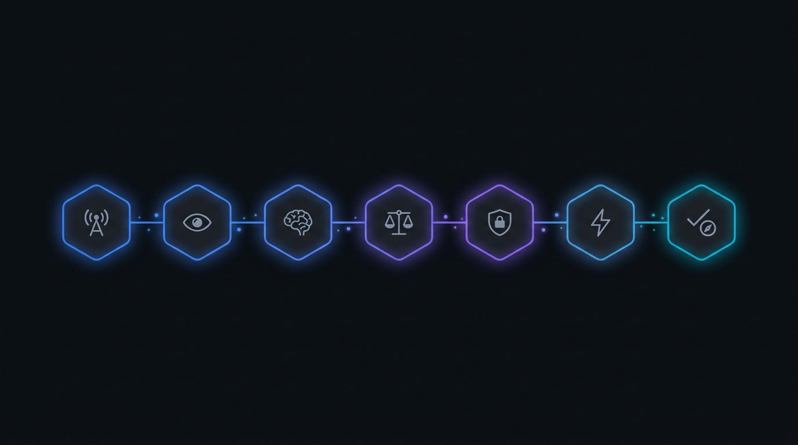
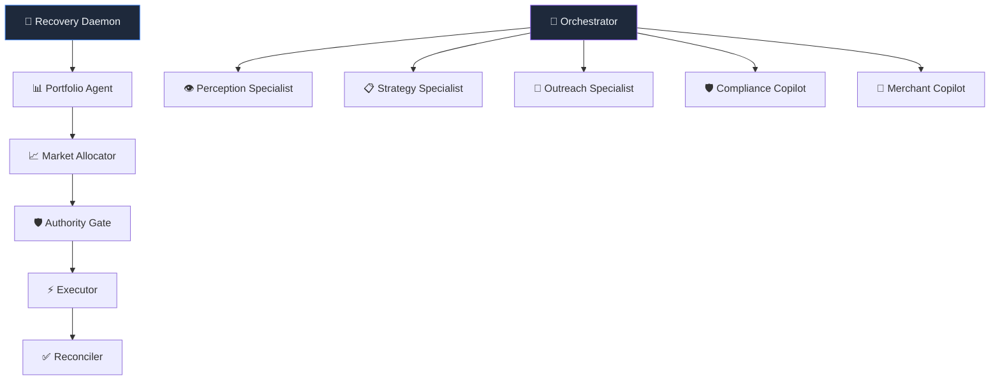
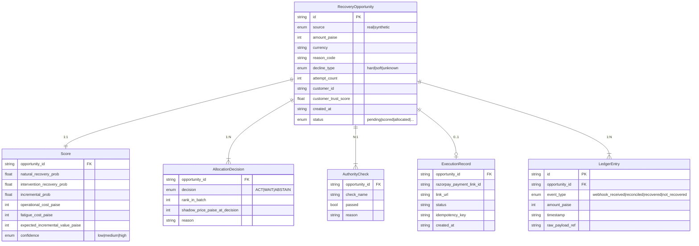

<p align="center">
  
</p>

<h1 align="center">🛡️ ULTRON</h1>

<h3 align="center">
  Autonomous Economic Control Plane for Failed-Payment Recovery
</h3>

<p align="center">
  <em>ULTRON doesn't ask "can we recover this payment?" — It asks<br/>"is recovering this payment <strong>worth spending our next unit of limited recovery capacity?</strong>"<br/>and only acts when the answer survives a deterministic compliance check.</em>
</p>

<br/>

<p align="center">
  <a href="#-architecture"></a>
  <a href="#-tech-stack"></a>
  <a href="#-getting-started"></a>
  <a href="#-api-reference"></a>
</p>

<p align="center">
  
  
  
  
  
</p>

---

## 📋 Table of Contents

- [Why ULTRON Exists](#-why-ultron-exists)
- [Core Philosophy](#-core-philosophy)
- [Architecture](#-architecture)
- [The 7-Stage Pipeline](#-the-7-stage-pipeline)
- [Advanced Economic Engine](#-advanced-economic-engine)
- [AI Agent System](#-ai-agent-system)
- [Tech Stack](#-tech-stack)
- [Project Structure](#-project-structure)
- [Getting Started](#-getting-started)
- [Environment Variables](#-environment-variables)
- [API Reference](#-api-reference)
- [Core Schema](#-core-schema)
- [Security & Enterprise Features](#-security--enterprise-features)
- [Testing](#-testing)
- [Docker Deployment](#-docker-deployment)
- [Design Principles](#-design-principles)
- [License](#-license)

---

## 🧠 Why ULTRON Exists

Razorpay, Stripe, Adyen, and Zuora already do smart **per-payment retry timing**. That is **not** what ULTRON builds.

ULTRON is the **layer above it** — a system that treats every failed payment as a **Recovery Opportunity** competing against every other opportunity for **scarce, costly recovery capacity** (payment links, human attention, contact budget), and that can rationally choose to do **nothing** when acting isn't worth it.

```
Traditional Retry Systems          ULTRON Control Plane
┌──────────────────────┐          ┌──────────────────────────────────────────────┐
│  Payment fails →     │          │  Payment fails →                             │
│  Wait X minutes →    │          │  Normalize into RecoveryOpportunity →        │
│  Retry again         │          │  Score incremental recovery probability →    │
│                      │          │  Compete against portfolio for capacity →    │
│  (No economics.      │          │  Run deterministic compliance gate →         │
│   No portfolio view. │          │  Execute only if AUTHORIZED →               │
│   No "do nothing"    │          │  Reconcile against provider truth →          │
│   option.)           │          │  Learn from outcome (Bayesian update)        │
└──────────────────────┘          └──────────────────────────────────────────────┘
```

> **Key Insight:** A payment that was going to recover on its own is worth acting on **only if** our intervention meaningfully improves the odds. ULTRON quantifies this via `incremental_prob = intervention_recovery_prob − natural_recovery_prob`.

---

## 💎 Core Philosophy

<table>
<tr>
<td width="60">🎯</td>
<td><strong>Incremental Value, Not Raw Probability</strong><br/>Score by how much <em>better</em> intervention makes recovery odds vs. natural recovery — not just "can we recover?"</td>
</tr>
<tr>
<td>⚖️</td>
<td><strong>Portfolio-Level Allocation</strong><br/>All opportunities compete for limited capacity under explicit budget constraints. The system exposes a <strong>shadow price</strong> — the value of the marginal accepted opportunity.</td>
</tr>
<tr>
<td>🛡️</td>
<td><strong>Two-Stage Decision Architecture</strong><br/>Economic decision (ACT/WAIT/ABSTAIN) → then deterministic compliance veto. Economics and compliance are <em>intentionally separate stages</em>.</td>
</tr>
<tr>
<td>🤖</td>
<td><strong>LLM as Explainer, Never as Executor</strong><br/>If an LLM is used, it may only <em>explain</em> a decision in natural language. No LLM sits on the execution path.</td>
</tr>
<tr>
<td>📊</td>
<td><strong>Model-Estimated, Not Measured Fact</strong><br/>Every probability shown is visibly labeled as <strong>model-estimated</strong> — because the true counterfactual is never observed.</td>
</tr>
<tr>
<td>📝</td>
<td><strong>Built-In Audit Trail</strong><br/>Every stage writes its reasoning to a durable log as it happens. The "Why?" screen reads stored fields, never generates explanations after the fact.</td>
</tr>
</table>

---

## 🏗 Architecture

<p align="center">
  
</p>

ULTRON processes every failed payment through a strict **7-stage pipeline** where each stage reads from and writes to a shared SQLite database, producing a complete, auditable decision trail.


---

## 🔗 The 7-Stage Pipeline

### Stage 1 — 🔔 Event Fabric
> **Webhook ingestion with HMAC-SHA256 signature verification and event deduplication**

| Capability | Implementation |
|---|---|
| Webhook endpoint | `POST /webhooks/razorpay/:tenant_id` |
| Signature verification | Timing-safe HMAC-SHA256 against per-tenant secrets |
| Event deduplication | By `event_id` and `payment_id` lookups |
| Multi-event support | `payment.failed`, `payment_link.paid`, `payment_link.expired` |
| Simulation endpoint | `POST /internal/simulate-webhook/:tenant_id` (source=`synthetic`) |
| Source labeling | Real webhooks → `source='real'` · Simulations → `source='synthetic'` |

Every incoming event is verified, deduplicated, and routed to the Perception layer. The simulation endpoint is completely isolated and unconditionally labels all ingested records as `synthetic`.

---

### Stage 2 — 👁 Perception
> **Decline taxonomy classification and opportunity normalization**

The Perception layer transforms raw Razorpay payment failure payloads into standardized `RecoveryOpportunity` records using a deterministic decline taxonomy:

```
┌────────────────────────────────┬────────────────────────────────────────┐
│  HARD DECLINES (irrecoverable) │  stolen_card, lost_card, pickup_card,  │
│  → Zero incremental value      │  restricted_card, card_stolen_lost     │
├────────────────────────────────┼────────────────────────────────────────┤
│  SOFT DECLINES (recoverable)   │  insufficient_funds, expired_card,     │
│  → Candidates for intervention │  generic_decline, bank_gateway_timeout,│
│                                │  do_not_honor, otp_timeout             │
├────────────────────────────────┼────────────────────────────────────────┤
│  UNKNOWN (unrecognized)        │  Any unmatched code →                  │
│  → Safe fallback, no crash     │  pipeline continues with low confidence│
└────────────────────────────────┴────────────────────────────────────────┘
```

Each opportunity also receives:
- **Customer profile** with trust score (default `0.65` for new customers)
- **Attempt count** derived from prior opportunity history
- **Tenant scoping** for multi-merchant isolation

---

### Stage 3 — 🧮 Economic Reasoning
> **Bayesian probability estimation, cost modeling, and Expected Incremental Value (IVEN) computation**

The Economic Reasoning engine computes a comprehensive `Score` for each opportunity:

```
IVEN = (incremental_prob × amount_paise) − operational_cost − fatigue_cost

where:
  incremental_prob = P(recovery | intervention) − P(recovery | no intervention)
  operational_cost = ₹4.00 (fixed per payment link)
  fatigue_cost     = f(attempt_count)  →  [₹0, ₹2.50, ₹7.50, ₹15+]
```

**Probability Sources:**

| Engine | Description | When Used |
|---|---|---|
| **Static Probability Table** | Hand-coded baselines per decline type | Default (< 100 observations) |
| **Bayesian Calibration** | Beta-Binomial posterior with sample-size gated auto-promotion | ≥ 100 observations per reason code |
| **Thompson Sampling Bandit** | Marsaglia-Tsang Gamma sampler with Box-Muller transform for exploration | Opt-in via `ENABLE_THOMPSON_SAMPLING` |

**Key Invariant:** Hard declines **always** produce `IVEN ≤ 0`. This is enforced at both the probability estimation and final score computation stages.

---

### Stage 4 — 📊 Recovery Market
> **Portfolio-level greedy allocation with shadow pricing and capacity constraints**

The Recovery Market treats opportunities as competing for **scarce recovery capacity**:

```
  Input: All non-terminal opportunities with scores
    │
    ├─ Filter: confidence='low' or IVEN ≤ 0 → ABSTAIN (exits ranking)
    ├─ Filter: 5% deterministic holdout      → ABSTAIN (counterfactual control)
    │
    ├─ Sort remaining by IVEN descending
    │
    ├─ Top K (capacity limit) → ACT
    ├─ Remainder             → WAIT (deferred)
    │
    └─ Shadow Price = IVEN of the Kth (marginal) opportunity
```

| Concept | Definition |
|---|---|
| **Shadow Price** | The IVEN of the last opportunity accepted — the minimum value for which capacity was allocated |
| **Capacity** | Configurable per-tenant or per-run (default: 5 payment links per run) |
| **Anti-Blast Engine** | Calculates exact savings from _not_ acting (messaging fees, provider fees, customer goodwill) |
| **Dual-Mirror Budget Pacer** | Daily/hourly budget tracking with Lagrangian shadow multiplier |
| **Holdout Group** | 5% deterministic holdout for continuous counterfactual measurement |

---

### Stage 5 — 🛡 Action Authority
> **Deterministic compliance gate with multi-level kill switch — vetoes economic decisions**

**This is an independent, deterministic gate that runs _after_ allocation and can veto an ACT decision.** The two-stage design (economic decision → compliance veto) is intentional.

```
  ┌──────────────────────────────────────────────────────────────────┐
  │  Check 1: Hard Decline Check     → BLOCKED if decline_type='hard'│
  │  Check 2: Retry Cap Check        → BLOCKED if attempt_count ≥ 3  │
  │  Check 3: Kill Switch Check      → BLOCKED if kill switch active  │
  │  Check 4: Confidence Recheck     → ABSTAIN if confidence='low'   │
  │  Check 5: Capacity Recheck       → WAIT if not in ACT batch      │
  └──────────────────────────────────────────────────────────────────┘

  Verdict: AUTHORIZED | BLOCKED | ABSTAIN | WAIT
```

**Multi-Level Kill Switch:**
- 🔴 **Global** — halts all recovery activity system-wide
- 🟠 **Per-Tenant** — halts recovery for a specific merchant
- 🟡 **Per-Provider** — halts recovery for a specific payment provider

---

### Stage 6 — ⚡ Execution
> **Razorpay payment link creation with circuit breaker, DLQ, and omnichannel dispatch**

Only `AUTHORIZED` opportunities reach the Execution stage. Key safeguards:

| Safeguard | Description |
|---|---|
| **Zero-Bypass Authority Assertion** | Re-evaluates authority verdict before every execution — no shortcut |
| **Idempotency** | Local SQLite + remote Razorpay `reference_id` deduplication |
| **Circuit Breaker** | 3-state (CLOSED→OPEN→HALF_OPEN) with 5-failure threshold and 30s cooldown |
| **Dead Letter Queue** | Failed executions recorded with actionable error messages for replay |
| **Rate Limiter** | Tiered: webhooks (100/min), execution (10/min), general (600/min) |

**Omnichannel Recovery Dispatch:**
- 📱 **WhatsApp** via Meta Cloud API (automated recovery link delivery)
- 📧 **Email** via Resend API / Custom SMTP (branded recovery notifications)
- 🔗 **Payment Link** with SMS+Email via Razorpay native notifications

---

### Stage 7 — ✅ Truth Engine
> **Authoritative reconciliation against provider truth with hash-chained double-entry ledger**

The Truth Engine is the **final arbiter** of recovery outcomes. It follows a strict invariant hierarchy:

```
  PROVIDER TRUTH  >  RECONCILIATION  >  LOCAL FINANCIAL STATE
```

| Component | Purpose |
|---|---|
| **Provider Truth Evaluator** | Extracts canonical payment state from raw Razorpay API response |
| **Canonical State Machine** | Maps provider statuses to 18 internal states with validated transitions |
| **Authoritative Reconciler** | Atomic SQLite transaction updating opportunity + execution + ledger |
| **Double-Entry Ledger** | SHA-256 hash-chained entries (debit: `bank_settlement` ↔ credit: `recovered_revenue`) |
| **Reconciliation SLA Monitor** | Tracks time-to-settlement and flags SLA breaches |
| **Causal Analysis Engine** | Evaluates intervention effectiveness with Brier score tracking |

**Learning Loop:** Every reconciled outcome feeds back into the Bayesian Calibration engine and Thompson Sampling Bandit, continuously updating probability distributions.

---

## 📈 Advanced Economic Engine

### Bayesian Probability Calibration

```
Prior:       Beta(α₀, β₀)  ← from static probability table
Observation: k successes in n trials
Posterior:   Beta(α₀ + k,  β₀ + (n − k))

Auto-Promotion Gate:
  • Sample size ≥ 100
  • Lift vs. baseline > 5%
  • Z-test p-value < 0.05
```

### Thompson Sampling (Explore/Exploit)

For each decline context, ULTRON maintains Beta-distributed arms and samples recovery probabilities using the **Marsaglia & Tsang (2000) Gamma distribution sampler** with Box-Muller Normal variates. This allows the system to:
- **Explore** uncertain decline codes that may have high recovery rates
- **Exploit** well-understood codes with proven intervention lift
- **Converge** to optimal allocation as observation count grows

### Anti-Blast Engine (Value of Inaction)

ULTRON uniquely quantifies the **value of not acting**:
- 📬 WhatsApp messaging fee saved: ₹0.85 per prevented message
- 🔗 Razorpay link overhead saved: ₹4.00 per prevented link
- 💚 Customer goodwill preserved: ₹5.00 – ₹50.00 (fraud blocks save ₹50)

---

## 🤖 AI Agent System

ULTRON includes a sophisticated multi-agent recovery orchestrator:



| Component | File | Purpose |
|---|---|---|
| **Autonomous Daemon** | `agents/daemon.ts` | 24/7 background sweep loop (configurable 15s–5min intervals) |
| **Portfolio Agent** | `agents/portfolio_agent.ts` | Scans and ranks all active opportunities |
| **Orchestrator** | `agents/orchestrator.ts` | Multi-step recovery plan execution with replanning |
| **Tool Registry** | `agents/tool_registry.ts` | 15+ registered tools for autonomous operations |
| **Memory System** | `agents/memory.ts` | Episodic + semantic memory for learning from outcomes |
| **Uncertainty Engine** | `agents/uncertainty.ts` | Entropy-based information value calculations |
| **Temporal Firewall** | `agents/temporal_firewall.ts` | Prevents action loops and temporal violations |
| **Loop Guard** | `agents/loop_guard.ts` | Infinite loop detection and circuit-breaking |

---

## 🛠 Tech Stack

<table>
<tr>
<th align="left">Layer</th>
<th align="left">Technology</th>
<th align="left">Purpose</th>
</tr>
<tr>
<td>Runtime</td>
<td></td>
<td>Server runtime (via tsx for TypeScript execution)</td>
</tr>
<tr>
<td>Language</td>
<td></td>
<td>End-to-end type safety across backend + frontend</td>
</tr>
<tr>
<td>API</td>
<td></td>
<td>REST API server with middleware pipeline</td>
</tr>
<tr>
<td>Database</td>
<td></td>
<td>Zero-setup embedded storage (file-based)</td>
</tr>
<tr>
<td>Cloud DB</td>
<td></td>
<td>PostgreSQL cloud sync for production deployments</td>
</tr>
<tr>
<td>Cache</td>
<td></td>
<td>Rate limiting, session cache, and budget tracking</td>
</tr>
<tr>
<td>Frontend</td>
<td></td>
<td>React-based dashboard with Tailwind CSS</td>
</tr>
<tr>
<td>Payments</td>
<td></td>
<td>Official Node SDK — Test Mode keys only</td>
</tr>
<tr>
<td>Messaging</td>
<td></td>
<td>Meta Cloud API for recovery notifications</td>
</tr>
<tr>
<td>Email</td>
<td></td>
<td>Transactional email delivery</td>
</tr>
<tr>
<td>Security</td>
<td></td>
<td>HSTS, CSP, and security headers</td>
</tr>
<tr>
<td>Validation</td>
<td></td>
<td>Runtime schema validation</td>
</tr>
<tr>
<td>LLM</td>
<td></td>
<td>Decision explanations only — never on execution path</td>
</tr>
<tr>
<td>Observability</td>
<td></td>
<td>Structured JSON logging + Prometheus metrics</td>
</tr>
<tr>
<td>Infrastructure</td>
<td></td>
<td>Multi-container deployment with NGINX reverse proxy</td>
</tr>
</table>

---

## 📁 Project Structure

```
ultron/
├── src/                          # Backend source (116 files, 21,598 LOC)
│   ├── server.ts                 # Express app entry point & route registration
│   ├── worker.ts                 # Background worker process
│   │
│   ├── webhooks/                 # Stage 1: Event Fabric
│   │   ├── razorpay.ts           #   HMAC-verified webhook handlers (real + simulated)
│   │   ├── queue.ts              #   Webhook delivery queue with replay
│   │   └── whatsapp.ts           #   WhatsApp Cloud API webhook receiver
│   │
│   ├── perception/               # Stage 2: Perception
│   │   └── normalizer.ts         #   Decline taxonomy & opportunity normalization
│   │
│   ├── economics/                # Stage 3: Economic Reasoning
│   │   ├── scorer.ts             #   IVEN computation engine
│   │   ├── bayesian_calibration.ts  # Beta-Binomial posterior calibration
│   │   ├── bandit_policy.ts      #   Thompson Sampling (Marsaglia-Tsang Gamma)
│   │   └── anti_blast_engine.ts  #   Value-of-inaction calculator
│   │
│   ├── market/                   # Stage 4: Recovery Market
│   │   ├── allocator.ts          #   Greedy portfolio allocation with shadow price
│   │   └── capacity_policy.ts    #   Dual-Mirror budget pacer & capacity limits
│   │
│   ├── authority/                # Stage 5: Action Authority
│   │   └── gate.ts               #   5-check compliance gate + multi-level kill switch
│   │
│   ├── execution/                # Stage 6: Execution
│   │   ├── executor.ts           #   Razorpay payment link creation
│   │   ├── circuit_breaker.ts    #   3-state circuit breaker pattern
│   │   ├── dlq.ts                #   Dead Letter Queue for failed executions
│   │   └── rate_limiter.ts       #   Per-endpoint rate limiting
│   │
│   ├── reconciliation/           # Stage 7: Truth Engine (Reconciliation)
│   │   ├── authoritative_reconciler.ts  # Atomic provider truth reconciliation
│   │   └── poller.ts             #   Periodic reconciliation sweep
│   │
│   ├── truth/                    # Stage 7: Truth Engine (Core)
│   │   ├── canonical_state_machine.ts   # 18-state payment lifecycle FSM
│   │   ├── provider_truth.ts     #   Razorpay API response evaluator
│   │   ├── double_entry_ledger.ts  #   SHA-256 hash-chained ledger
│   │   ├── causal_analysis_engine.ts  #  Intervention effectiveness analysis
│   │   └── reconciliation_sla.ts #   Settlement SLA monitoring
│   │
│   ├── agents/                   # Autonomous AI Agent System
│   │   ├── daemon.ts             #   24/7 background recovery daemon
│   │   ├── orchestrator.ts       #   Multi-step plan executor
│   │   ├── portfolio_agent.ts    #   Portfolio sweep & ranking
│   │   ├── planner.ts            #   Recovery plan generator
│   │   ├── tool_registry.ts      #   15+ autonomous operation tools
│   │   ├── memory.ts             #   Episodic + semantic memory
│   │   ├── learning.ts           #   Outcome-based learning engine
│   │   ├── llm_provider.ts       #   NVIDIA NIM LLM integration
│   │   ├── specialists/          #   Domain-specific sub-agents
│   │   └── tools/                #   Read + proposal tool definitions
│   │
│   ├── security/                 # Enterprise Security Layer
│   │   ├── auth.ts               #   JWT authentication
│   │   ├── rbac.ts               #   Role-based access control
│   │   ├── api_keys.ts           #   API key management
│   │   ├── secrets.ts            #   AES-256 credential vault
│   │   ├── webhook_validator.ts  #   Multi-secret webhook verification
│   │   ├── tenancy.ts            #   Multi-tenant isolation
│   │   └── pii.ts                #   PII masking utilities
│   │
│   ├── providers/                # Payment Provider Abstraction
│   │   ├── router.ts             #   Multi-provider routing
│   │   └── razorpay/             #   Razorpay client pool & connection service
│   │
│   ├── notifications/            # Omnichannel Notifications
│   │   ├── email.ts              #   Resend API + SMTP branded emails
│   │   └── whatsapp.ts           #   Meta WhatsApp Cloud API
│   │
│   ├── simulation/               # Testing & Simulation
│   │   ├── scenario_runner.ts    #   Automated test scenario execution
│   │   └── synthetic_generator.ts  # Synthetic payment failure generator
│   │
│   ├── db/                       # Data Layer
│   │   ├── database.ts           #   SQLite schema + CRUD (76KB, 2000+ LOC)
│   │   ├── adapter.ts            #   SQLite ↔ PostgreSQL dual adapter
│   │   └── migrations/           #   Schema migration runner
│   │
│   ├── cache/                    #   Redis cache manager & rate limiter
│   ├── realtime/                 #   SSE broadcaster for live dashboard
│   ├── observability/            #   Logger, Prometheus metrics, health probes
│   ├── middleware/               #   Audit logger, tenant scoping, tracing
│   ├── llm/                      #   LLM explainer (decision narratives only)
│   ├── routes/                   #   16 Express route modules
│   ├── connectors/               #   External system connectors (Odoo ERP)
│   └── types/                    #   Core TypeScript interfaces
│
├── frontend/                     # Next.js Dashboard (17 files, 4,762 LOC)
│   └── src/app/
│       ├── dashboard/            #   Main operations dashboard
│       │   ├── page.tsx          #   Dashboard home (32KB)
│       │   ├── layout.tsx        #   Navigation layout
│       │   └── settings/         #   Configuration panels
│       ├── login/                #   Authentication UI
│       ├── signup/               #   Merchant onboarding
│       ├── showcase/             #   Product showcase page
│       └── product/              #   Product information
│
├── scripts/                      # Utility & Test Scripts (85 files)
├── tests/                        # Structured Test Suites
│   ├── agent/                    #   AI agent behavior tests
│   ├── core/                     #   Core hardening tests
│   ├── economics/                #   Economic model tests
│   ├── infra/                    #   Infrastructure tests
│   ├── market/                   #   Market allocation tests
│   ├── truth/                    #   State consistency & causal stats
│   └── v6/                       #   V6 phase acceptance tests (Phase 4–12)
│
├── docker-compose.yml            # 4-service deployment (Postgres, Redis, Backend, Frontend)
├── Dockerfile                    # Backend container
├── nginx.conf                    # Reverse proxy configuration
└── .env.example                  # Required environment variables
```

---

## 🚀 Getting Started

### Prerequisites

- **Node.js** ≥ 18
- **npm** ≥ 9
- **Razorpay Test Mode** account with API keys

### 1. Clone and Install

```bash
git clone https://github.com/Mr-Roninx/ULTRON.git
cd ULTRON

# Backend dependencies
npm install

# Frontend dependencies
cd frontend && npm install && cd ..
```

### 2. Configure Environment

```bash
cp .env.example .env
```

Edit `.env` with your credentials:

```env
# Required
JWT_SECRET=your_super_secret_jwt_key
RAZORPAY_KEY_ID=rzp_test_xxxxx
RAZORPAY_KEY_SECRET=your_secret
RAZORPAY_WEBHOOK_SECRET=rzp_whsec_xxxxx

# Optional (enhances functionality)
NVIDIA_API_KEY=nvapi-xxxxx          # LLM explanations
RESEND_API_KEY=re_xxxxx             # Email notifications
DATABASE_URL=postgresql://...       # Supabase cloud sync
```

### 3. Initialize Database & Seed

```bash
# Auto-migrates on server start, or manually:
npm run db:migrate

# Seed synthetic test scenarios
npm run seed
```

### 4. Start Development Servers

```bash
# Terminal 1: Backend API (port 3001)
npm run dev

# Terminal 2: Frontend Dashboard (port 3000)
cd frontend && npm run dev
```

### 5. Verify Installation

```bash
# Health check
curl http://localhost:3001/health

# Run full pipeline test
npm run test:integration
```

---

## 🔐 Environment Variables

| Variable | Required | Description |
|---|:---:|---|
| `JWT_SECRET` | ✅ | Secret for JWT authentication tokens |
| `AES_MASTER_KEY` | ✅ | 256-bit hex key for credential encryption |
| `RAZORPAY_KEY_ID` | ✅ | Razorpay Test Mode Key ID |
| `RAZORPAY_KEY_SECRET` | ✅ | Razorpay Test Mode Key Secret |
| `RAZORPAY_WEBHOOK_SECRET` | ✅ | Razorpay webhook signature secret |
| `PORT` | ❌ | Server port (default: `3001`) |
| `MAX_LINKS_PER_RUN` | ❌ | Payment links per execution batch (default: `5`) |
| `DATABASE_URL` | ❌ | PostgreSQL connection string for Supabase |
| `REDIS_URL` | ❌ | Redis connection string (default: in-memory fallback) |
| `NVIDIA_API_KEY` | ❌ | NVIDIA NIM API key for LLM explanations |
| `RESEND_API_KEY` | ❌ | Resend API key for transactional email |
| `SUPABASE_URL` | ❌ | Supabase project URL |
| `SUPABASE_KEY` | ❌ | Supabase anon/service key |

> ⚠️ **Never commit `.env` to version control.** The `.gitignore` already excludes it.

---

## 📡 API Reference

### Authentication

| Endpoint | Method | Description |
|---|---|---|
| `/v1/auth/signup` | `POST` | Merchant registration & onboarding |
| `/v1/auth/login` | `POST` | JWT token authentication |

### Core Pipeline

| Endpoint | Method | Auth | Description |
|---|---|---|---|
| `/webhooks/razorpay/:tenant_id` | `POST` | HMAC | Real webhook ingestion |
| `/internal/simulate-webhook/:tenant_id` | `POST` | HMAC | Simulation webhook (source=synthetic) |
| `/v1/events` | `POST` | API Key | Canonical event ingestion gateway |
| `/opportunities` | `GET` | JWT | List all recovery opportunities |
| `/market/run` | `POST` | JWT+Admin | Execute market allocation round |
| `/authority/evaluate/:id` | `POST` | JWT | Run authority checks on opportunity |
| `/execution/batch` | `POST` | JWT+Admin | Execute authorized batch |

### Dashboard & Observability

| Endpoint | Method | Auth | Description |
|---|---|---|---|
| `/dashboard/summary` | `GET` | JWT | Full dashboard metrics |
| `/health` | `GET` | — | System health + pool metrics |
| `/health/live` | `GET` | — | Kubernetes liveness probe |
| `/health/ready` | `GET` | — | Kubernetes readiness probe |
| `/health/deep` | `GET` | — | Deep dependency check |
| `/metrics` | `GET` | — | Prometheus metrics export |
| `/audit/records` | `GET` | JWT | Audit trail records |

### Enterprise Features

| Endpoint | Method | Auth | Description |
|---|---|---|---|
| `/v1/api-keys` | `POST/GET` | JWT+Admin | API key management |
| `/v1/integrations` | `GET/POST` | JWT | Provider integration management |
| `/v1/notifications` | `GET` | JWT | Recovery activity notifications |
| `/v1/webhooks/queue` | `GET/POST` | JWT | Webhook delivery queue & replay |
| `/v1/playground` | `POST` | JWT | Recovery simulation playground |
| `/agents/status` | `GET` | JWT+Admin | AI agent daemon status |

---

## 📊 Core Schema

All records use these exact field names — every feature reads and writes against this contract:



---

## 🔒 Security & Enterprise Features

<table>
<tr>
<td width="200"><strong>🔑 Authentication</strong></td>
<td>JWT-based with bcrypt password hashing. Configurable token expiry.</td>
</tr>
<tr>
<td><strong>👥 RBAC</strong></td>
<td>Three roles: <code>ADMIN</code> (full access), <code>OPERATOR</code> (pipeline operations), <code>VIEWER</code> (read-only dashboards)</td>
</tr>
<tr>
<td><strong>🏢 Multi-Tenancy</strong></td>
<td>Full tenant isolation — every query is scoped, every webhook is per-tenant.</td>
</tr>
<tr>
<td><strong>🔐 Credential Vault</strong></td>
<td>AES-256-GCM encrypted credential storage with per-tenant secrets.</td>
</tr>
<tr>
<td><strong>🛡️ Webhook Verification</strong></td>
<td>Multi-secret rotation support, timestamp freshness checks, IP allowlisting.</td>
</tr>
<tr>
<td><strong>📊 Prometheus Metrics</strong></td>
<td>Counter, histogram, and gauge metrics exported at <code>/metrics</code>.</td>
</tr>
<tr>
<td><strong>🏥 Health Probes</strong></td>
<td>3-tier Kubernetes-compatible: <code>/health/live</code>, <code>/health/ready</code>, <code>/health/deep</code>.</td>
</tr>
<tr>
<td><strong>📝 Audit Logging</strong></td>
<td>Every API access logged with user, action, resource, and timestamp.</td>
</tr>
<tr>
<td><strong>🔄 SSE Realtime</strong></td>
<td>Server-Sent Events broadcaster for live dashboard updates per tenant.</td>
</tr>
<tr>
<td><strong>🗄️ PII Masking</strong></td>
<td>Automatic masking of emails, phone numbers, and card data in logs.</td>
</tr>
</table>

---

## 🧪 Testing

ULTRON ships with **164 test files** across multiple test suites:

```bash
# Run all V6 phase acceptance tests
npm test

# Individual module tests
npm run test:perception        # Decline taxonomy classification
npm run test:economics         # IVEN computation & Bayesian engine
npm run test:market            # Portfolio allocation & shadow pricing
npm run test:authority         # Compliance gate & kill switch
npm run test:execution         # Payment link creation & idempotency
npm run test:truth             # State consistency & reconciliation

# Advanced test suites
npm run test:agent             # AI agent behavior tests
npm run test:core              # Core hardening tests
npm run test:infra             # Infrastructure resilience tests
npm run test:integration       # End-to-end integration
npm run stress:all             # Comprehensive stress testing
npm run test:black-box         # Black-box acceptance criteria

# V6 Phase-specific tests
npm run test:v6-phase4         # Tenancy & Auth
npm run test:v6-phase5         # Event Connector
npm run test:v6-phase6         # Provider Adapter
npm run test:v6-phase7         # Ledger & Reconciliation
npm run test:v6-phase8         # Economic Engine
npm run test:v6-phase9         # Action Authority
npm run test:v6-phase10        # Execution Layer
npm run test:v6-phase11        # Agent & Copilot
npm run test:v6-phase12        # Simulation Harness

# Causal experiments
npm run experiments:causal     # Intervention effectiveness analysis
```

---

## 🐳 Docker Deployment

ULTRON ships with a complete 4-service Docker Compose configuration:

```bash
# Start all services
docker compose up -d

# Services:
#   ultron-postgres   → PostgreSQL 15 (port 5432)
#   ultron-redis      → Redis 7 (port 6379)
#   ultron-backend    → ULTRON API (port 3001)
#   ultron-frontend   → Next.js Dashboard (port 3000)
#   ultron-nginx      → Reverse Proxy (port 80)
```

```yaml
# Architecture
┌─────────────┐     ┌──────────────┐     ┌──────────────┐
│   NGINX     │────▶│   Backend    │────▶│  PostgreSQL  │
│   :80       │     │   :3001      │     │   :5432      │
└─────────────┘     └──────┬───────┘     └──────────────┘
                           │
┌─────────────┐     ┌──────▼───────┐
│  Frontend   │     │    Redis     │
│   :3000     │     │   :6379      │
└─────────────┘     └──────────────┘
```

---

## 📐 Design Principles

> These are **non-negotiable** and enforced throughout the codebase:

| # | Principle | Enforcement |
|:---:|---|---|
| 1 | Every failed payment becomes a `RecoveryOpportunity` record | Pipeline rejects raw webhook processing |
| 2 | Score by **incremental** probability, not raw | `incremental_prob = intervention − natural` |
| 3 | Every opportunity resolves to **ACT / WAIT / ABSTAIN** | Tri-state decision enum enforced in types |
| 4 | Portfolio-level allocation with **shadow price** | Greedy sort by IVEN with capacity cutoff |
| 5 | Action Authority is a **separate deterministic gate** | Two-stage: economic → compliance veto |
| 6 | LLM may only **explain**, never execute | `llm/explainer.ts` — no LLM on execution path |
| 7 | Every stage writes reasoning to **durable log** | Ledger + audit trail built from stored fields |
| 8 | Probabilities labeled as **model-estimated** | `probability_disclaimer` field on every Score |
| 9 | **Test Mode only** — capped at 5 links per run | `MAX_LINKS_PER_RUN` env var with hard ceiling |

---

## ⚠️ Disclaimer

> **ULTRON is a demonstration project operating in Razorpay Test Mode only.** It is not production-ready and does not process live money. All monetary values shown are from test transactions. All probabilities displayed are model-estimated counterfactuals — the true counterfactual is never observed for any real payment.

---

<p align="center">
  <sub>Built with 🧠 economic reasoning and ⚡ autonomous execution</sub>
  <br/>
  <sub>All monetary values in paise (₹) · Razorpay Test Mode Only</sub>
</p>
