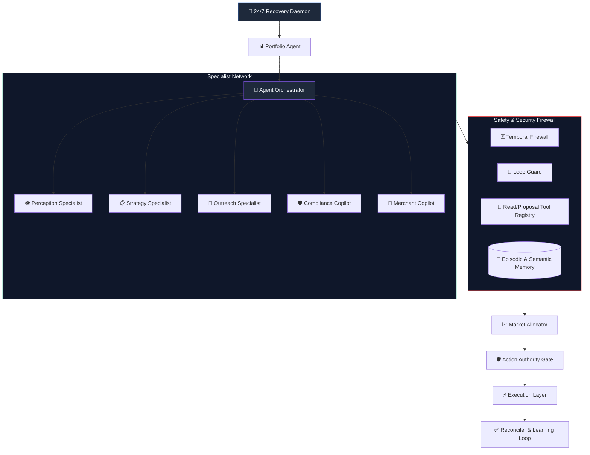
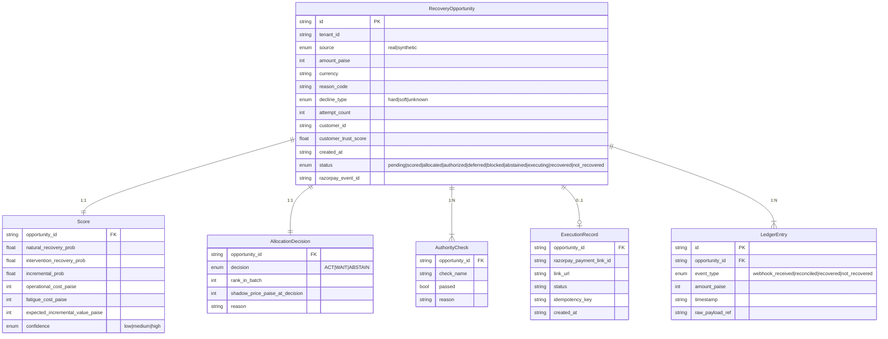

<p align="center">
  
</p>

<h1 align="center">🛡️ ULTRON</h1>

<h3 align="center">
  Autonomous Economic Control Plane for Failed-Payment Recovery
</h3>

<p align="center">
  <em>ULTRON doesn't ask "can we recover this payment?" — It asks<br/>"is recovering this payment <strong>worth spending our next unit of limited recovery capacity?</strong>"<br/>and only acts when the answer survives a deterministic compliance check.</em>
</p>

<br/>

<p align="center">
  <a href="https://ultron-power.vercel.app/dashboard" target="_blank"></a>
  <a href="https://ultron-power.vercel.app/showcase" target="_blank"></a>
</p>

<p align="center">
  <a href="#-architecture"></a>
  <a href="#-tech-stack"></a>
  <a href="#-real-money-production-vs-sandbox-test-mode"></a>
  <a href="#-strategic-positioning-ultron-vs-razorpay-2026-ai-vulcan--agent-studio"></a>
  <a href="#-api-reference"></a>
</p>

<p align="center">
  
  
  
  
  
</p>

<p align="center">
  🌐 <strong>Real Working Website:</strong> <a href="https://ultron-power.vercel.app/dashboard" target="_blank"><strong>https://ultron-power.vercel.app/dashboard</strong></a>
</p>

---

## 📋 Table of Contents

- [🌐 Live Working Website](#-live-working-website)
- [Why ULTRON Exists](#-why-ultron-exists)
- [Core Philosophy](#-core-philosophy)
- [⚔️ Strategic Positioning: ULTRON vs. Razorpay 2026 AI (Vulcan & Agent Studio)](#-strategic-positioning-ultron-vs-razorpay-2026-ai-vulcan--agent-studio)
- [Architecture](#-architecture)
- [The 7-Stage Pipeline](#-the-7-stage-pipeline)
- [Advanced Economic Engine](#-advanced-economic-engine)
- [🤖 AI Agent System & Specialist Network](#-ai-agent-system--specialist-network)
- [⚡ Real Money (Production) vs Sandbox (Test Mode)](#-real-money-production-vs-sandbox-test-mode)
- [Tech Stack](#-tech-stack)
- [Project Structure](#-project-structure)
- [Getting Started](#-getting-started)
- [Environment Variables](#-environment-variables)
- [API Reference](#-api-reference)
- [Core Schema](#-core-schema)
- [Security & Enterprise Features](#-security--enterprise-features)
- [Testing](#-testing)
- [Docker Deployment](#-docker-deployment)
- [Design Principles](#-design-principles)
- [License](#-license)

---

## 🌐 Live Working Website

Experience the live ULTRON autonomous recovery control plane running in production on Vercel:

<div align="center">
  <br/>
  <a href="https://ultron-power.vercel.app/dashboard" target="_blank">
    
  </a>
  <br/><br/>
  <strong>🔗 Direct Dashboard URL:</strong> <a href="https://ultron-power.vercel.app/dashboard" target="_blank"><strong>https://ultron-power.vercel.app/dashboard</strong></a>
  <br/>
  <strong>🎨 Interactive Failure Lab & Showcase:</strong> <a href="https://ultron-power.vercel.app/showcase" target="_blank"><strong>https://ultron-power.vercel.app/showcase</strong></a>
  <br/><br/>
</div>

> ⚡ **Cloud Deployment Note:** The live website connects to our cloud PostgreSQL instance, demonstrating real-time portfolio allocation, live economic shadow pricing, Bayesian calibration curves, and deterministic compliance verification without requiring local setup.

---

## 🧠 Why ULTRON Exists

Razorpay, Stripe, Adyen, and Zuora already do smart **per-payment retry timing**. That is **not** what ULTRON builds.

ULTRON is the **layer above it** — a system that treats every failed payment as a **Recovery Opportunity** competing against every other opportunity for **scarce, costly recovery capacity** (payment links, human attention, contact budget), and that can rationally choose to do **nothing** when acting isn't worth it.

```
Traditional Retry Systems          ULTRON Control Plane
┌──────────────────────┐          ┌──────────────────────────────────────────────┐
│  Payment fails →     │          │  Payment fails →                             │
│  Wait X minutes →    │          │  Normalize into RecoveryOpportunity →        │
│  Retry again         │          │  Score incremental recovery probability →    │
│                      │          │  Compete against portfolio for capacity →    │
│  (No economics.      │          │  Run deterministic compliance gate →         │
│   No portfolio view. │          │  Execute only if AUTHORIZED →               │
│   No "do nothing"    │          │  Reconcile against provider truth →          │
│   option.)           │          │  Learn from outcome (Bayesian update)        │
└──────────────────────┘          └──────────────────────────────────────────────┘
```

> **Key Insight:** A payment that was going to recover on its own is worth acting on **only if** our intervention meaningfully improves the odds. ULTRON quantifies this via `incremental_prob = intervention_recovery_prob − natural_recovery_prob`.

---

## 💎 Core Philosophy

<table>
<tr>
<td width="60">🎯</td>
<td><strong>Incremental Value, Not Raw Probability</strong><br/>Score by how much <em>better</em> intervention makes recovery odds vs. natural recovery — not just "can we recover?"</td>
</tr>
<tr>
<td>⚖️</td>
<td><strong>Portfolio-Level Allocation</strong><br/>All opportunities compete for limited capacity under explicit budget constraints. The system exposes a <strong>shadow price</strong> — the value of the marginal accepted opportunity.</td>
</tr>
<tr>
<td>🛡️</td>
<td><strong>Two-Stage Decision Architecture</strong><br/>Economic decision (ACT/WAIT/ABSTAIN) → then deterministic compliance veto. Economics and compliance are <em>intentionally separate stages</em>.</td>
</tr>
<tr>
<td>🤖</td>
<td><strong>LLM as Explainer, Never as Executor</strong><br/>If an LLM is used, it may only <em>explain</em> a decision in natural language. No LLM sits on the execution path.</td>
</tr>
<tr>
<td>📊</td>
<td><strong>Model-Estimated, Not Measured Fact</strong><br/>Every probability shown is visibly labeled as <strong>model-estimated</strong> — because the true counterfactual is never observed.</td>
</tr>
<tr>
<td>📝</td>
<td><strong>Built-In Audit Trail</strong><br/>Every stage writes its reasoning to a durable log as it happens. The "Why?" screen reads stored fields, never generates explanations after the fact.</td>
</tr>
</table>

---

## ⚔️ Strategic Positioning: ULTRON vs. Razorpay 2026 AI (Vulcan & Agent Studio)

In 2026, Razorpay unveiled two flagship AI platforms: **Agent Studio** (built on Anthropic's Claude Agent SDK) and **Vulcan** (India's first transformer foundation model for payments, built with NVIDIA & AWS). 

While both represent major technological leaps, they solve problems on opposite sides of the financial lifecycle. **ULTRON is neither an in-flight router nor an open conversational bot** — it is the **autonomous economic control plane and fiduciary guardrail** that sits between transaction failure and merchant action.

```
┌──────────────────────────────────────────────────────────────────────────────────────────────────┐
│                                   PAYMENT LIFECYCLE                                              │
│                                                                                                  │
│   [Checkout & Routing]             [Post-Failure Recovery]           [Back-Office Operations]    │
│                                                                                                  │
│    Razorpay VULCAN                      ULTRON                         Razorpay AGENT STUDIO     │
│   ────────────────────             ─────────────────                  ──────────────────────     │
│   • In-flight set transformer      • Post-failure economic plane      • Claude Agent SDK         │
│   • Millisecond routing            • Counterfactual IVEN calculus     • Conversational ops       │
│   • Multi-rail authorization       • Shadow-price capacity auction    • Chargeback dispute kits  │
│   • "Can we authorize this?"       • Deterministic Action Authority   • No-code merchant agents  │
│                                    • "Is it worth our capacity?"      • "Automate my backoffice" │
└──────────────────────────────────────────────────────────────────────────────────────────────────┘
```

### 📊 Comparative Architecture & Economics

| Dimension | Razorpay Vulcan | Razorpay Agent Studio | 🛡️ ULTRON Control Plane |
| :--- | :--- | :--- | :--- |
| **Primary Mission** | Maximize checkout authorization rates & detect network fraud | Automate manual merchant workflows using LLM agents | Maximize net recovery yield under scarce operational capacity |
| **Operational Timing** | **In-flight** (millisecond authorization window) | **Asynchronous / Reactive** (triggered by events/prompts) | **Post-flight** (immediately following authorization failure) |
| **Core AI / Math Engine** | **Set Transformer** (3,000 signals, non-sequential field tokens, AWS SageMaker) | **Generative LLM** (Anthropic Claude Agent SDK + tool use) | **Bayesian Estimation + Lagrangian Portfolio Allocation** |
| **Core Question Answered** | *"Which banking rail gives the highest probability of authorization right now?"* | *"Can an AI agent handle this operational task instead of a human?"* | *"Is recovering this payment worth spending our next unit of scarce recovery capacity?"* |
| **Execution Authority** | Gateway-internal transaction routing logic | Autonomous Agent with direct tool-execution permissions | **Two-Stage Gate**: Stage 1 Economic Optimization, Stage 2 **Deterministic Compliance Veto** |
| **LLM on Financial Path** | **None** (pure transformer embeddings, not a language model) | **Direct** (LLM decides tool parameters, messaging, retry timing) | **Strictly Prohibited** (LLM only explains pre-computed ledger logs; zero financial authority) |
| **Economic Calculus** | Binary authorization probability ($P_{success}$) | Task completion & gross recovery | **Incremental Value ($IVEN$)**: $\Delta P \times \text{Paise} - C_{ops} - C_{fatigue}$ |
| **Counterfactual Awareness** | Blind to counterfactuals (evaluates only in-flight attempt) | Blind (assumes all recovered revenue was caused by the agent) | **Explicit Natural vs. Intervention Recovery**: isolates true causal lift ($\Delta P$) |
| **Capacity & Scarcity** | Elastic cloud inference capacity | Unconstrained (retries as many payments as configured) | **Hard Capacity Caps**: derives marginal **Shadow Price ($\lambda$)** per run |
| **Auditability** | Deep learning black box (proprietary architecture) | Non-deterministic prompt transcripts | **Deterministic Immutable Ledger**: every decision replayed from discrete fields |
| **Alignment of Interest** | Gateway volume (earns MDR fees on transaction attempts) | Platform stickiness & Claude SDK compute consumption | **Merchant Balance Sheet**: prevents blast fatigue & wasted unit costs |

---

### 🔍 Deep Dive: The Three Core Distinctions

#### 1. In-Flight Routing (Vulcan) vs. Post-Failure Economic Allocation (ULTRON)
- **Vulcan's domain** is the checkout millisecond: predicting which bank pipe, card network, or UPI switch has the highest probability of success. It treats failure as a transient routing problem.
- **ULTRON's domain** begins after Vulcan and the upstream gateway have failed. When a payment fails, ULTRON does not ask "how do we retry this right now?" It treats the failed payment as an asset on the merchant's balance sheet that must compete for scarce budget, customer attention, and contact quotas.
- *Synergy:* ULTRON does not replace Vulcan. Instead, Vulcan’s error codes and route telemetry feed directly into ULTRON’s **Perception Engine** as prior signals.

#### 2. Generative Agent Execution (Agent Studio) vs. Deterministic Action Authority (ULTRON)
- **The LLM Execution Danger:** Placing an LLM (like Claude) directly on the financial execution path creates non-deterministic drift, uncalibrated spending, and hallucinated action risks during banking outages.
- **ULTRON Rule #6:** *No LLM sits on the execution path.* ULTRON utilizes deterministic mathematical models for all scoring ($IVEN$), constrained optimization for allocation, and a strict 5-check compliance gate (**Action Authority**) that can veto economic decisions regardless of potential upside. In ULTRON, LLMs are used strictly as post-hoc natural language explainers reading immutable audit logs.
- **The Anti-Blast Advantage:** While unconstrained agent bots blast payment links for every failed subscription, ULTRON calculates customer fatigue cost ($C_{fatigue}$) and natural recovery probability ($P_{natural}$). If a customer will settle naturally on Monday morning, ULTRON issues an **ABSTAIN** decision, saving messaging fees, gateway charges, and customer goodwill.

#### 3. The Gateway Conflict of Interest: Why ULTRON Must Be Independent
Payment gateways earn fees on processing attempts, payment link dispatches, and transaction volume. Gateways have **no structural incentive** to tell a merchant: *"Do nothing. Do not send this payment link. Let the user pay on their own tomorrow."*

ULTRON is the merchant’s fiduciary guardian. Because ULTRON is independent of transaction attempt fees, its objective function is strictly aligned with the merchant's net cash recovery and brand preservation.

---

### 🧩 The Enterprise Coexistence Stack

In modern fintech architecture, Vulcan, Agent Studio, and ULTRON form a unified, complementary hierarchy:

```
1. PRE-CHECKOUT & ROUTING  ──►  Razorpay Vulcan (Foundation Model)
                                Maximize millisecond success rates across UPI/Cards.

2. PAYMENT FAILURE EVENT   ──►  ULTRON Perception & Economics Engine
                                Screen raw webhooks. Calculate natural vs. intervention odds.
                                Filter out low-lift and high-fatigue opportunities.

3. CAPACITY ALLOCATION     ──►  ULTRON Recovery Market
                                Auction scarce daily WhatsApp/Payment Link quotas.
                                Establish shadow price (λ) for the batch.

4. COMPLIANCE & SAFETY     ──►  ULTRON Action Authority
                                Deterministic veto on hard decline codes and exhausted users.

5. DISPATCH & WORKFLOWS    ──►  Razorpay Agent Studio / Official SDK
                                Execute approved recovery links, or trigger Dispute 
                                Responder for chargebacks approved by finance.
```

---

## 🏗 Architecture

<p align="center">
  
</p>

ULTRON processes every failed payment through a strict **7-stage pipeline** where each stage reads from and writes to a shared SQLite database, producing a complete, auditable decision trail.


---

## 🔗 The 7-Stage Pipeline

### Stage 1 — 🔔 Event Fabric
> **Webhook ingestion with HMAC-SHA256 signature verification and event deduplication**

| Capability | Implementation |
|---|---|
| Webhook endpoint | `POST /webhooks/razorpay/:tenant_id` |
| Signature verification | Timing-safe HMAC-SHA256 against per-tenant secrets |
| Event deduplication | By `event_id` and `payment_id` lookups |
| Multi-event support | `payment.failed`, `payment_link.paid`, `payment_link.expired` |
| Simulation endpoint | `POST /internal/simulate-webhook/:tenant_id` (source=`synthetic`) |
| Source labeling | Real webhooks → `source='real'` · Simulations → `source='synthetic'` |

Every incoming event is verified, deduplicated, and routed to the Perception layer. The simulation endpoint is completely isolated and unconditionally labels all ingested records as `synthetic`.

---

### Stage 2 — 👁 Perception
> **Decline taxonomy classification and opportunity normalization**

The Perception layer transforms raw Razorpay payment failure payloads into standardized `RecoveryOpportunity` records using a deterministic decline taxonomy:

```
┌────────────────────────────────┬────────────────────────────────────────┐
│  HARD DECLINES (irrecoverable) │  stolen_card, lost_card, pickup_card,  │
│  → Zero incremental value      │  restricted_card, card_stolen_lost     │
├────────────────────────────────┼────────────────────────────────────────┤
│  SOFT DECLINES (recoverable)   │  insufficient_funds, expired_card,     │
│  → Candidates for intervention │  generic_decline, bank_gateway_timeout,│
│                                │  do_not_honor, otp_timeout             │
├────────────────────────────────┼────────────────────────────────────────┤
│  UNKNOWN (unrecognized)        │  Any unmatched code →                  │
│  → Safe fallback, no crash     │  pipeline continues with low confidence│
└────────────────────────────────┴────────────────────────────────────────┘
```

Each opportunity also receives:
- **Customer profile** with trust score (default `0.65` for new customers)
- **Attempt count** derived from prior opportunity history
- **Tenant scoping** for multi-merchant isolation

---

### Stage 3 — 🧮 Economic Reasoning
> **Bayesian probability estimation, cost modeling, and Expected Incremental Value (IVEN) computation**

The Economic Reasoning engine computes a comprehensive `Score` for each opportunity:

```
IVEN = (incremental_prob × amount_paise) − operational_cost − fatigue_cost

where:
  incremental_prob = P(recovery | intervention) − P(recovery | no intervention)
  operational_cost = ₹4.00 (fixed per payment link)
  fatigue_cost     = f(attempt_count)  →  [₹0, ₹2.50, ₹7.50, ₹15+]
```

**Probability Sources:**

| Engine | Description | When Used |
|---|---|---|
| **Static Probability Table** | Hand-coded baselines per decline type | Default (< 100 observations) |
| **Bayesian Calibration** | Beta-Binomial posterior with sample-size gated auto-promotion | ≥ 100 observations per reason code |
| **Thompson Sampling Bandit** | Marsaglia-Tsang Gamma sampler with Box-Muller transform for exploration | Opt-in via `ENABLE_THOMPSON_SAMPLING` |

**Key Invariant:** Hard declines **always** produce `IVEN ≤ 0`. This is enforced at both the probability estimation and final score computation stages.

---

### Stage 4 — 📊 Recovery Market
> **Portfolio-level greedy allocation with shadow pricing and capacity constraints**

The Recovery Market treats opportunities as competing for **scarce recovery capacity**:

```
  Input: All non-terminal opportunities with scores
    │
    ├─ Filter: confidence='low' or IVEN ≤ 0 → ABSTAIN (exits ranking)
    ├─ Filter: 5% deterministic holdout      → ABSTAIN (counterfactual control)
    │
    ├─ Sort remaining by IVEN descending
    │
    ├─ Top K (capacity limit) → ACT
    ├─ Remainder             → WAIT (deferred)
    │
    └─ Shadow Price = IVEN of the Kth (marginal) opportunity
```

| Concept | Definition |
|---|---|
| **Shadow Price** | The IVEN of the last opportunity accepted — the minimum value for which capacity was allocated |
| **Capacity** | Configurable per-tenant or per-run (default: 5 payment links per run) |
| **Anti-Blast Engine** | Calculates exact savings from _not_ acting (messaging fees, provider fees, customer goodwill) |
| **Dual-Mirror Budget Pacer** | Daily/hourly budget tracking with Lagrangian shadow multiplier |
| **Holdout Group** | 5% deterministic holdout for continuous counterfactual measurement |

---

### Stage 5 — 🛡 Action Authority
> **Deterministic compliance gate with multi-level kill switch — vetoes economic decisions**

**This is an independent, deterministic gate that runs _after_ allocation and can veto an ACT decision.** The two-stage design (economic decision → compliance veto) is intentional.

```
  ┌──────────────────────────────────────────────────────────────────┐
  │  Check 1: Hard Decline Check     → BLOCKED if decline_type='hard'│
  │  Check 2: Retry Cap Check        → BLOCKED if attempt_count ≥ 3  │
  │  Check 3: Kill Switch Check      → BLOCKED if kill switch active  │
  │  Check 4: Confidence Recheck     → ABSTAIN if confidence='low'   │
  │  Check 5: Capacity Recheck       → WAIT if not in ACT batch      │
  └──────────────────────────────────────────────────────────────────┘

  Verdict: AUTHORIZED | BLOCKED | ABSTAIN | WAIT
```

**Multi-Level Kill Switch:**
- 🔴 **Global** — halts all recovery activity system-wide
- 🟠 **Per-Tenant** — halts recovery for a specific merchant
- 🟡 **Per-Provider** — halts recovery for a specific payment provider

---

### Stage 6 — ⚡ Execution
> **Razorpay payment link creation with circuit breaker, DLQ, and omnichannel dispatch**

Only `AUTHORIZED` opportunities reach the Execution stage. Key safeguards:

| Safeguard | Description |
|---|---|
| **Zero-Bypass Authority Assertion** | Re-evaluates authority verdict before every execution — no shortcut |
| **Idempotency** | Local SQLite + remote Razorpay `reference_id` deduplication |
| **Circuit Breaker** | 3-state (CLOSED→OPEN→HALF_OPEN) with 5-failure threshold and 30s cooldown |
| **Dead Letter Queue** | Failed executions recorded with actionable error messages for replay |
| **Rate Limiter** | Tiered: webhooks (100/min), execution (10/min), general (600/min) |

**Omnichannel Recovery Dispatch:**
- 📱 **WhatsApp** via Meta Cloud API (automated recovery link delivery)
- 📧 **Email** via Resend API / Custom SMTP (branded recovery notifications)
- 🔗 **Payment Link** with SMS+Email via Razorpay native notifications

---

### Stage 7 — ✅ Truth Engine
> **Authoritative reconciliation against provider truth with hash-chained double-entry ledger**

The Truth Engine is the **final arbiter** of recovery outcomes. It follows a strict invariant hierarchy:

```
  PROVIDER TRUTH  >  RECONCILIATION  >  LOCAL FINANCIAL STATE
```

| Component | Purpose |
|---|---|
| **Provider Truth Evaluator** | Extracts canonical payment state from raw Razorpay API response |
| **Canonical State Machine** | Maps provider statuses to 18 internal states with validated transitions |
| **Authoritative Reconciler** | Atomic SQLite transaction updating opportunity + execution + ledger |
| **Double-Entry Ledger** | SHA-256 hash-chained entries (debit: `bank_settlement` ↔ credit: `recovered_revenue`) |
| **Reconciliation SLA Monitor** | Tracks time-to-settlement and flags SLA breaches |
| **Causal Analysis Engine** | Evaluates intervention effectiveness with Brier score tracking |

**Learning Loop:** Every reconciled outcome feeds back into the Bayesian Calibration engine and Thompson Sampling Bandit, continuously updating probability distributions.

---

## 📈 Advanced Economic Engine

### Bayesian Probability Calibration

```
Prior:       Beta(α₀, β₀)  ← from static probability table
Observation: k successes in n trials
Posterior:   Beta(α₀ + k,  β₀ + (n − k))

Auto-Promotion Gate:
  • Sample size ≥ 100
  • Lift vs. baseline > 5%
  • Z-test p-value < 0.05
```

### Thompson Sampling (Explore/Exploit)

For each decline context, ULTRON maintains Beta-distributed arms and samples recovery probabilities using the **Marsaglia & Tsang (2000) Gamma distribution sampler** with Box-Muller Normal variates. This allows the system to:
- **Explore** uncertain decline codes that may have high recovery rates
- **Exploit** well-understood codes with proven intervention lift
- **Converge** to optimal allocation as observation count grows

### Anti-Blast Engine (Value of Inaction)

ULTRON uniquely quantifies the **value of not acting**:
- 📬 WhatsApp messaging fee saved: ₹0.85 per prevented message
- 🔗 Razorpay link overhead saved: ₹4.00 per prevented link
- 💚 Customer goodwill preserved: ₹5.00 – ₹50.00 (fraud blocks save ₹50)

---

## 🤖 AI Agent System & Specialist Network

ULTRON includes an enterprise multi-agent recovery orchestrator operating under strict economic and safety constraints:



### 👥 The 5 Domain Specialist Agents

| Specialist | Implementation File | Mission & Capabilities |
|---|---|---|
| **👁 Perception Specialist** | `agents/specialists/perception_agent.ts` | Deep decline context extraction, banking rail health correlation, card bin profiling, and failure pattern clustering. |
| **📋 Strategy Specialist** | `agents/specialists/strategy_agent.ts` | Counterfactual scenario formulation, optimal recovery window modeling, dynamic price-elasticity estimation, and holdout assignment. |
| **📨 Outreach Specialist** | `agents/specialists/outreach_agent.ts` | Channel-specific recovery payload formulation (WhatsApp vs. SMS vs. Email), cooling-off cadence, and message fatigue tracking. |
| **🛡 Compliance Copilot** | `agents/specialists/compliance_copilot.ts` | Real-time regulatory auditing (RBI recurring e-mandates, DPDP privacy standards), chargeback dispute pre-screening, and KYC validation. |
| **🏪 Merchant Copilot** | `agents/specialists/merchant_copilot.ts` | Human-in-the-loop review interface, natural language decision explanation generation, and merchant manual override processing. |

### 🛡️ Autonomous Safety Architecture & Guardrails

| Guardrail Layer | Implementation File | Functionality |
|---|---|---|
| **Temporal Firewall** | `agents/temporal_firewall.ts` | Enforces non-retroactive state sequencing, cooling-off windows, and prevents action replay attacks. |
| **Loop Guard** | `agents/loop_guard.ts` | Detects cycles and halting state anomalies, preventing runaway recursive LLM loops with automatic circuit breaking. |
| **Tool Registry** | `agents/tool_registry.ts` | 15+ strictly segregated tools divided into **Read Tools** (read-only telemetry) and **Proposal Tools** (requires Action Authority review). |
| **Memory System** | `agents/memory.ts` | Dual-tier **Episodic Memory** (historical failure traces & run histories) and **Semantic Memory** (merchant-specific behavioral patterns). |
| **Replanning Engine** | `agents/replan_engine.ts` | Dynamic multi-step recovery replanning when environmental conditions change (e.g., bank outage cleared). |
| **Wait / Wake Daemon** | `agents/wait_wake.ts` | Asynchronous suspension of opportunities awaiting optimal recovery windows without blocking system workers. |

---

## ⚡ Real Money (Production) vs Sandbox (Test Mode)

ULTRON provides strict, zero-leak isolation between **Test Sandbox** and **Real Money (Production)** execution modes, with a one-click dashboard switcher:

| Dimension | 🧪 Test Mode (Sandbox) | ⚡ Production Mode (Real Money) |
|---|---|---|
| **Credentials** | `RAZORPAY_KEY_ID` / `RAZORPAY_KEY_SECRET` (`rzp_test_...`) | `RAZORPAY_LIVE_KEY_ID` / `RAZORPAY_LIVE_KEY_SECRET` (`rzp_live_...`) or encrypted per-tenant AES-256 vault |
| **Payment Links** | Real Razorpay Test payment links (simulated settlement) | Real Razorpay Live payment links (actual customer money recovery) |
| **Data Partitioning** | `environment = 'test'` (scoped opportunities & ledger) | `environment = 'live'` (isolated real money pipeline) |
| **Allocation & Authority** | Scoped strictly to sandbox opportunities | Scoped strictly to production opportunities |
| **Safety Guardrails** | Standard rate limits | High-visibility emerald badge, confirmation modal, strict fail-closed credentials |
| **Client Pool Isolation** | Resolves test SDK client | Strictly rejects if live keys are absent — **zero test credential leak** |

### Switching Environments in Dashboard
Operators and merchants can toggle modes instantly via the top navigation bar:
- **`🧪 Test`**: Simulates failed payments, tests webhooks, and evaluates recovery without financial risk.
- **`⚡ Live`**: Activates real-money recovery mode using live Razorpay credentials and real customer payment links.

---

## 🛠 Tech Stack

<table>
<tr>
<th align="left">Layer</th>
<th align="left">Technology</th>
<th align="left">Purpose</th>
</tr>
<tr>
<td>Runtime</td>
<td></td>
<td>Server runtime (via tsx for TypeScript execution)</td>
</tr>
<tr>
<td>Language</td>
<td></td>
<td>End-to-end type safety across backend + frontend</td>
</tr>
<tr>
<td>API</td>
<td></td>
<td>REST API server with middleware pipeline</td>
</tr>
<tr>
<td>Database</td>
<td></td>
<td>Zero-setup embedded storage (file-based)</td>
</tr>
<tr>
<td>Cloud DB</td>
<td></td>
<td>PostgreSQL cloud sync for production deployments</td>
</tr>
<tr>
<td>Cache</td>
<td></td>
<td>Rate limiting, session cache, and budget tracking</td>
</tr>
<tr>
<td>Frontend</td>
<td></td>
<td>React-based dashboard with Tailwind CSS</td>
</tr>
<tr>
<td>Payments</td>
<td></td>
<td>Official Node SDK — Seamless Test Sandbox & Real Money Production</td>
</tr>
<tr>
<td>Messaging</td>
<td></td>
<td>Meta Cloud API for recovery notifications</td>
</tr>
<tr>
<td>Email</td>
<td></td>
<td>Transactional email delivery</td>
</tr>
<tr>
<td>Security</td>
<td></td>
<td>HSTS, CSP, and security headers</td>
</tr>
<tr>
<td>Validation</td>
<td></td>
<td>Runtime schema validation</td>
</tr>
<tr>
<td>LLM</td>
<td></td>
<td>Decision explanations only — never on execution path</td>
</tr>
<tr>
<td>Observability</td>
<td></td>
<td>Structured JSON logging + Prometheus metrics</td>
</tr>
<tr>
<td>Infrastructure</td>
<td></td>
<td>Multi-container deployment with NGINX reverse proxy</td>
</tr>
</table>

---

## 📁 Project Structure

```
ultron/
├── src/                          # Backend source (116 files, 21,598 LOC)
│   ├── server.ts                 # Express app entry point & route registration
│   ├── worker.ts                 # Background worker process
│   │
│   ├── webhooks/                 # Stage 1: Event Fabric
│   │   ├── razorpay.ts           #   HMAC-verified webhook handlers (real + simulated)
│   │   ├── queue.ts              #   Webhook delivery queue with replay
│   │   └── whatsapp.ts           #   WhatsApp Cloud API webhook receiver
│   │
│   ├── perception/               # Stage 2: Perception
│   │   └── normalizer.ts         #   Decline taxonomy & opportunity normalization
│   │
│   ├── economics/                # Stage 3: Economic Reasoning
│   │   ├── scorer.ts             #   IVEN computation engine
│   │   ├── bayesian_calibration.ts  # Beta-Binomial posterior calibration
│   │   ├── bandit_policy.ts      #   Thompson Sampling (Marsaglia-Tsang Gamma)
│   │   └── anti_blast_engine.ts  #   Value-of-inaction calculator
│   │
│   ├── market/                   # Stage 4: Recovery Market
│   │   ├── allocator.ts          #   Greedy portfolio allocation with shadow price
│   │   └── capacity_policy.ts    #   Dual-Mirror budget pacer & capacity limits
│   │
│   ├── authority/                # Stage 5: Action Authority
│   │   └── gate.ts               #   5-check compliance gate + multi-level kill switch
│   │
│   ├── execution/                # Stage 6: Execution
│   │   ├── executor.ts           #   Razorpay payment link creation
│   │   ├── circuit_breaker.ts    #   3-state circuit breaker pattern
│   │   ├── dlq.ts                #   Dead Letter Queue for failed executions
│   │   └── rate_limiter.ts       #   Per-endpoint rate limiting
│   │
│   ├── reconciliation/           # Stage 7: Truth Engine (Reconciliation)
│   │   ├── authoritative_reconciler.ts  # Atomic provider truth reconciliation
│   │   └── poller.ts             #   Periodic reconciliation sweep
│   │
│   ├── truth/                    # Stage 7: Truth Engine (Core)
│   │   ├── canonical_state_machine.ts   # 18-state payment lifecycle FSM
│   │   ├── provider_truth.ts     #   Razorpay API response evaluator
│   │   ├── double_entry_ledger.ts  #   SHA-256 hash-chained ledger
│   │   ├── causal_analysis_engine.ts  #  Intervention effectiveness analysis
│   │   └── reconciliation_sla.ts #   Settlement SLA monitoring
│   │
│   ├── agents/                   # Autonomous AI Agent System
│   │   ├── daemon.ts             #   24/7 background recovery daemon
│   │   ├── orchestrator.ts       #   Multi-step plan executor
│   │   ├── portfolio_agent.ts    #   Portfolio sweep & ranking
│   │   ├── planner.ts            #   Recovery plan generator
│   │   ├── tool_registry.ts      #   15+ autonomous operation tools
│   │   ├── memory.ts             #   Episodic + semantic memory
│   │   ├── learning.ts           #   Outcome-based learning engine
│   │   ├── llm_provider.ts       #   NVIDIA NIM LLM integration
│   │   ├── specialists/          #   Domain-specific sub-agents
│   │   └── tools/                #   Read + proposal tool definitions
│   │
│   ├── security/                 # Enterprise Security Layer
│   │   ├── auth.ts               #   JWT authentication
│   │   ├── rbac.ts               #   Role-based access control
│   │   ├── api_keys.ts           #   API key management
│   │   ├── secrets.ts            #   AES-256 credential vault
│   │   ├── webhook_validator.ts  #   Multi-secret webhook verification
│   │   ├── tenancy.ts            #   Multi-tenant isolation
│   │   └── pii.ts                #   PII masking utilities
│   │
│   ├── providers/                # Payment Provider Abstraction
│   │   ├── router.ts             #   Multi-provider routing
│   │   └── razorpay/             #   Razorpay client pool & connection service
│   │
│   ├── notifications/            # Omnichannel Notifications
│   │   ├── email.ts              #   Resend API + SMTP branded emails
│   │   └── whatsapp.ts           #   Meta WhatsApp Cloud API
│   │
│   ├── simulation/               # Testing & Simulation
│   │   ├── scenario_runner.ts    #   Automated test scenario execution
│   │   └── synthetic_generator.ts  # Synthetic payment failure generator
│   │
│   ├── db/                       # Data Layer
│   │   ├── database.ts           #   SQLite schema + CRUD (76KB, 2000+ LOC)
│   │   ├── adapter.ts            #   SQLite ↔ PostgreSQL dual adapter
│   │   └── migrations/           #   Schema migration runner
│   │
│   ├── cache/                    #   Redis cache manager & rate limiter
│   ├── realtime/                 #   SSE broadcaster for live dashboard
│   ├── observability/            #   Logger, Prometheus metrics, health probes
│   ├── middleware/               #   Audit logger, tenant scoping, tracing
│   ├── llm/                      #   LLM explainer (decision narratives only)
│   ├── routes/                   #   16 Express route modules
│   ├── connectors/               #   External system connectors (Odoo ERP)
│   └── types/                    #   Core TypeScript interfaces
│
├── frontend/                     # Next.js Dashboard (17 files, 4,762 LOC)
│   └── src/app/
│       ├── dashboard/            #   Main operations dashboard
│       │   ├── page.tsx          #   Dashboard home (32KB)
│       │   ├── layout.tsx        #   Navigation layout
│       │   ├── settings/         #   Configuration panels (API keys, integrations, team)
│       │   └── setup/            #   Merchant setup & onboarding walkthrough
│       ├── login/                #   Authentication UI
│       ├── signup/               #   Merchant onboarding
│       ├── showcase/             #   Product showcase page
│       └── product/              #   Product information
│
├── scripts/                      # Utility & Test Scripts (85 files)
├── tests/                        # Structured Test Suites
│   ├── agent/                    #   AI agent behavior tests
│   ├── core/                     #   Core hardening tests
│   ├── economics/                #   Economic model tests
│   ├── infra/                    #   Infrastructure tests
│   ├── market/                   #   Market allocation tests
│   ├── truth/                    #   State consistency & causal stats
│   └── v6/                       #   V6 phase acceptance tests (Phase 4–12)
│
├── docker-compose.yml            # 4-service deployment (Postgres, Redis, Backend, Frontend)
├── Dockerfile                    # Backend container
├── nginx.conf                    # Reverse proxy configuration
└── .env.example                  # Required environment variables
```

---

## 🚀 Getting Started

You can test and explore ULTRON in two ways:
1. **Instantly via the Live Cloud Dashboard:** Visit [**https://ultron-power.vercel.app/dashboard**](https://ultron-power.vercel.app/dashboard) (no setup required).
2. **Locally on your machine:** Follow the quick 5-step guide below to pull, execute, and run tests.

---

### Prerequisites

- **Node.js** ≥ 18.x
- **npm** ≥ 9.x
- **Razorpay Test Mode** keys ([sign up for free test keys](https://dashboard.razorpay.com))
- *Note:* SQLite is file-based and embedded (`ultron.db`) — **zero database server setup is required**.

---

### Step 1: Pull or Clone the Codebase

#### Fresh Installation:
```bash
git clone https://github.com/Mr-Roninx/ULTRON.git
cd ULTRON
```

#### If you already have the repository:
```bash
git pull origin main
```

#### Install All Dependencies:
```bash
# 1. Install Backend Dependencies
npm install

# 2. Install Frontend Next.js Dashboard Dependencies
cd frontend && npm install && cd ..
```

---

### Step 2: Configure Environment Variables

```bash
cp .env.example .env
```

Edit `.env` with your Razorpay Test Mode credentials (or keep defaults for synthetic tests):

```env
# Required for execution & authentication
JWT_SECRET=your_super_secret_jwt_key
AES_MASTER_KEY=0123456789abcdef0123456789abcdef0123456789abcdef0123456789abcdef
RAZORPAY_KEY_ID=rzp_test_YOUR_KEY_ID
RAZORPAY_KEY_SECRET=YOUR_KEY_SECRET
RAZORPAY_WEBHOOK_SECRET=rzp_whsec_YOUR_SECRET

# Portfolio Configuration
PORT=3001
MAX_LINKS_PER_RUN=5

# Optional Integrations
APP_URL=https://ultron-power.vercel.app
NVIDIA_API_KEY=nvapi-YOUR_KEY        # Natural language decision explainer
RESEND_API_KEY=re_YOUR_KEY           # Email recovery notifications
DATABASE_URL=postgresql://...        # Optional Supabase cloud synchronization
```

---

### Step 3: Initialize Database & Seed Scenarios

ULTRON uses an embedded SQLite database (`ultron.db`) with WAL mode enabled. Initialize the schema and seed the canonical test scenarios:

```bash
# Apply schema migrations
npm run db:migrate

# Seed synthetic test scenarios (hard declines, soft declines, and holdout groups)
npm run seed
```

---

### Step 4: Execute & Run the Application

Start the local development stack:

#### Terminal 1 — Backend API & 24/7 Autonomous Recovery Daemon:
```bash
npm run dev
```
*The backend starts at `http://localhost:3001` and automatically starts the 24/7 autonomous recovery daemon.*

#### Terminal 2 — Next.js Operations Dashboard:
```bash
cd frontend && npm run dev
```
*The frontend dashboard starts at `http://localhost:3000`.*

#### Interactive Test Endpoints & Live Views:
- 📊 **Local Dashboard:** [http://localhost:3000/dashboard](http://localhost:3000/dashboard)
- 🛒 **Demo Merchant Storefront:** [http://localhost:3001/demo-store](http://localhost:3001/demo-store) (test real failure interception)
- 🌐 **Live Production Cloud Dashboard:** [https://ultron-power.vercel.app/dashboard](https://ultron-power.vercel.app/dashboard)
- 🎨 **Live Product Showcase:** [https://ultron-power.vercel.app/showcase](https://ultron-power.vercel.app/showcase)

---

### Step 5: Run Automated Tests

ULTRON ships with **165 test & verification scripts** (80 structured test suites across 7 test directories in `tests/` + 85 automated validation and scenario scripts in `scripts/`). Verify your installation using the commands below:

```bash
# 1. Quick System Health & Dependency Probe
curl http://localhost:3001/health
curl http://localhost:3001/health/deep

# 2. Master V6 Acceptance Test Battery (27 suites, 100% pass)
npm test

# 3. Complete Forensic Truth Verification
npm run verify:v6-truth

# 4. End-to-End Webhook & Recovery Pipeline Integration
npm run test:integration

# 5. Stage-by-Stage Module Tests
npm run test:perception        # Stage 2: Decline taxonomy classification
npm run test:economics         # Stage 3: Bayesian IVEN calculation
npm run test:market            # Stage 4: Portfolio knapsack & shadow price
npm run test:authority         # Stage 5: Deterministic compliance checks
npm run test:execution         # Stage 6: Payment link dispatch & idempotency
npm run test:truth             # Stage 7: Double-entry ledger & reconciliation

# 6. AI Agent System & Stress Tests
npm run test:agent             # Autonomous multi-agent behavior tests
npm run stress:all             # System-wide concurrency & load stress test
```

---

## 🔐 Environment Variables

| Variable | Required | Description |
|---|:---:|---|
| `JWT_SECRET` | ✅ | Secret for JWT authentication tokens |
| `AES_MASTER_KEY` | ✅ | 256-bit hex key for credential encryption in vault |
| `RAZORPAY_KEY_ID` | ✅ | Razorpay Test Mode Key ID |
| `RAZORPAY_KEY_SECRET` | ✅ | Razorpay Test Mode Key Secret |
| `RAZORPAY_WEBHOOK_SECRET` | ✅ | Razorpay webhook signature verification secret |
| `PORT` | ❌ | Server port (default: `3001`) |
| `MAX_LINKS_PER_RUN` | ❌ | Payment links per execution batch (default: `5`) |
| `DATABASE_URL` | ❌ | PostgreSQL connection string for Supabase / remote sync |
| `DATABASE_POOL_SIZE` | ❌ | Maximum connection pool size (default: `15`) |
| `REDIS_URL` | ❌ | Redis connection string (default: in-memory fallback) |
| `NVIDIA_BASE_URL` | ❌ | NVIDIA NIM base endpoint (default: `https://integrate.api.nvidia.com/v1`) |
| `NVIDIA_API_KEY` | ❌ | NVIDIA NIM API key for LLM explanations |
| `LLM_MODEL` | ❌ | NVIDIA LLM model (default: `nvidia/nemotron-3.5-lightning-30b-a3b`) |
| `DISABLE_LLM_SCORING_INFLUENCE` | ❌ | Pure deterministic scoring mode when `true` (default: `false`) |
| `RESEND_API_KEY` | ❌ | Resend API key for transactional email recovery |
| `RESEND_FROM_EMAIL` | ❌ | Sender email address for Resend notifications |
| `APP_URL` | ❌ | Frontend web application URL for CORS and links |
| `SUPABASE_URL` | ❌ | Supabase project URL |
| `SUPABASE_KEY` | ❌ | Supabase service/anon key |

> ⚠️ **Never commit `.env` to version control.** The `.gitignore` already excludes it.

---

## 📡 API Reference

### Authentication & Merchant Onboarding

| Endpoint | Method | Auth | Description |
|---|---|---|---|
| `/v1/auth/signup` | `POST` | Public | Merchant registration & tenant workspace initialization |
| `/v1/auth/login` | `POST` | Public | Email/password JWT token authentication |
| `/v1/auth/send-otp` | `POST` | Public | Dispatch one-time authentication passcode |
| `/v1/auth/verify-otp` | `POST` | Public | Verify OTP code and issue session token |
| `/v1/auth/demo-login` | `POST` | Public | Instant demo merchant session generator |
| `/v1/auth/me` | `GET` | JWT | Current authenticated merchant & tenant metadata |
| `/v1/auth/tenant` | `PATCH` | JWT | Update merchant capacity limit and environment |

### Core Pipeline & Recovery Operations

| Endpoint | Method | Auth | Description |
|---|---|---|---|
| `/webhooks/razorpay/:tenant_id` | `POST` | HMAC | Ingest real Razorpay payment failure/success webhooks |
| `/internal/simulate-webhook/:tenant_id` | `POST` | HMAC | Ingest synthetic test scenarios (unconditionally source=`synthetic`) |
| `/v1/events` | `POST` | API Key | Universal canonical event ingestion gateway (Odoo/external) |
| `/v1/events/ping` | `POST` | API Key / JWT | Web application heartbeat & origin connection handshake |
| `/opportunities` | `GET` | JWT | List all recovery opportunities for current merchant |
| `/opportunities/score-all` | `POST` | JWT | Run batch economic IVEN scoring across all opportunities |
| `/opportunities/:id/score` | `GET` | JWT | Inspect IVEN, cost breakdown, and model-estimated probabilities |
| `/opportunities/:id/authority` | `GET` | JWT | Check 5-stage deterministic compliance checks for opportunity |
| `/opportunities/:id/explain` | `GET/POST` | JWT | LLM natural language narrative explaining recovery decision |
| `/market/run` | `GET/POST` | JWT+Operator | Run greedy portfolio allocation under capacity limit |
| `/authority/run` | `GET/POST` | JWT+Operator | Run batch compliance gate across all allocated opportunities |
| `/authority/evaluate/:id` | `GET/POST` | JWT | Run compliance checks and return verdict on specific opportunity |
| `/authority/kill-switch` | `GET/POST` | JWT+Admin | Check status or toggle global/tenant emergency kill switch |
| `/execution/run` | `POST` | JWT+Operator | Execute batch payment link creation for authorized opportunities |
| `/execution/batch` | `POST` | JWT+Operator | Alias for `/execution/run` batch dispatch |
| `/execution/opportunity/:id` | `POST` | JWT+Operator | Execute payment link creation for a single authorized opportunity |
| `/execution/records` | `GET` | JWT | List execution records and created payment links |

### Dashboard & Observability

| Endpoint | Method | Auth | Description |
|---|---|---|---|
| `/dashboard/summary` | `GET` | JWT | Real-time recovery metrics, shadow price, anti-blast savings |
| `/dashboard/analytics` | `GET` | JWT | Bank-by-bank failure rates, gross causal lift, budget pacing state |
| `/dashboard/reconcile-poll` | `POST` | JWT | Trigger manual reconciliation against provider truth |
| `/health` | `GET` | Public | System status, database pool metrics, and cache telemetry |
| `/health/live` | `GET` | Public | Kubernetes liveness probe |
| `/health/ready` | `GET` | Public | Kubernetes readiness probe |
| `/health/deep` | `GET` | Public | Deep dependency check (SQLite, PostgreSQL, Redis, Razorpay) |
| `/metrics` | `GET` | Public | Prometheus exposition format metrics scrape endpoint |
| `/audit/records` | `GET` | JWT | Immutable audit trail logs with actor, action, and timestamp |

### Enterprise Features & AI Agent Daemon

| Endpoint | Method | Auth | Description |
|---|---|---|---|
| `/v1/api-keys` | `GET/POST` | JWT+Admin | Generate and manage scoped API keys (`events:write`, etc.) |
| `/v1/integrations` | `GET/POST` | JWT | Multi-provider configuration and discovery |
| `/v1/notifications` | `GET/POST` | JWT | Omnichannel recovery alerts (WhatsApp, Email) |
| `/v1/webhooks/queue` | `GET/POST` | JWT | Webhook delivery queue telemetry and dead-letter replay |
| `/v1/playground` | `GET/POST` | JWT | Interactive recovery sandbox & counterfactual lift simulator |
| `/agents/status` | `GET` | JWT+Admin | Check 24/7 autonomous recovery daemon state and sweep counts |
| `/agents/daemon/status` | `GET` | JWT+Admin | Full daemon status with active interval and capacity settings |
| `/agents/daemon/start` | `POST` | JWT+Admin | Start 24/7 background autonomous sweep loop |
| `/agents/daemon/stop` | `POST` | JWT+Admin | Pause 24/7 background autonomous sweep loop |
| `/agents/daemon/sweep` | `POST` | JWT+Admin | Trigger an immediate manual recovery sweep cycle |
| `/agents/tools` | `GET` | JWT+Admin | Inspect tool registry and permission controls |
| `/agents/runs` | `GET` | JWT+Admin | List agent mission traces and replanning telemetry |

---

## 📊 Core Schema

All records use these exact field names — every feature reads and writes against this contract:



---

## 🔒 Security & Enterprise Features

<table>
<tr>
<td width="200"><strong>🔑 Authentication</strong></td>
<td>JWT-based with bcrypt password hashing. Configurable token expiry.</td>
</tr>
<tr>
<td><strong>👥 RBAC</strong></td>
<td>Three roles: <code>ADMIN</code> (full access), <code>OPERATOR</code> (pipeline operations), <code>VIEWER</code> (read-only dashboards)</td>
</tr>
<tr>
<td><strong>🏢 Multi-Tenancy</strong></td>
<td>Full tenant isolation — every query is scoped, every webhook is per-tenant.</td>
</tr>
<tr>
<td><strong>🔐 Credential Vault</strong></td>
<td>AES-256-GCM encrypted credential storage with per-tenant secrets.</td>
</tr>
<tr>
<td><strong>🛡️ Webhook Verification</strong></td>
<td>Multi-secret rotation support, timestamp freshness checks, IP allowlisting.</td>
</tr>
<tr>
<td><strong>📊 Prometheus Metrics</strong></td>
<td>Counter, histogram, and gauge metrics exported at <code>/metrics</code>.</td>
</tr>
<tr>
<td><strong>🏥 Health Probes</strong></td>
<td>3-tier Kubernetes-compatible: <code>/health/live</code>, <code>/health/ready</code>, <code>/health/deep</code>.</td>
</tr>
<tr>
<td><strong>📝 Audit Logging</strong></td>
<td>Every API access logged with user, action, resource, and timestamp.</td>
</tr>
<tr>
<td><strong>🔄 SSE Realtime</strong></td>
<td>Server-Sent Events broadcaster for live dashboard updates per tenant.</td>
</tr>
<tr>
<td><strong>🗄️ PII Masking</strong></td>
<td>Automatic masking of emails, phone numbers, and card data in logs.</td>
</tr>
</table>

---

## 🧪 Testing

ULTRON ships with **165 test & verification scripts** (80 structured test suites across 7 test directories in `tests/` + 85 automated validation and scenario scripts in `scripts/`):

```bash
# Run all 27 V6 phase acceptance tests (including Live Money Environment)
npm test                       # Alias for npm run test:v6-all

# Comprehensive forensic truth verification
npm run verify:v6-truth        # Verifies 100% truth consistency across all deliverables
npm run verify:test-counts     # Verifies cross-file test count consistency

# Individual pipeline stage tests
npm run test:perception        # Decline taxonomy classification (Stage 2)
npm run test:economics         # IVEN computation & Bayesian engine (Stage 3)
npm run test:market            # Portfolio allocation & shadow pricing (Stage 4)
npm run test:authority         # Compliance gate & kill switch (Stage 5)
npm run test:execution         # Payment link creation & idempotency (Stage 6)
npm run test:truth             # State consistency & reconciliation (Stage 7)

# AI Agent System test suite (28 safety & specialist tests)
npm run test:agent             # Autonomous multi-agent behavior & boundary tests
npm test tests/agent/test_agent_prompt_injection.ts  # Prompt injection firewall
npm test tests/agent/test_agent_tool_injection.ts    # Tool execution safety
npm test tests/agent/test_agent_temporal_firewall.ts # Non-retroactive time firewall

# Advanced test suites
npm run test:core              # Core hardening & edge-case stress tests
npm run test:infra             # Infrastructure resilience & pool tests
npm run test:integration       # End-to-end integration & pipeline flow
npm run stress:all             # Comprehensive system-wide stress testing
npm run test:black-box         # Black-box acceptance criteria verification

# V6 Phase-specific suites (Phases 4–12 + Live Money)
npm run test:v6-phase4         # Tenancy & Auth Platform
npm run test:v6-phase5         # Canonical Event Connector
npm run test:v6-phase6         # Razorpay Provider Adapter
npm run test:v6-phase7         # Unified Ledger & Reconciliation
npm run test:v6-phase8         # Economic Engine & Bayesian Calibration
npm run test:v6-phase9         # Action Authority & Multi-Level Kill Switch
npm run test:v6-phase10        # Execution Layer & Token Bucket Limiter
npm run test:v6-phase11        # Specialist Agents & Human-in-the-Loop Review
npm run test:v6-phase12        # Simulation Harness & Synthetic Generator
npm test tests/v6/test_live_money_environment.ts # Production isolation & client pool

# Counterfactual and agent demos
npm run experiments:causal     # Intervention effectiveness & causal lift
npm run demo:agent             # Autonomous multi-agent recovery demo
npm run demo:real-recovery     # Real payment recovery verification
```

---

## 🐳 Docker Deployment

ULTRON ships with a complete 4-service Docker Compose configuration:

```bash
# Start all services
docker compose up -d

# Services:
#   ultron-postgres   → PostgreSQL 15 (port 5432)
#   ultron-redis      → Redis 7 (port 6379)
#   ultron-backend    → ULTRON API (port 3001)
#   ultron-frontend   → Next.js Dashboard (port 3000)
#   ultron-nginx      → Reverse Proxy (port 80)
```

```yaml
# Architecture
┌─────────────┐     ┌──────────────┐     ┌──────────────┐
│   NGINX     │────▶│   Backend    │────▶│  PostgreSQL  │
│   :80       │     │   :3001      │     │   :5432      │
└─────────────┘     └──────┬───────┘     └──────────────┘
                           │
┌─────────────┐     ┌──────▼───────┐
│  Frontend   │     │    Redis     │
│   :3000     │     │   :6379      │
└─────────────┘     └──────────────┘
```

---

## 📐 Design Principles

> These are **non-negotiable** and enforced throughout the codebase:

| # | Principle | Enforcement |
|:---:|---|---|
| 1 | Every failed payment becomes a `RecoveryOpportunity` record | Pipeline rejects raw webhook processing |
| 2 | Score by **incremental** probability, not raw | `incremental_prob = intervention − natural` |
| 3 | Every opportunity resolves to **ACT / WAIT / ABSTAIN** | Tri-state decision enum enforced in types |
| 4 | Portfolio-level allocation with **shadow price** | Greedy sort by IVEN with capacity cutoff |
| 5 | Action Authority is a **separate deterministic gate** | Two-stage: economic → compliance veto |
| 6 | LLM may only **explain**, never execute | `llm/explainer.ts` — no LLM on execution path |
| 7 | Every stage writes reasoning to **durable log** | Ledger + audit trail built from stored fields |
| 8 | Probabilities labeled as **model-estimated** | `probability_disclaimer` field on every Score |
| 9 | **Dual-Mode Execution** — Test Sandbox + Real Money Live | Safe 5-link cap in Test Mode; encrypted AES-256 vault & fail-closed credentials in Live |

---

## ⚠️ Disclaimer

> **ULTRON provides dual-mode operational capability:** an isolated **Test Sandbox** (capped at 5 payment links with synthetic/test keys) and an enterprise **Real Money Live Mode** (protected by AES-256 encrypted credential vaults, tenant isolation, and deterministic Action Authority gates). All counterfactual probability metrics and recovery lift estimates displayed across the dashboard are explicitly **model-estimated** — because true counterfactual outcomes are fundamentally unobservable for any individual real payment.

---

<p align="center">
  <sub>Built with 🧠 economic reasoning and ⚡ autonomous execution</sub>
  <br/>
  <sub>All monetary values in paise (₹) · Dual Environment (Test Sandbox + Real Money Live)</sub>
  <br/>
  <sub>🌐 Production Dashboard: <a href="https://ultron-power.vercel.app/dashboard" target="_blank">https://ultron-power.vercel.app/dashboard</a></sub>
</p>

