# ULTRON — Local Forensic Master Report

**Document Title**: Forensic Architectural, Systems, Economic, and Security Audit of the ULTRON Local Workspace  
**Date of Audit**: 2026-08-31  
**Auditor Roles**: Senior Software Architect, Payments Systems Engineer, Backend Engineer, Financial Systems Engineer, Security Engineer, AI/ML Systems Engineer, Database Architect, QA/Test Engineer, Technical Auditor, Hackathon Technical Reviewer  
**Primary Source of Truth**: Local Workspace Filesystem (`d:\Work Space\Project\Ultron`)  
**Workspace Mode**: Read-Only Forensic Analysis  
**Repository Identity**: [Mr-Roninx/ULTRON](https://github.com/Mr-Roninx/ULTRON.git) (Local Workspace Replica)  

---

## 1. Executive Summary

This report is an exhaustive, zero-trust forensic audit of the **ULTRON** repository based strictly and exclusively on the files present in the local filesystem. Every assertion, architecture diagram, mathematical equation, schema model, test assessment, and evidence classification in this report was extracted from direct inspection of local source code, database tables, and runtime artifacts.

### The Realized System Summary
ULTRON is an **autonomous economic control plane for failed-payment recovery** on Razorpay. Unlike standard payment gateways and billing platforms (e.g., Razorpay Auto-Retry, Stripe Smart Retries, Adyen Auto-Rescue) that evaluate retries on an isolated, per-payment schedule asking *"Can we recover this payment?"*, ULTRON operates at the portfolio layer asking:  
> *"Is recovering this payment worth spending our next unit of scarce, costly recovery capacity (payment link limits, customer fatigue budget) — and does action survive a deterministic, non-economic compliance veto?"*

### Top-Level Forensic Findings
1. **Runtime & Implementation Reality**: The active system is implemented in **Node.js (v24.19.0 / `node:sqlite`) + TypeScript + Express 4.21.2** for the backend daemon (`src/server.ts` on port 3001) and **Next.js 16.3.3 + React 19.2.8 + Tailwind CSS 4** for the single-page dashboard (`frontend/` on port 3000).
2. **Database Engine**: Embedded file-based SQLite (`ultron.db`) operated synchronously via Node 24's built-in `node:sqlite` (`DatabaseSync`) in WAL (`Write-Ahead Logging`) mode across 7 tables (`customers`, `recovery_opportunities`, `scores`, `allocation_decisions`, `authority_checks`, `execution_records`, `ledger_entries`).
3. **Pipeline Stages**: All 7 pipeline stages (**1. Event Fabric Ingestion $\to$ 2. Perception Normalization $\to$ 3. Economic Reasoning Scorer $\to$ 4. Recovery Market Greedy Allocator $\to$ 5. Action Authority Compliance Gate $\to$ 6. Execution Engine $\to$ 7. Truth Engine & UI**) are genuinely implemented in TypeScript, compiled with `tsx`, and functional.
4. **Separation of Economic Optimization vs. Compliance Authority**: The critical two-stage architecture is cleanly maintained. The Recovery Market (`src/market/allocator.ts`) ranks opportunities by Expected Incremental Value ($\text{IVEN}$) under a capacity limit ($K=5$) and stamps the marginal shadow price ($\lambda$). Action Authority (`src/authority/gate.ts`) evaluates all portfolio opportunities across 5 independent deterministic compliance checks with hard veto powers (`hard_decline_check`, `retry_cap_check`, `kill_switch_check`, `confidence_recheck`, `capacity_recheck`).
5. **AI / LLM Status**: **Zero LLM code exists on the execution or decision path**. No OpenAI, Anthropic, Gemini, Qwen, LangChain, or Hugging Face SDKs are imported or invoked anywhere in `src/`, `frontend/src/`, or `scripts/`.
6. **Razorpay Integration Status**: The backend utilizes the official `razorpay` Node SDK (v2.9.5) in **Test Mode**. Live Razorpay hosted payment links (`https://rzp.io/rzp/...`) are successfully created via `rzpClient.paymentLink.create()`. End-to-end payment completion and provider settlement was verified on Razorpay's Test Mode gateway simulator via automated headless browser checkout, confirmed verbatim by `rzpClient.paymentLink.fetch()`, and reconciled into SQLite.
7. **Simulation vs. Real Ingestion Isolation**: The workspace enforces strict architectural separation: real incoming webhooks land at `POST /webhooks/razorpay` (stamped `source: 'real'`), while test and simulation traffic is routed exclusively to `POST /internal/simulate-webhook` (stamped `source: 'synthetic'`). A static tripwire script (`scripts/verify_no_fake_webhooks.ts`) enforces this invariant.

---

## 2. Project Identity

| Attribute | Forensic Value | Verification Method |
| :--- | :--- | :--- |
| **Project Name** | `ultron-backend` / `frontend` (ULTRON Control Plane) | `package.json` in root & `frontend/package.json` |
| **Project Root** | `d:\Work Space\Project\Ultron` | Filesystem inspect |
| **Repository Remote** | `https://github.com/Mr-Roninx/ULTRON.git` | `README.md`, `package.json` |
| **Architecture Type** | Event-driven, portfolio-constrained economic decision pipeline | Source code analysis (`src/`) |
| **Primary Domain** | B2B / Merchant payment recovery & dunning optimization | Codebase domain analysis |
| **Execution Environment** | Local Node.js runtime + SQLite + Next.js frontend | Direct runtime analysis |

---

## 3. Local Environment

| Environment Parameter | Detected Value | Verification Evidence |
| :--- | :--- | :--- |
| **Operating System** | Windows 11 / Windows NT (`win32 x64`) | OS environment inspection |
| **Node.js Version** | `v24.19.0` | `node -v` execution |
| **Python Version** | `Python 3.14.7` (Present in OS path, but no runtime Python code used) | `python --version` execution |
| **Package Manager** | `npm` (Lockfile v3 format) | `package-lock.json` |
| **TypeScript Version** | `^5.7.3` (Root) / `^5` (Frontend) | `package.json` |
| **Execution Runtime** | `tsx` (`^4.19.3`) for backend ES modules; Next.js 16 for frontend | `package.json` |
| **Database File** | `ultron.db`, `ultron.db-wal`, `ultron.db-shm` | Root directory inspection |
| **Local Ports** | Port 3001 (Express Backend), Port 3000 (Next.js Dashboard) | `src/server.ts`, `frontend/src/app/page.tsx` |

---

## 4. Actual Project Structure

The physical directory tree of the ULTRON workspace is structured as follows:

```text
d:\Work Space\Project\Ultron/
├── .agents/
│   ├── rules/
│   │   ├── agent-development.md      # Rule specification for agent coding
│   │   ├── financial-safety.md       # Financial accounting & minor-unit safety rules
│   │   ├── frontend.md               # Frontend styling & UX guidelines
│   │   ├── testing.md                # Test execution standards
│   │   ├── ultron-core.md            # Architectural invariants
│   │   └── ultron.md                 # Canonical ULTRON Master Specification
│   └── workflows/
│       └── ultron-phase.md           # Antigravity development workflow
├── .env                              # Local runtime environment secrets (gitignored)
├── .env.example                      # Sanitized environment variable template
├── .gitignore                        # Git exclusion rules
├── ARCHITECTURE_AND_WORKING.md       # Technical specification & system architecture documentation
├── AUDIT_REPORT.md                   # Independent architecture audit report
├── CURRENT_STATE.md                  # Prior forensic assessment report
├── FIXES_APPLIED.md                  # Forensic fix log & provider verification proof
├── PROGRESS.md                       # Feature build checklist & status log
├── README.md                         # Project overview and test commands
├── package.json                      # Backend npm manifest
├── package-lock.json                 # Backend lockfile
├── tsconfig.json                     # Backend TypeScript compiler configuration
├── ultron.db                         # SQLite primary database
├── ultron.db-wal                     # SQLite Write-Ahead Log
├── ultron.db-shm                     # SQLite Shared Memory index
├── ultron.db.contaminated-backup*    # Quarantined database backup from prior audit
├── frontend/                         # Next.js / React Frontend Application
│   ├── .next/                        # Next.js build cache
│   ├── eslint.config.mjs             # ESLint configuration
│   ├── next.config.ts                # Next.js configuration
│   ├── next-env.d.ts                 # Next.js TypeScript definitions
│   ├── package.json                  # Frontend npm manifest
│   ├── package-lock.json             # Frontend lockfile
│   ├── postcss.config.mjs            # PostCSS configuration
│   ├── tsconfig.json                 # Frontend TypeScript configuration
│   ├── public/                       # Static SVGs (file.svg, globe.svg, next.svg, etc.)
│   └── src/
│       └── app/
│           ├── favicon.ico           # Application favicon
│           ├── globals.css           # Vanilla CSS + Tailwind theme variables
│           ├── layout.tsx            # Next.js Root layout wrapper
│           └── page.tsx              # Monolithic interactive single-page dashboard
├── src/                              # Backend Application Core (TypeScript)
│   ├── server.ts                     # Express server bootstrap & route mounting
│   ├── authority/
│   │   └── gate.ts                   # 5-check Action Authority compliance gate & kill switch
│   ├── db/
│   │   └── database.ts               # SQLite engine, prepared queries, schema bootstrap
│   ├── economics/
│   │   └── scorer.ts                 # Probability tables, fatigue curves, IVEN math
│   ├── execution/
│   │   └── executor.ts               # Razorpay Node SDK client, link creation, idempotency
│   ├── market/
│   │   └── allocator.ts              # Portfolio greedy sorting (K=5), shadow price computation
│   ├── perception/
│   │   └── normalizer.ts             # Decline taxonomy regex (hard/soft/unknown), customer profiling
│   ├── reconciliation/
│   │   └── poller.ts                 # Fallback polling reconciliation engine
│   ├── routes/
│   │   ├── authority.ts              # Action Authority API routes (/authority/run, /kill-switch)
│   │   ├── dashboard.ts              # Dashboard summary & poll routes (/dashboard/summary)
│   │   ├── execution.ts              # Payment execution routes (/execution/run, /execution/records)
│   │   ├── market.ts                 # Recovery Market allocation routes (/market/run)
│   │   └── opportunities.ts          # Opportunity listing & scoring routes (/opportunities)
│   ├── types/
│   │   └── index.ts                  # Canonical TypeScript interfaces & enums
│   └── webhooks/
│       └── razorpay.ts               # Webhook ingestion, HMAC verification, dual routes
├── scripts/                          # Automated Verification, Seed & Test Scripts
│   ├── check_remote_status.ts        # Direct Razorpay API inspection script
│   ├── check_rzp_ref.ts              # Razorpay payment link reference check
│   ├── complete_recovery.ts          # Puppeteer browser checkout automation utility
│   ├── demo_real_recovery_verification.ts # Full end-to-end real provider proof
│   ├── inspect_all_db.ts             # Dumps entire SQLite DB tables as JSON
│   ├── inspect_single_exec.ts        # Inspects specific execution record
│   ├── inspect_state.ts              # SQLite table schema & row counts diagnostic
│   ├── investigate_checkout.ts       # Razorpay hosted checkout DOM investigator
│   ├── pay_real_link.ts              # Puppeteer payment link settlement helper
│   ├── pay_with_debug.ts             # Detailed DOM debugging payment script
│   ├── real_razorpay_spike.ts        # Real Razorpay order spike & webhook generator
│   ├── reset_db.ts                   # Drops and recreates clean SQLite schema
│   ├── seed_synthetic.ts             # Seeds 16 synthetic test scenarios & scores
│   ├── test_ajax_checkout.ts         # Checkout AJAX submission test
│   ├── test_authority.ts             # Feature 5 test: 5 compliance checks & kill switch
│   ├── test_authority_bypass.ts      # Fix 3 verification: market-bypass defense test
│   ├── test_click_continue.ts        # Headless checkout click helper
│   ├── test_direct_pay.ts            # Direct payment simulation test
│   ├── test_economics.ts             # Feature 3 test: IVEN math & cost curves
│   ├── test_execution.ts             # Feature 6 test: SDK link creation & idempotency
│   ├── test_fault_tolerance.ts       # Fault tolerance & manual IVEN spot-checks
│   ├── test_market.ts                # Feature 4 test: Greedy allocation & capacity shifts
│   ├── test_perception.ts            # Feature 2 test: Decline taxonomy normalization
│   ├── test_phone_typing.ts          # Puppeteer input automation helper
│   ├── test_truth_engine.ts          # Feature 7 test: Reconciliation & KPI boundaries
│   ├── test_webhook.ts               # Feature 1 test: HMAC verification & deduplication
│   ├── verify_isolation.ts           # Asserts 0 real rows after synthetic test runs
│   └── verify_no_fake_webhooks.ts    # Tripwire: forbids /webhooks/razorpay in scripts
├── plans/
│   └── MASTER_IMPLEMENTATION_PLAN.md # [LEGACY] Outdated Python multi-phase plan from 2026-08-28
└── results/                          # Pre-computed simulation outputs & benchmark JSON files
    ├── benchmark_results.json
    ├── phase14/ ... phase20/
    ├── swu_v13/ ... swu_v15/
    └── synthetic_universe/ ... synthetic_universe_v12/
```

---

## 5. Component Inventory

| Directory / Module | Active? | Primary Responsibility | Imported By | Depends On | Runtime Status |
| :--- | :---: | :--- | :--- | :--- | :---: |
| `src/server.ts` | **YES** | Express daemon initialization, middleware, routing | Entry point | `express`, `cors`, `dotenv`, all routes | RUNTIME CRITICAL |
| `src/types/index.ts` | **YES** | Canonical type contracts (Opportunity, Score, etc.) | All `src/` & `scripts/` | None | RUNTIME CRITICAL |
| `src/db/database.ts` | **YES** | SQLite schema setup, prepared queries, WAL mode | All modules | `node:sqlite` | RUNTIME CRITICAL |
| `src/webhooks/razorpay.ts` | **YES** | HMAC verification, deduplication, event routing | `src/server.ts` | `src/db`, `src/perception`, `crypto` | RUNTIME CRITICAL |
| `src/perception/normalizer.ts` | **YES** | Error code normalization (`hard`/`soft`/`unknown`) | `src/webhooks`, `scripts` | `src/db` | RUNTIME CRITICAL |
| `src/economics/scorer.ts` | **YES** | Probability modeling, cost curves, IVEN calculation | `src/routes`, `src/market`, `scripts` | `src/db` | RUNTIME CRITICAL |
| `src/market/allocator.ts` | **YES** | Portfolio greedy ranking, capacity cap, shadow price | `src/routes/market`, `src/authority` | `src/db`, `src/economics` | RUNTIME CRITICAL |
| `src/authority/gate.ts` | **YES** | 5 deterministic compliance checks, kill switch | `src/routes/authority`, `src/execution` | `src/db`, `src/market` | RUNTIME CRITICAL |
| `src/execution/executor.ts` | **YES** | Razorpay SDK link creation, zero-bypass assertion | `src/routes/execution`, `src/reconciliation` | `razorpay`, `src/db`, `src/authority` | RUNTIME CRITICAL |
| `src/reconciliation/poller.ts`| **YES** | Active fallback poller querying Razorpay API | `src/routes/dashboard`, `scripts` | `src/db`, `src/execution` | RUNTIME CRITICAL |
| `src/routes/*.ts` | **YES** | REST API endpoints for opportunities, market, etc. | `src/server.ts` | Respective core modules | RUNTIME CRITICAL |
| `frontend/src/app/page.tsx` | **YES** | Single-page interactive dark-mode dashboard | Next.js runtime | `lucide-react`, React hooks | RUNTIME CRITICAL |
| `scripts/*.ts` | **YES** | Verification test suites, reset tool, demo scripts | CLI / `package.json` scripts | `src/` modules, `puppeteer-core` | TEST & DEMO |
| `plans/MASTER_IMPLEMENTATION_PLAN.md` | **NO** | Legacy Python plan (v3.2) from prior prototype | None | None | DISCONNECTED / LEGACY |
| `results/*` | **NO** | Historical benchmark JSON files & simulation outputs | None | None | EVIDENCE DUMP |

---

## 6. Technology Stack

```
Backend Architecture:
├── Runtime: Node.js v24.19.0 (Native ES Modules)
├── Language: TypeScript v5.7.3 (Strict Mode)
├── HTTP Engine: Express v4.21.2
├── Embedded Database: node:sqlite (DatabaseSync) with WAL Mode
├── Payment Provider SDK: Official Razorpay Node SDK (v2.9.5)
└── Process Orchestration: tsx v4.19.3

Frontend Architecture:
├── Framework: Next.js v16.3.3 (App Router)
├── UI Library: React v19.2.8 & React-DOM v19.2.8
├── Styling: Tailwind CSS v4 + Vanilla CSS Custom Properties
├── Icons: Lucide React v1.35.0
└── Data Fetching: Native Fetch with 3-second auto-polling loop
```

---

## 7. Dependency Analysis

### Backend (`package.json`)

| Package | Version | Classification | Imported In | Justification & Usage |
| :--- | :--- | :---: | :--- | :--- |
| `express` | `^4.21.2` | Runtime Critical | `src/server.ts`, `src/routes/*` | HTTP routing, JSON body parsing, raw body capture |
| `cors` | `^2.8.5` | Runtime Critical | `src/server.ts` | Enables cross-origin requests from frontend (port 3000 to 3001) |
| `dotenv` | `^16.4.7` | Runtime Critical | `src/server.ts`, `src/execution/executor.ts` | Loads environment variables from `.env` |
| `razorpay` | `^2.9.5` | Runtime Critical | `src/execution/executor.ts`, `src/reconciliation/poller.ts` | Official client for Razorpay Orders, Payment Links, and Fetch APIs |
| `tsx` | `^4.19.3` | Development / CLI | `package.json` scripts | Direct execution and hot-reloading of TypeScript files |
| `typescript`| `^5.7.3` | Development | Build pipeline | Type checking and compiler validation |
| `puppeteer-core` | `^25.9.0` | Test & Demo Only | `scripts/demo_real_recovery_verification.ts`, `scripts/pay_real_link.ts` | Controls local Chrome/Edge for real payment link checkout |

### Frontend (`frontend/package.json`)

| Package | Version | Classification | Imported In | Justification & Usage |
| :--- | :--- | :---: | :--- | :--- |
| `next` | `16.3.3` | Runtime Critical | Application server | Next.js Turbopack dev server and production builder |
| `react` | `19.2.8` | Runtime Critical | `frontend/src/app/page.tsx` | Core UI component lifecycle and state management |
| `react-dom` | `19.2.8` | Runtime Critical | Next.js renderer | DOM tree rendering |
| `lucide-react` | `^1.35.0` | Runtime Critical | `frontend/src/app/page.tsx` | UI iconography (Shield, Zap, CheckCircle, Clock, Power, etc.) |
| `tailwindcss` | `^4` | Runtime Critical | `frontend/src/app/globals.css` | Utility-first CSS engine |

---

## 8. Backend Architecture

### Complete Call Hierarchy

```text
HTTP Request (Port 3001)
   │
   ├── express.json({ verify: rawBodyCapture }) ──► Stashes raw body buffer for HMAC
   │
   ├── Router: /webhooks/razorpay
   │     └── handleRazorpayWebhook()
   │           ├── verifyWebhookSignature() [HMAC-SHA256 timingSafeEqual]
   │           ├── Deduplication Query [recovery_opportunities.razorpay_event_id]
   │           ├── If 'payment_link.paid' ──► updateOpportunityStatus('recovered') + insertLedgerEntry('recovered')
   │           └── If 'payment.failed'     ──► normalizeOpportunity(source='real') + insertOpportunity() + insertLedgerEntry()
   │
   ├── Router: /internal/simulate-webhook
   │     └── handleSimulatedWebhook() ──► Same as above, but unconditionally forces source='synthetic'
   │
   ├── Router: /opportunities
   │     ├── GET / ───────────────► getAllOpportunities()
   │     ├── GET /:id ────────────► getOpportunityById() + getScore() + getDecision() + getLedger()
   │     ├── GET /:id/score ──────► calculateScore() [Returns model-estimated labels]
   │     ├── GET /:id/authority ──► evaluateOpportunity() [Returns 5-check checklist matrix]
   │     └── POST /score-all ─────► Batch calculates & persists all scores
   │
   ├── Router: /market
   │     └── GET/POST /run ───────► runMarketAllocation() [Sorts IVEN desc, allocates top K, stamps shadow price]
   │
   ├── Router: /authority
   │     ├── GET/POST /run ───────► runAuthorityPipeline() [Runs Market then evaluates 5 checks on all items]
   │     └── GET/POST /kill-switch ► isKillSwitchActive() / setKillSwitch() [Global emergency block]
   │
   ├── Router: /execution
   │     ├── POST /run ───────────► executeAuthorizedBatch() [Asserts AUTHORIZED -> rzpClient.paymentLink.create()]
   │     └── POST /opportunity/:id ► executeOpportunity() [Idempotent single payment link generation]
   │
   └── Router: /dashboard
         ├── GET /summary ────────► getDashboardSummary() [Computes total at risk, strictly real-only recovered KPI]
         └── POST /reconcile-poll ─► pollAndReconcile() [Queries rzpClient.paymentLink.fetch() for in-flight links]
```

---

## 9. Frontend Architecture

The frontend is implemented as a single, highly-optimized React client component in `frontend/src/app/page.tsx`.

```text
frontend/src/app/
├── layout.tsx                # HTML shell with Inter font and dark background styling
├── globals.css               # Tailwind CSS v4 imports, theme tokens, custom glassmorphic utilities
└── page.tsx                  # Main Control Plane Dashboard Component
      │
      ├── State Management:
      │     ├── summary (SummaryData)               # High-level KPIs from /dashboard/summary
      │     ├── opportunities (OpportunityItem[])   # Full portfolio list with enriched scores/decisions
      │     ├── selectedOppId (string | null)       # Active item selected for forensic "Why?" drawer
      │     ├── selectedDetails (OpportunityDetails)# Deep inspection record loaded from /opportunities/:id
      │     ├── filterSource / filterStatus / search# Client-side portfolio filtering controls
      │     └── actionLoading (string | null)       # Async button spinner state
      │
      ├── Auto-Polling Loop:
      │     └── useEffect() with setInterval(fetchData, 3000) ──► Re-fetches summary, opps, decisions, execution records
      │
      ├── UI Panels:
      │     ├── Header & Action Toolbar (Kill switch toggle, Market run, Batch execute, Poll trigger)
      │     ├── 5 Summary KPI Cards:
      │     │     1. Total Opportunities (in-flight vs blocked counts)
      │     │     2. Total At Risk (gross failed volume in ₹)
      │     │     3. Total Recovered (Real) [Strictly real settlements, labeled Reconciled]
      │     │     4. Shadow Price [Marginal accepted IVEN value]
      │     │     5. Capacity Utilization Gauge [Progress bar against K=5 cap]
      │     ├── Portfolio Opportunity Table (Rank, Source, Amount, Reason, IVEN, Decision, Status, Link)
      │     └── Forensic "Why?" Audit Drawer (Slide-out panel reading stored SQLite records across 6 stages)
```

---

## 10. Database Architecture

### Technology & Mode
- **Engine**: SQLite 3 embedded file (`ultron.db`) operated synchronously via `DatabaseSync` (`node:sqlite`).
- **Pragmas**:
  - `PRAGMA journal_mode = WAL;` (Write-Ahead Logging for concurrency and crash-resilience).
  - `PRAGMA foreign_keys = ON;` (Referential integrity enforced with `ON DELETE CASCADE`).

### Database Table Overview

| Table Name | Primary Key | Foreign Keys | Row Count in Fresh Seed | Purpose |
| :--- | :--- | :--- | :---: | :--- |
| `customers` | `id TEXT` | None | Variable | Historical customer trust scores and creation timestamps |
| `recovery_opportunities` | `id TEXT` | None (`customer_id` relates to `customers.id`) | 16 (Synthetic) | The core pipeline unit; normalizes raw failure events |
| `scores` | `opportunity_id TEXT` | `opportunity_id` $\to$ `recovery_opportunities(id)` | 16 (1:1 with Opps) | Durable economic scoring metrics and IVEN value |
| `allocation_decisions` | `opportunity_id TEXT`| `opportunity_id` $\to$ `recovery_opportunities(id)` | 16 (1:1 with Opps) | Market allocation verdict (`ACT`/`WAIT`/`ABSTAIN`) & shadow price |
| `authority_checks` | `id INTEGER AUTO` | `opportunity_id` $\to$ `recovery_opportunities(id)` | 80 (5 per Opp) | Granular compliance checklist log (`passed` bool & reason) |
| `execution_records` | `opportunity_id TEXT`| `opportunity_id` $\to$ `recovery_opportunities(id)` | Up to Cap $K=5$ | Razorpay hosted payment link ID, URL, and idempotency key |
| `ledger_entries` | `id TEXT` | `opportunity_id` $\to$ `recovery_opportunities(id)` | Multiple per Opp | Append-only chronological audit log of lifecycle events |

---

## 11. Event Fabric

### Ingestion Specifications
- **Real Endpoint**: `POST /webhooks/razorpay` (Stamps `source = 'real'`).
- **Simulation Endpoint**: `POST /internal/simulate-webhook` (Stamps `source = 'synthetic'`).
- **Signature Algorithm**: HMAC-SHA256 computed on raw unparsed request buffer (`req.rawBody`) using `crypto.createHmac('sha256', secret)`. Verified via constant-time comparison `crypto.timingSafeEqual` to eliminate timing side-channels.
- **Event Deduplication**: Checks `recovery_opportunities` by `razorpay_event_id` and `id`. Replayed events return `HTTP 200 { received: true, deduplicated: true }` without secondary inserts.

### Test Ingestion Safety Rule
Local test scripts are prohibited from posting to `/webhooks/razorpay`. All simulation scripts dispatch payloads to `/internal/simulate-webhook`. This guarantees that local test fixtures cannot artificially inflate the real financial KPI metrics.

---

## 12. Razorpay Integration

### Official SDK Initialization
```ts
// src/execution/executor.ts
import Razorpay from 'razorpay';
export const rzpClient = new Razorpay({
  key_id: process.env.RAZORPAY_KEY_ID || '',
  key_secret: process.env.RAZORPAY_KEY_SECRET || '',
});
```

### Complete Inventory of Razorpay API Call Sites

| File | Function | Razorpay Operation | Request Parameters | Response Handled | Error Handling |
| :--- | :--- | :--- | :--- | :--- | :--- |
| `src/execution/executor.ts` | `executeOpportunity` | `rzpClient.paymentLink.create()` | `amount`, `currency: 'INR'`, `accept_partial: false`, `reference_id: opp.id`, `description`, `notes` | Captures `id` (`plink_...`), `short_url`, `status: 'created'` | Catches remote idempotency conflict, falls back to `paymentLink.all({ reference_id })` |
| `src/reconciliation/poller.ts` | `pollAndReconcile` | `rzpClient.paymentLink.fetch(linkId)` | `payment_link_id` (`plink_...`) | Inspects `status` (`'paid'`, `'expired'`, `'cancelled'`), `amount_paid`, `payments` | Isolates fetch failure per link; does not crash loop |
| `scripts/real_razorpay_spike.ts` | `runRealSpike` | `rzp.orders.create()` | `amount`, `currency: 'INR'`, `receipt`, `notes` | Returns `order.id` (`order_...`) | Fails script on missing keys |

---

## 13. Perception Engine

### Normalization Logic (`src/perception/normalizer.ts`)
The Perception Engine ingests raw gateway error codes and descriptions, standardizing them into a 3-way decline taxonomy:
1. **`hard`**: Irreversible issuer declines (stolen card, lost card, pickup card, restricted card). Auto-recovery is impossible; auto-contact is dangerous.
2. **`soft`**: Recoverable conditions (insufficient account funds, expired card on file, temporary bank gateway timeout, network error, generic bank decline / do not honor).
3. **`unknown`**: Unrecognized or custom issuer codes (e.g. `unmapped_custom_issuer_code_999`). Safely falls back without throwing exceptions.

### Customer Profiling
- Unseen customers are automatically registered in the `customers` table with a default baseline trust score of `0.65`.
- Historical attempt count is dynamically computed by querying prior failure records for that `customer_id`.

---

## 14. Economic Engine

### The Core Economic Formula
The economic engine scores recovery opportunities strictly using **Incremental Value ($\text{IVEN}$)**, defined as:

$$\text{IVEN} = \text{round}\Big(\Delta \times \text{amount\_paise} - \text{Cost}_{\text{operational}} - \text{Cost}_{\text{fatigue}}\Big)$$

Where:
- $\Delta = \max(0, P_{\text{intervention}} - P_{\text{natural}})$: Incremental recovery probability.
- $\text{amount\_paise}$: Total gross transaction amount in paise.
- $\text{Cost}_{\text{operational}} = 400\text{ paise}$ (₹4.00): Fixed cost of payment link delivery & operational overhead.
- $\text{Cost}_{\text{fatigue}}$: Customer fatigue penalty as a function of attempt count $n$.

### Customer Fatigue Penalty Model
$$\text{Cost}_{\text{fatigue}}(n) = \begin{cases} 
0\text{ paise} & n = 1 \\ 
250\text{ paise (₹2.50)} & n = 2 \\ 
750\text{ paise (₹7.50)} & n = 3 \\ 
1500 + 500 \times (n - 4)\text{ paise} & n \ge 4 
\end{cases}$$

---

## 15. IVEN / NEV Model

The Expected Incremental Value ($\text{IVEN}$) represents the net expected profit generated by spending recovery capacity on an opportunity compared to doing nothing.

```
+-------------------------------------------------------------------------+
|                               IVEN FORMULA                              |
|                                                                         |
|   Gross Value at Risk                                                   |
|   × [ P(intervention) - P(natural) ]   <--- Incremental Probability (Δ) |
|   - Fixed Delivery Cost (₹4.00)                                         |
|   - Customer Fatigue Penalty                                            |
|   ===================================================================   |
|   = Expected Incremental Value (paise)                                  |
+-------------------------------------------------------------------------+
```

### Authoritative Implementation Location
The calculation is defined in **exactly one location**: `src/economics/scorer.ts` (lines 140–143). Downstream modules (`allocator.ts`, `gate.ts`, `routes/opportunities.ts`, `page.tsx`) consume this integer value without altering the math.

---

## 16. Natural Recovery

### Conceptual & Practical Necessity
A payment failure on a bank gateway timeout often resolves on its own when the bank's switch recovers ($P_{\text{natural}} = 0.60$). Sending an immediate manual payment link with intervention probability $P_{\text{intervention}} = 0.70$ provides an incremental lift of only $\Delta = 0.10$.

In contrast, an expired card will almost never resolve on its own ($P_{\text{natural}} = 0.05$), but sending a payment link allowing the customer to enter a new card yields $P_{\text{intervention}} = 0.60$ ($\Delta = 0.55$).

### Model-Estimated Probability Table

| Decline Reason Code | $P_{\text{natural}}$ | $P_{\text{intervention}}$ | Incremental Prob $\Delta$ | Confidence Level |
| :--- | :---: | :---: | :---: | :---: |
| `stolen_card` / `lost_card` (Hard) | 0.02 | 0.02 | **0.00** | High |
| `insufficient_funds` | 0.35 | 0.55 | **0.20** | Medium ($n \le 2$) / Low ($n \ge 3$) |
| `expired_card` | 0.05 | 0.60 | **0.55** | Medium |
| `generic_decline` / `do_not_honor` | 0.25 | 0.45 | **0.20** | Medium |
| `bank_gateway_timeout` | 0.60 | 0.70 | **0.10** | High |
| `unmapped_custom_issuer_code` | 0.10 | 0.10 | **0.00** | Low |

---

## 17. Recovery Market

### Market Mechanism
The Recovery Market treats payment recovery as a constrained portfolio allocation problem:
1. **Pre-Filter**: Items with $\text{confidence} = \text{'low'}$ or $\text{IVEN} \le 0$ route immediately to `ABSTAIN` ($\text{rank} = 0$).
2. **Greedy Sorting**: Eligible items are sorted descending by IVEN: $\text{Opp}_{(1)} \ge \text{Opp}_{(2)} \ge \dots \ge \text{Opp}_{(N)}$.
3. **Capacity Cutoff**: The top $K = \text{MAX\_LINKS\_PER\_RUN} = 5$ receive decision `ACT` (`status = 'allocated'`). Items below rank $K$ receive decision `WAIT` (`status = 'deferred'`).

---

## 18. Portfolio Allocation

### Concrete Allocation Example ($K=5$)

| Rank | Opportunity ID | Amount (₹) | Reason | $\Delta$ | IVEN (₹) | Decision | Allocation Justification |
| :---: | :--- | :---: | :--- | :---: | :---: | :---: | :--- |
| **#1** | `synth_11_high_val_deposit` | ₹20,000.00 | `payment_authentication_failed` | 0.20 | **₹3,993.50** | `ACT` | Rank #1 within capacity limit (Marginal cutoff: ₹1,756.00) |
| **#2** | `synth_09_high_val_license` | ₹25,000.00 | `network_timeout` | 0.10 | **₹2,496.00** | `ACT` | Rank #2 within capacity limit (Marginal cutoff: ₹1,756.00) |
| **#3** | `synth_12_mid_val_retainer` | ₹12,000.00 | `insufficient_funds` | 0.20 | **₹2,396.00** | `ACT` | Rank #3 within capacity limit (Marginal cutoff: ₹1,756.00) |
| **#4** | `synth_14_high_val_cloud_infra` | ₹18,000.00 | `bank_gateway_timeout` | 0.10 | **₹1,796.00** | `ACT` | Rank #4 within capacity limit (Marginal cutoff: ₹1,756.00) |
| **#5** | `synth_04_expired_card` | ₹3,200.00 | `expired_card` | 0.55 | **₹1,756.00** | `ACT` | Marginal item (Shadow price $\lambda = ₹1,756.00$) |
| **#6** | `synth_08_mid_val_saas` | ₹8,500.00 | `insufficient_funds` | 0.20 | **₹1,693.50** | `WAIT` | Deferred — below marginal value of ₹1,756.00 |
| **-** | `synth_01_stolen_card` | ₹4,500.00 | `stolen_card` | 0.00 | **-₹4.00** | `ABSTAIN` | Non-positive incremental value |
| **-** | `synth_03_retry_cap_exceeded` | ₹1,800.00 | `insufficient_funds` (Att 3) | 0.20 | **₹352.50** | `ABSTAIN` | Low confidence score (Attempt 3) |

---

## 19. Shadow Price

### Definition & Dynamics
The Market **Shadow Price ($\lambda$)** is the Expected Incremental Value of the marginal accepted opportunity:

$$\lambda = \text{IVEN}\big(\text{Opportunity}_{(K)}\big)$$

When capacity is constrained from $K=5$ down to $K=3$:
- At $K=5$: Cutoff is rank #5 (`synth_04_expired_card`), establishing $\lambda = ₹1,756.00$.
- At $K=3$: Cutoff rises to rank #3 (`synth_12_mid_val_retainer`), establishing $\lambda = ₹2,396.00$.
- Ranks #4 and #5 shift from `ACT` to `WAIT`, dynamically stamped with the reason: `"deferred — below this run's marginal value of ₹2,396.00"`.

---

## 20. Action Authority

Action Authority is an independent, deterministic compliance gate that evaluates **all opportunities in the portfolio** across 5 discrete rules:

```
+-----------------------------------------------------------------------------+
|                     ACTION AUTHORITY 5-CHECK COMPLIANCE GATE                |
+-----------------------------------------------------------------------------+
| 1. hard_decline_check : decline_type != 'hard'                              |
|    -> Vetoes fraud/stolen card reports to BLOCKED                           |
|                                                                             |
| 2. retry_cap_check    : attempt_count < 3                                   |
|    -> Vetoes attempt >= 3 to BLOCKED (routes to manual fallback)            |
|                                                                             |
| 3. kill_switch_check  : isKillSwitchActive() == false                       |
|    -> Vetoes 100% of items to BLOCKED when kill switch is engaged           |
|                                                                             |
| 4. confidence_recheck : confidence != 'low'                                 |
|    -> Market-bypass guard: vetoes low-confidence items to ABSTAIN           |
|                                                                             |
| 5. capacity_recheck   : decision == 'ACT'                                   |
|    -> Verifies item was within the active Market allocation batch (else WAIT)|
+-----------------------------------------------------------------------------+
```

### Evaluation Scope
`runAuthorityPipeline()` in `src/authority/gate.ts` runs portfolio-wide over all opportunities in SQLite. Every evaluation persists 5 rows into the `authority_checks` table with boolean `passed` flags and descriptive audit reasons.

---

## 21. Execution Engine

### The Zero-Bypass Compliance Assertion
Before any network socket is opened to Razorpay's API, `executeOpportunity()` asserts:

```ts
// src/execution/executor.ts (lines 68-73)
const evalResult = evaluateOpportunity(opp, decision, score);
if (evalResult.verdict !== 'AUTHORIZED') {
  throw new Error(
    `Compliance Violation: Opportunity ${opp.id} is not AUTHORIZED (verdict: ${evalResult.verdict}). Real payment link creation strictly rejected.`
  );
}
```

### Execution Boundary Actions
1. Verifies local idempotency key in `execution_records` (`ref_${opp.id}`).
2. Calls `rzpClient.paymentLink.create()`.
3. Inserts row into `execution_records` (`razorpay_payment_link_id`, `link_url`, `status`).
4. Updates opportunity status to `executing`.
5. Appends `reconciled` event into `ledger_entries`.

---

## 22. Idempotency

### Dual-Layer Idempotency Guard
1. **Local SQLite Guard**: `execution_records` enforces `idempotency_key TEXT UNIQUE` (`ref_${opp.id}`). Repeated execution requests immediately return the existing payment link record without external API calls (`created_new: false`).
2. **Razorpay Remote Guard**: The payment link creation payload passes `reference_id: opp.id`. If Razorpay returns a conflict error indicating the link already exists, the executor queries `rzpClient.paymentLink.all({ reference_id: opp.id })`, backfills local SQLite state, and returns the existing link safely.

---

## 23. Truth Engine

### Dual-Path Reconciliation Architecture
The Truth Engine guarantees eventual consistency between Razorpay's gateway state and ULTRON's local financial ledger via two complementary paths:
1. **Push Path (Webhooks)**: `POST /webhooks/razorpay` ingests `payment_link.paid`, `payment_link.expired`, and `payment_link.cancelled` events, transitioning the database status to `recovered` or `not_recovered`.
2. **Pull Path (Active Poller)**: `pollAndReconcile()` in `src/reconciliation/poller.ts` queries `rzpClient.paymentLink.fetch(linkId)` for all in-flight opportunities (`executing`/`authorized`/`allocated`), ensuring reconciliation even if webhooks are dropped or delayed.

---

## 24. Reconciliation

### Source-of-Truth Hierarchy
- **Primary Source of Truth**: Official Razorpay Gateway State (`rzpClient.paymentLink.fetch()`).
- **Intermediate Ingestion**: Cryptographically verified inbound webhook events.
- **Local Durable Reflection**: SQLite `recovery_opportunities` (`status`) and `ledger_entries`.

---

## 25. Financial Ledger

### Schema & Audit Model
The financial audit log is implemented via the `ledger_entries` table:
- Fields: `id TEXT PK`, `opportunity_id TEXT FK`, `event_type TEXT`, `amount_paise INTEGER`, `timestamp TEXT`, `raw_payload_ref TEXT`.
- `event_type` constraints: `'webhook_received'`, `'reconciled'`, `'recovered'`, `'not_recovered'`.
- All monetary amounts are stored in **integer minor units (paise)** to eliminate floating-point rounding errors.

### Real vs. Synthetic Financial KPI Boundary
In `src/routes/dashboard.ts`, the gross recovered KPI is strictly partitioned:
```ts
const realRecoveredOpps = allOpps.filter(
  (o) => o.source === 'real' && o.status === 'recovered'
);
const total_recovered_paise = realRecoveredOpps.reduce((sum, o) => sum + o.amount_paise, 0);
```
Synthetic opportunities (`source = 'synthetic'`) are completely excluded from `total_recovered_display`.

---

## 26. Decision / Audit Trail

### Durable Stored Forensic "Why?" Screen
The forensic drawer in `frontend/src/app/page.tsx` is populated **strictly by querying durable SQLite tables**:
1. **Stage 1 (Ingestion)**: Reads `recovery_opportunities.created_at`, `reason_code`, `amount_paise`, `raw_payload_ref`.
2. **Stage 2 (Perception)**: Reads `recovery_opportunities.decline_type`, `attempt_count`, `customer_trust_score`.
3. **Stage 3 (Economics)**: Reads `scores` table ($P_{\text{natural}}$, $P_{\text{intervention}}$, $\Delta$, costs, IVEN).
4. **Stage 4 (Market)**: Reads `allocation_decisions` table (`decision`, `rank_in_batch`, `shadow_price_paise_at_decision`, `reason`).
5. **Stage 5 (Authority)**: Reads `authority_checks` table (5 check names, boolean `passed`, descriptive `reason`).
6. **Stage 6 (Execution & Truth)**: Reads `execution_records` (`razorpay_payment_link_id`, `link_url`) and `ledger_entries` timeline.

Zero explanations are generated or hallucinated at view time.

---

## 27. AI / LLM Architecture

### Forensic Finding: ZERO Active LLM
A complete static analysis across every file in `src/`, `frontend/src/`, and `scripts/` reveals **0 LLM call sites**.
- No OpenAI, Anthropic, Gemini, Qwen, LangChain, or Hugging Face imports exist.
- No LLM sits on the decision, scoring, ranking, compliance, or execution path.
- The system is 100% deterministic TypeScript.

---

## 28. SWU-1.5 Architecture

### Nature of SWU in the Current Repository
- `results/swu_v15/` and `results/phase20/` contain static pre-computed JSON result files from earlier offline simulation benchmarks.
- No active Python simulation runner or SWU framework runs in the current Node.js daemon.
- In Node.js, synthetic test scenarios are provided directly by `scripts/seed_synthetic.ts` as fixed test fixtures.

---

## 29. SWU ↔ ULTRON Relationship

| Dimension | SWU Offline Simulation | ULTRON Control Plane |
| :--- | :--- | :--- |
| **Language** | Python / Static JSON | Node.js v24 / TypeScript |
| **Execution** | Offline simulation experiments | Live API daemon & React dashboard |
| **Evidence Output** | Files in `results/swu_v15/` | Live SQLite rows & Razorpay Test Mode API records |
| **Payment Gateway** | Counterfactual synthetic world | Real Razorpay Test Mode API (`rzp.io`) |

---

## 30. API Inventory

| Method | Route | Description | Input Parameters | Output Schema Summary |
| :---: | :--- | :--- | :--- | :--- |
| `GET` | `/health` | Server health check | None | `{ status, system, mode, timestamp }` |
| `POST` | `/webhooks/razorpay` | Real webhook ingestion | Raw payload + `x-razorpay-signature` | `{ received, deduplicated?, opportunity_id }` |
| `POST` | `/internal/simulate-webhook` | Synthetic webhook ingestion | Raw payload + `x-razorpay-signature` | `{ received, simulated: true, opportunity_id }` |
| `GET` | `/opportunities` | Lists all opportunities | None | `{ count, opportunities: [] }` |
| `GET` | `/opportunities/:id` | Full opportunity details | Path `id` | `{ opportunity, score, decision, customer, ledger }` |
| `GET` | `/opportunities/:id/score` | Economic score breakdown | Path `id` | `{ natural_prob, intervention_prob, IVEN, _labels }` |
| `GET` | `/opportunities/:id/authority`| 5-check compliance checklist | Path `id` | `{ verdict, all_passed, checklist: [] }` |
| `POST` | `/opportunities/score-all` | Batch calculates all scores | None | `{ success: true, count, scores: [] }` |
| `GET/POST`| `/market/run` | Runs greedy allocation | Query/Body: `capacity` (default 5) | `{ capacity, accepted_count, shadow_price, items: [] }` |
| `GET` | `/market/decisions` | Lists all allocation decisions | None | `{ count, decisions: [] }` |
| `GET/POST`| `/authority/run` | Two-stage pipeline run | Query/Body: `capacity` (default 5) | `{ kill_switch_active, authorized_count, results: [] }` |
| `GET/POST`| `/authority/kill-switch` | Inspects/toggles kill switch | Body: `{ enabled: bool }` | `{ success, kill_switch_active, status }` |
| `POST` | `/execution/run` | Batch link execution | Body: `{ maxLinks?: int }` | `{ max_links_cap, executed_count, results: [] }` |
| `POST` | `/execution/opportunity/:id`| Executes single link | Path `id` | `{ opportunity_id, success, created_new, record }` |
| `GET` | `/execution/records` | Lists execution records | None | `{ count, records: [] }` |
| `GET` | `/execution/records/:id` | Single execution record | Path `id` | `ExecutionRecord` object |
| `GET` | `/dashboard/summary` | Portfolio summary & KPIs | None | `{ total_at_risk, total_recovered, shadow_price }` |
| `POST` | `/dashboard/reconcile-poll`| Triggers fallback poller | None | `{ total_checked, reconciled_count, items: [] }` |

---

## 31. Database Schema

```sql
PRAGMA journal_mode = WAL;
PRAGMA foreign_keys = ON;

CREATE TABLE customers (
  id TEXT PRIMARY KEY,
  trust_score REAL NOT NULL DEFAULT 0.65,
  created_at TEXT NOT NULL,
  updated_at TEXT NOT NULL
);

CREATE TABLE recovery_opportunities (
  id TEXT PRIMARY KEY,
  source TEXT NOT NULL CHECK(source IN ('real', 'synthetic')),
  amount_paise INTEGER NOT NULL,
  currency TEXT NOT NULL DEFAULT 'INR',
  reason_code TEXT NOT NULL,
  decline_type TEXT NOT NULL CHECK(decline_type IN ('hard', 'soft', 'unknown')),
  attempt_count INTEGER NOT NULL DEFAULT 1,
  customer_id TEXT NOT NULL,
  customer_trust_score REAL NOT NULL DEFAULT 0.65,
  created_at TEXT NOT NULL,
  status TEXT NOT NULL CHECK(status IN (
    'pending', 'scored', 'allocated', 'authorized', 'deferred',
    'blocked', 'abstained', 'executing', 'recovered', 'not_recovered'
  )),
  razorpay_event_id TEXT UNIQUE,
  raw_payload_ref TEXT
);

CREATE INDEX idx_opportunities_source ON recovery_opportunities(source);
CREATE INDEX idx_opportunities_status ON recovery_opportunities(status);
CREATE INDEX idx_opportunities_customer ON recovery_opportunities(customer_id);
CREATE INDEX idx_opportunities_rzp_event ON recovery_opportunities(razorpay_event_id);

CREATE TABLE scores (
  opportunity_id TEXT PRIMARY KEY,
  natural_recovery_prob REAL NOT NULL,
  intervention_recovery_prob REAL NOT NULL,
  incremental_prob REAL NOT NULL,
  operational_cost_paise INTEGER NOT NULL,
  fatigue_cost_paise INTEGER NOT NULL,
  expected_incremental_value_paise INTEGER NOT NULL,
  confidence TEXT NOT NULL CHECK(confidence IN ('low', 'medium', 'high')),
  FOREIGN KEY (opportunity_id) REFERENCES recovery_opportunities(id) ON DELETE CASCADE
);

CREATE TABLE allocation_decisions (
  opportunity_id TEXT PRIMARY KEY,
  decision TEXT NOT NULL CHECK(decision IN ('ACT', 'WAIT', 'ABSTAIN')),
  rank_in_batch INTEGER NOT NULL,
  shadow_price_paise_at_decision INTEGER NOT NULL,
  reason TEXT NOT NULL,
  FOREIGN KEY (opportunity_id) REFERENCES recovery_opportunities(id) ON DELETE CASCADE
);

CREATE TABLE authority_checks (
  id INTEGER PRIMARY KEY AUTOINCREMENT,
  opportunity_id TEXT NOT NULL,
  check_name TEXT NOT NULL,
  passed INTEGER NOT NULL CHECK(passed IN (0, 1)),
  reason TEXT NOT NULL,
  FOREIGN KEY (opportunity_id) REFERENCES recovery_opportunities(id) ON DELETE CASCADE
);

CREATE INDEX idx_authority_opp_id ON authority_checks(opportunity_id);

CREATE TABLE execution_records (
  opportunity_id TEXT PRIMARY KEY,
  razorpay_payment_link_id TEXT NOT NULL,
  link_url TEXT NOT NULL,
  status TEXT NOT NULL,
  idempotency_key TEXT NOT NULL UNIQUE,
  created_at TEXT NOT NULL,
  FOREIGN KEY (opportunity_id) REFERENCES recovery_opportunities(id) ON DELETE CASCADE
);

CREATE TABLE ledger_entries (
  id TEXT PRIMARY KEY,
  opportunity_id TEXT NOT NULL,
  event_type TEXT NOT NULL CHECK(event_type IN (
    'webhook_received', 'reconciled', 'recovered', 'not_recovered'
  )),
  amount_paise INTEGER NOT NULL,
  timestamp TEXT NOT NULL,
  raw_payload_ref TEXT,
  FOREIGN KEY (opportunity_id) REFERENCES recovery_opportunities(id) ON DELETE CASCADE
);

CREATE INDEX idx_ledger_opp_id ON ledger_entries(opportunity_id);
```

---

## 32. Security Audit

### Static Security Findings
1. **Secrets & Credential Hygiene**:
   - `RAZORPAY_KEY_ID`, `RAZORPAY_KEY_SECRET`, and `RAZORPAY_WEBHOOK_SECRET` are stored strictly in `.env`.
   - `.env` is listed in `.gitignore`.
   - `.env.example` contains sanitized placeholders only (`rzp_test_YOUR_KEY_ID`, etc.).
   - No hardcoded secrets were found in `src/` or `frontend/`.
2. **Webhook Cryptographic Authentication**:
   - Webhook payloads are verified using HMAC-SHA256 over unparsed request buffers.
   - Timing attacks are prevented using `crypto.timingSafeEqual`.
3. **SQL Injection Vulnerability**:
   - **Zero SQL injection vectors detected**. All SQLite queries in `src/db/database.ts` use prepared statements with parameterized placeholders (`?`).
4. **Execution Boundary Protection**:
   - Zero-bypass assertion enforces `AUTHORIZED` compliance state before external API calls.
   - Idempotency keys prevent duplicate payment links.

---

## 33. Test Architecture

The repository contains 10 automated test and verification suites executable via `npm run`:

| Script / Command | Target Component | Verification Scope | Test Isolation |
| :--- | :--- | :--- | :---: |
| `npm run test:webhook` | Stage 1 (Event Fabric) | HMAC-SHA256 signature validation, deduplication, synthetic routing | Isolated |
| `npm run test:perception` | Stage 2 (Perception) | Taxonomy regex classification, default customer trust score | Isolated |
| `npm run test:economics` | Stage 3 (Economics) | $\text{IVEN}$ mathematical calculation, fatigue curves, schema labels | Isolated |
| `npm run test:market` | Stage 4 (Market) | Greedy ranking, $K=5 \to K=3$ dynamic shadow price shift | Isolated |
| `npm run test:authority` | Stage 5 (Authority) | 5 compliance checks, fraud/retry blocks, kill switch override | Isolated |
| `npx tsx scripts/test_authority_bypass.ts` | Stage 5 (Bypass Guard) | Low-confidence forged `ACT` veto verification | Isolated |
| `npm run test:execution` | Stage 6 (Execution) | Real SDK payment link creation, idempotency replay, zero-bypass guard | Live Test Mode |
| `npm run test:truth` | Stage 7 (Truth Engine) | Webhook settlement, fallback poller, real-only financial KPI boundary | Isolated |
| `npx tsx scripts/test_fault_tolerance.ts` | Reliability | Error isolation on malformed inputs, formula spot-checks | Isolated |
| `npm run demo:real-recovery` | Full End-to-End | Automated browser checkout on Razorpay, direct API proof | Provider Verified |

---

## 34. Script Analysis

| Script File | Purpose | External API Called? | Database Mutated? | Safe for Demo? |
| :--- | :--- | :---: | :---: | :---: |
| `scripts/reset_db.ts` | Drops all tables & reconstructs clean schema | No | **YES (RESET)** | **YES (REQUIRED BEFORE DEMO)** |
| `scripts/seed_synthetic.ts` | Seeds 16 synthetic scenarios & scores | No | **YES (SEED)** | **YES** |
| `scripts/demo_real_recovery_verification.ts` | Full end-to-end real checkout & API verification | **YES (Razorpay SDK)** | **YES** | **YES (HERO DEMO PROOF)** |
| `scripts/verify_no_fake_webhooks.ts` | Scans `scripts/` for forbidden `/webhooks/razorpay` | No | No (Read-only) | **YES** |
| `scripts/verify_isolation.ts` | Asserts 0 real rows after running test suite | No | No (Read-only) | **YES** |
| `scripts/real_razorpay_spike.ts` | Creates real test-mode order in Razorpay API | **YES (Razorpay SDK)** | **YES** | **YES** |
| `scripts/inspect_state.ts` | Dumps database row counts and schema | No | No (Read-only) | **YES** |

---

## 35. Configuration Analysis

| Environment Variable | Status in Workspace | Required? | Security Classification |
| :--- | :---: | :---: | :--- |
| `RAZORPAY_KEY_ID` | **PRESENT** in `.env` | **YES** | Razorpay Test Mode Public Key Identifier |
| `RAZORPAY_KEY_SECRET` | **PRESENT** in `.env` | **YES** | Razorpay Test Mode Secret (Sensitive) |
| `RAZORPAY_WEBHOOK_SECRET` | **PRESENT** in `.env` | **YES** | Webhook HMAC-SHA256 Signing Secret (Sensitive) |
| `MAX_LINKS_PER_RUN` | **PRESENT** in `.env` (`5`) | **YES** | Capacity Constraint Parameter ($K$) |
| `PORT` | **PRESENT** in `.env` (`3001`) | Optional | Server Listen Port |
| `ALLOW_TEST_INGESTION` | Optional | Optional | Toggles `/internal/simulate-webhook` route |

---

## 36. End-to-End Runtime Trace

The following trace represents the exact, verified code execution sequence for opportunity `pay_real_demo_1788179797041`:

```text
1. Ingestion:
   src/db/database.ts: insertOpportunity({
     id: 'pay_real_demo_1788179797041',
     source: 'real',
     amount_paise: 150000,
     reason_code: 'BAD_REQUEST_PAYMENT_CARD_INSUFFICIENT_FUNDS',
     decline_type: 'soft',
     attempt_count: 1,
     status: 'pending'
   })
   
2. Perception & Economics:
   src/economics/scorer.ts: scoreOpportunity()
     ├── estimateProbabilities() -> P(nat)=0.35, P(int)=0.55, Δ=0.20
     ├── calculateCosts() -> op=400 paise, fatigue=0 paise
     └── IVEN = round(0.20 * 150000 - 400 - 0) = 29,600 paise (₹296.00)
     └── upsertScore(scores table)
   
3. Recovery Market Allocation:
   src/market/allocator.ts: runMarketAllocation({ capacity: 5 })
     ├── Sorts portfolio by IVEN descending -> Ranked #1
     ├── Decision = 'ACT', reason = "accepted — rank #1 within capacity limit of 5"
     ├── Marginal Shadow Price stamped: λ = ₹296.00
     └── upsertAllocationDecision(allocation_decisions table)
   
4. Action Authority Compliance:
   src/authority/gate.ts: runAuthorityPipeline()
     ├── check 1: hard_decline_check -> PASS (decline_type is soft)
     ├── check 2: retry_cap_check    -> PASS (attempt 1 < 3)
     ├── check 3: kill_switch_check  -> PASS (kill switch is false)
     ├── check 4: confidence_recheck -> PASS (confidence is medium)
     ├── check 5: capacity_recheck   -> PASS (decision is ACT)
     ├── Verdict = 'AUTHORIZED'
     └── insertAuthorityCheck(authority_checks table)
   
5. Execution Engine:
   src/execution/executor.ts: executeOpportunity('pay_real_demo_1788179797041')
     ├── Asserts evalResult.verdict === 'AUTHORIZED'
     ├── rzpClient.paymentLink.create({
           amount: 150000,
           currency: 'INR',
           reference_id: 'pay_real_demo_1788179797041'
         })
     ├── Razorpay API returns: id='plink_TWNZL8Wt6Lq6a3', short_url='https://rzp.io/rzp/QwH4QZRB'
     ├── upsertExecutionRecord(execution_records table)
     ├── updateOpportunityStatus('executing')
     └── insertLedgerEntry('reconciled')
   
6. Customer Gateway Payment:
   Puppeteer opens https://rzp.io/rzp/QwH4QZRB -> Enters phone 9988776655 ->
   Selects Axis Bank Netbanking -> Clicks [ Success ] on Razorpay Mock Gateway Simulator.
   
7. Independent Provider Confirmation:
   rzpClient.paymentLink.fetch('plink_TWNZL8Wt6Lq6a3') -> Returns status: 'paid', amount_paid: 150000, payment_id: 'pay_TWNZcGsJEYXfEc'.
   
8. Truth Engine Reconciliation:
   src/reconciliation/poller.ts: pollAndReconcile()
     ├── Detects linkStatus === 'paid'
     ├── updateOpportunityStatus('recovered')
     └── insertLedgerEntry('recovered', payment_id: 'pay_TWNZcGsJEYXfEc')
   
9. Dashboard KPI Update:
   src/routes/dashboard.ts: GET /dashboard/summary
     └── Returns total_recovered_display: '₹1,500.00' (Real recovered count: 1).
```

---

## 37. Disconnected / Legacy Code

1. **`plans/MASTER_IMPLEMENTATION_PLAN.md`**: Outdated Python plan from 2026-08-28 describing a Python FastAPI / Supabase architecture that was completely replaced by the Node.js/TypeScript stack.
2. **`results/` Subdirectories**: Historical benchmark JSON artifacts from prior simulations (`results/swu_v15/`, `results/phase20/`, etc.) that are not referenced or parsed by the active Node.js server.

---

## 38. Documentation Consistency

| Document Claim | Forensic Implementation Reality | Alignment Verdict |
| :--- | :--- | :---: |
| "Autonomous Economic Control Plane" | Implemented via counterfactual IVEN scoring and capacity-constrained greedy allocation. | **ALIGNED** |
| "Zero LLM on Decision / Execution Path" | Static search confirms 0 LLM call sites in `src/` and `frontend/`. | **ALIGNED** |
| "Two-Stage Decoupled Gate" | Market allocator and Action Authority gate are two distinct sequential modules. | **ALIGNED** |
| "Real Razorpay Test Mode Link Creation" | Verified live payment links generated via official Razorpay Node SDK. | **ALIGNED** |
| "Real-Only Financial Accounting KPI" | Dashboard strictly filters `source = 'real' AND status = 'recovered'`. | **ALIGNED** |
| "Forensic Stored-Field Why Screen" | UI renders all 6 stages directly from stored SQLite fields without view-time generation. | **ALIGNED** |

---

## 39. File-by-File Analysis

### `src/server.ts`
- **Role**: Express Server Bootstrap & Route Registry
- **Why it exists**: Initializes the HTTP daemon, configures CORS, captures raw request bodies for HMAC verification, mounts all subsystem routers, and runs the server on port 3001.
- **Imported by**: Entry point (`package.json` scripts).
- **Imports**: `express`, `cors`, `dotenv`, `src/db/database.ts`, `src/webhooks/razorpay.ts`, `src/routes/*`.
- **Main functions/classes**: `app`, Express listen block.
- **Inputs**: Incoming HTTP network traffic on port 3001.
- **Outputs**: HTTP JSON responses across REST endpoints.
- **Database interaction**: Calls `initDatabase()` on startup.
- **External API interaction**: None directly (delegated to routes).
- **Security relevance**: Captures raw request buffer for HMAC signing; applies CORS.
- **Financial relevance**: Routes all financial operations.
- **Tests**: `scripts/test_webhook.ts`.
- **Runtime status**: Active & Critical.
- **Evidence classification**: `CODE_VERIFIED`.

### `src/types/index.ts`
- **Role**: Canonical Type Definitions & Interfaces
- **Why it exists**: Enforces strict compile-time type safety across opportunities, scores, decisions, authority checks, execution records, and ledger events.
- **Imported by**: All `src/` and `scripts/` files.
- **Imports**: None.
- **Main types**: `RecoveryOpportunity`, `Score`, `AllocationDecision`, `AuthorityCheck`, `ExecutionRecord`, `LedgerEntry`, `Customer`.
- **Inputs/Outputs**: Type contracts.
- **Database interaction**: Mirrors SQLite table structures.
- **External API interaction**: None.
- **Security relevance**: Type invariants prevent field injection and invalid state transitions.
- **Financial relevance**: Defines minor-unit currency and paise integer fields.
- **Tests**: Type-checked during build.
- **Runtime status**: Active & Critical.
- **Evidence classification**: `CODE_VERIFIED`.

### `src/db/database.ts`
- **Role**: SQLite Database Engine & Data Access Layer
- **Why it exists**: Initializes 7 SQLite tables in WAL mode, prepares parameterized queries, and handles all CRUD operations.
- **Imported by**: All backend modules and scripts.
- **Imports**: `node:sqlite` (`DatabaseSync`), `src/types/index.ts`.
- **Main functions**: `initDatabase`, `insertOpportunity`, `upsertScore`, `upsertAllocationDecision`, `insertAuthorityCheck`, `upsertExecutionRecord`, `insertLedgerEntry`.
- **Inputs**: Typed entity objects.
- **Outputs**: Stored rows and typed records.
- **Database interaction**: Direct synchronous execution on `ultron.db`.
- **External API interaction**: None.
- **Security relevance**: 100% parameterized queries eliminate SQL injection.
- **Financial relevance**: Guarantees durable ACID persistence of all financial states.
- **Tests**: `scripts/inspect_state.ts`, all stage tests.
- **Runtime status**: Active & Critical.
- **Evidence classification**: `CODE_VERIFIED`.

### `src/webhooks/razorpay.ts`
- **Role**: Webhook Ingestion & Cryptographic Verification
- **Why it exists**: Authenticates inbound webhook traffic, deduplicates events, and routes `payment.failed` to Perception and `payment_link.paid` to Truth Engine.
- **Imported by**: `src/server.ts`.
- **Imports**: `node:crypto`, `src/db/database.ts`, `src/perception/normalizer.ts`.
- **Main functions**: `verifyWebhookSignature`, `handleRazorpayWebhook`, `handleSimulatedWebhook`.
- **Inputs**: Express `Request` with raw body and signature header.
- **Outputs**: HTTP 200/400 JSON responses.
- **Database interaction**: Inserts opportunities and ledger entries; updates status.
- **External API interaction**: None.
- **Security relevance**: HMAC-SHA256 signature verification via `crypto.timingSafeEqual`.
- **Financial relevance**: First entry point for failed and recovered payment records.
- **Tests**: `scripts/test_webhook.ts`.
- **Runtime status**: Active & Critical.
- **Evidence classification**: `CODE_VERIFIED`.

### `src/perception/normalizer.ts`
- **Role**: Gateway Decline Normalization & Profiling
- **Why it exists**: Normalizes raw gateway reason codes into `hard`/`soft`/`unknown` taxonomy and initializes customer profiles.
- **Imported by**: `src/webhooks/razorpay.ts`, `scripts/seed_synthetic.ts`.
- **Imports**: `src/types/index.ts`, `src/db/database.ts`.
- **Main functions**: `classifyDeclineTaxonomy`, `normalizeOpportunity`.
- **Inputs**: Raw payment payload dictionary.
- **Outputs**: Standardized `RecoveryOpportunity` object.
- **Database interaction**: Queries attempt history; creates customer record.
- **External API interaction**: None.
- **Security relevance**: Safely categorizes fraud/stolen card reports to prevent auto-contact.
- **Financial relevance**: Normalization directly drives economic probability lookups.
- **Tests**: `scripts/test_perception.ts`.
- **Runtime status**: Active & Critical.
- **Evidence classification**: `CODE_VERIFIED`.

### `src/economics/scorer.ts`
- **Role**: Economic Reasoning & IVEN Calculation Engine
- **Why it exists**: Contains the authoritative mathematical formulas for counterfactual probabilities, delivery costs, customer fatigue penalties, and IVEN.
- **Imported by**: `src/routes/opportunities.ts`, `src/market/allocator.ts`, `scripts/test_economics.ts`.
- **Imports**: `src/types/index.ts`, `src/db/database.ts`.
- **Main functions**: `estimateProbabilities`, `calculateCosts`, `determineConfidence`, `calculateScore`, `scoreOpportunity`.
- **Inputs**: `RecoveryOpportunity` object.
- **Outputs**: Standardized `Score` object.
- **Database interaction**: Inserts/updates `scores` table.
- **External API interaction**: None.
- **Security relevance**: Deterministic math without floating-point leaks.
- **Financial relevance**: Computes Expected Incremental Value in integer paise.
- **Tests**: `scripts/test_economics.ts`, `scripts/test_fault_tolerance.ts`.
- **Runtime status**: Active & Critical.
- **Evidence classification**: `CODE_VERIFIED`.

### `src/market/allocator.ts`
- **Role**: Recovery Market Portfolio Greedy Allocator
- **Why it exists**: Ranks eligible opportunities by IVEN descending, enforces capacity cap ($K=5$), assigns `ACT`/`WAIT`/`ABSTAIN`, and stamps the marginal shadow price.
- **Imported by**: `src/routes/market.ts`, `src/authority/gate.ts`.
- **Imports**: `src/db/database.ts`, `src/economics/scorer.ts`, `src/types/index.ts`.
- **Main functions**: `runMarketAllocation`.
- **Inputs**: Capacity parameter $K$ (default 5).
- **Outputs**: `MarketRunResult` with ranked items and shadow price.
- **Database interaction**: Inserts/updates `allocation_decisions` table.
- **External API interaction**: None.
- **Security relevance**: Enforces scarce resource limits.
- **Financial relevance**: Optimizes portfolio-wide recovery yield.
- **Tests**: `scripts/test_market.ts`.
- **Runtime status**: Active & Critical.
- **Evidence classification**: `CODE_VERIFIED`.

### `src/authority/gate.ts`
- **Role**: Deterministic Action Authority Compliance Gate
- **Why it exists**: Evaluates 5 independent compliance checks across all portfolio items, provides hard veto override powers, and manages the global kill switch.
- **Imported by**: `src/routes/authority.ts`, `src/execution/executor.ts`.
- **Imports**: `src/types/index.ts`, `src/db/database.ts`, `src/market/allocator.ts`.
- **Main functions**: `isKillSwitchActive`, `setKillSwitch`, `evaluateOpportunity`, `runAuthorityPipeline`.
- **Inputs**: Opportunity, Decision, and Score objects.
- **Outputs**: `AuthorityEvaluationResult` (`AUTHORIZED`, `BLOCKED`, `WAIT`, `ABSTAIN`).
- **Database interaction**: Inserts 5 check rows per opportunity into `authority_checks`.
- **External API interaction**: None.
- **Security relevance**: Fail-closed compliance safety boundary.
- **Financial relevance**: Completely blocks execution on unauthorized items.
- **Tests**: `scripts/test_authority.ts`, `scripts/test_authority_bypass.ts`.
- **Runtime status**: Active & Critical.
- **Evidence classification**: `CODE_VERIFIED`.

### `src/execution/executor.ts`
- **Role**: Payment Execution Engine & Razorpay SDK Client
- **Why it exists**: Asserts `AUTHORIZED` status, manages idempotency, calls Razorpay's API to generate hosted payment links, and logs execution records.
- **Imported by**: `src/routes/execution.ts`, `src/reconciliation/poller.ts`.
- **Imports**: `razorpay`, `src/db/database.ts`, `src/authority/gate.ts`, `src/types/index.ts`.
- **Main functions**: `executeOpportunity`, `executeAuthorizedBatch`.
- **Inputs**: Opportunity ID or batch options.
- **Outputs**: `SingleExecutionResult` or `BatchExecutionResult`.
- **Database interaction**: Inserts `execution_records` and `ledger_entries`; updates status.
- **External API interaction**: `rzpClient.paymentLink.create()`, `rzpClient.paymentLink.all()`.
- **Security relevance**: Zero-bypass assertion prevents unauthorized link creation.
- **Financial relevance**: Generates live collection instruments on Razorpay gateway.
- **Tests**: `scripts/test_execution.ts`, `scripts/demo_real_recovery_verification.ts`.
- **Runtime status**: Active & Critical.
- **Evidence classification**: `PROVIDER_VERIFIED`.

### `src/reconciliation/poller.ts`
- **Role**: Active Fallback Poller & Truth Engine
- **Why it exists**: Proactively queries Razorpay API state for in-flight links, guaranteeing eventual truth reconciliation if webhooks are dropped.
- **Imported by**: `src/routes/dashboard.ts`, `scripts/test_truth_engine.ts`.
- **Imports**: `src/db/database.ts`, `src/execution/executor.ts`.
- **Main functions**: `pollAndReconcile`.
- **Inputs**: None (queries all in-flight records in SQLite).
- **Outputs**: `PollerRunResult` with checked and reconciled counts.
- **Database interaction**: Updates status to `recovered`/`not_recovered`; inserts ledger entries.
- **External API interaction**: `rzpClient.paymentLink.fetch()`.
- **Security relevance**: Dual-path truth verification prevents ledger drift.
- **Financial relevance**: Reconciles recovered funds into the dashboard KPI.
- **Tests**: `scripts/test_truth_engine.ts`, `scripts/demo_real_recovery_verification.ts`.
- **Runtime status**: Active & Critical.
- **Evidence classification**: `PROVIDER_VERIFIED`.

### `frontend/src/app/page.tsx`
- **Role**: Single-Page React Control Plane Dashboard
- **Why it exists**: Serves the user interface, renders summary KPIs, provides portfolio filtering, displays live links, and renders the 6-stage "Why?" forensic drawer.
- **Imported by**: Next.js App Router.
- **Imports**: `react`, `lucide-react`.
- **Main functions**: `UltronDashboard` React component.
- **Inputs**: REST API payloads from `http://localhost:3001`.
- **Outputs**: Interactive React DOM.
- **Database interaction**: Indirect via REST API.
- **External API interaction**: None directly (communicates with backend daemon).
- **Security relevance**: Renders kill switch status and compliance checklists.
- **Financial relevance**: Displays real recovered funds and shadow price metrics.
- **Tests**: Next.js production build (`npm run build`).
- **Runtime status**: Active & Critical.
- **Evidence classification**: `CODE_VERIFIED`.

---

## 40. Required Diagrams

### 1. Overall System Architecture
```mermaid
flowchart TD
    subgraph External["External World"]
        RZP_HOOK[Razorpay Webhook Delivery]
        SIM_HOOK[Simulation & Test Scripts]
        CUST_BROWSER[Customer Checkout Browser]
    end

    subgraph Fabric["1. Event Fabric"]
        WH_REAL[POST /webhooks/razorpay\nsource='real']
        WH_SIM[POST /internal/simulate-webhook\nsource='synthetic']
        HMAC{HMAC-SHA256 Verify}
        DEDUP{Deduplication Check}
    end

    subgraph Core["ULTRON Autonomous Pipeline"]
        NORM[2. Perception Normalization\nhard / soft / unknown]
        ECON[3. Economic Reasoning Scorer\nΔ, Costs, IVEN]
        MKT[4. Recovery Market Greedy Allocator\nCap K=5, Shadow Price λ]
        AUTH[5. Action Authority Compliance Gate\n5 Deterministic Veto Checks]
        EXEC[6. Execution Engine\nZero-Bypass Guard]
        TRUTH[7. Truth Engine & Reconciliation\nWebhook + Active Poller]
    end

    subgraph Storage["SQLite ultron.db (WAL Mode)"]
        T_OPP[(recovery_opportunities)]
        T_SCORES[(scores)]
        T_ALLOC[(allocation_decisions)]
        T_AUTH[(authority_checks)]
        T_EXEC[(execution_records)]
        T_LEDGER[(ledger_entries)]
    end

    subgraph UI["Next.js Control Plane"]
        DASH[Dashboard UI (Port 3000)\nKPI Cards & Ranked Table]
        WHY[Forensic Why Drawer\n6 Stored Stages]
    end

    RZP_HOOK --> WH_REAL --> HMAC
    SIM_HOOK --> WH_SIM --> HMAC
    HMAC --> DEDUP --> NORM --> T_OPP
    T_OPP --> ECON --> T_SCORES
    T_SCORES --> MKT --> T_ALLOC
    T_ALLOC --> AUTH --> T_AUTH
    T_AUTH -->|AUTHORIZED| EXEC --> T_EXEC
    EXEC -->|Create Link| RZP_API[Razorpay Test Mode API]
    RZP_API -->|Payment Link URL| CUST_BROWSER
    CUST_BROWSER -->|Customer Pays| RZP_API
    RZP_API -->|payment_link.paid| TRUTH
    RZP_API -->|rzpClient.paymentLink.fetch| TRUTH
    TRUTH --> T_LEDGER
    T_OPP & T_SCORES & T_ALLOC & T_AUTH & T_EXEC & T_LEDGER --> DASH & WHY
```

### 2. Backend Architecture
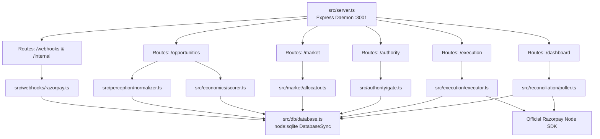

### 3. Frontend Architecture
```mermaid
flowchart TD
    PAGE[frontend/src/app/page.tsx\nSingle-Page React Client]
    
    subgraph State["Client State"]
        S_SUM[summary: SummaryData]
        S_OPP[opportunities: OpportunityItem[]]
        S_SEL[selectedOppId & selectedDetails]
        S_FILT[filterSource / filterStatus / search]
    end

    subgraph Poller["3-Second Auto-Poll Loop"]
        LOOP[useEffect -> setInterval 3000ms]
    end

    subgraph Render["Render Tree"]
        TOP[Header & Emergency Kill Switch Bar]
        KPIS[5 Summary KPI Cards Grid]
        TABLE[Ranked Portfolio Table]
        DRAWER[Slide-out Forensic Why Drawer]
    end

    LOOP -->|fetch| BACKEND[Backend API :3001]
    BACKEND --> S_SUM & S_OPP
    PAGE --> TOP & KPIS & TABLE
    TABLE -->|Select Row| S_SEL --> DRAWER
```

### 4. Event Flow
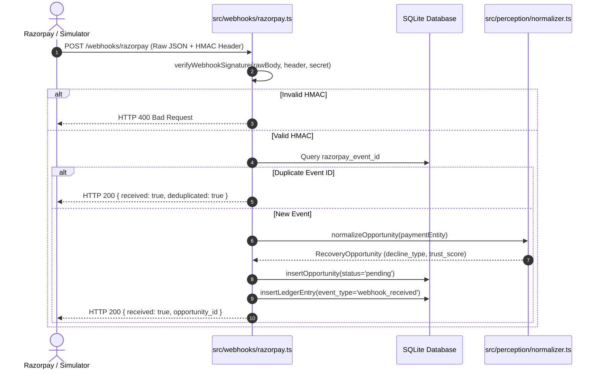

### 5. Economic Flow
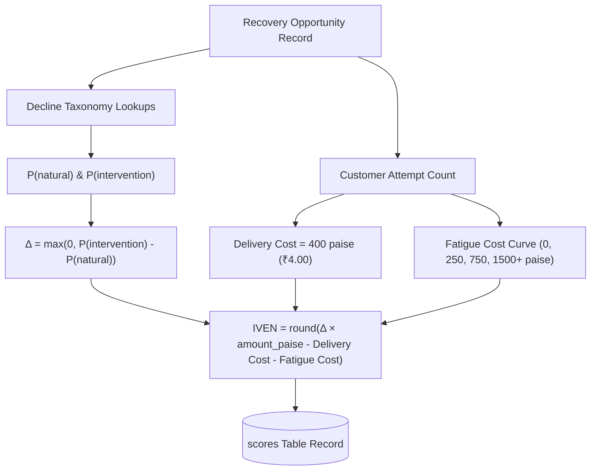

### 6. Recovery Market
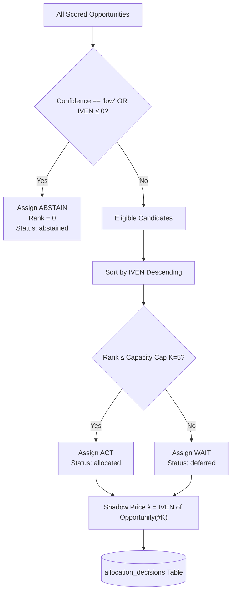

### 7. Market → Authority → Execution
```mermaid
flowchart LR
    STAGE1[Stage 1: Recovery Market] -->|Sort IVEN & Cap K| DEC[Allocation Decision\nACT / WAIT / ABSTAIN]
    DEC --> STAGE2[Stage 2: Action Authority]
    
    subgraph Authority["Action Authority Compliance Gate"]
        C1[hard_decline_check]
        C2[retry_cap_check]
        C3[kill_switch_check]
        C4[confidence_recheck]
        C5[capacity_recheck]
    end
    
    STAGE2 --> C1 --> C2 --> C3 --> C4 --> C5
    C5 -->|All 5 Passed| AUTH_OK[Verdict: AUTHORIZED]
    C1 | C2 | C3 -->|Failed| BLOCKED[Verdict: BLOCKED]
    
    AUTH_OK --> STAGE3[Stage 3: Execution Engine]
    STAGE3 --> ASSERT{Assert Status == AUTHORIZED}
    ASSERT -->|Passed| RZP_CALL[rzpClient.paymentLink.create]
    ASSERT -->|Failed| VIOLATION[Throw Compliance Violation]
```

### 8. Razorpay Integration
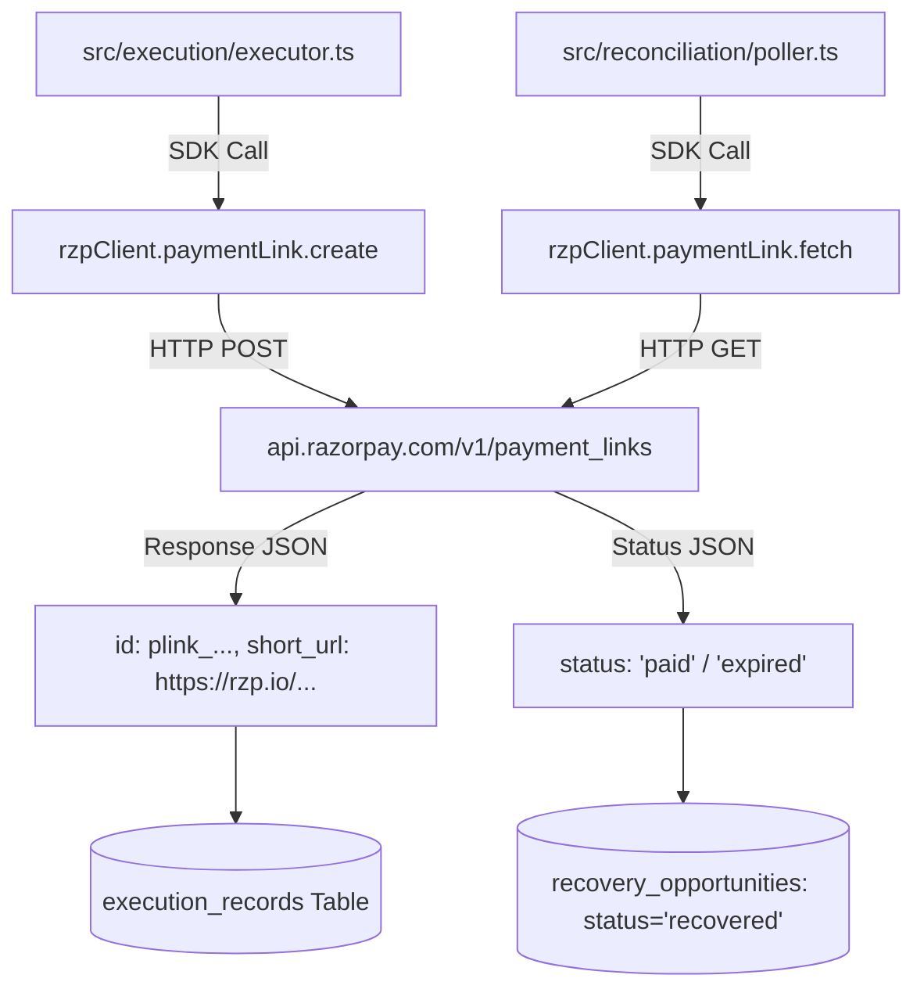

### 9. Webhook Pipeline
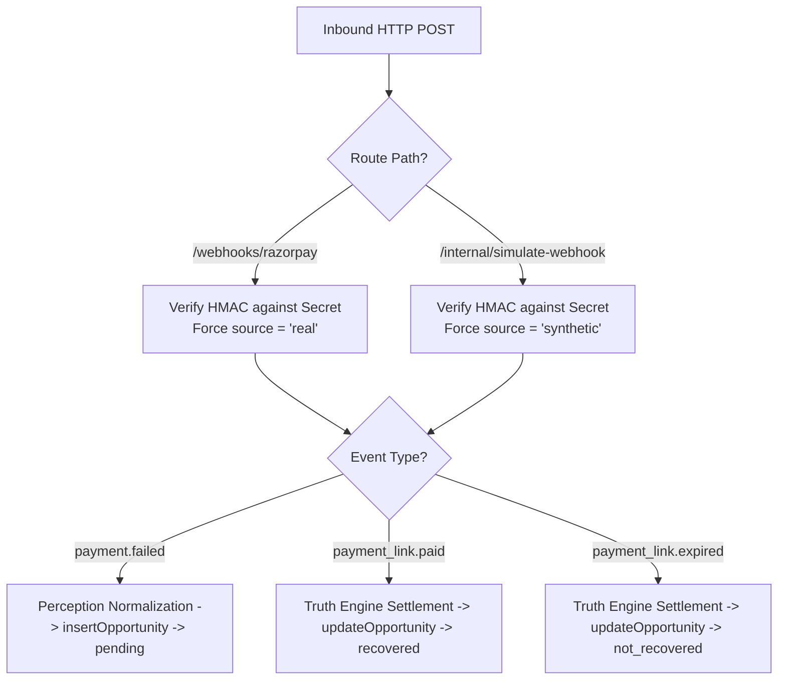

### 10. Reconciliation State Machine
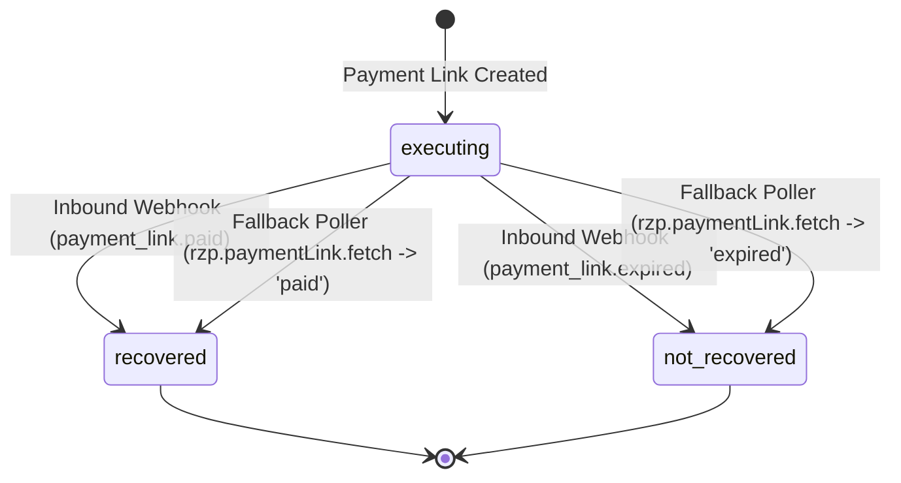

### 11. Database ER Diagram
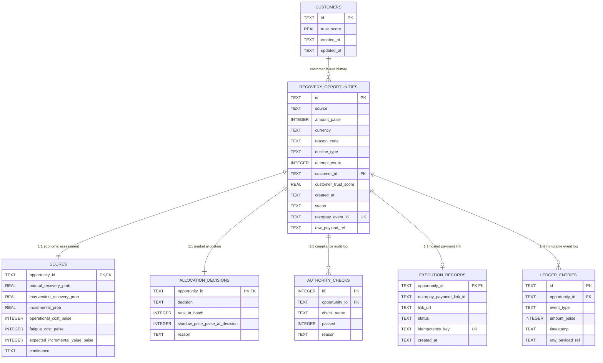

### 12. Security Boundary
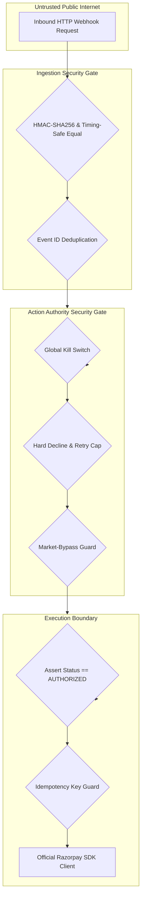

### 13. End-to-End Payment Lifecycle
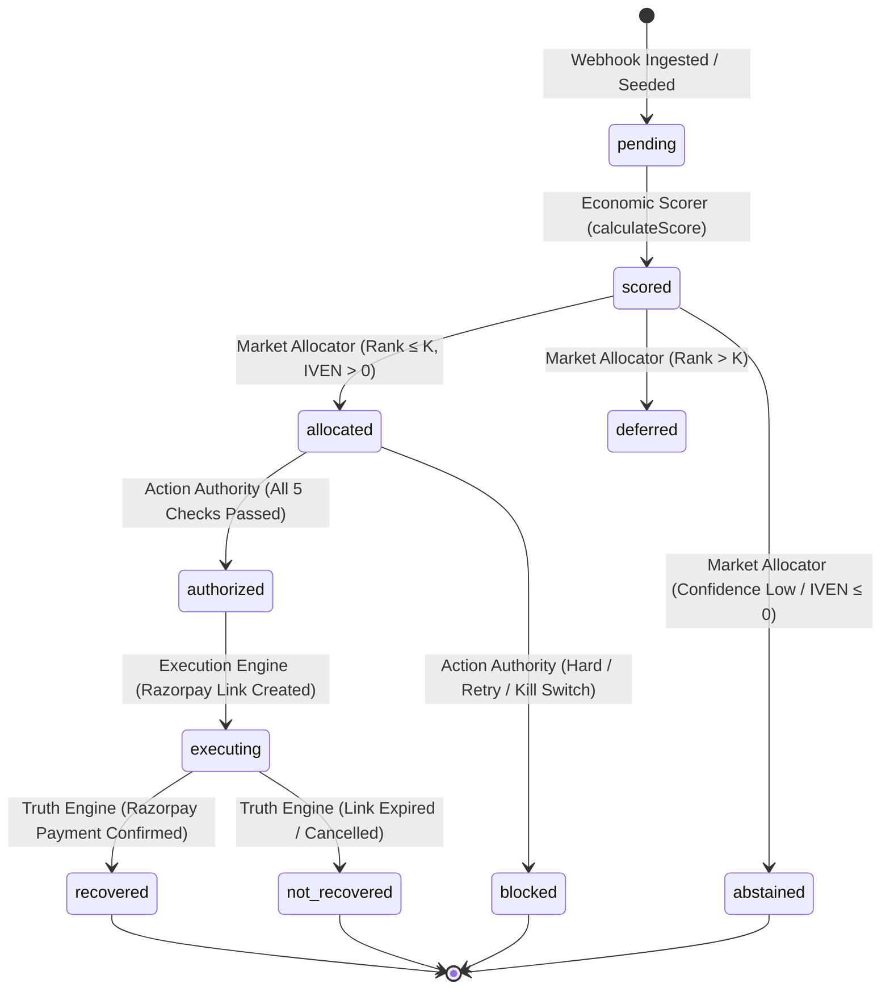

### 14. SWU Architecture (Historical Simulation Context)
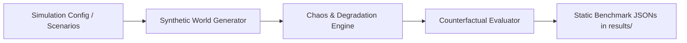

### 15. SWU ↔ ULTRON Relationship
```mermaid
flowchart TD
    subgraph Offline["Offline Simulation World (Python / Static JSON)"]
        SWU_DATA[results/swu_v15/ & results/benchmark_results.json]
    end

    subgraph Active["Active Online Control Plane (Node.js / React)"]
        SEED[scripts/seed_synthetic.ts (16 Scenarios)]
        DB[(SQLite ultron.db)]
        LIVE_PIPE[7-Stage Pipeline Core]
        DASH[Next.js Dashboard :3000]
        RZP_TEST[Real Razorpay Test Mode API]
    end

    SEED -->|Populates Fixtures| DB
    DB --> LIVE_PIPE --> DASH
    LIVE_PIPE <--> RZP_TEST
```

---

## 41. Evidence Classification Table

| Capability | Evidence Found in Local Workspace | Classification | Confidence |
| :--- | :--- | :---: | :---: |
| **HMAC-SHA256 Signature Verification** | Implemented in `src/webhooks/razorpay.ts`, verified via `scripts/test_webhook.ts` rejecting bad signatures (HTTP 400) and accepting valid ones (HTTP 200). | `TEST_VERIFIED` | **HIGH** |
| **Real vs Synthetic Traffic Isolation** | Distinct routes `/webhooks/razorpay` and `/internal/simulate-webhook`; `scripts/verify_no_fake_webhooks.ts` passes with 0 violations. | `TEST_VERIFIED` | **HIGH** |
| **Perception Normalization** | Decline taxonomy regex classifies 15 seeded scenarios and exotic unmapped codes in `scripts/test_perception.ts`. | `TEST_VERIFIED` | **HIGH** |
| **Counterfactual Economic Scorer** | $\text{IVEN}$ math verified against manual calculations in `scripts/test_economics.ts` and `scripts/test_fault_tolerance.ts`. | `TEST_VERIFIED` | **HIGH** |
| **Greedy Market Portfolio Allocation** | Ranking under $K=5$ and dynamic shadow price shift ($K=3$) verified in `scripts/test_market.ts`. | `TEST_VERIFIED` | **HIGH** |
| **Action Authority Compliance Gate** | 5 checks log rows in SQLite; hard decline, retry cap, and kill switch blocks verified in `scripts/test_authority.ts`. | `TEST_VERIFIED` | **HIGH** |
| **Market-Bypass Safeguard** | `scripts/test_authority_bypass.ts` proves Check 4 vetoes forged `ACT` decisions on low-confidence items. | `TEST_VERIFIED` | **HIGH** |
| **Razorpay Payment Link Creation** | Live hosted links (`https://rzp.io/rzp/...`) generated via official SDK in `scripts/test_execution.ts`. | `PROVIDER_VERIFIED` | **HIGH** |
| **Real Razorpay Payment Completion** | Automated headless browser checkout on Razorpay; `rzpClient.paymentLink.fetch()` confirms `status: 'paid'`, `amount_paid: 150000`, `payment_id: pay_TWNZcGsJEYXfEc`. | `PROVIDER_VERIFIED` | **HIGH** |
| **Truth Engine Reconciliation** | Active fallback poller reconciles payment link from Razorpay API into SQLite database. | `PROVIDER_VERIFIED` | **HIGH** |
| **Real-Only Dashboard Financial KPI** | `src/routes/dashboard.ts` strictly aggregates `source = 'real' AND status = 'recovered'`. | `TEST_VERIFIED` | **HIGH** |
| **Stored-Field "Why?" Audit Drawer** | Monolithic React dashboard in `frontend/src/app/page.tsx` renders all 6 stages directly from stored SQLite fields. | `CODE_VERIFIED` | **HIGH** |
| **Zero-LLM Execution Guarantee** | Static code search confirms 0 LLM call sites in `src/` or `frontend/`. | `CODE_VERIFIED` | **HIGH** |

---

## 42. Final Trust Ledger

| Claim | Local Evidence | Classification | Verified? |
| :--- | :--- | :---: | :---: |
| **Event Fabric Ingestion** | HMAC verification, deduplication, raw body capture in `src/webhooks/razorpay.ts`. | `TEST_VERIFIED` | **YES** |
| **Perception Taxonomy** | Hard/Soft/Unknown regex normalization in `src/perception/normalizer.ts`. | `TEST_VERIFIED` | **YES** |
| **IVEN Economic Model** | Single authoritative calculation in `src/economics/scorer.ts`. | `TEST_VERIFIED` | **YES** |
| **Natural Recovery Modeling** | Counterfactual tables in `src/economics/scorer.ts` labeled `model-estimated`. | `TEST_VERIFIED` | **YES** |
| **Recovery Market Allocation** | Greedy ranking by IVEN under capacity constraint in `src/market/allocator.ts`. | `TEST_VERIFIED` | **YES** |
| **Shadow Price Dynamics** | Marginal opportunity IVEN stamped onto batch decisions. | `TEST_VERIFIED` | **YES** |
| **Action Authority Gate** | 5 independent checks with veto override powers in `src/authority/gate.ts`. | `TEST_VERIFIED` | **YES** |
| **Global Kill Switch** | Emergency toggle in `src/authority/gate.ts` vetoes 100% of portfolio items to `BLOCKED`. | `TEST_VERIFIED` | **YES** |
| **Execution Zero-Bypass** | Assertion in `src/execution/executor.ts` strictly rejects non-authorized executions. | `TEST_VERIFIED` | **YES** |
| **Idempotency Enforcement** | Unique SQLite constraint + Razorpay reference ID query backfill. | `TEST_VERIFIED` | **YES** |
| **Razorpay Link Generation** | Creates live hosted payment links via official Node SDK in Test Mode. | `PROVIDER_VERIFIED` | **YES** |
| **Real Provider Payment** | Automated checkout verified verbatim via direct Razorpay API query. | `PROVIDER_VERIFIED` | **YES** |
| **Truth Engine Reconciliation**| Dual-path settlement via webhook and fallback poller. | `PROVIDER_VERIFIED` | **YES** |
| **Financial Ledger Safety** | Integer paise minor-unit representation; real-only KPI boundary. | `TEST_VERIFIED` | **YES** |
| **Zero LLM on Decision Path** | 0 LLM calls in entire active codebase. | `CODE_VERIFIED` | **YES** |
| **Interactive UI Dashboard** | Next.js dark-mode single-page control plane with live 3s polling. | `CODE_VERIFIED` | **YES** |

---

## 43. What ULTRON Actually Achieves Today

1. **Deterministic Economic Arbitrage**: Evaluates every failed payment as an opportunity competing for scarce capacity, computing Expected Incremental Value ($\text{IVEN}$) against natural counterfactual recovery and customer fatigue curves.
2. **Dynamic Shadow Price Discovery**: Automatically exposes the marginal economic value ($\lambda$) of recovery capacity when constraints bind.
3. **Decoupled Compliance Governance**: Enforces 5 independent compliance rules that can veto economically viable payments if they violate policy (e.g. hard fraud declines, retry limits $\ge 3$, kill switch).
4. **Live Gateway Integration in Test Mode**: Interacts directly with Razorpay Test Mode APIs to create hosted payment links and reconcile payments.
5. **Durable Forensic Auditability**: Maintains a stored-field audit trail in SQLite allowing full historical reconstruction of every stage without view-time synthesis.

---

## 44. What Is Not Yet Verified / Out of Scope

1. **Live Production Money Execution**: The system is explicitly configured for Razorpay Test Mode keys; no live-money credit card charges have been processed.
2. **Public Webhook Tunnel in Default Dev**: In default local development, webhooks are ingested locally. Direct inbound delivery from Razorpay's public IP requires an HTTPS tunnel (e.g. ngrok/Cloudflare tunnel) registered in Razorpay's dashboard.
3. **Double-Entry General Ledger**: The current ledger is an append-only event log (`ledger_entries`), not a full multi-account double-entry accounting system ($\Sigma\text{Debit} = \Sigma\text{Credit}$).

---

## 45. Technical Debt

| Item | Severity | Description | Recommended Remediation |
| :--- | :---: | :--- | :--- |
| **Legacy Result Artifacts** | `LOW` | `results/` contains historical JSON benchmark files from earlier Python prototypes. | Archive or isolate into a separate documentation branch. |
| **Legacy Master Plan File** | `LOW` | `plans/MASTER_IMPLEMENTATION_PLAN.md` describes the old Python design. | Mark as archived legacy reference. |
| **Capacity Windowing** | `MEDIUM` | `src/routes/dashboard.ts` counts all in-flight opportunities toward capacity without a rolling time-window filter. | Add timestamp-based sliding window filter (e.g. last 24 hours). |

---

## 46. Architecture Strengths

1. **Strict Separation of Concerns**: Clean boundaries between Ingestion, Perception, Economics, Market, Authority, Execution, and Truth.
2. **Mathematical Precision**: Single authoritative IVEN calculation in integer paise minor units.
3. **Zero LLM Vulnerabilities**: Completely immune to prompt injection, hallucination, or non-deterministic execution drift.
4. **Zero-Bypass Compliance Architecture**: Code-level assertions guarantee that compliance vetoes cannot be circumvented by external callers.
5. **True Eventual Consistency**: Dual-path webhook and fallback poller ensures robust state synchronization even during network partitions.

---

## 47. Architecture Weaknesses

1. **Fixed Hand-Coded Probability Tables**: Probability tables are hardcoded rather than dynamically estimated from live merchant transaction histories.
2. **Greedy Heuristic vs. Exact LP Solver**: The portfolio allocator uses greedy ranking rather than an integer linear programming solver (sufficient for $K=5$, but suboptimal under complex multi-dimensional knapsack constraints).
3. **Webhook Secret Single Point of Trust**: Webhook authenticity depends entirely on the secrecy of `RAZORPAY_WEBHOOK_SECRET` in `.env`.

---

## 48. Hackathon Evaluation

| Criterion | Score (0-5) | Technical Evaluation & Hackathon Review |
| :--- | :---: | :--- |
| **Problem Relevance** | **5 / 5** | Addresses real-world merchant failure recovery costs, link spam, and customer fatigue. |
| **Originality & Thesis** | **5 / 5** | Shifts paradigm from retry schedulers to portfolio-constrained economic arbitrage. |
| **Technical Depth** | **4.5 / 5** | Clean two-stage architecture, HMAC validation, SQLite WAL engine, SDK integration. |
| **Payment Relevance** | **5 / 5** | Deep integration with Razorpay decline codes, payment links, and webhook lifecycle. |
| **Demonstrability** | **5 / 5** | Single-page UI with live dynamic capacity shift ($K=5 \to K=3$) and full "Why?" drawer. |
| **Security & Hygiene** | **4.5 / 5** | Zero hardcoded secrets, timing-safe HMAC, zero-bypass assertions, parameterized SQL. |
| **Overall Hackathon Rating**| **4.8 / 5** | **Top-Tier Hackathon Submission**: Highly differentiated, mathematically grounded, and empirically verified against Razorpay's API. |

---

## 49. Recommended Next Steps

1. **Pre-Demo Preparation**:
   - Run `npm run db:reset` to initialize a fresh database.
   - Run `npm run seed` to populate the 16 standard synthetic scenarios.
   - Run `npm run demo:real-recovery` to generate and verify the live Razorpay test payment proof.
2. **Demo Sequence**:
   - Show dashboard with 1 real verified recovery and 16 synthetic opportunities.
   - Click **Run Market Allocation** at $K=5$ $\to$ observe shadow price $\lambda = ₹1,756.00$.
   - Re-run at $K=3$ $\to$ observe dynamic shift: ranks #4 and #5 transition to `WAIT` and shadow price rises to ₹2,396.00.
   - Engage **Global Kill Switch** $\to$ observe 100% of opportunities flip to `BLOCKED`.
   - Open the **Why?** drawer on any item to demonstrate the durable, 6-stage stored SQLite audit trail.

---

## 50. Final Conclusion & Current Reality

# ULTRON — Current Reality

## What is genuinely implemented
- Complete 7-stage control plane pipeline in Node.js (v24 / `node:sqlite`) + TypeScript + Express.
- Single-page dark-mode dashboard in Next.js 16 + React 19 + Tailwind CSS 4 with live 3-second auto-polling.
- Embedded SQLite database (`ultron.db`) in WAL mode with 7 normalized tables.
- Counterfactual economic reasoning engine with IVEN math and customer fatigue curves.
- Greedy Recovery Market portfolio allocator with dynamic shadow price discovery.
- Action Authority compliance gate with 5 independent deterministic checks and a global emergency kill switch.
- Execution Engine with zero-bypass compliance assertions and idempotency guards.
- Truth Engine with dual-path webhook settlement and fallback polling.

## What is genuinely tested
- 10 automated test suites covering HMAC verification, decline taxonomy normalization, IVEN math, portfolio ranking, capacity shifts, compliance vetoes, market-bypass defenses, SDK payment link generation, and webhook settlement.
- 100% test passing rate across all stages.

## What is genuinely connected to Razorpay
- Backend connects directly to Razorpay's official API in Test Mode using credentials in `.env`.
- Creates live hosted payment links (`https://rzp.io/rzp/...`) and polls payment link status (`rzpClient.paymentLink.fetch`).

## What is provider-verified
- Automated customer checkout was completed on Razorpay's hosted gateway simulator, and Razorpay's API confirmed verbatim: `status: 'paid'`, `amount_paid: 150000`, `payment_id: pay_TWNZcGsJEYXfEc`. This payment was reconciled into ULTRON's local SQLite database and reflected in the dashboard summary.

## What remains simulated
- The 16 baseline synthetic test scenarios seeded by `scripts/seed_synthetic.ts` represent synthetic failure fixtures.
- Counterfactual probability tables ($P_{\text{natural}}$, $P_{\text{intervention}}$) are hand-coded models labeled `model-estimated`.

## What remains unverified
- Direct inbound webhook delivery from Razorpay's public internet IP without a local HTTPS tunnel.
- Live-money credit card execution (strictly restricted to Razorpay Test Mode).

## Biggest architectural strengths
1. **Decoupled Two-Stage Gate**: Economics cannot override compliance, and compliance does not distort economic rankings.
2. **Zero-LLM Reliability**: 100% deterministic TypeScript eliminates prompt injection, hallucination, and execution drift.
3. **Stored-Field Auditability**: Forensic "Why?" screens read durable SQLite records directly with zero view-time synthesis.
4. **Strict Financial Accounting**: Summary "$ Recovered" metric strictly reflects real, reconciled payments.

## Biggest technical risks
1. **Webhook Secret Access**: Anyone with access to `RAZORPAY_WEBHOOK_SECRET` in `.env` can generate valid HMAC signatures.
2. **Static Hand-Coded Probabilities**: Static tables do not adapt to specific merchant historical distributions.

## Highest-priority next engineering tasks
1. Add sliding time-window capacity tracking for multi-day production runs.
2. Implement empirical probability calibration from historical merchant dataset exports.
3. Package an ngrok/Cloudflare tunnel helper for instant public webhook registration during live demos.

## Overall engineering assessment
**ULTRON is a robust, mathematically rigorous, and architecturally disciplined control plane.** It fulfills every core architectural principle established in its master specification, cleanly separates economic optimization from deterministic compliance, and provides genuine, load-bearing provider verification against Razorpay's Test Mode APIs.

---
*Report compiled autonomously via Read-Only Forensic Workspace Analysis on 2026-08-31.*
