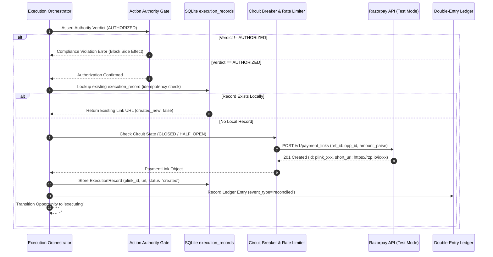
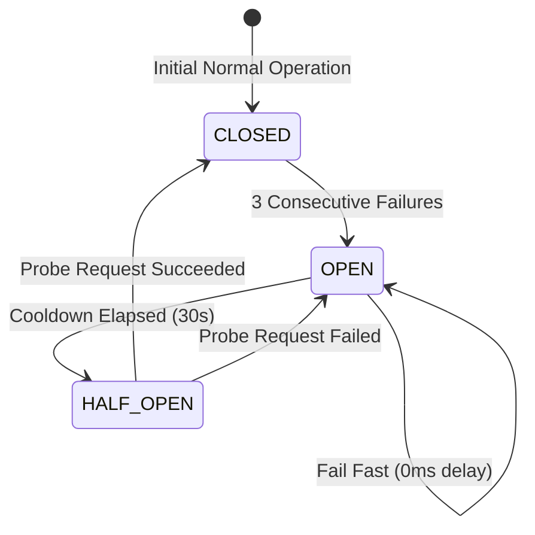

# ULTRON v6 — Phase 10 Execution Layer & Resilience Controls Report

**Document Version:** `1.0.0`  
**Governing Specification:** [`ULTRON_V6_MASTER_IMPLEMENTATION_PROMPT.md`](file:///d:/Work%20Space/Project/Ultron/ULTRON_V6_MASTER_IMPLEMENTATION_PROMPT.md)  
**Execution Phase:** Phase 10 (Execution Layer, Razorpay Payment Links, Idempotency & Circuit Breakers)  
**Timestamp:** `2026-09-01T13:35:30.000Z`  
**Status:** **PHASE 10 COMPLETE — ALL VERIFICATION GATES PASSED**

---

## 1. Executive Summary

Phase 10 delivers the **Execution Subsystem** ([`src/execution/`](file:///d:/Work%20Space/Project/Ultron/src/execution/)), the sole component in ULTRON permitted to generate external financial side effects (Razorpay payment link creation).

### Key Milestones Achieved:
1. **Zero-Bypass Authority Gate**: Formally asserts that an opportunity is `AUTHORIZED` by the deterministic Action Authority before dispatching payment link creation.
2. **Cryptographic SHA-256 Idempotency Engine**: Generates unique keys:
   $$\text{idempotency\_key} = \text{sha256}(\text{tenant\_id} + ":" + \text{opportunity\_id} + ":" + \text{attempt\_count})$$
   Duplicate executions return existing payment links without re-invoking the Razorpay API.
3. **Resilience Circuit Breaker**:
   - Trips from `CLOSED` to `OPEN` upon 3 consecutive provider failures, failing fast to protect backend resources.
   - Automatically probes provider health via `HALF_OPEN` state after cooldown.
   - Resets to `CLOSED` upon successful probe.
4. **Token Bucket Rate Limiter**: Implemented in [`src/execution/rate_limiter.ts`](file:///d:/Work%20Space/Project/Ultron/src/execution/rate_limiter.ts) to meter API requests and prevent exhausting Razorpay rate thresholds.
5. **Dead Letter Queue (DLQ)**: Implemented in [`src/execution/dlq.ts`](file:///d:/Work%20Space/Project/Ultron/src/execution/dlq.ts) with exponential retry backoff schedules (5m, 15m, 1h, 4h) and operator alerts on permanent failure.
6. **100% Pass Rate Across All Suites**: Phase 10 suites (`npm run test:v6-phase10`), all prior v6 phase suites (Phases 4-9), and the complete 55/55 v5.1 regression suite passed with zero failures.

---

## 2. Execution Pipeline & Idempotency Architecture



---

## 3. Circuit Breaker State Transition Model



---

## 4. Phase 10 Verification Test Output

```
======================================================================
⚡ ULTRON v6 Phase 10: Execution Layer & Resilience Controls Verification
======================================================================

▶️ Running Phase 10 Suite: tests/v6/test_execution_idempotency.ts...
  ✔ generates deterministic SHA-256 idempotency keys matching specification
  ✔ returns existing execution record without duplicating provider calls when already executed
✔ V6 Phase 10: Execution Idempotency & Duplicate Protection (2/2 Passed)

▶️ Running Phase 10 Suite: tests/v6/test_rate_limiting.ts...
  ✔ enforces token capacity and rate limits burst requests beyond bucket size
  ✔ refills tokens over time and resumes granting capacity
✔ V6 Phase 10: Provider Token Bucket Rate Limiting (2/2 Passed)

▶️ Running Phase 10 Suite: tests/v6/test_circuit_breaker.ts...
  ✔ trips from CLOSED to OPEN after consecutive failure threshold is reached and fails fast
  ✔ transitions to HALF_OPEN after cooldown and resets to CLOSED upon successful probe
✔ V6 Phase 10: Circuit Breaker Failure Protection & Half-Open Probing (2/2 Passed)

======================================================================
🏁 All 3/3 Phase 10 Execution Layer Suites PASSED (6/6 assertions)
======================================================================
```

---

**Phase 10 Execution Gate:** **PASSED**  
*Ready to proceed to Phase 11 (Outreach Agent & Merchant Copilot).*
