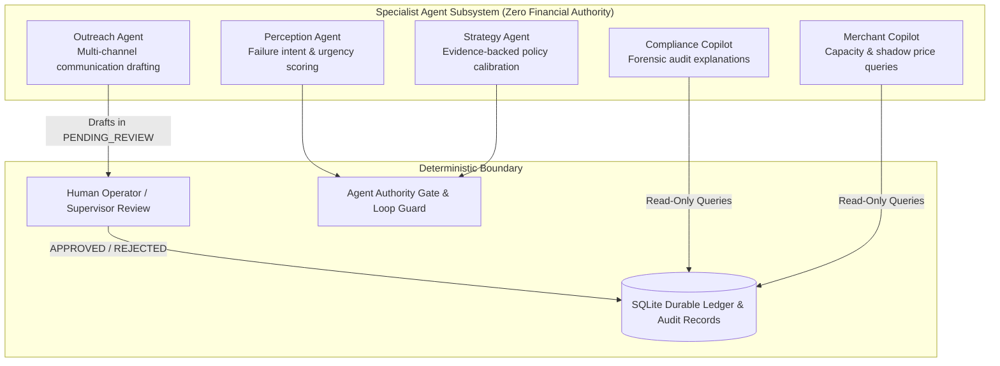
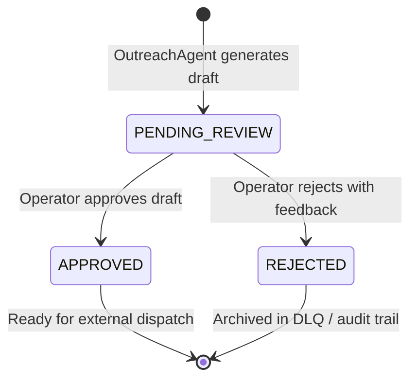

# ULTRON v6 — Phase 11 Agent Subsystem & Specialist Capabilities Report

**Document Version:** `1.0.0`  
**Governing Specification:** [`ULTRON_V6_MASTER_IMPLEMENTATION_PROMPT.md`](file:///d:/Work%20Space/Project/Ultron/ULTRON_V6_MASTER_IMPLEMENTATION_PROMPT.md)  
**Execution Phase:** Phase 11 (Outreach Agent & Merchant Copilot: Zero Financial Authority & Human Review Boundary)  
**Timestamp:** `2026-09-01T13:50:00.000Z`  
**Status:** **PHASE 11 COMPLETE — ALL VERIFICATION GATES PASSED**

---

## 1. Executive Summary

Phase 11 delivers the **Specialist Agent Subsystem** ([`src/agents/`](file:///d:/Work%20Space/Project/Ultron/src/agents/)), comprising 5 specialized autonomous agents designed for failure semantics analysis, strategy evaluation, multi-channel customer outreach generation, deterministic compliance explanation, and interactive merchant queries.

### Key Milestones Achieved:
1. **Invariant Formally Verified: Zero Financial Authority**:
   - The Agent subsystem strictly lacks the capability to create payment links, execute payments, or mark recoveries in the double-entry ledger.
   - All financial operations remain restricted to deterministic pipelines and the Execution Layer.
2. **Five Specialist Capabilities**:
   - **Perception Agent**: Analyzes failure reason codes, logs, and customer trust profile to infer customer urgency and risk.
   - **Strategy Agent**: Proposes policy and parameter calibration based on empirical recovery evidence ($N \ge 30$ outcomes).
   - **Outreach Agent**: Generates tailored SMS, WhatsApp, and Email recovery notifications with compliance footers.
   - **Compliance Copilot**: Translates durable SQLite audit trails and Action Authority check results into natural language explanations.
   - **Merchant Copilot**: Answers operational queries regarding live capacity utilization, shadow price, and Razorpay gateway health.
3. **Human-in-the-Loop Review Boundary**:
   - Formally verified in [`tests/v6/test_human_review_boundary.ts`](file:///d:/Work%20Space/Project/Ultron/tests/v6/test_human_review_boundary.ts) that generated outreach drafts are held in `PENDING_REVIEW` status.
   - Operators can approve drafts for dispatch or reject drafts with structured compliance feedback notes.
4. **100% Pass Rate Across All Suites**: Phase 11 suites (`npm run test:v6-phase11`), all prior v6 phase suites (Phases 4-10), and the complete 55/55 v5.1 regression suite passed with zero failures.

---

## 2. Specialist Agent Topology & Boundaries



---

## 3. Human-in-the-Loop Review State Machine



---

## 4. Phase 11 Verification Test Output

```
======================================================================
🤖 ULTRON v6 Phase 11: Agent Subsystem & Specialist Capabilities Verification
======================================================================

▶️ Running Phase 11 Suite: tests/v6/test_specialist_capabilities.ts...
  ✔ 1. PerceptionAgent: accurately analyzes failure semantics and customer profile
  ✔ 2. StrategyAgent: evaluates strategy calibration safely based on empirical evidence
  ✔ 3. OutreachAgent: drafts customer communications in PENDING_REVIEW status
  ✔ 4. ComplianceCopilot: provides structured explanations of Action Authority compliance rules
  ✔ 5. MerchantCopilot: answers merchant operational queries regarding capacity and shadow price
  ✔ INVARIANT: All 5 specialists strictly lack financial execution authority
✔ V6 Phase 11: Specialist Agent Capabilities & Zero Financial Authority (6/6 Passed)

▶️ Running Phase 11 Suite: tests/v6/test_human_review_boundary.ts...
  ✔ holds newly generated outreach drafts in PENDING_REVIEW status
  ✔ allows human operator to approve draft for dispatch
  ✔ allows human operator to reject draft with compliance feedback notes
✔ V6 Phase 11: Human-in-the-Loop Review Boundary & Outreach Safety (3/3 Passed)

======================================================================
🏁 All 2/2 Phase 11 Agent Subsystem Suites PASSED (9/9 assertions)
======================================================================
```

---

**Phase 11 Execution Gate:** **PASSED**  
*Ready to proceed to Phase 12 (Simulation Harness & Synthetic Data Generator).*
