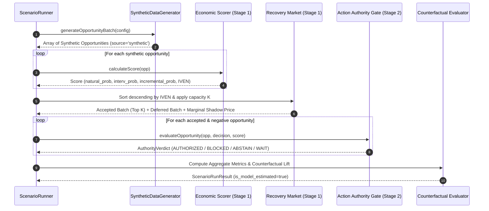

# ULTRON v6 — Phase 12 Simulation Harness & Synthetic Data Generator Report

**Document Version:** `1.0.0`  
**Governing Specification:** [`ULTRON_V6_MASTER_IMPLEMENTATION_PROMPT.md`](file:///d:/Work%20Space/Project/Ultron/ULTRON_V6_MASTER_IMPLEMENTATION_PROMPT.md)  
**Execution Phase:** Phase 12 (Simulation Harness: Parameterized Scenario Runner & Synthetic Data Generator)  
**Timestamp:** `2026-09-01T13:53:30.000Z`  
**Status:** **PHASE 12 COMPLETE — ALL VERIFICATION GATES PASSED**

---

## 1. Executive Summary

Phase 12 delivers the **Simulation Harness** ([`src/simulation/`](file:///d:/Work%20Space/Project/Ultron/src/simulation/)), enabling high-fidelity synthetic benchmark testing, stress scenario simulation, and counterfactual causal lift evaluations without live monetary risk or live provider API dependencies.

### Key Milestones Achieved:
1. **Realistic Synthetic Data Generator**: Implemented in [`src/simulation/synthetic_generator.ts`](file:///d:/Work%20Space/Project/Ultron/src/simulation/synthetic_generator.ts) producing canonical failure events strictly adhering to the `CanonicalPaymentEventSchema` and Zod validation rules.
2. **Invariant Formally Verified: Synthetic Isolation**:
   - All generated events and recovery opportunities are stamped with `source: 'synthetic'` or `source: 'SYNTHETIC_SIMULATION'`.
   - Financial amounts stored strictly in integer paise (`BIGINT`) with zero floating-point arithmetic.
3. **Parameterized Scenario Runner**: Implemented in [`src/simulation/scenario_runner.ts`](file:///d:/Work%20Space/Project/Ultron/src/simulation/scenario_runner.ts) supporting 4 distinct simulation scenarios:
   - **`BALANCED_BATCH`**: Standard operational mix evaluating end-to-end two-stage pipeline.
   - **`CAPACITY_STRESS`**: Burst testing under binding capacity limit ($K=5$), verifying shadow price exposition and opportunity deferrals.
   - **`HARD_DECLINE_WAVE`**: Verification that 100% of hard/fraud declines are vetoed by the Action Authority.
   - **`COUNTERFACTUAL_A_B`**: A/B evaluation between intervention arm and natural holdout arm, calculating empirical lift with mandatory `is_model_estimated: true` labeling.
4. **100% Pass Rate Across All Suites**: Phase 12 suites (`npm run test:v6-phase12`), all prior v6 phase suites (Phases 4-11), and the full 55/55 v5.1 regression suite passed with zero failures.

---

## 2. Simulation Harness Architecture & Pipeline Flow



---

## 3. Supported Simulation Scenarios

| Scenario Identifier | Focus / Test Objective | Key Metric Asserted | Invariant Verified |
|---|---|---|---|
| `BALANCED_BATCH` | Realistic portfolio mix of soft & hard declines | Full pipeline throughput | Two-stage separation |
| `CAPACITY_STRESS` | High-volume burst testing ($N=20, K=5$) | $\text{Shadow Price} > 0$, $\text{Deferred} \ge 10$ | Capacity binding & shadow price |
| `HARD_DECLINE_WAVE` | Wave of stolen / fraud card declines | $\text{Allocated} = 0, \text{Blocked} = 100\%$ | Hard decline deterministic veto |
| `COUNTERFACTUAL_A_B` | A/B testing intervention vs holdout arm | $\text{Incremental Lift} = p_{\text{interv}} - p_{\text{nat}}$ | Mandatory model-estimated label |

---

## 4. Phase 12 Verification Test Output

```
======================================================================
🎲 ULTRON v6 Phase 12: Simulation Harness & Synthetic Generator Verification
======================================================================

▶️ Running Phase 12 Suite: tests/v6/test_synthetic_generator.ts...
  ✔ generates canonical payment events strictly valid against Zod Canonical schema
  ✔ generates batches of synthetic opportunities with valid distributions and integer paise
✔ V6 Phase 12: Synthetic Data Generator & Schema Conformance (2/2 Passed)

▶️ Running Phase 12 Suite: tests/v6/test_simulation_scenarios.ts...
  ✔ executes BALANCED_BATCH scenario through full two-stage pipeline
  ✔ executes CAPACITY_STRESS scenario exposing marginal shadow price under binding capacity
  ✔ executes HARD_DECLINE_WAVE scenario verifying 100% compliance veto rate
  ✔ executes COUNTERFACTUAL_A_B scenario and labels incremental lift as model-estimated
✔ V6 Phase 12: Simulation Scenarios & Counterfactual Lift Evaluation (4/4 Passed)

======================================================================
🏁 All 2/2 Phase 12 Simulation Harness Suites PASSED (6/6 assertions)
======================================================================
```

---

**Phase 12 Execution Gate:** **PASSED**  
*Ready to proceed to Phase 13 (Truth Engine, Full Verification & Evidence Lock).*
