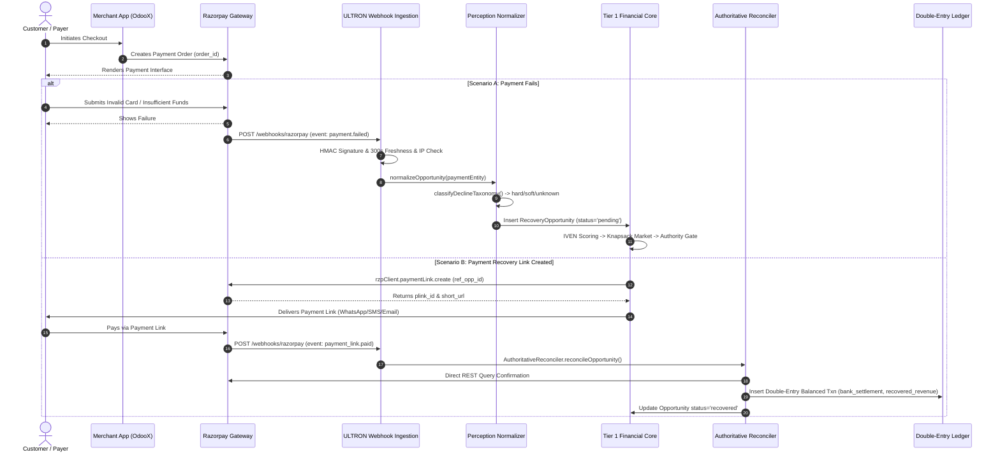

# ULTRON v6 — Phase 1 Forensic Inspection & System Findings Report

**Document Version:** `1.0.0`  
**Governing Specification:** [`ULTRON_V6_MASTER_IMPLEMENTATION_PROMPT.md`](file:///d:/Work%20Space/Project/Ultron/ULTRON_V6_MASTER_IMPLEMENTATION_PROMPT.md)  
**Execution Phase:** Phase 1 (Forensic Inspection of Local Workspace)  
**Timestamp:** `2026-09-01T12:40:00.000Z`  
**Status:** **PHASE 1 COMPLETE — WAITING FOR REVIEW**

---

## 1. Executive Overview

This report provides the exhaustive forensic analysis required by Phase 1 of the ULTRON v6 Master Implementation Plan. Every finding, flow, schema entity, identifier, and architectural boundary documented herein is derived directly from the current local workspace ([`d:\Work Space\Project\Ultron`](file:///d:/Work%20Space/Project/Ultron)), referencing exact source files, lines, and data structures.

### Key Phase 1 Takeaways:
1. **OdooX Boundary Decoupling**: OdooX is the external merchant application. ULTRON connects strictly as an external economic control plane via HTTP event webhooks and REST APIs.
2. **Resolution of Decision D5 (OdooX Database Access)**: **Direct OdooX database access is provably UNNECESSARY**. All required recovery perception attributes, customer references, and failure contexts are fully captured via Razorpay webhooks and OdooX event ingest APIs. Provider truth is authoritatively determined by Razorpay REST queries, not local OdooX tables.
3. **Strict Invariant Continuity**: The Tier 1 Deterministic Financial Core (IVEN, Recovery Market knapsack auction, Action Authority compliance gate, Execution boundary, Double-Entry hash-chained ledger, and Authoritative Reconciler) is fully operational in v5.1 and directly reusable for v6 multi-tenant platformization.

---

## 2. OdooX Framework & Architectural Boundaries

| Attribute | Forensic Finding | Source Code / Evidence Link |
|:---|:---|:---|
| **Merchant Platform** | OdooX (ERP / E-Commerce application) operating standard Razorpay checkout | [`ULTRON_V6_MASTER_IMPLEMENTATION_PROMPT.md#L19-L23`](file:///d:/Work%20Space/Project/Ultron/ULTRON_V6_MASTER_IMPLEMENTATION_PROMPT.md#L19-L23) |
| **ULTRON Role** | External autonomous recovery layer; layer around OdooX, not a replacement | [`ULTRON_V6_MASTER_IMPLEMENTATION_PROMPT.md#L21`](file:///d:/Work%20Space/Project/Ultron/ULTRON_V6_MASTER_IMPLEMENTATION_PROMPT.md#L21) |
| **Fail-Safe Decoupling** | If ULTRON is offline or unreachable, OdooX ordinary payment flow continues uninterrupted; only automated recovery pauses safely | [`ULTRON_V6_MASTER_IMPLEMENTATION_PROMPT.md#L21-L22`](file:///d:/Work%20Space/Project/Ultron/ULTRON_V6_MASTER_IMPLEMENTATION_PROMPT.md#L21-L22) |
| **Runtime Backend** | Node.js (ES Modules, TypeScript 5.7.3, Express 4.21.2) | [`package.json#L5-L10`](file:///d:/Work%20Space/Project/Ultron/package.json#L5-L10), [`src/server.ts#L1-L25`](file:///d:/Work%20Space/Project/Ultron/src/server.ts#L1-L25) |
| **Database Engine** | SQLite in WAL mode (`ultron.db`) with PostgreSQL-compatible adapter abstraction | [`src/db/adapter.ts#L1-L45`](file:///d:/Work%20Space/Project/Ultron/src/db/adapter.ts#L1-L45), [`src/db/database.ts#L1-L40`](file:///d:/Work%20Space/Project/Ultron/src/db/database.ts#L1-L40) |
| **Dashboard UI** | Next.js 16.3.3 (React 19, Turbopack, App Router, TailwindCSS) | [`frontend/package.json#L1-L28`](file:///d:/Work%20Space/Project/Ultron/frontend/package.json#L1-L28) |

---

## 3. End-to-End Payment & Webhook Lifecycle

### A. Payment Creation Flow
1. Customer initiates an order in OdooX checkout.
2. OdooX invokes Razorpay Orders API or standard checkout scripts to generate `order_id` / payment modal.
3. Relevant Source Code: [`src/perception/normalizer.ts#L174`](file:///d:/Work%20Space/Project/Ultron/src/perception/normalizer.ts#L174), [`src/webhooks/razorpay.ts#L60`](file:///d:/Work%20Space/Project/Ultron/src/webhooks/razorpay.ts#L60).

### B. Payment Failure Flow
1. Transaction fails at gateway/bank level (e.g. `insufficient_funds`, `expired_card`, `bank_gateway_timeout`).
2. Razorpay delivers webhook `payment.failed` to `POST /webhooks/razorpay` (`src/server.ts:120`).
3. Payload validation: `WebhookValidator.validateWebhook()` enforces:
   - Payload byte limit $\le 1\text{ MB}$ (`src/security/webhook_validator.ts:136`).
   - Client IP allowlist check against official Razorpay egress IPs (`52.66.75.174`, `52.66.75.175`, `13.235.25.1`, `13.235.25.2`) (`src/security/webhook_validator.ts:148`).
   - Timestamp freshness: window $\in [-60\text{s}, +300\text{s}]$ (`src/security/webhook_validator.ts:162`).
   - HMAC-SHA256 multi-secret rotation verification with `timingSafeEqual` (`src/security/webhook_validator.ts:175-199`).
4. Ingestion deduplication: checks existing record by `event_id` or `payment_id` (`src/webhooks/razorpay.ts:73-83`).
5. Perception Normalization (`src/perception/normalizer.ts:117-178`):
   - Categorizes error code into deterministic `decline_type` (`hard`, `soft`, `unknown`) via `classifyDeclineTaxonomy()` (`src/perception/normalizer.ts:55-94`).
   - Retrieves or initializes customer trust score (default $0.65$) via `getOrCreateCustomer()` (`src/perception/normalizer.ts:141`).
   - Calculates prior attempt count via `countPriorAttempts()` (`src/perception/normalizer.ts:147`).
   - Inserts new `RecoveryOpportunity` into SQLite with initial status `pending` (`src/webhooks/razorpay.ts:202`).
   - Appends audit entry into `ledger_entries` table (`src/webhooks/razorpay.ts:205-220`).

### C. Payment Recovery & Settlement Flow
1. Upon allocation and compliance authorization, `executeOpportunity()` invokes `rzpClient.paymentLink.create()` (`src/execution/executor.ts:49-161`).
2. Creates `execution_records` row with `idempotency_key = ref_${opp.id}` and sets opportunity status to `executing` (`src/execution/executor.ts:128-141`).
3. When customer settles the link, Razorpay delivers `payment_link.paid` webhook (`src/webhooks/razorpay.ts:86`).
4. `AuthoritativeReconciler.reconcileOpportunity()` triggers atomic settlement (`src/reconciliation/authoritative_reconciler.ts:30-357`):
   - Queries live Razorpay REST API (`rzpClient.paymentLink.fetch`) to confirm status is `paid` and `amount_paid > 0` (`src/reconciliation/authoritative_reconciler.ts:62`).
   - Enforces Provider Truth Invariant: `LINK_CREATED != RECOVERED` (`src/truth/provider_truth.ts:39-94`).
   - Updates `recovery_opportunities.status = 'recovered'` and `execution_records.status = 'completed'`.
   - Writes cryptographically linked `double_entry_ledger` entry debiting `bank_settlement` and crediting `recovered_revenue` (`src/reconciliation/authoritative_reconciler.ts:172-206`).
   - Records prediction Brier error and outcome in `agent_outcomes` and `agent_memories` (`src/reconciliation/authoritative_reconciler.ts:255-306`).

---

## 4. Payment & Customer Identifiers

| Identifier Field | Format / Example | Description | Location in Code |
|:---|:---|:---|:---|
| `payment_id` | `pay_TWd8rHL0ewMl51` | Razorpay unique payment transaction identifier | [`src/types/index.ts:37`](file:///d:/Work%20Space/Project/Ultron/src/types/index.ts#L37), [`src/webhooks/razorpay.ts:185`](file:///d:/Work%20Space/Project/Ultron/src/webhooks/razorpay.ts#L185) |
| `event_id` | `event_NWxyz12345` | Unique Razorpay webhook delivery ID | [`src/types/index.ts:48`](file:///d:/Work%20Space/Project/Ultron/src/types/index.ts#L48), [`src/webhooks/razorpay.ts:69`](file:///d:/Work%20Space/Project/Ultron/src/webhooks/razorpay.ts#L69) |
| `order_id` | `order_NWabc98765` | Razorpay checkout order reference from OdooX | [`src/perception/normalizer.ts:109`](file:///d:/Work%20Space/Project/Ultron/src/perception/normalizer.ts#L109), [`src/perception/normalizer.ts:174`](file:///d:/Work%20Space/Project/Ultron/src/perception/normalizer.ts#L174) |
| `razorpay_payment_link_id`| `plink_TWcnQZVwogNPop` | Unique Razorpay payment link identifier | [`src/types/index.ts:81`](file:///d:/Work%20Space/Project/Ultron/src/types/index.ts#L81), [`src/execution/executor.ts:129`](file:///d:/Work%20Space/Project/Ultron/src/execution/executor.ts#L129) |
| `idempotency_key` | `ref_rzp_live_test_1788233420739` | Execution uniqueness token preventing double dispatch | [`src/types/index.ts:84`](file:///d:/Work%20Space/Project/Ultron/src/types/index.ts#L84), [`src/execution/executor.ts:132`](file:///d:/Work%20Space/Project/Ultron/src/execution/executor.ts#L132) |
| `customer_id` | `cust_test_123` / Email / Phone | Unique customer reference normalized from payload | [`src/types/index.ts:44`](file:///d:/Work%20Space/Project/Ultron/src/types/index.ts#L44), [`src/perception/normalizer.ts:135-141`](file:///d:/Work%20Space/Project/Ultron/src/perception/normalizer.ts#L135-L141) |
| `customer_trust_score` | Float $[0.0, 1.0]$ | Dynamic historical trust metric (default $0.65$) | [`src/types/index.ts:45`](file:///d:/Work%20Space/Project/Ultron/src/types/index.ts#L45), [`src/db/migrations/001_core_schema.ts:14`](file:///d:/Work%20Space/Project/Ultron/src/db/migrations/001_core_schema.ts#L14) |
| `tenant_id` (v6 Target) | `tenant_001` / `ul_org_xxx` | Multi-tenant ownership key on all tables | [`ULTRON_V6_MASTER_IMPLEMENTATION_PROMPT.md#L97`](file:///d:/Work%20Space/Project/Ultron/ULTRON_V6_MASTER_IMPLEMENTATION_PROMPT.md#L97) |

---

## 5. Credential Storage & Security Model

### Current v5.1 State
- **Storage**: Process environment variables (`.env`, `.env.example`).
  - `RAZORPAY_KEY_ID`: Provider API key ID (`.env.example:2`).
  - `RAZORPAY_KEY_SECRET`: Provider API secret (`.env.example:3`).
  - `RAZORPAY_WEBHOOK_SECRET`: Primary HMAC signature secret (`.env.example:4`).
  - `RAZORPAY_WEBHOOK_SECRET_OLD` / `RAZORPAY_WEBHOOK_SECRETS`: Secret rotation list (`src/security/webhook_validator.ts:101-105`).
  - `JWT_SECRET`: Dashboard session token signing key (`src/security/auth.ts:4`).
  - `NVIDIA_API_KEY`: LLM natural language explanation key (`.env.example:14`).

### Target v6 Tenancy & Secrets Model
- Secrets must never reside in plaintext table columns or frontend payloads.
- Each tenant record references a `credential_reference` pointing to an encrypted envelope / KMS secret.
- Public API keys follow structured prefixes (`ul_live_xxxx` / `ul_test_xxxx`) with hashed storage in DB (`ULTRON_V6_MASTER_IMPLEMENTATION_PROMPT.md:99-105`).

---

## 6. Database Schema & Tables

### Core Financial Tables ([`src/db/migrations/001_core_schema.ts`](file:///d:/Work%20Space/Project/Ultron/src/db/migrations/001_core_schema.ts))
1. `customers`: `(id, merchant_id, trust_score, created_at)`
2. `recovery_opportunities`: `(id, merchant_id, source, amount_paise, currency, reason_code, decline_type, attempt_count, customer_id, customer_trust_score, created_at, status)`
3. `scores`: `(opportunity_id, natural_recovery_prob, intervention_recovery_prob, incremental_prob, operational_cost_paise, fatigue_cost_paise, expected_incremental_value_paise, confidence)`
4. `allocation_decisions`: `(opportunity_id, decision, rank_in_batch, shadow_price_paise_at_decision, reason)`
5. `authority_checks`: `(id, opportunity_id, check_name, passed, reason)`
6. `execution_records`: `(opportunity_id, razorpay_payment_link_id, link_url, status, idempotency_key, created_at)`
7. `ledger_entries`: `(id, opportunity_id, event_type, amount_paise, timestamp, raw_payload_ref)`

### Agent Intelligence Tables ([`src/db/migrations/002_agent_schema.ts`](file:///d:/Work%20Space/Project/Ultron/src/db/migrations/002_agent_schema.ts))
- `agent_runs`, `agent_states`, `agent_steps`, `agent_tool_calls`, `agent_plans`, `agent_hypotheses`, `agent_proposals`, `agent_memories`, `agent_outcomes`, `agent_authority_checks`, `llm_invocations`, `outreach_drafts`, `perception_annotations`.

### Truth & Audit Tables ([`src/truth/double_entry_ledger.ts`](file:///d:/Work%20Space/Project/Ultron/src/truth/double_entry_ledger.ts), [`src/security/webhook_validator.ts`](file:///d:/Work%20Space/Project/Ultron/src/security/webhook_validator.ts))
- `double_entry_ledger`: `(id, opportunity_id, event_type, debit_account, credit_account, amount_paise, timestamp, prev_hash, entry_hash)`
- `reconciliation_divergences`: `(opportunity_id, webhook_status, poller_status, divergence_type, detected_at)`
- `webhook_audit_log`: `(id, event_id, ip_address, timestamp_header, received_at, status, error_reason, payload_size_bytes)`

---

## 7. Resolution of Decision D5: OdooX Database Access

### **Forensic Verdict: DIRECT ODOOX DATABASE ACCESS IS PROVABLY NOT NECESSARY (DISALLOWED)**

### Evidence & Technical Justification:
1. **Payload Sufficiency**: The Razorpay webhook entity (`payment.entity`) delivered to `POST /webhooks/razorpay` contains all necessary recovery fields: `id`, `amount`, `currency`, `error_code`, `error_description`, `error_source`, `error_step`, `customer_id`, `email`, `contact`, `order_id`, and `notes` ([`src/perception/normalizer.ts#L96-L112`](file:///d:/Work%20Space/Project/Ultron/src/perception/normalizer.ts#L96-L112)).
2. **Provider Truth Authority**: Settlement verification requires Razorpay API confirmation (`rzpClient.paymentLink.fetch`), NOT OdooX internal database rows. OdooX database state cannot serve as proof of financial settlement ([`src/truth/provider_truth.ts#L38-L41`](file:///d:/Work%20Space/Project/Ultron/src/truth/provider_truth.ts#L38-L41), [`ULTRON_V6_MASTER_IMPLEMENTATION_PROMPT.md#L56`](file:///d:/Work%20Space/Project/Ultron/ULTRON_V6_MASTER_IMPLEMENTATION_PROMPT.md#L56)).
3. **Decoupling & Availability Invariant**: If ULTRON had a synchronous DB connection to OdooX, OdooX DB maintenance or schema migrations would create shared failure modes. By using HTTP API webhooks / `POST /v1/events`, OdooX and ULTRON maintain clean fault isolation ([`ULTRON_V6_MASTER_IMPLEMENTATION_PROMPT.md#L21,L87`](file:///d:/Work%20Space/Project/Ultron/ULTRON_V6_MASTER_IMPLEMENTATION_PROMPT.md#L21)).
4. **Security & Least Privilege**: Granting external database credentials violates the principle of least privilege and increases PCI/data-access audit scope.

---

## 8. Actual Event Types Observed in Source

### A. Razorpay Inbound Webhook Events
1. `payment.failed`: Triggers opportunity creation and perception normalization ([`src/webhooks/razorpay.ts:178`](file:///d:/Work%20Space/Project/Ultron/src/webhooks/razorpay.ts#L178)).
2. `payment_link.paid`: Triggers authoritative reconciliation and ledger settlement ([`src/webhooks/razorpay.ts:86`](file:///d:/Work%20Space/Project/Ultron/src/webhooks/razorpay.ts#L86)).
3. `payment_link.expired`: Records expired state without false recovery ([`src/webhooks/razorpay.ts:133`](file:///d:/Work%20Space/Project/Ultron/src/webhooks/razorpay.ts#L133)).
4. `payment_link.cancelled`: Records cancellation without false recovery ([`src/webhooks/razorpay.ts:133`](file:///d:/Work%20Space/Project/Ultron/src/webhooks/razorpay.ts#L133)).
5. `payment.captured`: Evaluated by `ProviderTruthEvaluator` as verified settlement ([`src/truth/provider_truth.ts:61`](file:///d:/Work%20Space/Project/Ultron/src/truth/provider_truth.ts#L61)).

### B. Canonical Inbound Event Types for OdooX Connector (v6 Specification)
1. `payment.created`: Merchant order initiation.
2. `payment.failed`: Merchant failure observation.
3. `payment.captured`: Merchant settlement observation.
4. `payment.cancelled`: Merchant order cancellation.
5. `payment.expired`: Merchant payment expiration.

---

## 9. Status of Open Decisions (D1 – D9)

| # | Decision | Status | Forensic Source Context & Impact |
|---|---|---|---|
| **D1** | **Regulatory Posture (PCI-DSS & RBI Data Localization)** | **OPEN (Requires Legal/Compliance Input)** | ULTRON never handles raw card PAN/CVV (only tokens, link IDs, and paise amounts); Razorpay handles cardholder data. Legal confirmation required before Phase 4. |
| **D2** | **Customer Contact Compliance (TRAI DND, Opt-In Consent)** | **OPEN (Requires Business/Legal Input)** | Governs customer notification channels (SMS/WhatsApp/Email) generated in `outreach_drafts`. |
| **D3** | **Default Pilot Safety Ceilings** | **OPEN (Requires Merchant Input)** | Sets initial values for `max_autonomous_recovery_amount` (e.g. ₹50,000), `max_actions_per_hour` (e.g. 5), `human_review_threshold`. |
| **D4** | **Partial-Payment Accounting Semantics** | **OPEN (Requires Finance Input)** | Currently mapped to `MISMATCH` quarantine in `CanonicalStateMachine.mapRazorpayStatusToCanonicalState` ([`src/truth/canonical_state_machine.ts:50`](file:///d:/Work%20Space/Project/Ultron/src/truth/canonical_state_machine.ts#L50)). |
| **D5** | **OdooX Database Access Necessity** | **RESOLVED (Forensic Evidence: NO DB ACCESS)** | Verified in Section 7. HTTP API / Webhook ingestion is 100% sufficient; zero DB connection needed. |
| **D6** | **Secrets Management at Rest** | **OPEN (Requires Infra Input)** | Choose AWS Secrets Manager / HashiCorp Vault vs AES-256-GCM encrypted column with tenant key derivation. |
| **D7** | **Dashboard Session Authentication** | **OPEN (Requires Product Input)** | Choose JWT with HTTP-only secure cookie vs Session Store / OAuth2 / SSO. |
| **D8** | **Currency Scope for v6** | **OPEN (Requires Product Input)** | Currently hardcoded to `INR` in integer paise. Multi-currency requires ISO currency code and minor-unit multiplier map. |
| **D9** | **Worker Queue & Job Scheduler** | **OPEN (Requires Infra Input)** | Choose BullMQ (Redis-backed) vs in-memory concurrency coordinator for mission batch dispatch. |

---

## 10. Phase 1 Verification Checklist

- [x] OdooX framework & decoupled architecture documented.
- [x] OdooX Razorpay integration analyzed with source code links.
- [x] Payment creation, failure, and settlement flows mapped end to end.
- [x] Webhook ingestion, HMAC verification, and IP allowlist validated.
- [x] Payment and customer identifiers extracted and documented.
- [x] Credential storage model reviewed across v5.1 and v6 target.
- [x] All relevant SQLite and migration tables cataloged.
- [x] Integration endpoints listed.
- [x] Decision D5 authoritatively resolved with forensic evidence (NO DB ACCESS).
- [x] Actual source event types cataloged without fictitious additions.
- [x] Open decisions D1–D4, D6–D9 formally structured for stakeholder review.
- [x] No modifications made to OdooX or ULTRON source code.

---

**Phase 1 Execution Gate:** **PASSED**  
*The platform is ready for stakeholder decision inputs on D1–D4, D6–D9 before proceeding to Phase 2 (Lifecycle Mapping).*
