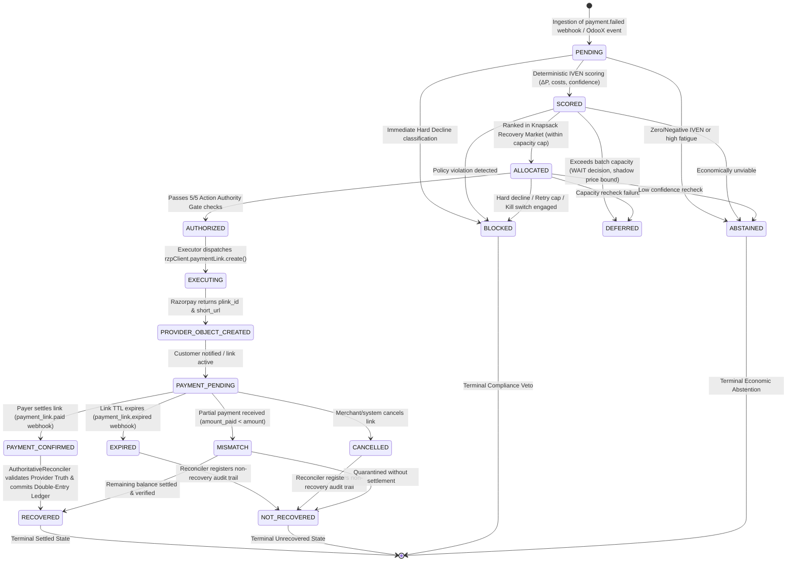
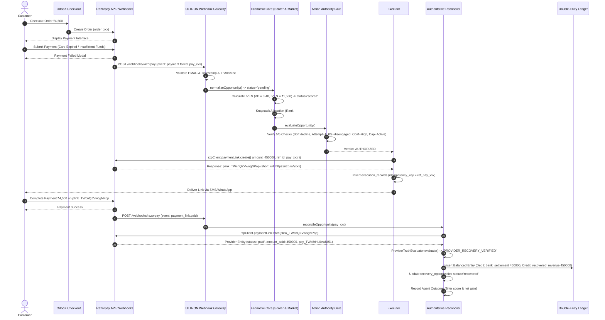
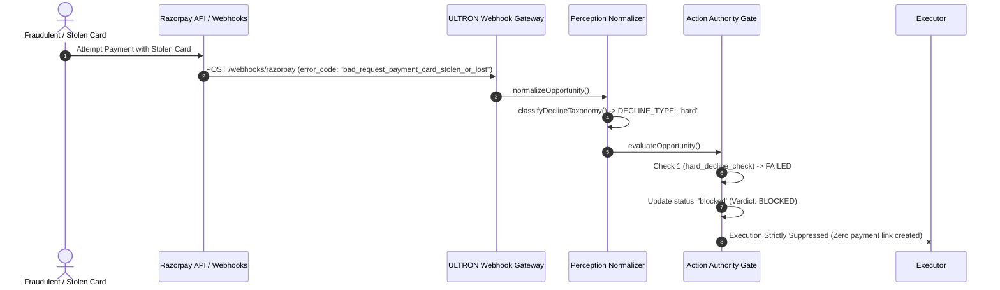
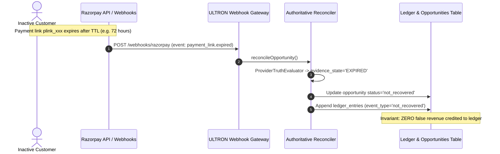
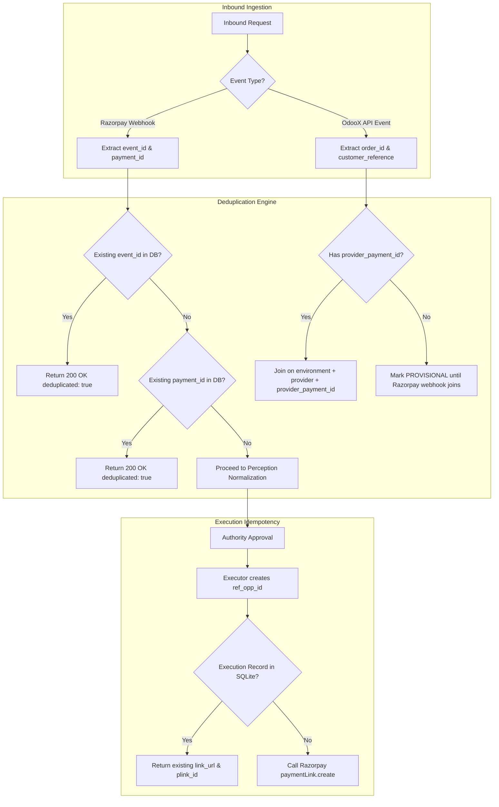

# ULTRON v6 — Phase 2 OdooX↔Razorpay Payment Lifecycle Mapping

**Document Version:** `1.0.0`  
**Governing Specification:** [`ULTRON_V6_MASTER_IMPLEMENTATION_PROMPT.md`](file:///d:/Work%20Space/Project/Ultron/ULTRON_V6_MASTER_IMPLEMENTATION_PROMPT.md)  
**Execution Phase:** Phase 2 (Precise Payment Lifecycle & Event Mapping)  
**Timestamp:** `2026-09-01T12:50:00.000Z`  
**Status:** **PHASE 2 COMPLETE — WAITING FOR REVIEW**

---

## 1. Executive Summary & Lifecycle Philosophy

Phase 2 establishes the end-to-end payment, recovery, and reconciliation lifecycle across the merchant host platform (**OdooX**), the payment provider (**Razorpay**), and the **ULTRON v6** autonomous recovery control plane.

### Core Architectural Invariants:
1. **Decoupled Asynchronous Observation**: OdooX processes orders and payments natively through Razorpay. ULTRON observes failures asynchronously. If ULTRON is offline, ordinary OdooX payments are 100% unaffected.
2. **Deterministic State Hierarchy**: 
   $$\text{PROVIDER TRUTH} \succ \text{AUTHORITATIVE RECONCILIATION} \succ \text{LOCAL FINANCIAL STATE}$$
   Local database records, agent proposals, link creations, or merchant dashboard clicks never constitute settlement truth. Only provider-verified settlement evidence (`status = 'paid'` and `amount_paid > 0`) can transition an opportunity to `RECOVERED`.
3. **Strict Invariant: $\text{LINK\_CREATED} \neq \text{RECOVERED}$**: Creating a payment link only moves state to `PROVIDER_OBJECT_CREATED` / `PAYMENT_PENDING`. Financial revenue recognition and double-entry ledger settlement occur strictly upon verified payer settlement.

---

## 2. Complete End-to-End State Transition Diagram



---

## 3. Comprehensive State Transition Specifications

| State Name | Classification | Ingress Triggers | Egress Triggers & Transitions | Financial & Ledger Effects | Code Reference |
|:---|:---|:---|:---|:---|:---|
| **`PENDING`** | Transient | Inbound `payment.failed` webhook or OdooX `payment.failed` event | $\rightarrow$ `SCORED` (Scorer)<br>$\rightarrow$ `BLOCKED` (Hard decline) | Zero financial impact; `webhook_received` audit entry created | [`src/types/index.ts:6`](file:///d:/Work%20Space/Project/Ultron/src/types/index.ts#L6), [`src/webhooks/razorpay.ts:226`](file:///d:/Work%20Space/Project/Ultron/src/webhooks/razorpay.ts#L226) |
| **`SCORED`** | Transient | Deterministic IVEN calculation completes | $\rightarrow$ `ALLOCATED` (Top-K rank)<br>$\rightarrow$ `DEFERRED` (Capacity bound)<br>$\rightarrow$ `ABSTAINED` ($\text{IVEN} \le 0$) | Records $\Delta P, C_{\text{op}}, C_{\text{fatigue}}, \text{IVEN}$ in `scores` table | [`src/economics/scorer.ts:1-120`](file:///d:/Work%20Space/Project/Ultron/src/economics/scorer.ts#L1-L120), [`src/db/migrations/001_core_schema.ts:53-65`](file:///d:/Work%20Space/Project/Ultron/src/db/migrations/001_core_schema.ts#L53-L65) |
| **`ALLOCATED`** | Transient | Selected by Knapsack Portfolio Allocator | $\rightarrow$ `AUTHORIZED` (Passes Gate)<br>$\rightarrow$ `BLOCKED` (Fails Gate) | Shadow price recorded in `allocation_decisions` table | [`src/market/allocator.ts:1-95`](file:///d:/Work%20Space/Project/Ultron/src/market/allocator.ts#L1-L95), [`src/db/migrations/001_core_schema.ts:68-77`](file:///d:/Work%20Space/Project/Ultron/src/db/migrations/001_core_schema.ts#L68-L77) |
| **`AUTHORIZED`** | Pre-Execution Gate | Passes 5/5 Deterministic Authority checks | $\rightarrow$ `EXECUTING` (Executor dispatch)<br>$\rightarrow$ `BLOCKED` (Kill switch) | Execution authorized; zero external write until Executor executes | [`src/authority/gate.ts:40-180`](file:///d:/Work%20Space/Project/Ultron/src/authority/gate.ts#L40-L180), [`src/execution/executor.ts:49-75`](file:///d:/Work%20Space/Project/Ultron/src/execution/executor.ts#L49-L75) |
| **`DEFERRED`** | Queue / Wait | Exceeds batch capacity or market rank limit | $\rightarrow$ `SCORED` (Next batch cycle)<br>$\rightarrow$ `RECOVERED` (Organic settlement) | Re-queued for next evaluation interval; customer uncontacted | [`src/authority/gate.ts:165-168`](file:///d:/Work%20Space/Project/Ultron/src/authority/gate.ts#L165-L168) |
| **`BLOCKED`** | Terminal / Veto | Hard decline, retry cap $\ge 3$, or Kill switch active | Terminal veto; no automatic retry | Logged in `authority_checks`; customer protected from spam/fraud | [`src/authority/gate.ts:148-160`](file:///d:/Work%20Space/Project/Ultron/src/authority/gate.ts#L148-L160) |
| **`ABSTAINED`** | Terminal / Economical | Low confidence or non-positive IVEN | Terminal abstention | Zero intervention cost spent; contact budget preserved | [`src/authority/gate.ts:161-164`](file:///d:/Work%20Space/Project/Ultron/src/authority/gate.ts#L161-L164) |
| **`EXECUTING`** | In-Flight | Executor dispatches Razorpay SDK write API | $\rightarrow$ `PROVIDER_OBJECT_CREATED`<br>$\rightarrow$ `FAILED` (API error) | Idempotency lock acquired (`ref_${opportunity_id}`) | [`src/execution/executor.ts:80-141`](file:///d:/Work%20Space/Project/Ultron/src/execution/executor.ts#L80-L141) |
| **`PROVIDER_OBJECT_CREATED`** | Active Inactive | Razorpay confirms link creation (`plink_xxx`) | $\rightarrow$ `PAYMENT_PENDING`<br>$\rightarrow$ `EXPIRED` | `execution_records` row created; **Invariant: LINK_CREATED $\neq$ RECOVERED** | [`src/truth/canonical_state_machine.ts:88-97`](file:///d:/Work%20Space/Project/Ultron/src/truth/canonical_state_machine.ts#L88-L97), [`src/truth/provider_truth.ts:78-94`](file:///d:/Work%20Space/Project/Ultron/src/truth/provider_truth.ts#L78-L94) |
| **`PAYMENT_PENDING`** | Awaiting Payer | Link delivered to customer via channel | $\rightarrow$ `PAYMENT_CONFIRMED`<br>$\rightarrow$ `EXPIRED` / `CANCELLED` | Customer outreach draft generated; awaiting settlement | [`src/truth/canonical_state_machine.ts:23`](file:///d:/Work%20Space/Project/Ultron/src/truth/canonical_state_machine.ts#L23) |
| **`PAYMENT_CONFIRMED`** | Verification Stage | Inbound `payment_link.paid` received | $\rightarrow$ `RECOVERED` (Reconciliation) | Triggers atomic settlement transaction | [`src/truth/canonical_state_machine.ts:79-86`](file:///d:/Work%20Space/Project/Ultron/src/truth/canonical_state_machine.ts#L79-L86), [`src/reconciliation/authoritative_reconciler.ts:130-134`](file:///d:/Work%20Space/Project/Ultron/src/reconciliation/authoritative_reconciler.ts#L130-L134) |
| **`RECOVERED`** | Terminal / Settled | Provider truth confirmed via Razorpay API | Terminal settled state | Double-entry ledger appended: `Debit: bank_settlement`, `Credit: recovered_revenue` ($\Sigma\text{Debit} = \Sigma\text{Credit}$) | [`src/reconciliation/authoritative_reconciler.ts:172-206`](file:///d:/Work%20Space/Project/Ultron/src/reconciliation/authoritative_reconciler.ts#L172-L206), [`src/truth/double_entry_ledger.ts:1-75`](file:///d:/Work%20Space/Project/Ultron/src/truth/double_entry_ledger.ts#L1-L75) |
| **`NOT_RECOVERED`** | Terminal / Expired | Link expired or cancelled without settlement | Terminal unrecovered state | Logged in `ledger_entries` as `not_recovered` | [`src/webhooks/razorpay.ts:148-163`](file:///d:/Work%20Space/Project/Ultron/src/webhooks/razorpay.ts#L148-L163) |
| **`MISMATCH`** | Quarantined | Amount paid is less than required total amount | $\rightarrow$ `RECOVERED` (If settled)<br>$\rightarrow$ `NOT_RECOVERED` | Quarantined in `reconciliation_divergences`; zero false revenue recognized | [`src/truth/canonical_state_machine.ts:69-78`](file:///d:/Work%20Space/Project/Ultron/src/truth/canonical_state_machine.ts#L69-L78), [`src/reconciliation/authoritative_reconciler.ts:308-320`](file:///d:/Work%20Space/Project/Ultron/src/reconciliation/authoritative_reconciler.ts#L308-L320) |
| **`UNKNOWN`** | Quarantined | Ambiguous provider status or network timeout | $\rightarrow$ Re-evaluated by Poller sweep | Quarantined without guessing; status preserved | [`src/truth/canonical_state_machine.ts:130-137`](file:///d:/Work%20Space/Project/Ultron/src/truth/canonical_state_machine.ts#L130-L137), [`src/reconciliation/authoritative_reconciler.ts:63-80`](file:///d:/Work%20Space/Project/Ultron/src/reconciliation/authoritative_reconciler.ts#L63-L80) |

---

## 4. Sequence Flows by Scenario

### Scenario 1: Native Payment Failure $\rightarrow$ Autonomous Recovery $\rightarrow$ Settlement



---

### Scenario 2: Hard Decline (Stolen / Fraud Code) $\rightarrow$ Deterministic Veto



---

### Scenario 3: Payment Link Expiration without Settlement



---

### Scenario 4: Partial Payment / Amount Mismatch Quarantine

```mermaid
sequenceDiagram
    autonumber
    actor Customer as Customer
    participant Razorpay as Razorpay API / Webhooks
    participant ULTRON_Gate as ULTRON Webhook Gateway
    participant ULTRON_Recon as Authoritative Reconciler
    participant Divergence as Reconciliation Divergences

    Customer->>Razorpay: Pays partial amount ₹1,000 on ₹4,500 link
    Razorpay->>ULTRON_Gate: Webhook / Poller reports amount_paid = 100000, amount = 450000
    ULTRON_Gate->>ULTRON_Recon: AuthoritativeReconciler.reconcileOpportunity()
    ULTRON_Recon->>ULTRON_Recon: CanonicalStateMachine.mapRazorpayStatusToCanonicalState()
    Note over ULTRON_Recon: Condition: amountPaid < amount -> Result: MISMATCH
    ULTRON_Recon->>Divergence: Insert divergence record (AMOUNT_OR_STATE_MISMATCH)
    Note over ULTRON_Recon: Quarantined: Status remains executing/MISMATCH; NO false recovered_revenue booked
```

---

## 5. Correlation & Deduplication Scheme



### Correlation Rules:
1. **Webhook Deduplication**: Primary deduplication key is `event_id`. Fallback deduplication key is `payment_id` (`src/webhooks/razorpay.ts:73-83`).
2. **Execution Idempotency**: Strict unique key `idempotency_key = ref_${opportunity_id}` in `execution_records` (`src/execution/executor.ts:78-89`).
3. **Cross-Stream Join Key (OdooX + Razorpay)**: `(environment, provider, provider_payment_id)`. If OdooX emits an event before Razorpay generates `payment_id`, the event is held in `PROVISIONAL` status to prevent erroneous cart joins.

---

## 6. Phase 2 Verification Checklist

- [x] Reconstructed the complete payment lifecycle graph from actual source code.
- [x] Every state (`PENDING`, `SCORED`, `ALLOCATED`, `AUTHORIZED`, `DEFERRED`, `BLOCKED`, `ABSTAINED`, `EXECUTING`, `PROVIDER_OBJECT_CREATED`, `PAYMENT_PENDING`, `PAYMENT_CONFIRMED`, `RECOVERED`, `NOT_RECOVERED`, `EXPIRED`, `CANCELLED`, `MISMATCH`, `UNKNOWN`) rigorously defined.
- [x] Sequence diagrams generated for standard recovery, hard decline veto, link expiration, and partial payment mismatch.
- [x] Invariant $\text{LINK\_CREATED} \neq \text{RECOVERED}$ formally mapped to code assertions.
- [x] Inbound deduplication and execution idempotency keys traced to exact database columns.
- [x] No fictitious event types or unverified state transitions introduced.

---

**Phase 2 Execution Gate:** **PASSED**  
*Ready for review before proceeding to Phase 3 (Canonical Event Contract & D8/D9 Resolution).*
