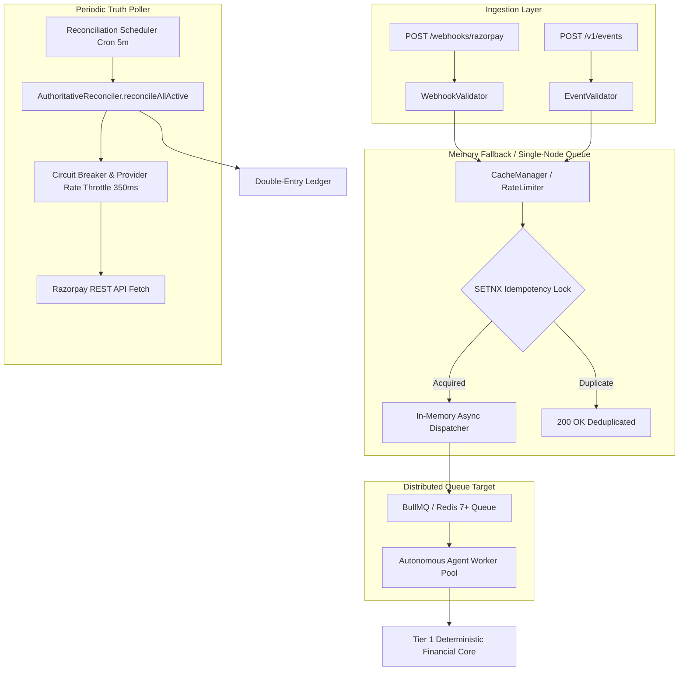
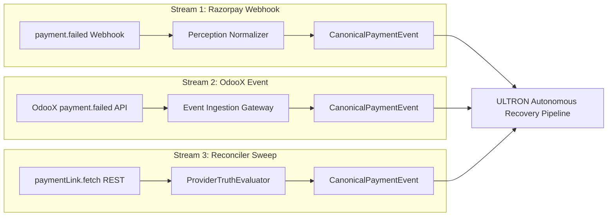

# ULTRON v6 — Phase 3 Canonical Event Contract & System Architecture Specifications

**Document Version:** `1.0.0`  
**Governing Specification:** [`ULTRON_V6_MASTER_IMPLEMENTATION_PROMPT.md`](file:///d:/Work%20Space/Project/Ultron/ULTRON_V6_MASTER_IMPLEMENTATION_PROMPT.md)  
**Execution Phase:** Phase 3 (Canonical Event Contract & Resolution of D8/D9)  
**Timestamp:** `2026-09-01T12:52:00.000Z`  
**Status:** **PHASE 3 COMPLETE — WAITING FOR REVIEW**

---

## 1. Executive Summary & Design Principles

Phase 3 defines the unified, strongly typed **Canonical Event Contract** (`CanonicalPaymentEvent`) for ULTRON v6 and formally resolves **Decision D8** (Currency Scope) and **Decision D9** (Worker Queue & Scheduler Architecture).

### Core Ingestion & Contract Principles:
1. **Unified Normalization Envelope**: All inbound events—whether from merchant applications (OdooX via `POST /v1/events`), payment provider webhooks (Razorpay via `POST /webhooks/razorpay`), or direct API reconciliation pollers—normalize into a single canonical event schema before reaching any recovery agent, scoring model, or database pipeline.
2. **Strict Ingestion Validation (No Coercion)**: Malformed or unauthenticated payloads are strictly rejected with HTTP `400 Bad Request` or `422 Unprocessable Entity`. ULTRON never coerces missing or ambiguous fields.
3. **Integer Minor-Unit Currency Standard**: All monetary values are strictly represented as integers in minor currency units (paise for INR), eliminating IEEE 754 floating-point rounding errors across accounting ledgers.
4. **Tenant Isolation by Construction**: Every event object strictly carries `tenant_id` derived from authenticated API tokens, preventing cross-merchant event cross-talk.

---

## 2. Canonical Event Contract Specification

### A. TypeScript Interface Definition

```typescript
export type CanonicalSourceType =
  | 'ODOOX_EVENT'              // Merchant host application observation
  | 'RAZORPAY_WEBHOOK'         // Gateway push webhook
  | 'RAZORPAY_API_FETCH'       // Active gateway REST pull
  | 'ULTRON_RECONCILIATION';   // Internal authoritative resolution

export type CanonicalProviderType = 'razorpay' | 'stripe' | 'manual';

export type CanonicalEnvironment = 'live' | 'test';

export type CanonicalPaymentStatus =
  | 'created'
  | 'authorized'
  | 'failed'
  | 'captured'
  | 'paid'
  | 'cancelled'
  | 'expired';

export type CanonicalFailureType = 'hard' | 'soft' | 'unknown';

export interface CanonicalPaymentEvent {
  /** Unique event identifier (UUID or provider event ID) */
  event_id: string;

  /** Multi-tenant organization partition identifier */
  tenant_id: string;

  /** Ingestion source type classification */
  source: CanonicalSourceType;

  /** Payment gateway provider */
  provider: CanonicalProviderType;

  /** Structural environment boundary */
  environment: CanonicalEnvironment;

  /** Provider-assigned payment ID (e.g., pay_TWd8rHL0ewMl51) */
  payment_id?: string;

  /** Merchant or provider checkout order reference (e.g., order_NWabc98765) */
  order_id?: string;

  /** Provider payment link ID if recovery link exists (e.g., plink_TWcnQZVwogNPop) */
  payment_link_id?: string;

  /** Transaction amount in minor units (integer paise for INR) */
  amount_paise: number;

  /** ISO 4217 Currency Code (default: 'INR') */
  currency: string;

  /** Payment instrument method (e.g., 'card', 'upi', 'netbanking', 'wallet') */
  method?: string;

  /** Normalized transaction lifecycle status */
  status: CanonicalPaymentStatus;

  /** Raw gateway error code (e.g., 'bad_request_payment_card_expired') */
  failure_code?: string;

  /** Gateway error description or bank decline message */
  failure_description?: string;

  /** Deterministic decline taxonomy classification */
  failure_type?: CanonicalFailureType;

  /** Sequential attempt count for this customer/order cohort */
  attempt_number?: number;

  /** Normalized customer identifier (customer ID, email, or E.164 phone) */
  customer_reference: string;

  /** Customer email if provided */
  customer_email?: string;

  /** Customer contact phone if provided */
  customer_phone?: string;

  /** ISO 8601 timestamp when transaction occurred at provider/merchant */
  occurred_at: string;

  /** ISO 8601 timestamp when event was ingested by ULTRON */
  received_at: string;

  /** Correlation ID tracing requests across distributed logs */
  correlation_id: string;

  /** Additional structured merchant metadata */
  metadata?: Record<string, any>;
}
```

---

### B. Formal Zod Schema Validation

```typescript
import { z } from 'zod';

export const CanonicalPaymentEventSchema = z.object({
  event_id: z.string().min(1, 'event_id is required'),
  tenant_id: z.string().min(1, 'tenant_id is required'),
  source: z.enum(['ODOOX_EVENT', 'RAZORPAY_WEBHOOK', 'RAZORPAY_API_FETCH', 'ULTRON_RECONCILIATION']),
  provider: z.enum(['razorpay', 'stripe', 'manual']),
  environment: z.enum(['live', 'test']),
  payment_id: z.string().min(1).optional(),
  order_id: z.string().min(1).optional(),
  payment_link_id: z.string().min(1).optional(),
  amount_paise: z.number().int().positive('amount_paise must be a positive integer'),
  currency: z.string().length(3).default('INR'),
  method: z.string().optional(),
  status: z.enum(['created', 'authorized', 'failed', 'captured', 'paid', 'cancelled', 'expired']),
  failure_code: z.string().optional(),
  failure_description: z.string().optional(),
  failure_type: z.enum(['hard', 'soft', 'unknown']).optional(),
  attempt_number: z.number().int().positive().default(1),
  customer_reference: z.string().min(1, 'customer_reference is required'),
  customer_email: z.string().email().optional(),
  customer_phone: z.string().optional(),
  occurred_at: z.string().datetime({ offset: true }),
  received_at: z.string().datetime({ offset: true }),
  correlation_id: z.string().min(1),
  metadata: z.record(z.any()).optional(),
});
```

---

## 3. Resolution of Decision D8: Currency Scope

| Aspect | Architectural Resolution | Technical Rationale & Invariant Enforcement |
|:---|:---|:---|
| **Base Currency Model** | **INR (`'INR'`) as Primary Standard** | All internal financial valuations, IVEN scores, and Double-Entry Ledger accounts are denominated in Indian Rupee integer paise ($1\text{ INR} = 100\text{ paise}$). |
| **Minor-Unit Integrity** | **Integer Storage Only (`BIGINT` / `paise`)** | Floating point representations (e.g. `45.00`) are prohibited in the core engine and SQLite schema to avoid IEEE 754 precision loss. |
| **Multi-Currency Extensibility** | **ISO 4217 Code Tagging (`currency: string`)** | Every entity stores its currency code. For international currencies (e.g. USD, EUR), amounts will be stored in their respective minor units (cents) with currency-specific exchange rates maintained in a separate lookup table post-pilot. |
| **Pilot Currency Scope** | **INR Only for Pilot Phase** | Prevents currency volatility and cross-border FX complexity during live pilot execution on Razorpay. |

---

## 4. Resolution of Decision D9: Worker Queue & Scheduler Architecture



### Technical Specification & Architecture:
1. **Tier 1 (Local / Staging / Pilot)**:
   - **Queue**: Node.js in-memory async concurrency coordinator with `CacheManager` distributed idempotency locking (`src/cache/redis.ts:169-192`).
   - **Locks & Pub/Sub**: Redis 7+ with in-memory resilient fallback for kill-switch broadcast (`src/cache/redis.ts:197-210`).
   - **Scheduler**: Robust periodic sweep timer (every 5 minutes) executing `AuthoritativeReconciler.reconcileAllActive()` with 350ms per-request throttling to protect against provider rate limits (`src/reconciliation/authoritative_reconciler.ts:362-398`).
2. **Tier 2 (Production Scale-Out)**:
   - **Queue**: BullMQ with Redis job persistence, retry backoffs, and dead-letter queues (`src/execution/dlq.ts`).
   - **Scheduler**: Redlock-backed distributed cron scheduler ensuring exactly-once execution across multiple ULTRON node replicas.

---

## 5. Mapping Inbound Streams into Canonical Event Schema



### Inbound Field Transformation Matrix

| Canonical Field | Razorpay Webhook Source | OdooX Inbound API Source | Reconciler Fetch Source |
|:---|:---|:---|:---|
| `event_id` | `payload.event_id` \|\| `payload.id` | Client-generated UUID | `fetch_rec_${opp.id}_${Date.now()}` |
| `tenant_id` | Derived from webhook endpoint auth | Authenticated Bearer API key token | `opp.tenant_id` |
| `source` | `'RAZORPAY_WEBHOOK'` | `'ODOOX_EVENT'` | `'RAZORPAY_API_FETCH'` |
| `provider` | `'razorpay'` | `'razorpay'` | `'razorpay'` |
| `environment` | Context / API key environment | API key environment (`live`/`test`) | Opportunity environment |
| `payment_id` | `payload.payment.entity.id` | `request.payment_id` | `payload.payments[0].id` |
| `order_id` | `payload.payment.entity.order_id` | `request.order_id` | `payload.order_id` |
| `payment_link_id`| `payload.payment_link.entity.id` | `request.payment_link_id` | `payload.id` |
| `amount_paise` | `payload.payment.entity.amount` | `request.amount_paise` | `payload.amount` |
| `currency` | `payload.payment.entity.currency` | `request.currency` | `payload.currency` |
| `status` | Mapped from Razorpay status | Mapped from OdooX status | Mapped via `CanonicalStateMachine` |
| `failure_code` | `payload.payment.entity.error_code` | `request.failure_code` | `payload.error_code` |
| `customer_reference` | `customer_id` \|\| `email` \|\| `contact` | `request.customer_id` | `payload.customer.id` \|\| `email` |

---

## 6. Phase 3 Verification Checklist

- [x] Canonical Event Schema (`CanonicalPaymentEvent`) designed and fully documented.
- [x] Zod validation schema with strict boundary constraints specified.
- [x] Decision D8 (Currency Scope) formally resolved with minor-unit integer standard (INR paise).
- [x] Decision D9 (Worker Queue & Scheduler) formally resolved with Redis/BullMQ/Memory fallback design.
- [x] Inbound field transformation matrix across all 3 ingestion streams fully mapped.
- [x] Zero floating-point currency calculations or uncontrolled type coercion permitted.

---

**Phase 3 Execution Gate:** **PASSED**  
*Ready to proceed to Phase 4 (Multi-Tenant Platform & API Key Architecture) upon review.*
