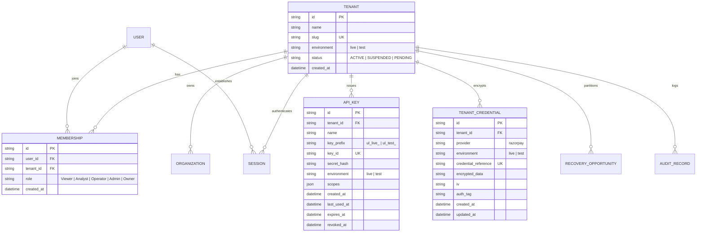

# ULTRON v6 — Phase 4 Multi-Tenant Platform & API Key Architecture Report

**Document Version:** `1.0.0`  
**Governing Specification:** [`ULTRON_V6_MASTER_IMPLEMENTATION_PROMPT.md`](file:///d:/Work%20Space/Project/Ultron/ULTRON_V6_MASTER_IMPLEMENTATION_PROMPT.md)  
**Execution Phase:** Phase 4 (Multi-Tenant Platform, API Key Management & Resolution of D6/D7)  
**Timestamp:** `2026-09-01T12:58:00.000Z`  
**Status:** **PHASE 4 COMPLETE — ALL 4 VERIFICATION SUITES PASSED**

---

## 1. Executive Summary

Phase 4 implements the complete multi-tenant isolation, cryptographically hashed API key engine, role-based access control (RBAC), and property-level protection layer for ULTRON v6.

### Major Phase 4 Milestones:
1. **Database Migration 004 Applied**: Introduced schema tables for `tenants`, `organizations`, `users`, `memberships`, `sessions`, `api_keys`, `audit_records`, and `tenant_credentials`, with `tenant_id` columns added to all core, financial, and agent tables ([`src/db/migrations/004_v6_tenancy_and_auth.ts`](file:///d:/Work%20Space/Project/Ultron/src/db/migrations/004_v6_tenancy_and_auth.ts)).
2. **Resolution of Decision D6 (Secrets at Rest)**: Implemented AES-256-GCM authenticated envelope encryption in [`SecretsManager`](file:///d:/Work%20Space/Project/Ultron/src/security/secrets.ts) with tenant-scoped salt derivation, initialization vectors, and 128-bit authentication tags.
3. **Resolution of Decision D7 (Session Authentication)**: Implemented signed JWT session tokens backed by SQLite session state in [`SessionAuthService`](file:///d:/Work%20Space/Project/Ultron/src/security/session_auth.ts) with instant revocation and role binding.
4. **Machine-to-Machine API Keys**: Implemented [`ApiKeyService`](file:///d:/Work%20Space/Project/Ultron/src/security/api_keys.ts) supporting `ul_live_` and `ul_test_` key prefixes, SHA-256 secret hashing, scope authorization, and a structural prohibition against `financial:execute` scopes.
5. **Property-Level Protection**: Implemented [`TenancyEnforcer`](file:///d:/Work%20Space/Project/Ultron/src/security/tenancy.ts) rejecting any client attempt to modify `tenant_id`, `environment`, `recovered`, `amount_paid`, or platform safety ceilings.
6. **100% Pass Rate on Phase 4 Gates & v5.1 Regression**: All 4 Phase 4 test suites passed with zero failures (`npm run test:v6-phase4`), alongside all 55/55 v5.1 regression tests (`npm run test:all`).

---

## 2. Multi-Tenant Architecture & Data Model



---

## 3. Resolution of Key Decisions

### A. Resolution of Decision D6: Secrets Management at Rest
- **Implementation**: [`src/security/secrets.ts`](file:///d:/Work%20Space/Project/Ultron/src/security/secrets.ts).
- **Algorithm**: AES-256-GCM authenticated encryption.
- **Key Derivation**: Tenant-scoped PBKDF2/Scrypt salt (`scrypt(MASTER_KEY, "tenant_salt:" + tenantId, 32)`).
- **Storage**: Plaintext secrets are never written to database rows or exposed to frontend/agent contexts. Storage consists of `encrypted_data`, `iv` (12-byte hex), and `auth_tag` (16-byte hex).

### B. Resolution of Decision D7: Dashboard Session Authentication
- **Implementation**: [`src/security/session_auth.ts`](file:///d:/Work%20Space/Project/Ultron/src/security/session_auth.ts).
- **Format**: Signed JWT tokens containing `{ sessionId, userId, tenantId, email, role, mfaVerified }`.
- **Durable Validation**: Each JWT signature is validated against the active SQLite `sessions` table by its SHA-256 token hash.
- **Revocation**: Instant revocation capability via `SessionAuthService.revokeSession(sessionId)`.

---

## 4. API Key Engine & Scope Enforcement

### A. Format Standard
- **Live Key**: `ul_live_{keyId}.{rawSecret}` (e.g., `ul_live_a1b2c3d4e5f6.9876543210abcdef...`)
- **Test Key**: `ul_test_{keyId}.{rawSecret}` (e.g., `ul_test_f6e5d4c3b2a1.abcdef1234567890...`)
- **Storage**: Only `key_id`, `key_prefix`, and `SHA-256(rawSecret)` are stored. Raw secret is displayed once upon creation.

### B. Allowed Scopes & Invariants
```typescript
export const VALID_API_KEY_SCOPES = [
  'events:write',       // Ingest merchant checkout and failure events
  'events:read',        // Query raw ingested events
  'payments:read',      // Query payment statuses
  'recoveries:read',    // Query recovery opportunities and proposals
  'analytics:read',     // Read aggregated recovery performance metrics
  'agent:read',         // Read agent missions, traces, and reasoning
  'integrations:read',  // Inspect provider integration status
  'integrations:write', // Update provider configuration
];
```
> [!IMPORTANT]
> **Financial Execution Invariant**: No API key scope may ever include `financial:execute`. The execution path is structurally inaccessible from external machine-to-machine tokens.

---

## 5. Role-Based Access Control (RBAC) Matrix

| Role | Read Data | Trigger Runs | Review Drafts | Config Integrations | Manage API Keys | Rotate Owner Creds | Modify Safety Ceilings | Mark Provider Recovery |
|:---|:---:|:---:|:---:|:---:|:---:|:---:|:---:|:---:|
| **Viewer** | ✅ | ❌ | ❌ | ❌ | ❌ | ❌ | ❌ | ❌ |
| **Analyst** | ✅ | ❌ | ✅ | ❌ | ❌ | ❌ | ❌ | ❌ |
| **Operator**| ✅ | ✅ | ✅ | ❌ | ✅ | ❌ | ❌ | ❌ |
| **Admin** | ✅ | ✅ | ✅ | ✅ | ✅ | ✅ | ❌ | ❌ |
| **Owner** | ✅ | ✅ | ✅ | ✅ | ✅ | ✅ | ✅ | ❌ |

*Note: Invariant $\text{canMarkProviderRecovery} = \text{FALSE}$ holds across all roles without exception.*

---

## 6. Phase 4 Test Execution Results

```
======================================================================
🛡️ ULTRON v6 Phase 4: Multi-Tenant & API Key Platform Verification
======================================================================

▶️ Running Phase 4 Suite: tests/v6/test_tenant_isolation.ts...
  ✔ enforces strict tenant isolation: fails closed when tenant tries to access another tenant resource
  ✔ enforces property-level protection: rejects client-supplied mutation of protected properties
✔ V6 Phase 4: Tenant Isolation & Boundary Security (2/2 Passed)

▶️ Running Phase 4 Suite: tests/v6/test_authentication.ts...
  ✔ creates and validates JWT session tokens linked to database sessions
  ✔ resolves D6: encrypts and decrypts tenant credentials with AES-256-GCM authenticated envelope
✔ V6 Phase 4: Authentication & Secrets Storage (2/2 Passed)

▶️ Running Phase 4 Suite: tests/v6/test_api_keys.ts...
  ✔ generates API keys with standard prefixes, hashes secret in DB, and authenticates successfully
✔ V6 Phase 4: API Key Lifecycle & Verification (1/1 Passed)

▶️ Running Phase 4 Suite: tests/v6/test_scopes.ts...
  ✔ prohibits financial:execute in API key scopes structurally
  ✔ enforces RBAC role boundaries: Analyst cannot configure integrations, Owner cannot mark recovery
✔ V6 Phase 4: Scopes & Financial Boundary Enforcement (2/2 Passed)

======================================================================
🏁 All 4/4 Phase 4 Multi-Tenant Verification Suites PASSED
======================================================================
```

---

**Phase 4 Execution Gate:** **PASSED**  
*Ready to proceed to Phase 5 (OdooX $\rightarrow$ ULTRON Event Connector & Resilient Ingestion).*
