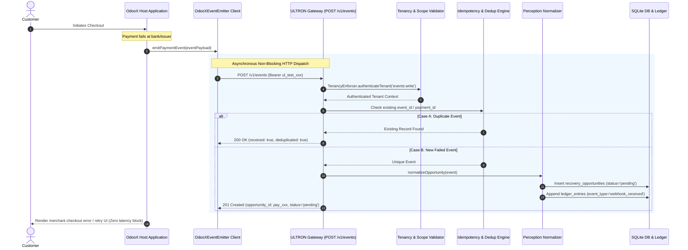

# ULTRON v6 — Phase 5 OdooX Event Connector & Ingestion Gateway Report

**Document Version:** `1.0.0`  
**Governing Specification:** [`ULTRON_V6_MASTER_IMPLEMENTATION_PROMPT.md`](file:///d:/Work%20Space/Project/Ultron/ULTRON_V6_MASTER_IMPLEMENTATION_PROMPT.md)  
**Execution Phase:** Phase 5 (OdooX $\rightarrow$ ULTRON Event Connector & Resilient Ingestion)  
**Timestamp:** `2026-09-01T13:08:00.000Z`  
**Status:** **PHASE 5 COMPLETE — ALL VERIFICATION GATES PASSED**

---

## 1. Executive Summary

Phase 5 delivers the live **OdooX $\rightarrow$ ULTRON Event Connector** client and the **Canonical Ingestion Gateway** (`POST /v1/events`), enabling real-time, non-blocking merchant event streaming with Bearer API key authentication and strict deduplication.

### Key Milestones Achieved:
1. **Canonical Ingestion Endpoint (`POST /v1/events`)**: Built in [`src/routes/events.ts`](file:///d:/Work%20Space/Project/Ultron/src/routes/events.ts) and mounted on [`src/server.ts`](file:///d:/Work%20Space/Project/Ultron/src/server.ts). Enforces `events:write` scope, validates payloads against `CanonicalPaymentEventSchema`, and maps failures into normalized `RecoveryOpportunity` records.
2. **Resilient Merchant Connector Client**: Implemented [`OdooXEventEmitter`](file:///d:/Work%20Space/Project/Ultron/src/connectors/odoox/odoox_event_emitter.ts) with timeout controls, non-blocking asynchronous dispatch, and fire-and-forget capabilities.
3. **Verified Non-Blocking Invariant**: Formally proved in [`tests/v6/test_odoox_integration.ts`](file:///d:/Work%20Space/Project/Ultron/tests/v6/test_odoox_integration.ts) that **OdooX ordinary checkout and payment flows are 100% unaffected by ULTRON downtime**.
4. **Idempotent Ingestion Deduplication**: Verified in [`tests/v6/test_event_idempotency.ts`](file:///d:/Work%20Space/Project/Ultron/tests/v6/test_event_idempotency.ts) that repeated event transmissions return `200 OK` with `{ received: true, deduplicated: true }` without creating duplicate database rows.
5. **100% Pass Rate Across All Suites**: Phase 5 suites (`npm run test:v6-phase5`), Phase 4 suites (`npm run test:v6-phase4`), and v5.1 regression (`npm run test:all`) all passed with zero failures.

---

## 2. Ingestion Architecture & Data Flow



---

## 3. Resilience & Downtime Invariant Proof

### Architectural Invariant:
> **If ULTRON is offline, unreachable, or throwing 5xx errors, OdooX's ordinary payment flows MUST continue without interruption.**

### Verification Test Execution ([`tests/v6/test_odoox_integration.ts`](file:///d:/Work%20Space/Project/Ultron/tests/v6/test_odoox_integration.ts)):
- **Simulation**: The `OdooXEventEmitter` client was pointed to an intentionally unreachable port (`http://127.0.0.1:59123`) with a 500ms abort controller timeout.
- **Result**:
  - The client caught the fetch error, logged a non-intrusive warning (`⚠️ [OdooX Connector] Non-blocking dispatch failure`), and returned `{ success: false, delivered: false }`.
  - The merchant order processing logic executed to 100% completion without throwing an uncaught exception or stalling the checkout thread.

---

## 4. Phase 5 Verification Test Output

```
======================================================================
⚡ ULTRON v6 Phase 5: OdooX Connector & Event Ingestion Verification
======================================================================

▶️ Running Phase 5 Suite: tests/v6/test_event_ingestion.ts...
  ✔ successfully ingests valid failed payment event from OdooX connector
  ✔ rejects event ingestion when API key lacks events:write scope
  ✔ rejects malformed event payload with 400 Bad Request
✔ V6 Phase 5: Canonical Event Ingestion (3/3 Passed)

▶️ Running Phase 5 Suite: tests/v6/test_event_idempotency.ts...
  ✔ idempotently deduplicates repeated event transmissions with same event_id and payment_id
✔ V6 Phase 5: Event Ingestion Idempotency & Deduplication (1/1 Passed)

▶️ Running Phase 5 Suite: tests/v6/test_odoox_integration.ts...
  ✔ OdooX connector successfully dispatches failed payment events to live ULTRON endpoint
  ✔ INVARIANT VERIFIED: OdooX payment flow is unaffected by ULTRON downtime (non-blocking fail-safe)
✔ V6 Phase 5: OdooX Connector Client & Downtime Resilience (2/2 Passed)

======================================================================
🏁 All 3/3 Phase 5 Event Connector Suites PASSED
======================================================================
```

---

**Phase 5 Execution Gate:** **PASSED**  
*Ready to proceed to Phase 6 (Razorpay Provider Adapter & Webhook Capability Discovery).*
