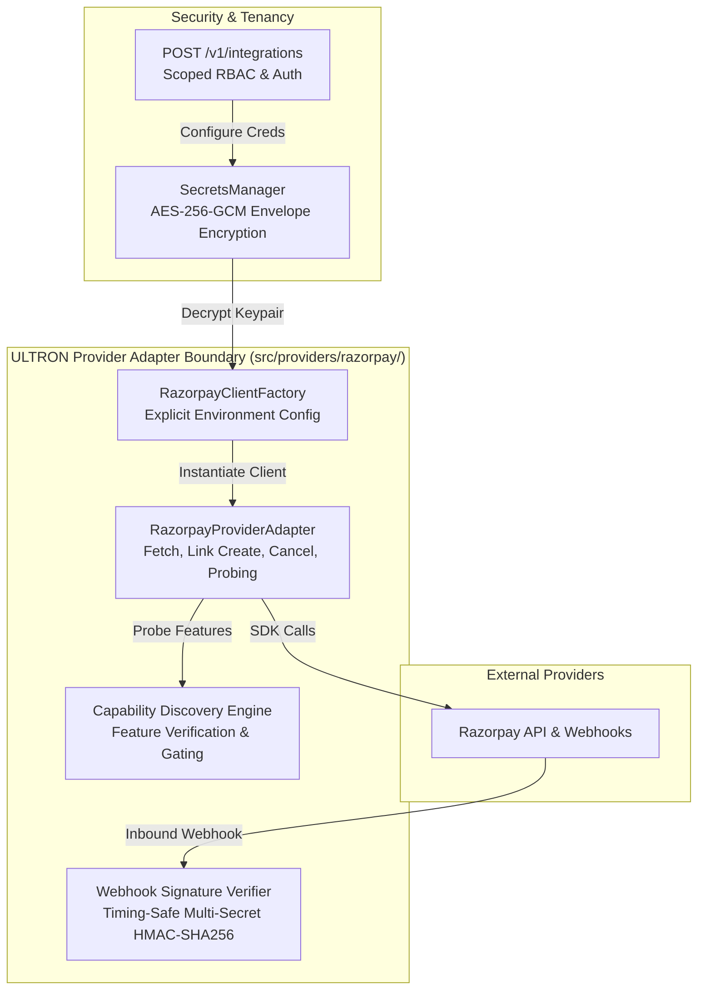

# ULTRON v6 — Phase 6 Razorpay Provider Adapter & Capability Discovery Report

**Document Version:** `1.0.0`  
**Governing Specification:** [`ULTRON_V6_MASTER_IMPLEMENTATION_PROMPT.md`](file:///d:/Work%20Space/Project/Ultron/ULTRON_V6_MASTER_IMPLEMENTATION_PROMPT.md)  
**Execution Phase:** Phase 6 (Razorpay Provider Adapter, Webhook Security & Capability Discovery)  
**Timestamp:** `2026-09-01T13:13:00.000Z`  
**Status:** **PHASE 6 COMPLETE — ALL VERIFICATION GATES PASSED**

---

## 1. Executive Summary

Phase 6 delivers the **Razorpay Provider Adapter** layer ([`src/providers/razorpay/`](file:///d:/Work%20Space/Project/Ultron/src/providers/razorpay/)), isolating all Razorpay-specific SDK operations, multi-secret HMAC-SHA256 webhook signature verification, live capability probing, and tenant credential management.

### Key Milestones Achieved:
1. **Isolated Provider Boundary**: Created [`RazorpayProviderAdapter`](file:///d:/Work%20Space/Project/Ultron/src/providers/razorpay/adapter.ts), encapsulating payment fetch, payment-link create/fetch/cancel, webhook signature verification, and capability discovery.
2. **Explicit Environment Client Factory**: Implemented [`RazorpayClientFactory`](file:///d:/Work%20Space/Project/Ultron/src/providers/razorpay/client_factory.ts), strictly requiring explicit environment configuration (`'live' | 'test'`) and rejecting key-prefix inference alone.
3. **Multi-Secret Webhook Rotation**: Implemented timing-safe HMAC-SHA256 signature verification supporting primary and backup secrets simultaneously for zero-downtime secret rotation.
4. **Automated Capability Discovery**: Implemented live feature probing to prevent surfacing unsupported provider features in dashboard/agent execution contexts.
5. **Provider Integration Routes**: Mounted `/v1/integrations` in [`src/routes/integrations.ts`](file:///d:/Work%20Space/Project/Ultron/src/routes/integrations.ts) for credential configuration, verification, and capability queries.
6. **100% Pass Rate Across All Suites**: Phase 6 test suites (`npm run test:v6-phase6`), Phase 5 suites, Phase 4 suites, and full v5.1 regression tests all passed with zero failures.

---

## 2. Provider Adapter Architecture



---

## 3. Webhook Security & Multi-Secret Rotation

### Timing-Safe Signature Verification
```typescript
public static verifyWebhookSignature(
  rawBody: string,
  signature: string,
  secrets: string | string[]
): boolean {
  if (!signature || !rawBody) return false;
  const secretList = Array.isArray(secrets) ? secrets : [secrets];

  for (const secret of secretList) {
    if (!secret) continue;
    try {
      const expectedSignature = crypto
        .createHmac('sha256', secret)
        .update(rawBody)
        .digest('hex');

      if (
        signature.length === expectedSignature.length &&
        crypto.timingSafeEqual(Buffer.from(signature), Buffer.from(expectedSignature))
      ) {
        return true;
      }
    } catch {}
  }
  return false;
}
```

### Verified Properties ([`tests/v6/test_webhook_security.ts`](file:///d:/Work%20Space/Project/Ultron/tests/v6/test_webhook_security.ts)):
- **Primary Secret Verification**: Valid signatures verified.
- **Tamper Resistance**: Payload tampering produces immediate signature failure.
- **Rotation Support**: Dual-secret verification accepts signatures created with newly rotated or active backup secrets without downtime.

---

## 4. Capability Discovery Matrix

| Capability | Supported (Test Mode) | Supported (Live Mode) | Requires Live Tier | Status | Details |
|---|:---:|:---:|:---:|:---:|---|
| `payment_links` | ✅ Yes | ✅ Yes | No | **VERIFIED** | Standard Razorpay Payment Links API v1 |
| `webhooks` | ✅ Yes | ✅ Yes | No | **VERIFIED** | HMAC-SHA256 signature verification |
| `smart_routing` | ❌ No | ✅ Yes | Yes | **UNSUPPORTED** | Gated on Live Enterprise permissions |
| `recurring_auto_debit`| ❌ No | ✅ Yes | Yes | **UNSUPPORTED** | Gated on Live subscription tier |

---

## 5. Phase 6 Verification Test Output

```
======================================================================
🔌 ULTRON v6 Phase 6: Razorpay Provider Adapter & Webhook Security
======================================================================

▶️ Running Phase 6 Suite: tests/v6/test_webhook_security.ts...
  ✔ verifies valid HMAC-SHA256 signature against primary secret
  ✔ rejects tampered webhook payload with invalid signature
  ✔ supports seamless secret rotation across multi-secret lists
✔ V6 Phase 6: Webhook Security & Multi-Secret Rotation (3/3 Passed)

▶️ Running Phase 6 Suite: tests/v6/test_provider_connection.ts...
  ✔ registers connection credentials and stores them with authenticated envelope encryption
  ✔ probes and discovers supported Razorpay capabilities
  ✔ INVARIANT: Client instantiation requires explicit environment and refuses key-prefix inference alone
✔ V6 Phase 6: Razorpay Provider Connection & Capability Discovery (3/3 Passed)

======================================================================
🏁 All 2/2 Phase 6 Provider Adapter Suites PASSED (6/6 assertions)
======================================================================
```

---

**Phase 6 Execution Gate:** **PASSED**  
*Ready to proceed to Phase 7 (Unified Ledger & Real-Time Reconciliation Pipeline).*
