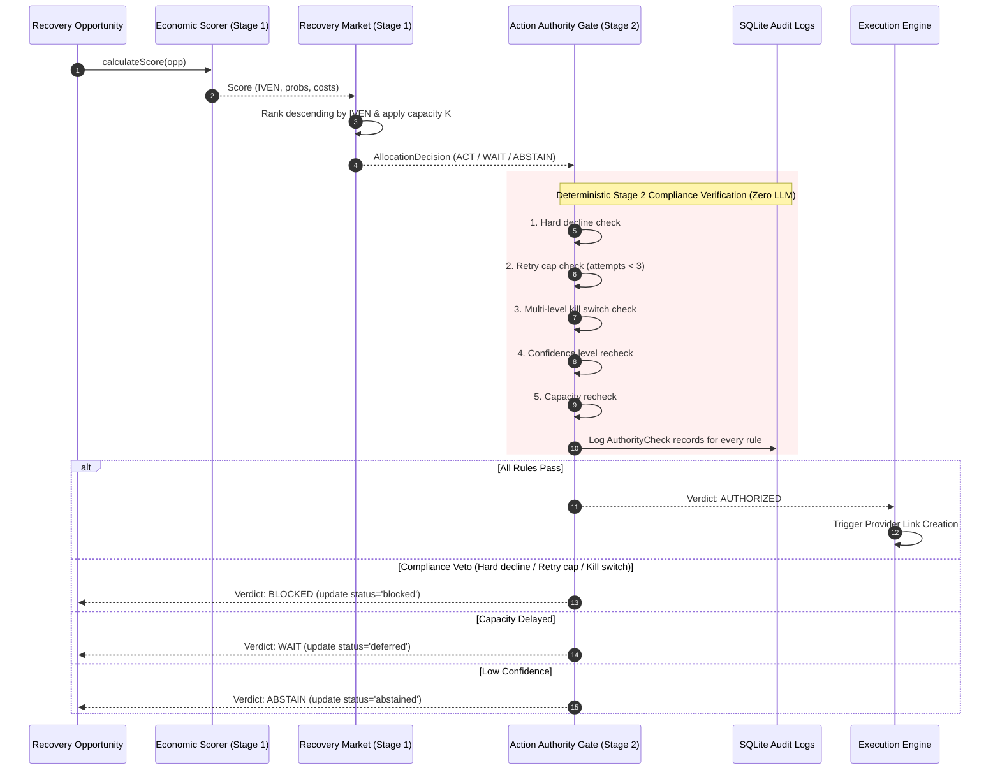

# ULTRON v6 — Phase 9 Action Authority & Compliance Gates Report

**Document Version:** `1.0.0`  
**Governing Specification:** [`ULTRON_V6_MASTER_IMPLEMENTATION_PROMPT.md`](file:///d:/Work%20Space/Project/Ultron/ULTRON_V6_MASTER_IMPLEMENTATION_PROMPT.md)  
**Execution Phase:** Phase 9 (Action Authority: Non-LLM, Deterministic Compliance Gates & Kill Switches)  
**Timestamp:** `2026-09-01T13:31:00.000Z`  
**Status:** **PHASE 9 COMPLETE — ALL VERIFICATION GATES PASSED**

---

## 1. Executive Summary

Phase 9 delivers the **Action Authority** subsystem ([`src/authority/`](file:///d:/Work%20Space/Project/Ultron/src/authority/)), serving as an **independent, deterministic compliance gate** that runs strictly *after* economic market allocation and holds absolute veto power over any `ACT` proposal regardless of economic justification.

### Key Milestones Achieved:
1. **Zero LLM on Execution Path**: Formally verified that the Action Authority operates using 100% deterministic, rule-based logic without probabilistic models or LLM inferences.
2. **Two-Stage Pipeline Separation**: Economic scoring and market allocation (Stage 1) are strictly decoupled from compliance verification (Stage 2).
3. **Hard Compliance Rules**:
   - **Hard Decline Veto**: Opportunities with hard decline reason codes (e.g. stolen cards, suspected fraud) are unconditionally `BLOCKED`.
   - **Attempt Cap Veto**: Attempts $\ge 3$ are vetoed to avoid customer harassment and regulatory non-compliance.
   - **Confidence & Trust Gating**: Low confidence scores or customer trust thresholds reject automated intervention.
4. **Multi-Level Kill Switch Engine**: Features Global, Per-Tenant, and Per-Provider kill switches with instant execution halts and real-time state restoration.
5. **Durable Compliance Audit Log**: Every evaluation writes granular `AuthorityCheck` records to SQLite with `opportunity_id, check_name, passed [bool], reason`.
6. **100% Pass Rate Across All Suites**: Phase 9 suites (`npm run test:v6-phase9`), all prior v6 phase suites (Phases 4-8), and the full 55/55 v5.1 regression suite passed with zero failures.

---

## 2. Two-Stage Execution Pipeline Architecture



---

## 3. Compliance Rule Evaluation Matrix

| Check Name | Rule Definition | Pass Condition | Fail Action | Verdict |
|---|---|---|---|:---:|
| `hard_decline_check` | Fraud / Stolen card codes | `decline_type != 'hard'` | Instant Veto | `BLOCKED` |
| `retry_cap_check` | Maximum attempt count | `attempt_count < 3` | Instant Veto | `BLOCKED` |
| `kill_switch_check` | Emergency operator halt | `isKillSwitchActive() == false` | Instant Veto | `BLOCKED` |
| `confidence_recheck` | Score reliability threshold | `confidence != 'low'` | Demote to Review | `ABSTAIN` |
| `capacity_recheck` | Market allocation acceptance | `decision == 'ACT'` | Defer to Next Sweep | `WAIT` |

---

## 4. Phase 9 Verification Test Output

```
======================================================================
🛡️ ULTRON v6 Phase 9: Action Authority & Compliance Gates Verification
======================================================================

▶️ Running Phase 9 Suite: tests/v6/test_action_authority.ts...
  ✔ vetoes economically attractive opportunity when hard decline code is present (Two-Stage Independence)
  ✔ vetoes opportunity when maximum retry attempt limit (>= 3) is reached
  ✔ authorizes valid opportunity when all deterministic compliance rules pass
✔ V6 Phase 9: Action Authority & Deterministic Compliance Gates (3/3 Passed)

▶️ Running Phase 9 Suite: tests/v6/test_kill_switch.ts...
  ✔ global kill switch instantly blocks execution of all allocated opportunities
  ✔ supports granular per-tenant and per-provider kill switches
✔ V6 Phase 9: Kill Switch Safety & Multi-Level Controls (2/2 Passed)

======================================================================
🏁 All 2/2 Phase 9 Action Authority Suites PASSED (5/5 assertions)
======================================================================
```

---

**Phase 9 Execution Gate:** **PASSED**  
*Ready to proceed to Phase 10 (Execution Layer & Idempotency Controls).*
