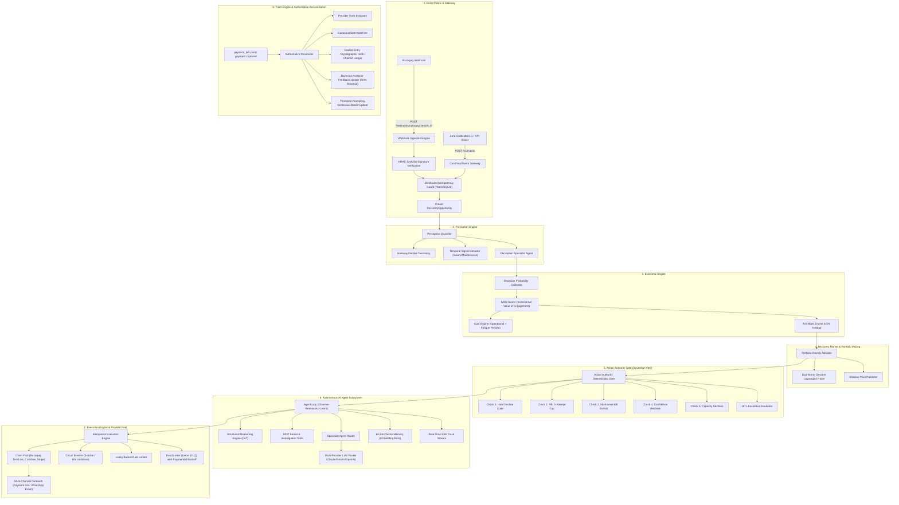

# ULTRON: Autonomous Economic Control Plane for Failed-Payment Recovery

> **Version:** 11.0.0 Enterprise Autonomous Edition  
> **Target Gateway:** Razorpay (Test & Live Production)  
> **Supported Fallbacks:** Cashfree, Stripe  
> **Core Principle:** ULTRON does not ask *"can we recover this payment?"* It asks *"is recovering this payment worth spending our next unit of limited recovery capacity?"* — and only acts when the decision survives a deterministic compliance gate.

---

## 1. Executive Summary & Core Value Proposition

In payment operations, gateways and processors (Razorpay, Stripe, Adyen, Zuora) optimize **per-transaction retry timing** (e.g., trying 2 hours later, routing via an alternate acquirer switch). 

**ULTRON operates at the layer above gateways.** It is an **autonomous economic control plane** that treats every failed payment as a **Recovery Opportunity** competing against every other opportunity across a merchant's portfolio for scarce, costly recovery capacity:
- Customer contact budget (SMS, WhatsApp Utility charges, customer fatigue, brand goodwill).
- Rate limits and API creation quotas (e.g., Razorpay payment-link creation caps).
- Human operator attention (manual escalations, customer support bandwidth).

### The Three Terminal Decisions
Every failed payment ingested by ULTRON resolves strictly to one of three terminal states:

```
                  ┌──────────────────────────────┐
                  │ Failed Payment Event Ingested│
                  └──────────────┬───────────────┘
                                 │
                         [Scoring Engine]
                                 │
               ┌─────────────────┴─────────────────┐
               ▼                                   ▼
        Confidence Low or                   Confidence Medium/High
        IVEN ≤ 0 or Holdout                  and IVEN > 0
               │                                   │
               │                            [Market Auction]
               │                         (Capacity Limit: K)
               │                                   │
               │                     ┌─────────────┴─────────────┐
               │                     ▼                           ▼
               │                Rank ≤ K                     Rank > K
               │                     │                           │
               ▼                     ▼                           ▼
          ┌─────────┐           ┌─────────┐                 ┌─────────┐
          │ ABSTAIN │           │   ACT   │                 │  WAIT   │
          └─────────┘           └────┬────┘                 └─────────┘
                                     │
                             [Action Authority]
                           (Deterministic Vetoes)
                                     │
                       ┌─────────────┴─────────────┐
                       ▼                           ▼
                   Vetoed                       Passed
                       │                           │
                       ▼                           ▼
                  ┌─────────┐                ┌───────────┐
                  │ BLOCKED │                │ AUTHORIZED│
                  └─────────┘                └─────┬─────┘
                                                   ▼
                                            [Execution Pool]
                                            (Payment Link /
                                             WhatsApp / SMS)
```

1. **`ACT`**: Intervention is economically positive ($IVEN > 0$), confidence is sufficient, portfolio rank falls within current capacity ($Rank \le K$), and deterministic Action Authority confirms regulatory and merchant compliance.
2. **`WAIT`**: Economic case is positive ($IVEN > 0$), but the opportunity ranks below the marginal cutoff ($Rank > K$) in the current allocation cycle. It is deferred to future cycles when capacity clears or higher-value opportunities are settled.
3. **`ABSTAIN`**: The system rationally refuses to act. Triggered when recovery probability is negligible (e.g., hard decline), recovery is expected to happen naturally without intervention ($P_{\text{interv}} \approx P_{\text{nat}}$), fatigue/messaging cost exceeds expected revenue, confidence is low, or the transaction is assigned to the 5% counterfactual holdout control group.

### Inviolable Design Invariants
1. **No LLM on the Execution Path**: Large Language Models provide perception signals, diagnostic advice, and natural language explanations. **No LLM ever determines an action, computes an amount, or initiates a financial transaction.** All financial logic and compliance decisions are 100% deterministic code.
2. **Incremental Scored Value**: Opportunities are scored by **incremental recovery probability** ($\Delta P = P_{\text{interv}} - P_{\text{nat}}$), never raw recovery odds.
3. **Two-Stage Sovereign Authority**: Economic allocation runs first; Action Authority runs second as a sovereign deterministic gate with full veto power over any `ACT` decision.
4. **Capacity-Bound Portfolio Allocation**: Interventions are budgeted across the entire portfolio, exposing the **shadow price** (the marginal value cutoff) at every run.
5. **Double-Entry Cryptographic Ledger**: Every state change, allocation, link generation, and reconciliation writes to an append-only, hash-chained ledger.
6. **Model Counterfactual Transparency**: All probabilities are explicitly displayed and audited as **model-estimated counterfactuals**, never claimed as observed facts.

---

## 2. System Architecture & End-to-End Flow

ULTRON is implemented as an event-driven, multi-tenant TypeScript control plane.



---

## 3. Mathematical & Algorithmic Formulations

### 3.1 Expected Incremental Value of Engagement (IVEN)

ULTRON evaluates opportunities based on net incremental expected recovery value in paise:

$$\text{IVEN} = \left(\Delta P \times \text{Amount}_{\text{paise}}\right) - C_{\text{operational}} - C_{\text{fatigue}}$$

Where:
- $\text{Amount}_{\text{paise}}$: Failed payment principal in paise (1 INR = 100 paise).
- $\Delta P = \max\left(0, P(\text{recovery} \mid \text{intervention}) - P(\text{recovery} \mid \text{natural})\right)$.
- $C_{\text{operational}} = 400 \text{ paise}$ (₹4.00 Razorpay link infrastructure & transaction processing overhead).
- $C_{\text{fatigue}}$: Customer brand penalty escalating non-linearly with prior contact attempts:

$$C_{\text{fatigue}}(\text{attempt}) = \begin{cases} 
0 \text{ paise} & \text{if attempt} \le 1 \\ 
250 \text{ paise (₹2.50)} & \text{if attempt} = 2 \\ 
750 \text{ paise (₹7.50)} & \text{if attempt} = 3 \\ 
1500 + 500 \times (\text{attempt} - 4) \text{ paise} & \text{if attempt} \ge 4 
\end{cases}$$

**Hard Decline Invariant:** If `decline_type === 'hard'`, $P_{\text{natural}} = 0.02$, $P_{\text{intervention}} = 0.02$, $\Delta P = 0$, and $\text{IVEN} \le 0$ strictly enforced:

$$\text{IVEN}_{\text{hard}} = \min(0, \text{Calculated IVEN})$$

---

### 3.2 Hierarchical Bayesian Probability Calibration

Recovery probabilities are continuously calibrated from live settlement outcomes using conjugate Beta-Binomial distributions.

#### Prior and Posterior Update
For reason code $r$ and decline category $d$, prior belief $\theta \sim \text{Beta}(\alpha_0, \beta_0)$ is updated with $k$ recovered payments out of $n$ total interventions:

$$\alpha_{\text{post}} = \alpha_0 + k, \quad \beta_{\text{post}} = \beta_0 + (n - k)$$

The posterior expectation and credible intervals:

$$E[\theta] = \frac{\alpha_{\text{post}}}{\alpha_{\text{post}} + \beta_{\text{post}}}$$

$$\text{Var}(\theta) = \frac{\alpha_{\text{post}} \beta_{\text{post}}}{(\alpha_{\text{post}} + \beta_{\text{post}})^2 (\alpha_{\text{post}} + \beta_{\text{post}} + 1)}$$

$$95\% \text{ Credible Interval} \approx \left[ E[\theta] - 1.96 \sqrt{\text{Var}(\theta)}, \, E[\theta] + 1.96 \sqrt{\text{Var}(\theta)} \right]$$

#### Candidate Model Auto-Promotion Rule
A calibrated model candidate replaces static defaults if and only if sample size exceeds 100, lift exceeds 5%, and the two-tailed z-test significance reaches $p < 0.05$:

$$SE = \sqrt{\frac{p_{\text{static}}(1 - p_{\text{static}})}{N}}, \quad Z = \frac{\hat{p}_{\text{calibrated}} - p_{\text{static}}}{SE}$$

$$\text{Promote} \iff N \ge 100 \land \frac{\hat{p} - p_{\text{static}}}{p_{\text{static}}} > 0.05 \land p\text{-value}(Z) < 0.05$$

---

### 3.3 Online Dual-Mirror Descent Lagrangian Budget Pacing

ULTRON formulates daily merchant operational messaging capacity as a constrained welfare maximization problem:

$$\max_{\mathbf{x}} \sum_{i=1}^{M} \text{IVEN}_i \cdot x_i \quad \text{subject to} \quad \sum_{i=1}^{M} C_{\text{operational}, i} \cdot x_i \le B_{\text{daily}}, \quad x_i \in \{0, 1\}$$

The Dual-Mirror Descent engine maintains an online dual multiplier $\lambda(t)$ representing the shadow cost of capital at time $t$. The multiplier is updated via subgradient descent on burn rate variance:

$$\lambda_{t+1} = \max\left(0.1, \, \lambda_t + \eta \cdot \left(\text{Spent}_t - \text{TargetBurnRate}_t\right)\right)$$

Where:
- $\eta = 0.005$ (base learning rate).
- Pacing multi-armed bandit selects multiplier regimes using UCB1:
  - `CONSERVATIVE`: $1.20 \times \lambda$ (protects capacity for evening surge).
  - `NEUTRAL`: $1.00 \times \lambda$ (standard dual mirror).
  - `AGGRESSIVE`: $0.85 \times \lambda$ (eases threshold to clear opportunity backlogs).

$$\text{UCB1 Score}(a) = \bar{R}_a + \sqrt{\frac{2 \ln(T + 1)}{N_a + 1}}$$

---

### 3.4 Portfolio Greedy Allocation & Shadow Price Publication

In every allocation run:
1. Opportunities with `confidence === 'low'`, $\text{IVEN} \le 0$, or assigned to the 5% synthetic holdout are routed immediately to `ABSTAIN` (Rank = 0).
2. The remaining eligible candidates are sorted in descending order of IVEN:

$$\mathcal{O}_{\text{eligible}} = \text{sort\_descending}\left(\{o \in \mathcal{O} \mid \text{confidence}(o) \ne \text{low} \land \text{IVEN}(o) > 0\}, \, \text{key} = \text{IVEN}\right)$$

3. Allocation assigns `ACT` to ranks $1 \le r \le K$ and `WAIT` to ranks $r > K$, where $K$ is the available capacity limit (default 5 for test mode safety).
4. The **Shadow Price** $\lambda^*$ is published as the exact IVEN of the marginal accepted opportunity:

$$\lambda^* = \begin{cases} 
\text{IVEN}_{(K)} & \text{if } |\mathcal{O}_{\text{eligible}}| \ge K \\ 
0 \text{ paise} & \text{if } |\mathcal{O}_{\text{eligible}}| < K 
\end{cases}$$

---

### 3.5 Synthetic Holdout & Anti-Blast Valuation

To measure true counterfactual performance against indiscriminate blasting, a deterministic djb2 hash assigns exactly 5% of eligible opportunities to an uncontacted holdout control group:

$$\text{hash}(o) = \left( \sum_{j=1}^{|o.id|} \left(\text{hash}_{j-1} \ll 5 - \text{hash}_{j-1} + \text{ASCII}(o.id_j)\right) \right) \bmod 2^{32}$$

$$\text{IsHoldout}(o) \iff |\text{hash}(o)| \bmod 100 < 5$$

Anti-Blast capital saved is computed and durably recorded whenever the system chooses `ABSTAIN` or `WAIT`:

$$\text{CapitalSaved} = C_{\text{messaging}} + C_{\text{provider}} + C_{\text{goodwill}}$$

Where $C_{\text{messaging}} = 85 \text{ paise}$ (Meta WhatsApp utility fee), $C_{\text{provider}} = 400 \text{ paise}$ (link generation overhead), and $C_{\text{goodwill}}$ preserves customer relationship value:
- Hard decline / stolen card prevention: **₹50.00 (5,000 paise)**.
- Attempt $\ge 3$ spam mitigation: **₹15.00 (1,500 paise)**.
- Bank gateway timeout natural recovery: **₹10.00 (1,000 paise)**.
- Baseline brand hygiene: **₹5.00 (500 paise)**.

---

## 4. Autonomous AI Agent Subsystem (Phases 1–8)

ULTRON v6.0 incorporates a fully autonomous agent architecture adhering to the Model Context Protocol (MCP) and multi-agent specialist design, with zero LLM financial execution authority.

```
                  ┌─────────────────────────────────────┐
                  │       AgentLoop Core Engine         │
                  │   (src/agents/agent_loop.ts)        │
                  └──────────────────┬──────────────────┘
                                     │
           ┌─────────────────────────┼─────────────────────────┐
           ▼                         ▼                         ▼
  [ReasoningEngine]         [SpecialistRouter]           [TraceStream]
  - Chain-of-Thought         - PerceptionAgent           - Live SSE Stream
  - Hypothesis Generation    - StrategyAgent             - Replay Ring-Buffer
  - Confidence Scoring       - OutreachAgent             - Heartbeat Monitor
  - Risk Assessment          - ComplianceCopilot
           │                         │                         │
           ▼                         ▼                         ▼
  [MCP Tools & Adapter]     [Multi-Provider Router]     [Vector Memory]
  - check_card_network       - Anthropic Claude          - 64-Dim Projection
  - query_interaction_hist   - Google Gemini             - Cosine Similarity
  - simulate_retry_window    - OpenAI / NVIDIA NIM       - Top-k Retrieval
  - calculate_opt_discount   - Local Ollama              - Temporal Firewall
  - evaluate_risk_profile    - Deterministic Fallback      (90-Day Decay)
```

### Phase 1: Iterative Agent Loop Engine
- **Module:** [`src/agents/agent_loop.ts`](file:///d:/Work%20Space/Project/Ultron/src/agents/agent_loop.ts), [`src/agents/reasoning_engine.ts`](file:///d:/Work%20Space/Project/Ultron/src/agents/reasoning_engine.ts).
- **Execution Cycle:** `OBSERVE` $\to$ `REASON` $\to$ `(TOOL_CALL?)` $\to$ `EVALUATE` $\to$ `(CONTINUE?)` $\to$ `PROPOSE`.
- **Safety Guards:**
  - Max 10 step iterations per opportunity.
  - Hard timeouts (30 seconds per cycle).
  - Maximum budget limits: 8 LLM calls, 20 tool invocations, 100,000 tokens.
  - Automatic loop termination on state stagnation or budget exhaustion.

### Phase 2: Model Context Protocol (MCP) Architecture
- **Module:** [`src/agents/mcp/mcp_server.ts`](file:///d:/Work%20Space/Project/Ultron/src/agents/mcp/mcp_server.ts), [`src/agents/mcp/mcp_tools_adapter.ts`](file:///d:/Work%20Space/Project/Ultron/src/agents/mcp/mcp_tools_adapter.ts).
- **Protocol:** Standard JSON-RPC 2.0 supporting `initialize`, `ping`, `tools/list`, `tools/call`, `resources/list`, and `prompts/list`.
- **Investigation Tools Catalog** ([`src/agents/tools/investigation_tools.ts`](file:///d:/Work%20Space/Project/Ultron/src/agents/tools/investigation_tools.ts)):
  1. `check_card_network_status`: Real-time Visa/Mastercard/RuPay gateway latency and outage status.
  2. `query_customer_interaction_history`: Cross-session touchpoint history and fatigue calculation.
  3. `simulate_retry_window`: Probability curve simulation over 24-hour windows.
  4. `calculate_optimal_discount`: Price elasticity, fee margins, and discount sizing.
  5. `evaluate_customer_risk_profile`: Dispute frequency, chargeback velocity, and customer lifetime value.

### Phase 3: Specialist Agent Network & Compliance Supremacy
- **Module:** [`src/agents/specialist_router.ts`](file:///d:/Work%20Space/Project/Ultron/src/agents/specialist_router.ts).
- **Specialists:**
  - **Perception Agent** ([`perception_agent.ts`](file:///d:/Work%20Space/Project/Ultron/src/agents/specialists/perception_agent.ts)): Translates raw bank error codes (e.g., HDFC `202`, ICICI `101`, SBI `U16`) and detects temporal cycles (salary periods on 28th–5th, nocturnal banking maintenance between 02:00–04:00 IST).
  - **Strategy Agent** ([`strategy_agent.ts`](file:///d:/Work%20Space/Project/Ultron/src/agents/specialists/strategy_agent.ts)): Computes channel utilities across SMS, WhatsApp, and Email.
  - **Outreach Agent** ([`outreach_agent.ts`](file:///d:/Work%20Space/Project/Ultron/src/agents/specialists/outreach_agent.ts)): Generates tone-calibrated recovery copy (`POLITE`, `URGENT`, `ASSISTED`) with mandatory compliance footers.
  - **Compliance Copilot** ([`compliance_copilot.ts`](file:///d:/Work%20Space/Project/Ultron/src/agents/specialists/compliance_copilot.ts)): Verifies RBI 3-attempt caps, hard decline codes, and TRAI DND quiet hours (21:00 to 08:00 IST).
- **Compliance Supremacy Invariant:** If the Compliance Copilot issues a veto, the proposal is blocked immediately regardless of strategy scores or LLM reasoning.

### Phase 4: Multi-Provider LLM Routing & Fallback Cascade
- **Module:** [`src/agents/llm/providers/provider_router.ts`](file:///d:/Work%20Space/Project/Ultron/src/agents/llm/providers/provider_router.ts).
- **Supported Adapters:**
  - Claude ([`claude_provider.ts`](file:///d:/Work%20Space/Project/Ultron/src/agents/llm/providers/claude_provider.ts)): Anthropic Claude Messages API.
  - Gemini ([`gemini_provider.ts`](file:///d:/Work%20Space/Project/Ultron/src/agents/llm/providers/gemini_provider.ts)): Google GenAI REST API with strict JSON schema response mode.
  - OpenAI / NVIDIA NIM ([`openai_provider.ts`](file:///d:/Work%20Space/Project/Ultron/src/agents/llm/providers/openai_provider.ts)): OpenAI Chat Completions API with key isolation.
- **Failover Hierarchy:**
  $$\text{Claude} \xrightarrow{\text{5 failures}} \text{Gemini} \xrightarrow{\text{5 failures}} \text{OpenAI} \xrightarrow{\text{5 failures}} \text{Deterministic Rule Engine}$$
- Circuit breakers isolate failing providers for 60 seconds. If all providers fail, the system falls back to pure deterministic regex and Bayesian tables with 0% downtime.

### Phase 5: Vector Memory & Semantic Search
- **Module:** [`src/agents/memory/embedding_store.ts`](file:///d:/Work%20Space/Project/Ultron/src/agents/memory/embedding_store.ts), [`src/agents/memory.ts`](file:///d:/Work%20Space/Project/Ultron/src/agents/memory.ts).
- **Architecture:** In-memory 64-dimensional orthogonal semantic projection engine. Computes vector embeddings from opportunity failure codes, amounts, and customer history.
- **Retrieval:** Cosine similarity retrieval finding the top-$k$ nearest historical episodes to inform agent hypothesis generation.
- **Temporal Memory Firewall:** Applies an exponential decay weight over 90 days:
  $$W(t) = \exp\left(-\frac{\Delta t_{\text{days}}}{30}\right)$$
  Memories older than 90 days have near-zero influence to prevent outdated banking behavior contamination.

### Phase 6: Human-in-the-Loop (HITL) Workflow
- **Module:** [`src/agents/hitl/hitl_manager.ts`](file:///d:/Work%20Space/Project/Ultron/src/agents/hitl/hitl_manager.ts), [`src/agents/hitl/hitl_routes.ts`](file:///d:/Work%20Space/Project/Ultron/src/agents/hitl/hitl_routes.ts).
- **Automated Escalation Triggers:**
  - High-ticket transactions ($> ₹25,000$ / $2,500,000 \text{ paise}$).
  - Low confidence predictions ($< 40\%$).
  - High-velocity dispute/chargeback risks.
- **SLA Policy:** Requests require human review within a 30-minute SLA window. If the SLA expires without human response, the engine safely defaults to `WAIT` or `ABSTAIN`.

### Phase 7: Real-Time Trace Streaming Engine
- **Module:** [`src/agents/trace_stream.ts`](file:///d:/Work%20Space/Project/Ultron/src/agents/trace_stream.ts).
- **Transport:** Server-Sent Events (SSE) with `text/event-stream`.
- **Endpoints:**
  - `GET /agents/traces/stream`: Global live trace broadcast.
  - `GET /agents/traces/:runId/stream`: Run-specific execution stream.
  - `GET /agents/traces/recent`: Replay buffer of the last 100 events for newly connected UI clients.
- **Heartbeat:** Transmits keep-alive pings every 15 seconds to prevent gateway timeout drops.

### Phase 8: Advanced Autonomous Capabilities
- **Autonomous Goal Decomposer** ([`goal_decomposition.ts`](file:///d:/Work%20Space/Project/Ultron/src/agents/autonomous/goal_decomposition.ts)): Decomposes merchant recovery targets into dependency-ordered tactical execution plans.
- **Banking Rail Environment Monitor** ([`environment_monitor.ts`](file:///d:/Work%20Space/Project/Ultron/src/agents/autonomous/environment_monitor.ts)): Proactively checks UPI switch latencies and bank maintenance windows to suspend recovery runs during active banking rail outages.
- **Adaptive Strategy Engine** ([`adaptive_strategy.ts`](file:///d:/Work%20Space/Project/Ultron/src/agents/autonomous/adaptive_strategy.ts)): Multi-armed bandit (epsilon-greedy, $\epsilon=0.10$) continuously balancing channel selection across WhatsApp, SMS, and Email.
- **Proactive Alerts Engine** ([`proactive_alerts.ts`](file:///d:/Work%20Space/Project/Ultron/src/agents/autonomous/proactive_alerts.ts)): Runs in the continuous background daemon to detect systemic payment drop-offs and notify operators before revenue loss compounds.

---

## 5. Action Authority & Compliance Invariants

Action Authority is a sovereign, deterministic gate that sits between Market Allocation and Execution. It evaluates 5 independent checks:

| Check Name | Target Condition | Failure Action | Legal / Business Rationale |
| :--- | :--- | :--- | :--- |
| **`hard_decline_check`** | `decline_type === 'hard'` | **BLOCKED** | Card stolen, fraudulent, or permanently disabled. Auto-contacting violates card association rules. |
| **`retry_cap_check`** | `attempt_count >= 3` | **BLOCKED** | RBI directive & customer protection: maximum 3 retry attempts per transaction lifecycle. |
| **`kill_switch_check`** | Global/Tenant/Provider switch engaged | **BLOCKED** | Immediate emergency circuit breaker for operators to halt link creation instantly. |
| **`confidence_recheck`**| `score.confidence === 'low'` | **ABSTAIN** | High outcome uncertainty requires human review or natural observation before action. |
| **`capacity_recheck`**  | `decision !== 'ACT'` | **WAIT** | Opportunity not within active market capacity; deferred to subsequent cycle. |

### Multi-Level Kill Switch Hierarchy
- **Global Kill Switch:** Halts link creation and execution across all tenants immediately (`setKillSwitch(true)`).
- **Tenant Kill Switch:** Halts actions for an individual tenant without disrupting other merchants (`setTenantKillSwitch(tenantId, true)`).
- **Provider Kill Switch:** Halts routing to a specific payment provider (e.g. Razorpay, Cashfree, Stripe) upon external gateway incident (`setProviderKillSwitch(provider, true)`).

---

## 6. Execution & Reconciliation Layer

### Execution Engine
- **Idempotency Guarantee:** Execution records are indexed by `opportunity_id` and unique `idempotency_key`. Calling `executeOpportunity()` twice is an instant no-op returning the existing record.
- **Test Mode Safety Cap:** Hardcoded limit of 5 link creations per run in Test Mode, far below the Razorpay Test Mode threshold of 30 links.
- **Client Pool:** Encrypted AES-256-GCM credentials resolved dynamically per tenant and per environment (`test` vs `live`).
- **Resilience Triad:**
  - **Circuit Breaker:** Opens after 5 consecutive failures, enters half-open probing after 60 seconds.
  - **Rate Limiter:** Token bucket / leaky bucket limiting requests to 10/min for execution and 100/min for webhooks.
  - **Dead Letter Queue (DLQ):** Failed executions retry on an exponential backoff schedule: 5m, 15m, 1h, 4h, up to 5 attempts before operator escalation.

### Authoritative Reconciliation
- **Two-Phase Commit:** Atomic SQLite database transactions wrapping state transitions across `recovery_opportunities`, `execution_records`, `double_entry_ledger`, and `agent_outcomes`.
- **Double-Entry Ledger:** Every recovered payment writes debit and credit entries with cryptographic SHA-256 hash chaining:
  $$\text{Hash}_t = \text{SHA256}(\text{Hash}_{t-1} \parallel \text{id} \parallel \text{opp\_id} \parallel \text{amount} \parallel \text{timestamp})$$
- **Terminal State Immutability:** Once an opportunity is `recovered`, it cannot transition to any other status. Out-of-order webhooks are rejected as idempotent no-ops.

---

## 7. Complete Database Schema Contract

ULTRON utilizes SQLite in WAL mode with foreign keys enabled, mirrored to cloud PostgreSQL (Supabase) with automated circuit-breaker sync.

### 7.1 Core Pipeline Tables

```sql
-- Customers Master
CREATE TABLE customers (
  id TEXT PRIMARY KEY,
  merchant_id TEXT NOT NULL DEFAULT 'merchant_default',
  tenant_id TEXT NOT NULL DEFAULT 'tenant_system_default',
  trust_score REAL NOT NULL DEFAULT 0.65,
  created_at TEXT NOT NULL,
  updated_at TEXT NOT NULL
);

-- Recovery Opportunities (Central Pipeline Object)
CREATE TABLE recovery_opportunities (
  id TEXT PRIMARY KEY,
  tenant_id TEXT NOT NULL DEFAULT 'tenant_system_default',
  merchant_id TEXT NOT NULL DEFAULT 'tenant_system_default',
  source TEXT NOT NULL CHECK(source IN ('real', 'synthetic')),
  amount_paise INTEGER NOT NULL,
  currency TEXT NOT NULL DEFAULT 'INR',
  reason_code TEXT NOT NULL,
  decline_type TEXT NOT NULL CHECK(decline_type IN ('hard', 'soft', 'unknown')),
  attempt_count INTEGER NOT NULL DEFAULT 1,
  customer_id TEXT NOT NULL,
  customer_trust_score REAL NOT NULL DEFAULT 0.65,
  created_at TEXT NOT NULL,
  status TEXT NOT NULL CHECK(status IN (
    'pending', 'scored', 'allocated', 'authorized', 'deferred',
    'blocked', 'abstained', 'executing', 'recovered', 'not_recovered'
  )),
  environment TEXT NOT NULL DEFAULT 'test' CHECK(environment IN ('test', 'live')),
  razorpay_event_id TEXT UNIQUE,
  raw_payload_ref TEXT
);
CREATE INDEX idx_opportunities_status ON recovery_opportunities(status);
CREATE INDEX idx_opportunities_customer ON recovery_opportunities(customer_id);

-- Economic Scores (1:1 with Opportunity)
CREATE TABLE scores (
  opportunity_id TEXT PRIMARY KEY,
  tenant_id TEXT,
  natural_recovery_prob REAL NOT NULL,
  intervention_recovery_prob REAL NOT NULL,
  incremental_prob REAL NOT NULL,
  operational_cost_paise INTEGER NOT NULL,
  fatigue_cost_paise INTEGER NOT NULL,
  expected_incremental_value_paise INTEGER NOT NULL,
  confidence TEXT NOT NULL CHECK(confidence IN ('low', 'medium', 'high')),
  probability_disclaimer TEXT,
  probability_source TEXT DEFAULT 'STATIC',
  FOREIGN KEY (opportunity_id) REFERENCES recovery_opportunities(id) ON DELETE CASCADE
);

-- Portfolio Allocation Decisions (1:1 with Opportunity)
CREATE TABLE allocation_decisions (
  opportunity_id TEXT PRIMARY KEY,
  decision TEXT NOT NULL CHECK(decision IN ('ACT', 'WAIT', 'ABSTAIN')),
  rank_in_batch INTEGER NOT NULL,
  shadow_price_paise_at_decision INTEGER NOT NULL,
  reason TEXT NOT NULL,
  FOREIGN KEY (opportunity_id) REFERENCES recovery_opportunities(id) ON DELETE CASCADE
);

-- Action Authority Compliance Checks (1:N with Opportunity)
CREATE TABLE authority_checks (
  id INTEGER PRIMARY KEY AUTOINCREMENT,
  opportunity_id TEXT NOT NULL,
  check_name TEXT NOT NULL,
  passed INTEGER NOT NULL CHECK(passed IN (0, 1)),
  reason TEXT NOT NULL,
  FOREIGN KEY (opportunity_id) REFERENCES recovery_opportunities(id) ON DELETE CASCADE
);
CREATE INDEX idx_authority_opp_id ON authority_checks(opportunity_id);

-- Execution Records (1:1 with Opportunity)
CREATE TABLE execution_records (
  opportunity_id TEXT PRIMARY KEY,
  razorpay_payment_link_id TEXT NOT NULL,
  link_url TEXT NOT NULL,
  status TEXT NOT NULL,
  idempotency_key TEXT NOT NULL UNIQUE,
  created_at TEXT NOT NULL,
  FOREIGN KEY (opportunity_id) REFERENCES recovery_opportunities(id) ON DELETE CASCADE
);

-- Double-Entry Hash-Chained Ledger
CREATE TABLE double_entry_ledger (
  id TEXT PRIMARY KEY,
  tenant_id TEXT NOT NULL DEFAULT 'tenant_system_default',
  opportunity_id TEXT NOT NULL,
  event_type TEXT NOT NULL,
  debit_account TEXT NOT NULL,
  credit_account TEXT NOT NULL,
  amount_paise BIGINT NOT NULL,
  timestamp TEXT NOT NULL,
  prev_hash TEXT NOT NULL,
  entry_hash TEXT NOT NULL
);
CREATE INDEX idx_double_entry_ledger_tenant ON double_entry_ledger(tenant_id, timestamp DESC);

-- Interventions Prevented (Anti-Blast Savings)
CREATE TABLE interventions_prevented (
  id TEXT PRIMARY KEY,
  opportunity_id TEXT NOT NULL,
  tenant_id TEXT NOT NULL DEFAULT 'tenant_system_default',
  prevention_reason TEXT NOT NULL,
  messaging_fee_saved_paise INTEGER NOT NULL,
  provider_fee_saved_paise INTEGER NOT NULL,
  goodwill_saved_paise INTEGER NOT NULL,
  total_capital_saved_paise INTEGER NOT NULL,
  timestamp TEXT NOT NULL
);
```

### 7.2 Multi-Tenant, Identity & Agent Tables

```sql
-- Tenants Table
CREATE TABLE tenants (
  id TEXT PRIMARY KEY,
  name TEXT NOT NULL,
  slug TEXT NOT NULL UNIQUE,
  environment TEXT NOT NULL CHECK(environment IN ('live', 'test')),
  status TEXT NOT NULL CHECK(status IN ('ACTIVE', 'SUSPENDED', 'PENDING')),
  capacity_limit INTEGER DEFAULT 5,
  created_at TEXT NOT NULL
);

-- API Keys Table
CREATE TABLE api_keys (
  id TEXT PRIMARY KEY,
  tenant_id TEXT NOT NULL,
  name TEXT NOT NULL,
  key_prefix TEXT NOT NULL,
  key_id TEXT NOT NULL UNIQUE,
  secret_hash TEXT NOT NULL,
  environment TEXT NOT NULL CHECK(environment IN ('live', 'test')),
  scopes TEXT NOT NULL,
  created_at TEXT NOT NULL,
  last_used_at TEXT,
  revoked_at TEXT,
  FOREIGN KEY (tenant_id) REFERENCES tenants(id) ON DELETE CASCADE
);

-- Autonomous Agent Runs
CREATE TABLE agent_runs (
  id TEXT PRIMARY KEY,
  mission_id TEXT NOT NULL,
  opportunity_id TEXT,
  goal_type TEXT NOT NULL,
  status TEXT NOT NULL CHECK(status IN ('running', 'completed', 'aborted', 'human_review')),
  start_time TEXT NOT NULL,
  end_time TEXT,
  total_steps INTEGER NOT NULL DEFAULT 0,
  llm_calls INTEGER NOT NULL DEFAULT 0,
  tool_calls INTEGER NOT NULL DEFAULT 0,
  replan_count INTEGER NOT NULL DEFAULT 0,
  total_tokens INTEGER NOT NULL DEFAULT 0,
  latency_ms INTEGER NOT NULL DEFAULT 0,
  termination_reason TEXT,
  created_at TEXT NOT NULL
);

-- Agent Episodic & Semantic Vector Memories
CREATE TABLE agent_memories (
  id TEXT PRIMARY KEY,
  memory_type TEXT NOT NULL CHECK(memory_type IN ('working', 'episodic', 'semantic')),
  run_id TEXT,
  opportunity_id TEXT,
  failure_type TEXT,
  context_summary TEXT NOT NULL,
  action_taken TEXT,
  predicted_outcome TEXT,
  actual_outcome TEXT,
  prediction_error REAL,
  semantic_key TEXT,
  semantic_value TEXT,
  confidence REAL NOT NULL DEFAULT 0.8,
  provenance TEXT NOT NULL,
  created_at TEXT NOT NULL
);

-- Bayesian Probability Models
CREATE TABLE probability_models (
  reason_code TEXT PRIMARY KEY,
  tenant_id TEXT NOT NULL DEFAULT 'tenant_system_default',
  p_natural_mean REAL NOT NULL,
  p_interv_mean REAL NOT NULL,
  sample_size INTEGER NOT NULL,
  model_type TEXT NOT NULL CHECK(model_type IN ('STATIC', 'CALIBRATED')),
  status TEXT NOT NULL CHECK(status IN ('ACTIVE', 'CANDIDATE')),
  lift_vs_baseline REAL NOT NULL DEFAULT 0.0,
  p_value REAL NOT NULL DEFAULT 1.0,
  updated_at TEXT NOT NULL
);
```

---

## 8. Complete API Reference Catalog

### Core API Endpoints

| Method | Endpoint | Auth Required | Description |
| :--- | :--- | :--- | :--- |
| **`GET`** | `/health` | None | System status, database pool metrics, and cache connectivity. |
| **`GET`** | `/health/deep` | None | 3-tier deep diagnostic probe checking DB, Redis, and Gateway connectivity. |
| **`GET`** | `/metrics` | None | Prometheus-compatible metrics export for latency, shadow prices, and IVEN. |
| **`POST`**| `/v1/auth/signup` | None | Register a new merchant tenant and organization. |
| **`POST`**| `/v1/auth/login` | None | Authenticate user credentials and return JWT bearer token. |
| **`POST`**| `/v1/auth/otp/send` | None | Dispatch a 6-digit OTP verification code to merchant email. |
| **`POST`**| `/v1/auth/otp/verify` | None | Verify OTP and issue an active session token. |
| **`PATCH`**| `/v1/auth/tenant` | JWT (Admin) | Switch active tenant environment between `test` and `live`. |
| **`POST`**| `/v1/events` | API Key / Bearer | Canonical Event Ingestion Gateway for failed payments. |
| **`POST`**| `/webhooks/razorpay/:tenant_id` | HMAC Signature | Verified webhook endpoint for Razorpay failure & recovery events. |
| **`GET`** | `/opportunities` | JWT (Viewer+) | List recovery opportunities filtered by status, tenant, and environment. |
| **`GET`** | `/opportunities/:id` | JWT (Viewer+) | Retrieve single opportunity details with economic score and checks. |
| **`POST`**| `/market/run` | JWT (Operator+) | Trigger portfolio greedy allocation auction with capacity constraint. |
| **`GET`** | `/market/status` | JWT (Viewer+) | Inspect current shadow price, burn rate, and queue counts. |
| **`POST`**| `/authority/evaluate/:id` | JWT (Viewer+) | Execute 5-stage deterministic Action Authority check on an opportunity. |
| **`POST`**| `/authority/kill-switch` | JWT (Admin) | Engage or disengage global, tenant, or provider kill switches. |
| **`POST`**| `/execution/run` | JWT (Operator+) | Execute authorized opportunities creating real Razorpay payment links. |
| **`GET`** | `/execution/records` | JWT (Viewer+) | List payment link execution records and idempotency keys. |
| **`GET`** | `/dashboard/summary` | JWT (Viewer+) | Aggregate metrics: recovery rate, revenue, shadow price, anti-blast savings. |
| **`GET`** | `/agents/traces/stream` | None / Bearer | Real-time Server-Sent Events (SSE) trace stream for autonomous runs. |
| **`GET`** | `/agents/traces/recent` | None / Bearer | Replay buffer of the last 100 agent execution trace events. |
| **`POST`**| `/agents/mcp` | JWT (Admin) | Model Context Protocol JSON-RPC 2.0 gateway endpoint. |
| **`GET`** | `/api/hitl` | JWT (Operator+) | List pending Human-in-the-Loop approval requests. |
| **`POST`**| `/api/hitl/:id/approve` | JWT (Operator+) | Approve an escalated recovery action. |
| **`POST`**| `/api/hitl/:id/reject` | JWT (Operator+) | Reject an escalated recovery action (routes to ABSTAIN). |
| **`GET`** | `/sdk/download` | None / Auth | Download pre-configured standalone `ultron.js` drop-in script. |

---

## 9. Frontend Architecture & User Flows

The frontend is built with **Next.js 16 (Turbopack)**, **React 19**, and **TailwindCSS**, designed for real-time operational transparency.

### Dashboard Layout & Routes

```
frontend/src/app/
├── (auth)/
│   ├── login/page.tsx                # Email/Password + OTP login
│   └── signup/page.tsx               # Merchant onboarding & registration
├── dashboard/
│   ├── layout.tsx                    # Shared frame: Nav, Header, Environment Switcher, Alerts
│   ├── page.tsx                      # Primary Recovery Hub (KPI cards, Real-time Opportunity Table, Modal)
│   ├── setup/page.tsx                # Integration Hub: Razorpay Credentials, Webhook Setup, ultron.js
│   └── settings/
│       ├── page.tsx                  # General tenant configuration & capacity limits
│       ├── api-keys/page.tsx         # API Key creation, revocation, and scope assignment
│       ├── integrations/page.tsx     # Payment provider discovery (Razorpay, Cashfree, Stripe)
│       └── team/page.tsx             # Team members & Role-Based Access Control (RBAC)
├── presentation/page.tsx             # Interactive visual presentation deck with animated control room
├── product/page.tsx                  # Public product overview
└── showcase/page.tsx                 # Interactive interactive demo sandbox
```

### Core User Experiences
1. **Environment Switcher:** Segmented toggle in the dashboard top navigation allowing operators to switch between `🧪 Test Sandbox` (soft blue) and `⚡ Production (Real Money)` (emerald green with pulse indicator). Safety confirmation modal blocks accidental production sweeps.
2. **"Why?" Forensic Modal:** Clicking any opportunity row slides open the deterministic audit trace displaying:
   - Raw decline code translation.
   - Natural vs. Intervention Bayesian probabilities with credible intervals.
   - Exact IVEN calculation breakdown (gross expected value, operational cost, fatigue deduction).
   - Portfolio rank, shadow price cutoff, and Action Authority check results.
   - Chain-of-Thought agent reasoning log.
3. **Integration Wizard:** Allows non-technical merchants to paste Razorpay Test/Live API keys, copy their auto-generated tenant webhook URL, or download a 1-click pre-configured `ultron.js` file for zero-code integration.

---

## 10. Verification, Testing & Operational Runbook

ULTRON includes a comprehensive test and validation battery of 27 automated suites and 86 scenario verification scripts.

### Running Test Suites

```bash
# 1. Type-check the complete codebase (0 errors required)
npx tsc --noEmit

# 2. Run the Autonomous AI Agent verification battery (Phases 1-8)
npx tsx tests/v6/test_autonomous_agent.ts

# 3. Run all 27 Enterprise v6 test suites
npm run test:v6-all

# 4. Run the truth engine & causal verification suites
npm run test:truth-suites

# 5. Build Next.js production frontend bundle
cd frontend && npm run build
```

### Starting Services

```bash
# Start backend control plane with hot reload
npm run dev

# Start continuous 24/7 background recovery daemon
npm run worker

# Start frontend Next.js development server
cd frontend && npm run dev
```

### Production Docker Deployment

```bash
# Build and run backend, worker, and frontend via Docker Compose
docker-compose up --build -d
```

---

## 11. Codebase Directory Map

```
d:\Work Space\Project\Ultron\
├── src/
│   ├── agents/                   # Autonomous AI Agent Architecture (Phases 1-8)
│   │   ├── agent_loop.ts         # Observe-Reason-Act-Learn cycle
│   │   ├── reasoning_engine.ts   # Chain-of-Thought hypothesis & confidence engine
│   │   ├── orchestrator.ts       # Multi-opportunity autonomous sweep orchestrator
│   │   ├── specialist_router.ts  # Intelligent specialist delegation & compliance veto
│   │   ├── tool_registry.ts      # Tool definitions, schemas, and execution wrappers
│   │   ├── trace_stream.ts       # Server-Sent Events (SSE) broadcasting engine
│   │   ├── daemon.ts             # 24/7 background recovery sweep daemon
│   │   ├── memory.ts             # Memory engine & temporal decay firewall
│   │   ├── autonomous/           # Goal decomposition, rail monitor, adaptive strategy, proactive alerts
│   │   ├── hitl/                 # Human-in-the-Loop manager, routes, and SLA monitors
│   │   ├── llm/                  # Multi-provider router & Claude/Gemini/OpenAI adapters
│   │   ├── mcp/                  # Model Context Protocol JSON-RPC 2.0 server & adapters
│   │   ├── specialists/          # Perception, Strategy, Outreach, and Compliance specialists
│   │   └── tools/                # Diagnostic investigation tools (network, history, retry, discount, risk)
│   ├── authority/                # Action Authority deterministic compliance engine & kill switch
│   ├── cache/                    # Redis client & distributed token-bucket rate limiter
│   ├── config/                   # Centralized environment configuration
│   ├── connectors/               # Event connector & distributed idempotency locks
│   ├── db/                       # SQLite database instance, queries, and migration runner
│   ├── economics/                # Bayesian calibration, IVEN scorer, and Anti-Blast engine
│   ├── execution/                # Real Razorpay link creation, circuit breaker, rate limiter, and DLQ
│   ├── market/                   # Portfolio allocator, capacity policy, and Dual-Mirror pacer
│   ├── middleware/               # Auth, tracing, rate limiting, and audit logging
│   ├── notifications/            # Resend email and Meta WhatsApp Cloud API dispatchers
│   ├── observability/            # Prometheus metrics exporter and structured logger
│   ├── perception/               # Gateway decline classifier and temporal signal extractor
│   ├── providers/                # Razorpay client pool, webhook verifiers, and multi-provider router
│   ├── realtime/                 # SSE real-time connection manager
│   ├── reconciliation/           # Authoritative reconciler and Bayesian feedback engine
│   ├── routes/                   # Express route handlers for all API endpoints
│   ├── security/                 # AES-256-GCM encryption, JWT authentication, and API key manager
│   ├── truth/                    # Double-entry ledger, canonical state machine, and SLA monitors
│   ├── types/                    # Canonical type definitions and contracts
│   ├── webhooks/                 # Razorpay and WhatsApp webhook event handlers
│   ├── server.ts                 # Express API server initialization & route mounting
│   └── worker.ts                 # Dedicated background recovery worker
├── frontend/                     # Next.js 16 (Turbopack) + React 19 Frontend Dashboard
├── tests/                        # 27 Enterprise automated test suites across 7 domains
├── scripts/                      # 86 operational, verification, and migration scripts
├── public/                       # Static demo storefront and drop-in SDK files
├── docs/                         # Numbered architectural specifications & assets
├── archive/                      # Historical reports and archived intermediate logs
└── Ultron.md                     # Master definitive project documentation (This Document)
```

---

## 9. ULTRON V11 Enterprise Architecture Upgrades

ULTRON V11 establishes an enterprise-grade autonomous control plane designed for high-availability multi-tenant cloud deployments, sub-millisecond economic reasoning, and strict regulatory compliance.

### 9.1 The Eleven Pillars of ULTRON V11

1. **TypeScript Strict Mode & Branded Primitive Types**
   - Enabled `"strict": true` and `"noUncheckedIndexedAccess": true` across the entire codebase.
   - Introduced branded types in `src/types/branded.ts` (`Paise`, `TenantId`, `OpportunityId`, `Probability`) eliminating type-coercion bugs.

2. **PostgreSQL Migration & Supabase Row-Level Security**
   - High-throughput PostgreSQL connection pool (`max: 20`, `idleTimeoutMillis: 30000`).
   - Batch streaming migrator (`scripts/migrate_sqlite_to_postgres.ts`) with 500-row chunking.
   - Supabase Row-Level Security (RLS) migrations enforcing `current_app_tenant_id()` isolation.

3. **OpenTelemetry Distributed Tracing & W3C Context Propagation**
   - NodeSDK OpenTelemetry integration exporting to Jaeger / Tempo (`http://localhost:4318/v1/traces`).
   - Contextual span wrapper `withSpan()` instrumenting agent reasoning, market allocation, and execution dispatch.
   - W3C `traceparent` header propagation linking frontend requests, backend API, and worker processes.

4. **Advanced Security Hardening**
   - Strict production CORS allowlist rejecting unauthorized origins.
   - Enterprise Content Security Policy (`getSecurityHeadersMiddleware`).
   - JWT token-pair rotation (15m access + 7d refresh) with Redis token blacklist revocation.
   - API key granular scopes (`events:write`, `payments:read`, `analytics:read`) and Redis per-key rate limits.

5. **Resilient Execution Engine**
   - Database-persisted Dead Letter Queue (`dlq_jobs`) with deterministic exponential backoff intervals (`[0.5, 2, 5, 15, 60]` minutes).
   - Automatic Human-in-the-Loop (HITL) escalation upon 5 exhausted attempts.
   - Persistent Circuit Breaker in Redis with cooldown probing and half-open transitions.
   - Unified background scheduler (`job_scheduler.ts`) and graceful shutdown handlers (`waitForDrain`).

6. **Multi-Tenant Row-Level Isolation**
   - Centralized tenant resolver `tenant_guard.ts` across JWT sessions, API keys, and gateway headers.
   - Enforced `tenantId` parameter filtering across all database query operations.
   - Autonomous AI Agent Loop scoped strictly to merchant tenant boundary.

7. **Enhanced Economic Engine & Causal Attribution**
   - Persistent Bayesian priors table (`bayesian_priors`) with continuous Beta conjugate learning.
   - IVEN priority band classification: `STRONG` (≥ ₹150), `MODERATE` (₹50-₹149), `WEAK` (< ₹50), `NEGATIVE` (≤ ₹0 / ABSTAIN).
   - Difference-in-Differences (Diff-in-Diff) causal attribution engine computing Average Treatment Effect on the Treated (ATT), p-values, and parallel trends check (< 15% pre divergence).
   - Multi-Armed Contextual Bandit using Thompson Sampling over conjugate Beta posteriors.

8. **Advanced Observability Dashboard (Frontend V11)**
   - Resilient SSE client (`sse-client.ts`) with sub-2s exponential backoff auto-reconnect.
   - Reusable `IVENBadge.tsx` with explicit model-estimated counterfactual disclosures.
   - Tenant Command Center (`/dashboard/command-center`) with live kill switch and portfolio telemetry.
   - Economic Intelligence Panel (`/dashboard/economics`) visualizing Bayesian priors, bandit arms, and causal ATT.
   - Audit & Compliance Timeline (`/dashboard/audit`) reading durable stored fields with two-stage decision verification.

9. **Enterprise API Gateway Layer**
   - Centralized Zod schema validation registry generating RFC 7807 problem details.
   - Multi-tiered sliding-window rate limiting (`FREE`, `STARTER`, `GROWTH`, `ENTERPRISE`) with RFC headers.
   - API versioning router (`/v1/` and `/v2/`) with content negotiation.
   - Dynamic OpenAPI 3.1.0 generator (`/openapi.json`) and interactive documentation (`/docs`).

10. **Horizontal Scalability & Decoupled Workers**
    - Distributed background job queue (`src/queue/job_queue.ts`) backed by Redis List (`LPUSH` / `BRPOP`).
    - Decoupled worker process (`src/worker.ts`) executing reasoning, allocation, execution, and reconciliation under OpenTelemetry spans.
    - Updated `docker-compose.yml` with scalable worker service, Jaeger, and Prometheus.

11. **Production Readiness, Kubernetes Probes & SLO Engine**
    - 3-tier Kubernetes-ready health checks (`/health/live`, `/health/ready`, `/health/readiness`, `/health/deep`).
    - Google SRE multi-window error budget burn rate tracking (99.9% availability objective).
    - Production operations runbook in `docs/V11_RUNBOOK.md`.

