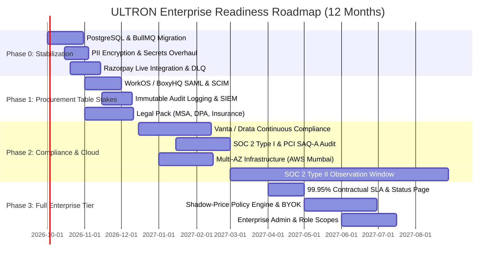

# ULTRON: Enterprise Readiness Strategic Roadmap & Implementation Plan
**Confidential Advisory Engagement | Principal Product Strategist & Enterprise Systems Consultant**  
**Date:** September 2026 | **Target Window:** 2026 – 2027

---

## 1. Executive Summary

### The Honest Verdict
ULTRON possesses an exceptional, defensible algorithmic core. Its central thesis — counterfactual revenue recovery ($\Delta P = P_{\text{intervention}} - P_{\text{natural}}$) bounded by portfolio shadow pricing and gated by a deterministic compliance check — solves the exact frustration that enterprise CFOs and Heads of Payments express toward incumbent "smart retry" vendors. 

However, from an **enterprise procurement perspective**, ULTRON is currently an **early-stage technical prototype (Stage 1 / Pre-Commercial)**. It is **9 to 12 months and approximately $150,000–$220,000 in direct tooling, compliance, legal, and specialized advisory spend away from closing its first six-figure enterprise MSA**.

### The Single Biggest Blocker: The Untrusted Data & Execution Path
The primary blocker is not algorithmic sophistication or feature breadth; it is **financial and regulatory liability in the money path**. Enterprise merchants processing ₹50Cr–₹1,000Cr+ GMV will not grant API keys or route transaction failure telemetry to a platform that:
1. Operates on an embedded local SQLite datastore (`ultron.db`) without multi-region automated failover, point-in-time recovery (PITR), or cryptographic tenant isolation at rest.
2. Lacks a certified **SOC 2 Type II** attestation and an attested **PCI-DSS v4.0.1 SAQ-A / AOC** boundary demonstrating that out-of-band payment link generation cannot intercept or expose payment credentials.
3. Has never processed an end-to-end production payment on Razorpay Live Mode with cryptographically verified webhook provenance.

Until security, tenant isolation, and regulatory guardrails (RBI data localization and TRAI DLT compliance) are independently certified, enterprise procurement will issue a **hard veto** during initial vendor risk assessment, regardless of ROI.

---

## 2. Market & Competitive Landscape (2025–2026)

The payment recovery and involuntary churn mitigation space has consolidated around automated gateway retries and dunning outreach. However, enterprise buyers are experiencing acute "dunning fatigue" and margin leakage.

### 2.1 Competitor Breakdown

| Competitor | Enterprise Tier Packaging | Pricing & Economics | Stated Enterprise SLAs & Posture | Critical Gaps & Enterprise Dissatisfaction Points |
| :--- | :--- | :--- | :--- | :--- |
| **Butter Payments** | Custom ML authorization models, direct gateway integrations (Stripe, Braintree, Adyen), custom webhooks, dedicated account manager. | Pure revenue share (10%–20% of recovered revenue). No upfront software fee. | Custom enterprise SLA (typically 99.9%), SOC 2 Type II, PCI DSS Level 1 certified. | **The "Attribution Tax"**: Enterprise CFOs revolt at paying 15% on payments that would have recovered naturally (e.g., customer payday or soft network blip). Butter does not expose counterfactual baselines or allow custom constraint caps. |
| **FlexPay** | "Invisible Recovery" AI engine, multi-merchant network intelligence, ERP integrations (Salesforce, NetSuite), custom retry scheduling. | Performance-based take-rate or hybrid minimum platform fee ($2k–$5k/mo) + variable percentage. | 99.95% uptime SLA, SOC 2 Type II, GDPR/CCPA compliant, dedicated integration engineering. | **Black-Box Opacity**: Enterprise risk teams report zero visibility into *why* a specific card was retried at 03:00 AM, occasionally triggering issuer velocity blocks and excessive retry fees. |
| **Stripe Revenue Recovery** (Built into Stripe Billing) | Smart Retries via Stripe network ML, automated dunning portal, card updater (CAU), custom retry schedules via Radar rules. | 0.7% of volume recovered on standard tiers; custom enterprise volume tiering (0.4%–0.5%). | 99.99% Stripe core infrastructure SLA, global multi-region redundancy, PCI Level 1. | **Single-Gateway Lock-In & Zero Indian Local Depth**: Ineffective for multi-processor routing, UPI auto-pay recovery failure modes, or specialized Indian payment rails (Netbanking, UPI VPA re-prompting). |
| **Zuora Collect** (Zuora Zephr / Collect AI) | Enterprise collections workflows, configurable dunning cadences, automated dispute management, global multi-currency ledgers. | Enterprise software license ($40,000–$150,000+ ACV base) + transaction surcharges. | 99.9% uptime, SOC 1 & 2 Type II, ISO 27001, dedicated Customer Success Manager & 24/7 TAM. | **Bloated Implementation & Rule Rigidity**: Requires 3–6 month professional services deployments. Employs deterministic static schedules rather than dynamic portfolio optimization or shadow-price constraints. |
| **Juspay Hyperswitch / Express Checkout** (India Context) | Multi-gateway routing, UPI deep-linking, smart retry across Indian payment aggregators (Razorpay, Cashfree, PayU). | SaaS platform fee + ₹0.50–₹2.00 per transaction routing fee. | 99.99% uptime, PCI-DSS Level 1, RBI PA-compliant hosting within India. | **Pure Routing, Zero Economic Reasoning**: Focuses on network routing at the moment of checkout; does not operate an asynchronous, capacity-constrained recovery market after abandonment. |

### 2.2 The Enterprise White Space ULTRON Exploits
1. **Verifiable Incremental Lift**: Enterprise finance teams refuse to pay performance fees on natural recoveries. ULTRON’s counterfactual engine ($\Delta P = P_{\text{intervention}} - P_{\text{natural}}$) offers mathematical proof of incremental value.
2. **Cap & Fatigue Protection**: Network schemes (Visa & Mastercard) fine merchants for excessive retries ($0.10–$2.00 per attempt past thresholds). ULTRON's capacity-capped allocation ($K$ links) and fatigue penalty functions protect the merchant's Merchant Identification (MID) standing.
3. **Deterministic Compliance Veto**: Providing an independent Action Authority gate that overrides optimization models satisfies enterprise Risk and Internal Audit departments.

---

## 3. Current-State Assessment

An appraisal of ULTRON’s active codebase (`src/`, `frontend/`, `tests/`) reveals strong core prototypes alongside critical enterprise infrastructure deficits.

```
┌─────────────────────────────────────────────────────────────────────────────┐
│                              ULTRON STACK SNAPSHOT                          │
├───────────────────────────────┬─────────────────────────────────────────────┤
│ Core Algorithmic Logic        │ Production-Grade Prototype (Clean TS/Math)  │
│ Tenancy & Security Middleware │ Scaffolded (JWT/Bearer Scopes, Local Secret)│
│ Primary Datastore             │ Incompatible (Local SQLite WAL File)        │
│ Cloud Infrastructure & CI/CD  │ Non-Existent (Localhost Node/Next.js)       │
│ Regulatory & Compliance       │ Pre-Audit (Zero Certifications)             │
│ Identity & Access (IAM)       │ Prototype (No SAML/OIDC, No SCIM)           │
│ Provider Integrations         │ Sandbox-Only (Razorpay Test Keys)           │
└───────────────────────────────┴─────────────────────────────────────────────┘
```

### Detailed Evaluation by Category

1. **Security & Compliance Certifications**: **`UNVERIFIED / GAP`**
   - *Current State*: Zero external certifications. No SOC 2, ISO 27001, or formal PCI DSS SAQ.
   - *Exposure*: Low cardholder data exposure because ULTRON delegates hosted checkout to Razorpay links, but enterprise buyers still mandate a SOC 2 Type II to assess data pipeline integrity and source code vulnerability handling.
2. **Identity & Access Management (IAM)**: **`SCAFFOLDED`**
   - *Current State*: `src/security/tenancy.ts` and `src/security/rbac.ts` define roles (`SUPER_ADMIN`, `TENANT_ADMIN`, `OPERATOR`, `VIEWER`) and evaluate bearer tokens.
   - *Enterprise Gap*: Lacks SAML 2.0 / OIDC integrations (Okta, Microsoft Entra ID, PingFederate). No SCIM 2.0 endpoints for user provisioning/deprovisioning.
3. **Data Handling & Storage**: **`BLOCKER`**
   - *Current State*: System relies on local file-backed SQLite (`ultron.db`) via `node:sqlite`. Dual Supabase scripts exist in `scripts/`, but the running core executes queries against SQLite.
   - *Enterprise Gap*: No point-in-time recovery (PITR), no multi-region read replicas, no transparent data encryption (TDE) at rest with KMS key rotation, no multi-tenant Row-Level Security (RLS) enforcement at the engine level.
4. **Reliability & Operations**: **`GAP`**
   - *Current State*: Single-process Express server (`src/server.ts`). Background polling runs on in-memory `setInterval()`.
   - *Enterprise Gap*: In-memory timers fail on horizontal scaling. Process restart drops scheduled runs. No public status page (e.g., Instatus/Statuspage), no multi-AZ auto-scaling group, no documented RTO/RPO runbooks.
5. **API Maturity & Observability**: **`SCAFFOLDED`**
   - *Current State*: Prometheus metric collector (`src/observability/metrics.ts`), Pino structured logger (`src/observability/logger.ts`), and basic rate limiter (`src/cache/rate_limiter.ts`).
   - *Enterprise Gap*: No distributed OpenTelemetry tracing across async execution queues, no OpenAPI/Swagger 3.1 specification, no cryptographically verifiable signed webhooks for outbound enterprise events.
6. **Regulatory Posture (Fintech / India Specifics)**: **`IMPORTANT GAP`**
   - *Current State*: Stores customer identifiers, phone numbers, and transactional amounts without field-level masking or explicit data retention policies.
   - *Enterprise Gap*: Fails RBI 2018 Payment Data Localization norms (all transactional storage must reside solely on servers located in India) and DPDP Act 2023 principles (right to erasure, purpose limitation). Lacks TRAI DLT template registration for WhatsApp/SMS outreach.

---

## 4. Gap Analysis

| Category | Requirement | Enterprise Bar | Current State in ULTRON | Severity | Est. Effort |
| :--- | :--- | :--- | :--- | :--- | :--- |
| **Security** | SOC 2 Type II | Clean report covering Security, Availability, and Confidentiality (minimum 6-month observation window). | None. | **Blocker** | 4–6 months |
| **Security** | PCI-DSS Posture | Formal SAQ-A Attestation of Compliance (AOC) with external QSA sign-off confirming zero CHD/SAD storage. | Architecture qualifies for SAQ-A (Razorpay links), but lacks formal AOC audit. | **Blocker** | 4–6 weeks |
| **IAM** | Enterprise SSO | SAML 2.0 & OIDC supporting Okta, Microsoft Entra ID, Google Workspace, Ping Identity. | Custom JWT and local password/bearer token authentication only. | **Blocker** | 3–4 weeks |
| **IAM** | Directory Sync | SCIM 2.0 for automated user provisioning, role synchronization, and instant deprovisioning. | Manual DB seeding / static admin creation. | **Important** | 2–3 weeks |
| **IAM** | Immutable Audit Log | SIEM-exportable, tamper-evident audit logs of all configuration, allocation override, and kill-switch actions. | `ledger_entries` records financial state transitions; administrative API calls lack tamper-evident actor tracking. | **Blocker** | 3 weeks |
| **Architecture** | Database Durability | Distributed PostgreSQL (RDS Aurora / Supabase Enterprise) with RLS, connection pooling, and multi-AZ failover. | Local file-backed `ultron.db` (SQLite). | **Blocker** | 4 weeks |
| **Architecture** | Scalable Queues | Redis-backed distributed task queue (BullMQ) with idempotency guarantees and dead-letter queues (DLQ). | In-memory `setInterval()` and asynchronous inline promise execution. | **Blocker** | 3 weeks |
| **Data Privacy** | India Data Localization | 100% of payment logs, customer VPAs, and failure telemetry stored exclusively within Indian territory (RBI 2018). | Local disk storage (unspecified geographic cloud deployment). | **Blocker (India)**| 2 weeks |
| **Data Privacy** | Privacy & DPDP Act | Automated data subject request (DSR) workflows for right-to-erasure and cryptographic masking of customer identifiers. | Clear-text `customer_id` and webhook payloads stored without masking. | **Important** | 3 weeks |
| **Contracts** | Enterprise MSA & DPA | Pre-negotiated Enterprise Master Services Agreement, Data Processing Addendum, and SLA schedule ($2M–$5M cyber insurance). | No formal legal templates; open-source LICENSE only. | **Blocker** | 4 weeks |
| **Reliability** | Availability SLA | Contractually guaranteed 99.95% uptime with financial service credits, public status page, and RPO < 15m / RTO < 1h. | Single server instance, no status page, no formal disaster recovery runbook. | **Important** | 3–4 weeks |
| **API** | Enterprise API Specs | OpenAPI 3.1 schema, SDK generation, granular API key scopes, and tenant-level webhook signing secrets. | TypeScript types and internal Express routes without public OpenAPI specification. | **Important** | 2 weeks |

---

## 5. Phased Implementation Roadmap



---

### Phase 0: Immediate Hardening & Foundation (Month 0–1)
**Theme**: Eliminate disqualifying technical risks and graduate from prototype to production architecture.

*   **Milestones & Deliverables**:
    1.  **PostgreSQL Migration**: Deprecate SQLite (`ultron.db`). Fully migrate to AWS RDS PostgreSQL (Multi-AZ in AWS `ap-south-1` Mumbai to satisfy RBI data localization) with connection pooling via PgBouncer. Enforce Postgres Row-Level Security (`tenant_id = current_setting('app.current_tenant')`).
    2.  **Distributed Queue Engine**: Replace Express `setInterval()` with Redis Cluster + BullMQ. Route webhook ingestion, IVEN scoring, allocation batches, and provider link dispatch into persistent, isolated job queues with automatic exponential backoff and DLQ.
    3.  **End-to-End Live Razorpay Validation**: Configure production webhooks via an API Gateway with static egress IPs. Execute real live-money ₹1.00 micro-transactions through production Razorpay credentials to validate HMAC verification, settlement reconciliation, and provider truth invariants in production.
    4.  **PII Field-Level Encryption**: Encrypt customer phone numbers, email addresses, and VPA identifiers using AES-256-GCM managed by AWS KMS with automated key rotation.
*   **Why Sequenced Here**: Building security or compliance controls on top of a local SQLite database or ephemeral in-memory timers produces throwaway work.
*   **Rough Effort / Cost**: 1 Senior Backend Engineer (4 weeks) + $400/month cloud infrastructure.
*   **Dependencies**: AWS infrastructure account, Razorpay production merchant account.
*   **Risk If Skipped**: Immediate technical disqualification during architecture review; complete loss of data consistency upon process crashes.

---

### Phase 1: Procurement "Table Stakes" (Month 1–3)
**Theme**: Unblock enterprise RFP gates and eliminate InfoSec friction.

*   **Milestones & Deliverables**:
    1.  **Enterprise SSO (SAML 2.0 / OIDC)**: Integrate WorkOS or BoxyHQ (self-hosted). Support plug-and-play Okta, Entra ID, and Google Workspace SSO with tenant domain discovery.
    2.  **SCIM 2.0 Provisioning**: Implement automated user lifecycle endpoints (`/scim/v2/Users`, `/scim/v2/Groups`) to satisfy IT deprovisioning mandates.
    3.  **Immutable Administrative Audit Log**: Implement structured, append-only administrative event streaming. Record actor identity, IP, tenant context, previous state, new state, and timestamp for all policy overrides, kill-switch activations, and threshold adjustments. Expose webhook/SIEM export (Splunk, Datadog).
    4.  **Security Pack & CAIQ Completion**: Pre-fill the Cloud Security Alliance Consensus Assessments Initiative Questionnaire (CAIQ-Lite) and Standardized Information Gathering (SIG) questionnaire. Publish a Customer Security Whitepaper and Architecture Diagram.
    5.  **Legal & Contractual Foundation**: Retain specialized SaaS legal counsel to draft enterprise-ready Master Services Agreement (MSA), Data Processing Addendum (DPA) compliant with EU GDPR and Indian DPDP 2023, and bind $2,000,000 Technology Errors & Omissions (E&O) and Cyber Liability insurance.
*   **Why Sequenced Here**: Mid-market and enterprise deals stall indefinitely when a vendor cannot provide SAML SSO or a clean DPA during initial procurement screening.
*   **Rough Effort / Cost**: 1 Full-Stack Engineer + SaaS Legal Counsel ($12,000 legal retainer) + WorkOS license ($125/month base + $30/connection) + Cyber Insurance ($4,500/year).
*   **Dependencies**: Phase 0 database and tenant isolation.
*   **Risk If Skipped**: Deals stall at the 30-day mark when InfoSec sends their standard vendor assessment sheet.

---

### Phase 2: Compliance Certifications & Scalability (Month 3–6)
**Theme**: Attain formal third-party trust attestations and scale infrastructure to 100x transaction volume.

*   **Milestones & Deliverables**:
    1.  **Continuous Compliance Tooling (Vanta / Drata)**: Deploy agent-based automated infrastructure monitoring across AWS, GitHub, and identity providers to continuously verify 80+ security controls.
    2.  **SOC 2 Type I Attestation**: Engage an accredited CPA firm (e.g., Prescient Assurance, Schellman, or Johanson Group) to perform a point-in-time design evaluation of security controls.
    3.  **PCI-DSS v4.0.1 SAQ-A Certification**: Retain a Qualified Security Assessor (QSA) to review ULTRON's payment-link-only execution architecture, confirm zero cardholder data environment (CDE) storage, and issue a formal Attestation of Compliance (AOC).
    4.  **Independent Penetration Testing**: Contract a CREST-accredited offensive security firm to conduct annual grey-box web application and cloud penetration testing, resolving all critical and high findings.
    5.  **High-Availability AWS Topology (100x Scale)**:
        *   Containerize services via Docker and deploy across Amazon ECS Fargate across 3 Availability Zones.
        *   Implement Redis Cluster for distributed rate limiting and state coordination.
        *   Establish an active-active Read Replica pool for analytical dashboard queries to isolate production transaction ingestion.
*   **Why Sequenced Here**: SOC 2 Type II requires a minimum 3-to-6 month observation period; the foundation and Type I audit must be locked early.
*   **Rough Effort / Cost**: Compliance Platform ($10,000/yr) + SOC 2 Auditor ($15,000–$22,000) + QSA PCI Review ($8,000) + Pen Test ($12,000) + DevOps/Infra Engineer (Part-time / Contractor).
*   **Dependencies**: Phase 1 audit logs, access controls, and production cloud deployment.
*   **Risk If Skipped**: Hard procurement veto from enterprise legal/compliance; inability to sign deals over $50,000 ACV.

---

### Phase 3: Full Enterprise Tier & Advanced Controls (Month 6–12)
**Theme**: Institutionalize carrier-grade operational excellence and defensible enterprise differentiation.

*   **Milestones & Deliverables**:
    1.  **SOC 2 Type II Final Report**: Conclude the 6-month observation window and deliver the final, unqualified Type II report to the enterprise collateral repository.
    2.  **Contractual 99.95% SLA & Real-Time Trust Center**: Launch a publicly accessible, dynamically updated Trust Center and Status Page (e.g., trust.ultron.io) displaying 90-day historical latency, component status, and automated uptime tracking. Publish SLA credit refund policies (e.g., 10% credit for <99.95%, 25% credit for <99.0%).
    3.  **Configurable Shadow-Price & Policy Management**: Provide enterprise administrators with UI and API controls to set tenant-level recovery constraints (e.g., hard cap on monthly outreach budget, max recovery link generation rate, custom fatigue half-life curves, and custom Action Authority rules).
    4.  **Bring-Your-Own-Key (BYOK) Encryption**: Allow Tier-1 enterprise clients to supply their own AWS KMS Key ARN for encrypting their tenant's database rows and audit events.
    5.  **24/7/365 Incident Response & Dedicated TAM**: Establish enterprise P1 on-call rotation via PagerDuty with contractually committed 15-minute response times and a dedicated Technical Account Manager (TAM) for enterprise tier clients.
*   **Why Sequenced Here**: High-end enterprise features (BYOK, custom SLA guarantees) are valuable only after the baseline product passes InfoSec and demonstrates operational stability.
*   **Rough Effort / Cost**: $30,000 (operational tooling, PagerDuty, Statuspage, ongoing compliance maintenance).
*   **Dependencies**: Clean SOC 2 Type II report, stable multi-AZ production cloud.
*   **Risk If Skipped**: Inability to charge premium enterprise contract values ($100k+ ARR) and vulnerability to displacement by established enterprise suites.

---

## 6. Technical & Architectural Readiness Deep-Dive

### 6.1 Multi-Tenancy Architecture Options & Trade-Offs

For ULTRON’s Node.js/PostgreSQL stack, three multi-tenancy models exist. Selecting the appropriate model determines the procurement trajectory.

```
┌─────────────────────────────────────────────────────────────────────────────┐
│                       MULTI-TENANCY SPECTRUM FOR ULTRON                     │
├──────────────────────┬──────────────────────┬───────────────────────────────┤
│ Model A: Pool/Shared │ Model B: Schema-Iso  │ Model C: Siloed Database      │
│ (Recommended Ph 0-2) │ (Not Recommended)    │ (Enterprise Add-on Ph 3)      │
├──────────────────────┼──────────────────────┼───────────────────────────────┤
│ • Shared DB & Schema │ • Separate PG Schema │ • Dedicated AWS RDS Instance  │
│ • Tenant ID on rows  │   per merchant       │ • Complete physical isolation │
│ • Postgres RLS       │ • High schema drift  │ • 10x cost, high ops overhead │
│ • Low cost, scales   │ • Max 500 tenants    │ • For banks / strict fintechs │
└──────────────────────┴──────────────────────┴───────────────────────────────┘
```

#### Strategic Recommendation
*   **Standard Enterprise Tier**: **Model A (Shared Database with Postgres Row-Level Security)**.
    *   *Implementation*: Every query sets `SET LOCAL app.current_tenant_id = 'tenant_123'`. A global RLS policy (`CREATE POLICY tenant_isolation_policy ON recovery_opportunities USING (tenant_id = current_setting('app.current_tenant_id'))`) enforces that a coding error in an Express route can **never** bleed cross-tenant data.
*   **Regulated / Premium Tier ($150k+ ACV)**: **Model C (Siloed Database)**.
    *   Deploy an isolated RDS PostgreSQL instance within an isolated VPC subnet for tier-1 financial enterprise buyers that legally mandate dedicated physical storage.

### 6.2 Scalability Bottlenecks at 10x and 100x Load

| Pipeline Stage | 1x Current Baseline (10 req/s) | 10x Load (100 req/s) Bottleneck | 100x Load (1,000 req/s) Bottleneck | Architectural Remediation |
| :--- | :--- | :--- | :--- | :--- |
| **Webhook Ingestion** | Express synchronous parsing and immediate DB write. | Express event-loop lag; DB write lock contention. | Connection pool starvation; dropped webhook deliveries from Razorpay. | **Asynchronous Edge Ingestion**: Ingest webhooks via Amazon API Gateway / AWS Lambda directly into Amazon SQS. Return `200 OK` within 25ms. Process via worker pool. |
| **IVEN Scoring** | Inline synchronous computation on single thread. | CPU overhead during batch failure spikes (e.g., bank-wide UPI outage). | Significant queue lag; timeouts during portfolio ranking. | Worker threads or standalone Go/Rust microservice for batch matrix multiplication; pre-cache Bayesian prior probability tables in Redis. |
| **Market Allocation** | Single-pass in-memory sort of entire batch ($O(N \log N)$). | Memory spikes if batch size exceeds 5,000 opportunities. | Allocation contention across distributed worker nodes. | Partition allocation runs by merchant tenant and currency; execute Redis-based distributed locking (`Redlock`) during portfolio settlement. |
| **Razorpay Link API** | Direct synchronous HTTPS call via official Node SDK. | Razorpay rate-limit threshold (30–120 requests/min). | Immediate HTTP 429 errors from Razorpay; link generation dropped. | **Token-Bucket Rate Limiter**: Queue outgoing API calls through a Redis-coordinated token-bucket worker pool adhering strictly to merchant-specific API gateway limits. |

---

## 7. Pricing & Packaging Architecture

Enterprise buyers in payments reject consumer-style self-serve pricing, but also push back hard against pure performance/take-rate models due to attribution skepticism.

```
┌─────────────────────────────────────────────────────────────────────────────┐
│                          ULTRON PACKAGING LADDER                            │
├──────────────────────────────┬──────────────────────────────────────────────┤
│ Growth (Self-Serve / SMB)    │ $999/mo + 8% of incremental recovered value  │
│ Business (Mid-Market)        │ $2,999/mo + 5% of incremental value          │
│ Enterprise (Sales-Assisted)  │ $45,000–$120,000 Base ARR + Tiered Uplift    │
└──────────────────────────────┴──────────────────────────────────────────────┘
```

### 7.1 The Three-Tier Packaging Strategy

| Plan Tier | Target Customer Segment | Platform Fee (Annual Base) | Variable / Usage Fee | Key Entitlements Included |
| :--- | :--- | :--- | :--- | :--- |
| **Growth** | ₹5Cr – ₹20Cr Annual GMV | ₹75,000 / month (billed annually) | 8% of verified $\text{IVEN}$ recovered | Standard Dashboard, 5 seats, Community support, Shared infra, Razorpay Test/Live adapter. |
| **Business** | ₹20Cr – ₹100Cr Annual GMV | ₹2,25,000 / month (billed annually) | 5% of verified $\text{IVEN}$ recovered | Role-Based Access Control, Webhook exports, 99.9% uptime SLA, 4-hour support response, Custom fatigue thresholds. |
| **Enterprise** | ₹100Cr+ Annual GMV | **$50,000 – $120,000+ ARR** (₹40L – ₹1Cr base commitment) | **2%–3% of verified incremental recovery** (or flat capacity packs: ₹0.75 per generated link) | **SAML 2.0 / SCIM SSO**, Dedicated VPC / Silo DB option, **99.95% SLA**, Custom Action Authority rules, Dedicated TAM, SOC 2 Type II & DPA, Custom ERP/Data Warehouse pipelines. |

### 7.2 Defeating the "Attribution Trap" in Enterprise Contracts
Most dunning vendors claim credit for any payment completed within 72 hours of an email or retry. Enterprise CFOs view this as predatory.
*   **ULTRON Contract Mechanism**: ULTRON's contracts define billing strictly on **Statistically Verified Incremental Uplift ($\Delta P$)**.
*   The system maintains a deterministic holdout group (e.g., 5% of randomly assigned failed transactions receive zero intervention to measure the actual $P_{\text{natural}}$ baseline in real-time).
*   The merchant is billed **only on the delta between the active group and the counterfactual holdout control**. This single contractual mechanism turns skeptical enterprise procurement teams into commercial champions.

---

## 8. Go-to-Market, Sales Enablement & Procurement Navigation

### 8.1 Enterprise Procurement Stakeholder Matrix

```
┌─────────────────────────────────────────────────────────────────────────────┐
│                       ENTERPRISE BUYING COMMITTEE                           │
├──────────────────────┬──────────────────────┬───────────────────────────────┤
│ Economic Buyer       │ Technical Gatekeeper │ Security / Risk Gatekeeper    │
│ (VP Finance / CFO)   │ (VP Eng / Payments)  │ (CISO / InfoSec Team)         │
│ Focus: Proven ROI &  │ Focus: Zero checkout │ Focus: Data leak prevention,  │
│ counterfactual lift  │ downtime & clean API │ SOC 2, PCI boundary & DPDP    │
└──────────────────────┴──────────────────────┴───────────────────────────────┘
```

1.  **Economic Buyer (VP Finance / Head of Payments / Chief Commercial Officer)**:
    *   *Objection*: "Why should we pay you when Razorpay and our dunning emails already recover failed payments?"
    *   *Winning Collateral*: **The Counterfactual ROI Calculator & Holdout Ledger**. Demonstrate that existing tools waste contact capacity and take false credit for natural recoveries while inducing customer churn.
2.  **Technical Gatekeeper (VP Engineering / Head of Infrastructure)**:
    *   *Objection*: "We cannot have an external system interfering with our billing engine and creating phantom payment links."
    *   *Winning Collateral*: **The Zero-Bypass Action Authority Whitepaper & Architecture Blueprint**. Show that ULTRON is an asynchronous control plane operating downstream of failure, with zero critical-path checkout latency and deterministic circuit breakers.
3.  **Security & Compliance Gatekeeper (CISO / IT Risk Director)**:
    *   *Objection*: "Do you process, store, or transmit cardholder data, and where is our customer financial telemetry hosted?"
    *   *Winning Collateral*: **Pre-packaged Security Dossier** containing:
        *   SOC 2 Type II report (or Type I + Bridge Letter during Phase 2).
        *   PCI DSS v4.0.1 SAQ-A Attestation of Compliance signed by QSA.
        *   Standardized Information Gathering (SIG) questionnaire (completed).
        *   AWS Mumbai Data Residency Attestation (satisfying RBI 2018).
4.  **Legal & Procurement Gatekeeper**:
    *   *Objection*: "Your liability cap of 1x annual contract value is insufficient for financial data risk; we demand uncapped indemnification."
    *   *Standard Negotiated Compromise*: Mutual liability cap at **2x 12-month trailing contract value**, with a separate "super-cap" of $2,000,000 specifically covering direct damages arising from confidentiality breaches or willful misconduct, backstopped by a $2M Cyber Liability insurance policy.

---

## 9. Resourcing, Budget & Cost Projections

Transitioning ULTRON to enterprise readiness requires a targeted blend of software tooling, specialized external consulting, and technical execution.

### 9.1 Projected 12-Month Enterprise Readiness Budget

| Budget Category | Description / Vendor | Timing | Estimated Cost (USD) |
| :--- | :--- | :--- | :--- |
| **Compliance Automation** | Vanta or Drata platform subscription (automated evidence collection). | Month 3 | $9,500 / year |
| **SOC 2 Type I & II Audits** | Accredited CPA audit firm (Prescient Assurance / Schellman). | Months 4 & 10 | $22,000 (combined) |
| **PCI-DSS SAQ-A QSA Review** | Qualified Security Assessor scoping review and formal AOC sign-off. | Month 4 | $8,500 |
| **External Penetration Testing** | CREST-certified grey-box API and infrastructure pen test (annual). | Month 4 | $12,000 |
| **Legal Counsel (SaaS & Privacy)** | Specialized boutique firm to draft Enterprise MSA, DPA, and DPDP review. | Months 1–2 | $14,000 |
| **Cyber Liability & E&O Insurance** | $2,000,000 aggregate policy covering technology errors, omissions, and data breach. | Month 2 | $4,500 / year |
| **Enterprise Identity Infrastructure** | WorkOS / BoxyHQ enterprise SSO & SCIM directory sync license. | Month 2 | $3,500 / year |
| **Cloud Infrastructure (AWS Mumbai)** | RDS Multi-AZ Postgres, Redis Cluster, ECS Fargate, KMS, CloudWatch, WAF. | Months 1–12 | $18,000 / year ($1.5k/mo) |
| **Observability & Status Platform** | Datadog / OpenTelemetry infra + Instatus / Statuspage.io. | Months 2–12 | $4,800 / year |
| **Specialized Engineering Contractor** | Senior Cloud Security & Infrastructure Engineer (3-month sprint for migration).| Months 1–3 | $45,000 |
| **Contingency & Reserve** | Incidental audit remediation, re-testing, legal negotiation buffer. | Months 1–12 | $15,000 |
| **TOTAL ESTIMATED CASH OUTLAY** | | | **~$156,800 USD** |

---

## 10. Enterprise Risk Register

| Risk ID | Risk Event | Likelihood | Impact | Severity | Mitigation Strategy |
| :--- | :--- | :---: | :---: | :---: | :--- |
| **R-01** | **SOC 2 Audit Scope Expansion / Delay**: Audit uncovers policy exceptions or takes 9+ months, blocking ongoing sales pipeline. | Medium | High | **HIGH** | Engage Vanta/Drata on Day 1 to pre-audit controls; issue a formal **SOC 2 Type I report** at Month 4 alongside an executive "Bridge Letter" to unblock mid-market enterprise procurement while the 6-month Type II observation period runs. |
| **R-02** | **Merchant Attribution Skepticism**: Enterprise buyers claim ULTRON is taking credit for payments that their internal retries or customers would have recovered. | High | High | **CRITICAL** | Implement a contractually binding **5% deterministic holdout control group** directly in the canonical state machine. Render side-by-side A/B counterfactual curves on the executive dashboard, billing strictly on incremental variance. |
| **R-03** | **Regulatory Enforcement (RBI Data Residency & DPDP Act)**: Regulatory scrutiny regarding financial transaction telemetry storage or customer communication consent. | Medium | Critical | **HIGH** | Restrict all database and backup instances physically to AWS Mumbai (`ap-south-1`). Integrate mandatory customer communication opt-out workflows, and mandate that all WhatsApp/SMS outreach templates use pre-registered TRAI DLT headers. |
| **R-04** | **Payment Gateway Rate-Limiting / API Degradation**: Razorpay API experiences latency or enforces strict link-creation rate limits, leading to missed recovery windows. | Medium | High | **MEDIUM** | Implement a token-bucket queue in BullMQ that throttles outgoing link requests to 80% of published gateway limits. Store pre-generated links asynchronously and maintain circuit breakers that trip to `WAIT` without crashing the pipeline. |
| **R-05** | **Zero-Day Vulnerability in Webhook Ingestion**: Malformed or spoofed payloads trigger remote code execution or tenant data pollution. | Low | Critical | **HIGH** | Isolate webhook ingestion at an AWS API Gateway boundary that verifies HMAC-SHA256 signatures before forwarding payloads to application workers. Enforce strict Zod runtime schema validation on all inputs. |

---

## 11. Success Metrics & Stage-Gate Scorecard

To verify that each phase translates directly into enterprise commercial acceleration, track progress against these stage-gate metrics:

```
┌─────────────────────────────────────────────────────────────────────────────┐
│                          STAGE-GATE SUCCESS SCORECARD                       │
├────────────────────────────────┬────────────────────────────────────────────┤
│ Milestone Gate 1 (Month 3)     │ 100% Postgres RLS Migration                │
│                                │ Zero Local SQLite Storage                  │
│                                │ Enterprise MSA / DPA / Insurance Active    │
├────────────────────────────────┼────────────────────────────────────────────┤
│ Milestone Gate 2 (Month 6)     │ Clean SOC 2 Type I Issued                  │
│                                │ PCI-DSS SAQ-A AOC Signed by QSA            │
│                                │ InfoSec Questionnaire Pass Rate > 85%      │
│                                │ Enterprise Sales Cycle Reduced by 40%      │
├────────────────────────────────┼────────────────────────────────────────────┤
│ Milestone Gate 3 (Month 12)    │ Clean SOC 2 Type II Issued                 │
│                                │ First 3 Enterprise Deals Closed ($50k+ ACV)│
│                                │ 99.95% Verified Infrastructure Uptime      │
│                                │ 0 Critical Vulnerabilities in Pen Tests    │
└────────────────────────────────┴────────────────────────────────────────────┘
```

---

## 12. Explicit Assumptions & Refinement Questionnaire

This strategic assessment is grounded in the current codebase state as of September 2026. The following assumptions were made and can be refined based on the founder's exact corporate roadmap:

### Working Assumptions:
1.  **Corporate Entity**: Assumed ULTRON is (or will be) structured as an Indian Private Limited entity targeting the Indian domestic payments market (Razorpay core), with plans for a US Delaware C-Corp flip if expanding internationally.
2.  **Core Payment Flow**: Assumed ULTRON operates exclusively via out-of-band payment link delivery (hosted on Razorpay's PCI-compliant checkout) and will **not** attempt to store raw credit card Primary Account Numbers (PAN) or process direct server-to-server card charges, preserving SAQ-A eligibility.
3.  **Target Buyer Persona**: Assumed the target initial enterprise buyer is a high-volume Indian subscription or e-commerce merchant (₹50Cr–₹500Cr GMV) utilizing Razorpay as their primary or secondary payment gateway.

### Information Needed to Refine:
*   *Current legal entity status and jurisdiction (India vs. US vs. Singapore)?*
*   *Do you plan to remain strictly within the Razorpay ecosystem, or will multi-processor orchestration (Cashfree, PayU, Stripe, Juspay) be required within the next 12 months?*
*   *What is the largest current customer prospect in the pipeline, and have they already submitted a vendor security questionnaire?*
